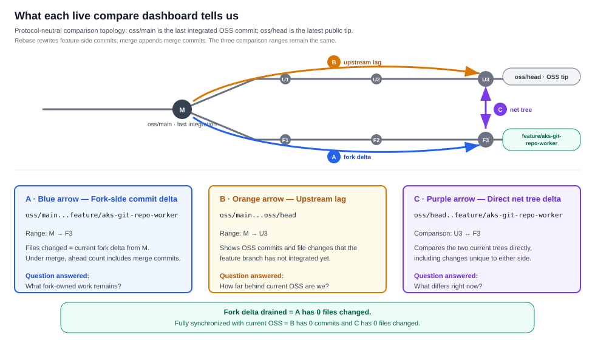
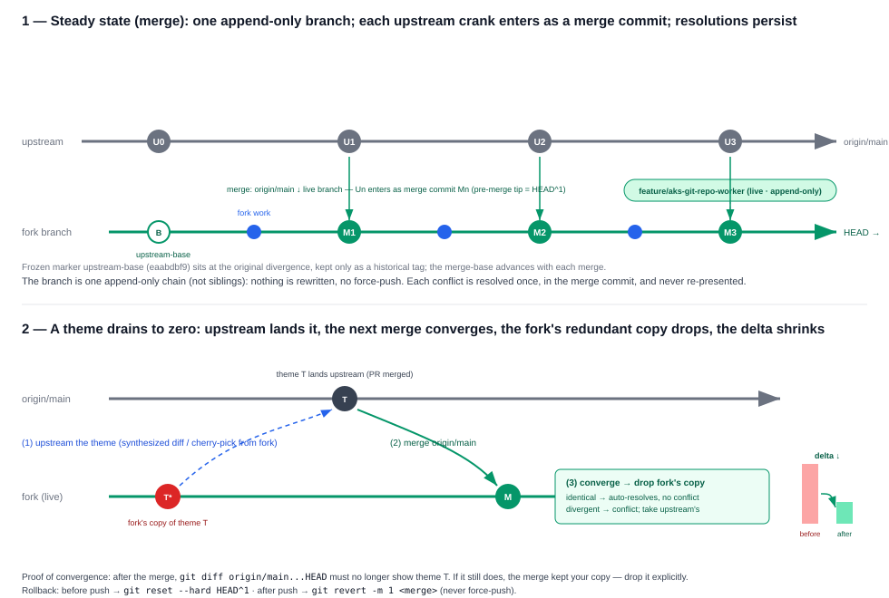

# PilotSwarm-SQL-staging → Transition Plan

> **Status:** In progress · **Owner:** @andrewkcchung · **Scope:** this fork only
> **This file is a fork-only artifact.** It must not be part of any PR to
> `affandar/PilotSwarm`. Delete it (or move it to the SQL-internal repo) once every
> capability it holds has landed upstream or moved to the SQL-internal repo.
>
> **Maintenance rule:** this is a current-state plan, not an execution log. Update it in place;
> completed work should remove or collapse content so the document shrinks with the remaining
> fork delta. Git history is the record of prior states and completed actions.

## Table of contents

- [1. Purpose](#1-purpose)
- [2. Goals](#2-goals)
- [3. Current state](#3-current-state-as-of-this-draft)
- [4. The core problem](#4-the-core-problem)
- [5. IP classification](#5-ip-classification-what-goes-upstream-vs-internal)
- [6A. Fork-to-upstream audit](#6a-fork-to-upstream-audit-platform-contributions-in-the-fork)
- [6B. Reverse-direction audit](#6b-reverse-direction-audit-generic-platform-assets-currently-in-sqlmort)
- [7. Strategy A: reconcile the existing fork](#7-strategy-a--reconcile-the-existing-fork-default)
- [8. Strategy B: clean-room reimplementation](#8-strategy-b--clean-room-reimplementation-alternative)
- [9. Recommendation](#9-recommendation)
- [10. Execution plan](#10-execution-plan-phased)
- [11. Merge protocol](#11-merge-protocol)
- [12. Definition of done](#12-definition-of-done)
- [13. Open decisions](#13-open-decisions)

## 1. Purpose

This clone (`C:\src\PilotSwarm`) is effectively **PilotSwarm-SQL-staging** — its working
branch pushes to the private mirror, not to the public upstream. It exists so the SQL
team can collaborate on in-flight work without publishing internal IP. **A private fork
is a staging buffer, not a destination.** It must not diverge from upstream for long.

> **`PilotSwarm-SQL-staging` is intentionally short-lived.** It is not a permanent SQL
> distribution of PilotSwarm, a product repository, or a long-term integration branch. Its
> only purpose is to temporarily hold mixed work while each capability is routed to public
> PilotSwarm or `sqlmort`. Its delta must continuously shrink, and the repository must be
> deleted once nothing remains that exists only in the staging fork.

**The repos involved:**

| Role | Repo | URL |
| --- | --- | --- |
| 🌐 Public upstream (platform destination) | `affandar/PilotSwarm` | https://github.com/affandar/PilotSwarm |
| 🔒 Short-lived internal staging fork (temporary; delete after transition) | `azure-data/PilotSwarm-SQL-staging` | https://msft.ghe.com/azure-data/PilotSwarm-SQL-staging |
| 🔒 SQL-internal composition repo (IP and deployment home) | `azure-data/sqlmort` | https://msft.ghe.com/azure-data/sqlmort |

**Fork vs. SQL-internal composition — two different artifacts.** The **fork**
(`azure-data/PilotSwarm-SQL-staging`)
is a *complete copy of the entire PilotSwarm codebase* carrying a large accumulated divergence —
platform changes and SQL-specific changes tangled together in the same files. It mirrors
upstream's full tree and is meant to be temporary. **`sqlmort`** is *not* a copy of PilotSwarm;
it holds **only the SQL-specific pieces** — the thin slice of proprietary IP that must never
go upstream — composed on top of the public platform. Reconciliation splits the fork's tangled
diff into those two homes: platform → organic PR upstream, SQL-specific → `sqlmort`.

The end state: **every logical change in this fork is either (a) landed in public PilotSwarm via
an organic PR, (b) moved to an explicitly owned SQL-internal or external integration package, or
(c) deleted because it is a workaround, unsafe shortcut, obsolete duplicate, or compatibility
layer with no durable platform contract.** Once nothing of value lives only in the fork, the fork
is deleted. This is capability disposition, not a commit-by-commit burndown.

## 2. Goals

1. **Contribute platform / public functionality to PilotSwarm proper** (`affandar/PilotSwarm`).
   Generic runtime primitives (SDK, orchestration, UI, job-generator framework, deploy
   scaffolding, docs) belong upstream, not in a private fork.
2. **Keep SQL-internal concepts / proprietary IP in
   [`azure-data/sqlmort`](https://msft.ghe.com/azure-data/sqlmort), never in the public repo.**
3. **Retire the fork.** Once (1) and (2) are complete, `PilotSwarm-SQL-staging` has no reason
   to exist and is deleted.

> **Historical destination note:** the ADO `SQL-AI-Marketplace` branch was the original
> short-term home proposed for SQL composition. It has been superseded by `azure-data/sqlmort`
> and is not an active destination in this plan.

## 3. Current state (as of this draft)

> **Original divergence point:** [`eaabdbf9`](https://github.com/affandar/PilotSwarm/commit/eaabdbf9dbf5801b77ac9eef7cd36d2e6baa41c0)
> on `affandar/PilotSwarm`, retained as the frozen `upstream-base` marker. `ghe/oss/main`
> identifies the current last-integrated upstream baseline and advances with each validated merge.


| Ref | Tip (code) | Relationship to `oss/main` | Role |
| --- | --- | :---: | --- |
| `ghe/oss/main` | `69dfbae4` | baseline | last-integrated public upstream |
| `feature/aks-git-repo-worker` | `7f9eb2a8` | 202 ahead / 0 behind | current internal fork tip |

> Moving upstream refs are resolved when running the comparison dashboards rather than recorded
> here.

```
   🌐 affandar/PilotSwarm   (upstream · main = the continuous horizontal trunk)

   …──o──o──o── … ──●────────[0..n upstream commits]────────► origin/main / oss/head
                    │ 69dfbae4 (2026-09-12) = current merge base / oss/main
                    │
                    └──o──o──o── … ──o──►   7f9eb2a8 (2026-09-12)   ← feature/aks-git-repo-worker   🔒 ghe
                          fork delta from oss/main: +202 · 0 behind

   (original divergence eaabdbf9 sits far to the left, frozen as upstream-base; each merge advances
    the merge-base to the newest integrated upstream tip, while origin/main may move ahead again)
```

- The fork-side divergence (`git diff ghe/oss/main...feature/aks-git-repo-worker`) for this baseline =
  **320 files / +62,714 / −4,039 / 202 commits** on top of the last-integrated baseline.
  This is the scope to route — each capability lands upstream or moves internal, not a
  commit-by-commit burndown.
- **All 202** commits above `oss/main` are internal-only on `ghe`; upstream `affandar` carries no
  divergent refs.

The internal staging repository maintains two OSS mirror refs for these comparisons:
`oss/main` is the upstream commit most recently integrated into the feature branch, while
`oss/head` is refreshed from the latest observed public `origin/main`.



> This comparison model is independent of whether integration uses rebase or merge. Rebase rewrites
> the feature-side commits while merge appends merge commits, but the three ref relationships remain
> the same. Under merge, dashboard A's **ahead commit count** includes merge-history commits and is
> not a drain metric; use its **Files changed** view for the fork delta and dashboard C for convergence.

- **A · Blue — Browse the accumulated fork delta since the last integration:**
  [`oss/main...feature/aks-git-repo-worker`](https://msft.ghe.com/azure-data/PilotSwarm-SQL-staging/compare/oss/main...feature/aks-git-repo-worker)
  — because `oss/main` is the last integrated upstream commit, this shows the feature branch's
  accumulated commits and file changes on top of that baseline. The fork-specific delta is drained
  when this dashboard reports **0 files changed**, even if public OSS has advanced since the baseline.
- **B · Orange — Browse upstream changes since the last integration — merge-risk dashboard:**
  [`oss/main...oss/head`](https://msft.ghe.com/azure-data/PilotSwarm-SQL-staging/compare/oss/main...oss/head)
  — this shows exactly how far public OSS has advanced since the last integration. Its commits and
  touched files are the new overlap surface that may produce textual or semantic merge conflicts.
- **C · Purple — Browse the current net tree delta — synchronization dashboard:**
  [`oss/head..feature/aks-git-repo-worker`](https://msft.ghe.com/azure-data/PilotSwarm-SQL-staging/compare/oss/head..feature/aks-git-repo-worker)
  — the two-dot comparison is the direct tip-to-tip diff. **0 files changed** here, together with
  **0 commits** in dashboard B, means the fork is also fully synchronized with current OSS; that is
  stronger than merely proving its unique delta has drained.
- **Browse the SQL-internal composition repo:**
  [`azure-data/sqlmort`](https://msft.ghe.com/azure-data/sqlmort) — the active "move it
  internal" destination for SQL-owned IP, deployment values, plugins, and scenarios.

### Remotes

```
origin     https://github.com/affandar/PilotSwarm.git                    (public upstream — merge source)
ghe        https://msft.ghe.com/azure-data/PilotSwarm-SQL-staging.git    (internal staging — SAML SSO-governed, private)
```

## 4. The core problem

**Why fork at all?** To give SQL engineers a concrete place to build and iterate on platform
scenarios **without risking a leak of SQL-specific IP into the public OSS upstream** — e.g. the
internal IcM MCP endpoint/AAD scope (see §5). Work lands internally first; only
deliberately-scrubbed platform enhancements route back upstream.

**Why a separate repo, not a branch of the OSS repo? (TL;DR)** Git visibility is per-**repo**, not
per-branch — a branch of a public repo is public the moment you push it, so any SQL IP on it leaks
instantly. A separate internal repo is the only real privacy boundary; we still track upstream by
adding it as a git **remote** and merging (§11).

The fork originally diverged from PilotSwarm `main` at `eaabdbf9` on 2026-08-08. That marker
is historical and fixed; the current last-integrated baseline advances after each validated
upstream merge. Since the original divergence, the fork accumulated **two
kinds of value, tangled into the same commits/files:**
- **SQL-specific values that cannot live in an OSS repo** — real internal endpoints, AAD scopes,
  and CI-gate names (the Tier 1 IP in §5) that must stay in `sqlmort`.
- **Genuine platform enhancements** — scenarios we built here (durable orchestration, the
  job-generator lifecycle, worker/git-hydration, delegated MCP, …) that are real improvements to
  the platform and belong back **upstream** (§6A).

The problem is that these are mixed together, not that the fork exists. Left alone it also
*drifts* — every week upstream moves and the reconciliation cost grows.

We are **not freezing the divergence.** Instead we set up a standing protocol:
- (a) **Constantly merge the upstream repo into the fork** so it never drifts — the fork stays
  a thin, current superset of `main` rather than a snapshot that rots (the §11 merge protocol).
- (b) **Formalize the SQL-specific values in `sqlmort`** — a composition repo carrying
  environment-specific templates on top of a shared platform — so proprietary/SQL config
  lives in one place instead of tangled through the tree.
- (c) **Route generic platform work upstream** as themed PRs, draining the fork's delta over
  time (§6A).

The end state is two repos — a pure-platform core (fork → upstream) and `sqlmort` — kept
aligned by continuous merge, not a one-time cutover.

## 5. IP classification (what goes upstream vs. internal)

This is the routing map: which parts of the divergence are proprietary (→ `sqlmort`) and
which are generic platform work (→ upstream PR). Three tiers.

### 🔴 Tier 1 — Domain behavior and composition → **SQL-internal repo (do NOT publish)**
Classification is based on domain ownership, not only whether a file contains a secret or
private endpoint. SQL-owned provider logic, operational policy, scenario definitions, prompts,
examples, tests, and deployment composition belong in `sqlmort`, even when their individual
values are not confidential.

The current SQL-owned surfaces include:
- Concrete ADO WIQL, IcM, and Kusto JobGenerator provider plugins: source authentication,
  request/response mapping, stable domain identity rules, tests, composition images, and
  operational documentation.
- SQL-specific Kusto MCP composition: concrete cluster/database values, service routing,
  fleet registration, delegated-access policy, acceptance scenarios, and runbooks. Only the
  reusable MCP adapter host remains a platform candidate; the public-sample Kusto adapter stays
  externally owned or is deleted.
- SQL scenario lifecycles, prompts, fixtures, and policy such as IncidentFix, Flakebuster,
  repository-to-audience mappings, and SQL repository/fleet names.
- SQL deployment composition: repository-specific Windows worker images, concrete identities,
  endpoints, cluster values, plugin selection, topology, and environment overlays.
- SQL acceptance suites and client policy that validate the composed deployment rather than
  generic platform behavior.

### 🟡 Tier 2 — Generic platform mechanisms and extension seams → **platform repo**
The platform owns contracts and mechanisms that do not enumerate or interpret SQL providers:
- Opaque JobGenerator provider IDs, the versioned provider ABI, plugin loader, provider host,
  generic runner, and normalized controller-to-runner protocol.
- Generic provider registration, credential references, response validation, guardrails, and
  lifecycle materialization. The host owns HTTP, authentication, health, deadlines,
  cancellation, validation, and shutdown; provider modules own source-specific connector behavior.
- Generic MCP-over-HTTP transport, delegated-authentication primitives, adapter hosting,
  repository/fleet MCP configuration, plugin loading, and first-class deployment mechanics.
- Provider-neutral APIs, SDK surfaces, and UI driven by registered descriptors rather than
  hard-coded source allowlists.
- Declarative deployment mechanics: instance-scoped service descriptors, Bicep/Flux resources,
  Kustomize composition, environment rendering, rollout verification, and externally composed
  image support.
- Generic extension-test infrastructure that runs consumer-owned acceptance suites without
  moving those suites into the platform repository.

### 🟢 Tier 3 — Generic fixtures and public integrations → **platform or external integration repo**
Optional public integrations, reference adapters, sample providers, tests, and documentation may
remain when they use public interfaces and domain-neutral examples. The current generic ADO PR
observer is a candidate because its approval-condition contract is consumed by the platform UI.

A concrete connector is not automatically internal merely because it targets ADO or Kusto: a
genuinely reusable, publicly supportable connector may be upstreamed as an optional integration.
The current ADO WIQL, IcM, and Kusto JobGenerator plugins remain in `sqlmort` because their
implementation, policy, deployment, and acceptance ownership is SQL-specific. Internal names and
environment values must be replaced with neutral placeholders before any public contribution.
The public-sample Kusto MCP adapter is not required by another platform contribution, so keep it
in an explicitly owned integration package or delete it rather than treating it as mandatory
upstream work.

**Bottom line:** the routing unit is an owned capability, not a count of files containing
private constants. Every fork-only surface must be either domain-neutral platform code or moved
to `sqlmort`.

## 6A. Fork-to-upstream audit: platform contributions in the fork

The functionality below is intended as generic PilotSwarm runtime and is the substance of what
this fork contributes back to `affandar/PilotSwarm`; the residual source-specific assumptions
identified after the theme list must be neutralized before contribution. Listed as themes, not
commits. This audit uses the exact last-integrated-baseline comparison
`git diff ghe/oss/main...HEAD`
([`69dfbae4`](https://github.com/affandar/PilotSwarm/commit/69dfbae4f249169f389ff2a7d2617f0baf7c4bd3)
→ [`7f9eb2a8`](https://msft.ghe.com/azure-data/PilotSwarm-SQL-staging/commit/7f9eb2a85400b6ac32928f6c74b26ccfa620a813)):
**320 files, +62,714 / −4,039,
202 commits above the baseline**. The themes below remain present in the fork delta. Upstream
commits after `oss/main` are lag to reconcile, not part of the
fork-contribution inventory.

1. **Git workspace durability + repository-worker fleet** — node-local git-cache mirrors,
   git-repo-worker DaemonSets, hostPath enlistment persistence, bundle/patch/metadata
   dehydrate/hydrate, acquisition-time reconcile, repo-affinity routing, per-session ref
   pinning, and OS-split fleets with truthful readiness.
2. **Job Generator lifecycle + external provider platform** — generic registration, hierarchy,
   lifecycle API resources, continuous materialization, durable state execution, canonical
   cross-source references, the versioned provider ABI, plugin loader, provider host/runner,
   normalized remote-provider dispatch, and E2E harness. *Concrete source providers are external
   modules owned by their domain or integration package.*
   - **Nearly upstream-ready:** replace the `ado_wiql` and WIQL sample data in JobGenerator
     controller/provider and SDK transport tests with a synthetic provider ID and neutral payload,
     then upstream the remaining JobGenerator/provider test phase with this lifecycle capability.
3. **Durable orchestration primitives** — keyed system waits, observed-condition waits,
   external-operation gates, durable response persistence, versioned orchestration snapshots,
   and bootstrap-turn folding.
4. **Delegated identity, MCP configuration, and plugin loading** — connect to fleet-default,
   repo-defined, and bound-agent MCP servers *as the caller*; maintain a per-audience token map
   with runtime audience discovery; inject per-session stdio MCP credentials; surface delegated
   tokens as named environment variables; load external plugin repositories through `PluginSpec`;
   and parse JSONC `mcp.json`.
5. **MCP-over-HTTP compatibility adapter + deployment** — generic adapter host, HTTP MCP
   transport, delegated-only authentication, safe request correlation, synthetic REST example,
   and instance-scoped Bicep/Flux/Kustomize deployment.
6. **Portal, job, and worker observability** — durable job-transition timelines, worker-utilization
   visualization, live swimlane spans, queued bands, per-condition PR-gate rows, tree keyboard
   navigation, repo picker, and "load older" history hydration.
   - **Nearly upstream-ready:** replace the portal's hard-coded recognition of `wiql`, `kql`,
     `query`, and `filter` fields with provider-supplied display metadata or generic serialized
     configuration.
7. **Optional public Azure DevOps integration** — observe ADO PR approval/completion and
   heterogeneous approval conditions through public APIs. This is a Tier 3 integration, distinct
   from SQLmort's ADO WIQL discovery provider.
8. **Worker routing and platform hardening** — `beforeRunTurn`/`afterRunTurn` hooks,
   platform-owned working directory and config/skill discovery, generic repo-less pools,
   worker-registry host/build provenance, owner-affinity isolation, and owner-managed logical
   cleanup.
9. **Devbox worker identity and authentication** — silent caller-token refresh, canonical
   worker identity across restarts, Azure CLI baked into the Windows base for popup-free auth,
   and signed-in Copilot-user model access.
10. **Deployment-framework extensions for standalone services** — the manifest-driven Bicep,
    Flux, and Kustomize deployment model already exists upstream. The fork extends it with
    standalone and instance-scoped services, service-owned environment configuration, structured
    GitOps overlays and replacements, an explicit render stage, Deployment/DaemonSet rollout
    support, prerequisite checks, and exact-image verification. The concrete git-cache,
    git-repo-worker, and MCP deployment definitions remain part of themes 1 and 5.
11. **Runtime reliability and operability** — Postgres pool self-heal, duroxide pool/acquire
    resiliency, jittered retry backoff, orchestration lease/timeout tuning, session-poison
    diagnostics, blob/DB managed-identity decoupling, WAF fixes, and generic support for
    governance-restricted subscriptions.

## 6B. Reverse-direction audit: generic platform assets currently in `sqlmort`

Section 6A addresses **false inclusion**: SQL-owned IP present in the fork that must not reach
OSS. This peer audit addresses the opposite **false exclusion** problem: generic PilotSwarm
mechanisms still hidden in `sqlmort` that should be available in OSS. Two reverse-direction
candidates remain, in recommended execution order:

1. **Publish and consume the canonical provider ABI (boundary-completion priority).**
   SQLmort's three JobGenerator plugins still carry structural copies of the canonical contract:
   - `plugins/job-generator/ado-wiql-provider/src/contracts.ts`
   - `plugins/job-generator/icm-provider/src/contracts.ts`
   - `plugins/job-generator/kusto-provider/src/contracts.ts`

   The authoritative ABI is
   `packages/job-generator-provider/src/contracts.ts` in PilotSwarm, with API version
   `pilotswarm.job-generator-provider/v1`. PilotSwarm should publish or otherwise expose a
   lightweight, stable contracts export that external repositories can consume. SQLmort
   should then reference that artifact and delete its mirrors. The plugins work today through
   TypeScript structural compatibility, so this is not an immediate runtime blocker, but it is
   required to prevent silent ABI drift and complete the ownership seam.

2. **Upstream the missing generic TypeScript SDK capabilities.** SQLmort callers use the
   published `pilotswarm-sdk`, while five platform-neutral gaps remain isolated under
   `Clients/sdk/typescript/src/upstream-candidates/`:
   - `api-auth.ts`
   - `delegated-auth.ts`
   - `job-generators.ts`
   - `model-catalog.ts`
   - `session-events.ts`

   Move these capabilities upstream using existing PilotSwarm TypeScript SDK idioms, then
   delete the SQLmort compatibility implementations.

   `web-client.ts` is a downstream convenience wrapper around those APIs, including a raw REST
   escape hatch for fields absent from the published SDK. Migrate its callers to the accepted
   public surfaces and delete the wrapper; do not upstream the wrapper itself.

   Keep SQL-specific repository-to-audience mappings, service audiences, token policy, and
   other domain behavior under `Clients/sdk/typescript/src/sql-domain/`.

The following remain explicitly SQL-owned and are **not** reverse-migration candidates:
ADO WIQL, IcM, and Kusto connector implementations; provider authentication and response
normalization; plugin composition images; `deploy/values/*.env` and MCP registrations;
SQL fleet topology and layered Windows tooling; domain prompts, work-item fixtures,
acceptance playlists, and runbooks; and private repository-to-audience mappings.

**Recommended sequence:** first expose and consume the canonical provider contract, then move
the five neutral client SDK modules and retire the local web-client wrapper. Each move must leave SQLmort with only a thin domain
composition layer and must not make PilotSwarm depend on `sqlmort`.

## 7. Strategy A — Reconcile the existing fork (default)

Route the fork's work to its homes: contribute the generic platform work upstream as organic,
themed PRs, and move SQL-owned capabilities to the SQL-internal repo. When nothing of value
lives only in the fork, delete it. (Not a commit-by-commit burndown — the unit is a capability,
not a commit.)

1. **Freeze divergence.** No new feature work lands only in the fork; new platform work goes
   through upstream PRs from here on.
2. **Upstream the platform work as organic, themed PRs** (all §6A themes; Tier 1 is excluded
   by definition):
   - Group by theme (§6A): git-hydration/worker, job-generator framework, orchestration
     versioning, UI timeline, SDK auth/lifecycle, deploy, etc. Each theme is one reviewable PR.
   - Cut each PR from current `origin/main`. Prefer **path-scoped assembly**
     — bring over the theme's final file state and commit it clean — over replaying the
     entangled per-commit history; reserve commit-by-commit replay for the few themes whose
     history is already tight. Stack dependent PRs (foundation → features → UI/deploy).
   - Scrub internal names, values, and deployment assumptions as each PR is prepared.
3. **Keep Tier 1 providers in `sqlmort`.** ADO WIQL, IcM, and Kusto JobGenerator extraction is
   complete; preserve the opaque provider boundary and keep new connector behavior, SQL policy,
   scenarios, values, and composition out of the platform repository.
4. **Resolve DELETE items** (anything experimental we don't want to publish or keep) — none
   identified yet; flag as found.
5. **Retire.** Once every §6A capability has landed upstream or moved internal — so the fork
   holds nothing not already in one of those homes — delete `PilotSwarm-SQL-staging`.

**Pros:** reuses the actual working, tested code (least rework); the current tip has a clean
provider/deployment boundary and the reusable mechanisms are already genericized. **Cons:** the
PRs are large and entangled with weeks of
mixed commits (orthogonal to the integration mechanic — assembling themed upstream PRs is work
regardless). Merging a moved `main` still has a conflict cost, but under the §11
merge protocol each conflict is resolved **once and persists**, and a theme's delta converges to
zero as it lands upstream — rather than being re-litigated on every integration as it was under
rebase.

## 8. Strategy B — Clean-room reimplementation (alternative)

Treat the fork as a **reference/spec**, not a source of commits. Pick the specific
functionality we actually want, and reimplement it directly against current `origin/main`
(and the SQL-internal repo), without carrying the divergent history.

1. Enumerate the capabilities worth keeping (git-repo worker, job-generator lifecycle,
   orchestration versioning, worker timeline, caller-auth, etc.).
2. For each, write fresh commits on a branch cut from `origin/main`, using the fork only as a
   design reference. Land as clean, themed PRs.
3. Put SQL-specific pieces straight into `sqlmort` — never in the fork.
4. Delete the fork once the target capabilities exist upstream + internal.

**Pros:** no messy history to reconcile; clean separation of concerns from the start; no risk of dragging
internal fixtures upstream by accident. **Cons:** discards working, tested code; higher
implementation effort; risk of behavioral drift from what already works.

## 9. Recommendation

Given the capability-routing requirement, **Strategy A (reconcile) is the default.** Reserve
**Strategy B** for any
capability whose commits are too entangled with SQL-specific concerns to cleanly split; those
few, reimplement clean rather than untangle.

## 10. Execution plan (phased)

This operationalizes §7 (Strategy A) and makes explicit the deployment-continuity model
§7 leaves implicit. The unit of work is a **capability — a logical diff of fork vs upstream** —
never a commit (nothing is cherry-picked).

### Phase 0 — Tip-level test confidence (complete)
The successful rebase onto current upstream, followed by green targeted and end-to-end suites,
provides sufficient confidence to continue the transition. We will not maintain a per-commit
coverage inventory or require retrospective `Covers:` trailers for the fork history.

Going forward, behavior changes should continue to ship focused tests in the same change. Integration
conflicts are validated against the current tip-level suite rather than a historical commit-by-commit
backfill.

### Phase 1 — Live fork, route-as-you-go
- Keep the fork the **active dev branch** for SQL-orchestration concepts upstream doesn't have
  yet; new work lands here first — expected, not a violation. (No hard "freeze".)
- **Classify at authoring** — every change knows its eventual home: **generic platform** →
  upstream (drained later via a theme PR); **SQL-specific** → `sqlmort` (or genericize in place).
- **Author upstream-first only when practical** (genuinely generic, no dependency on
  not-yet-upstreamed primitives); everything else is fork-first by necessity.
- Run a **constant merge** cadence so the fork stays `origin/main + delta`, however that delta churns.
- Keep deploying from the fork for now (single deployable, as today).

### Phase 2 — Carve SQL out behind a plugin seam; `sqlmort` becomes the deployment repo (→ 2 repos)
- [x] Introduce the **provider plugin seam** in the fork: opaque provider IDs, a versioned
  module ABI, a platform-owned runner, normalized controller-to-runner HTTP, credential
  references, generic limits, persistence migration, and provider-neutral API/UI validation.
- [x] Extract ADO WIQL from JobGenerator core into a SQLmort-owned sibling module beside IcM.
  The domain module owns Azure DevOps query/authentication behavior while PilotSwarm's generic
  runner owns HTTP, authentication, health, deadlines, cancellation, validation, and process
  lifecycle.
- [x] Move `IcmEvaluator`, its MCP dependency, tests, endpoint/scope configuration, and
  operational documentation out of the platform implementation into **`sqlmort`**. The
  SQL-owned module contains only IcM connector behavior; its image composes that module over
  the platform runner. Kubernetes resources, controller registration, and coordinated rollout
  tooling remain deferred until the composition image can be exercised against a target stamp.
- [x] Validate the cross-repository provider boundary with SQLmort's `ado_wiql` sibling plugin
  and the deterministic mock-delivery lifecycle. On 2026-09-10 generator
  `fcadf52f-eae6-42e7-beab-54b361330425` loaded the external module through PilotSwarm's
  generic runner, discovered work item `5565721`, created one Job, and reached `Validated`
  after both durable mock waits.
- [x] Waive legacy in-process provider migration: no deployed use cases depend
  on the old ADO WIQL, IcM, or Kusto environment contracts, so remove their
  provider-specific startup guards instead of carrying migration scaffolding.
- [x] Extract the Kusto JobGenerator evaluator into a SQLmort-owned sibling module using the
  same provider ABI as ADO WIQL and IcM.
- [ ] Expose the canonical provider ABI as a consumable PilotSwarm package/export, update the
  three SQLmort providers to consume it, and delete their structural `contracts.ts` mirrors.
- [x] Extract the Kusto MCP deployment surface. The reusable adapter host and public-API
  Kusto reference adapter remain in the platform; SQL-specific endpoint values, fleet
  registrations, and acceptance scenarios live in `sqlmort`. The platform-managed `sqlwus2`
  instance passed the delegated-MCP and complete external suites on 2026-09-11, after which
  the copied sqlmort manifest and ad hoc build/apply wrappers were removed.
- **Make `sqlmort` the deployment/integration repo:** it depends on core (fork now, upstream
  later), injects the IcM plugin, and owns the compose→build→ship pipeline.
- **Split the deploy layer:** generic build recipes stay in **core** (to upstream); SQL-specific
  composition + env + infra (core-version pin, IcM injection, ACR/AKS/AFD/PG targeting,
  governance-restricted-subscription overrides) stay in **`sqlmort`**.
- [x] Neutralize identified fork-added SQL/org-specific comments and example paths in the SDK
  and git-cache deployment documentation.
- [x] Genericize PVS operation and policy fixtures and remove the hard-coded Private Validation
  Service UI label while preserving the generic external-operation and named-policy mechanisms.
- [x] Genericize remaining **Tier 2** examples in place: replace `StandardFix` and
  `DsMainDev` with neutral fixtures and remove the concrete ACR name.
- **Result:** deployment is now **core (fork) + `sqlmort` = 2 repos**, orchestrated *from
  `sqlmort`*; the fork is now a **pure-platform repo** (a precondition for retiring it).

> **⚠️ "Pure-platform" describes the *tree*, not the *history*.** After Phase 2 the fork's **working
> tree** is IP-free — the Tier-1 files (IcM endpoint, AAD scope, CI-gate names) now live in the
> `sqlmort`. But the **commit history still contains the IP**: Phase 2 removes it at the *tip* via
> *new* commits — it does **not** rewrite history, so the older commits that introduced the IP are
> still reachable in the branch. Consequence: the fork is safe to keep **private**, but must
> **never** be pushed — branch, tag, or mirror — to any **public** repo. A public branch exposes its
> full history, and checking out any historical commit leaks the IP (§4), and it cannot be
> un-published once cloned/forked/cached. This is precisely why **Phase 3 does not publish the fork
> branch**: it upstreams via **clean-room, path-scoped PRs re-originated from `origin/main`** (fresh
> commits, no entangled history). Treat "IP-less" as a claim gated on a **secret + full-history
> scan**, not one inferred from a clean tip.

### Phase 3 — Upstream the platform, theme by theme (slow track, external pace)
- Slice the fork-vs-upstream logical diff into the remaining capability themes of §6A.
- Execute the current topologically sorted contribution sequence in
  [`UPSTREAM-CONTRIBUTION-SEQUENCE.md`](UPSTREAM-CONTRIBUTION-SEQUENCE.md). That document is the
  single source of truth for the exact commit units, dependency blockers, proposed commit
  messages, relative risk, existing test coverage, readiness limitations, migration lane, and
  parallel workstreams.
- For each contribution item, in dependency order:
  - Cut a clean PR branch from **current `origin/main`** via **path-scoped assembly** (bring the
    theme's final file state, commit clean) — not a replay of entangled history.
  - Open the PR into `affandar/main` from a GitHub fork of `affandar` (a **contribution remote**,
    never a deploy input).
  - On merge, the next fork merge **drains** that theme (byte-identical → auto-converges;
    divergent → resolve take-upstream);
    reconcile if upstream modified or independently built it.
- Keep the contribution-sequence document current-state only: after each upstream merge, follow
  the §11 merge protocol, prove the logical delta drained, remove the completed item, and
  recalculate newly unblocked downstream items. It must converge to zero rather than retain
  execution history.
- Do not force every candidate upstream. Remove a sequence item when upstream already provides
  the behavior, the durable owner is an external/domain package, or the fork implementation is a
  workaround, unsafe shortcut, duplicate, or obsolete compatibility layer that should be deleted.
- For any item too entangled to lift safely, use **Strategy B (clean-room against current
  upstream)** as directed by the item's readiness limitations.

**Upstream PR review synchronization (minimize the follow-on merge conflict).** The reviewed
upstream tree is authoritative. Review comments often move it away from the fork snapshot used to
open the PR, so synchronize the accepted review delta back into the fork *before* the upstream PR
merges:

1. **Record the submitted PR head.** Keep the initial contribution-branch SHA as
   `$submittedPrHead`; it is the base for isolating review-driven changes.
2. **During active review, edit the upstream PR branch first.** Apply suggestions and requested
   revisions there. Do not independently reinterpret the same comment in both repositories; two
   hand-written implementations of one review request create avoidable semantic drift.
3. **At approval, freeze the reviewed head.** Fetch the contribution branch and capture its exact
   SHA as `$reviewedPrHead`. Do not merge the PR if its head changes after this point without
   repeating the synchronization gate.
4. **Mirror only the accepted review delta into the fork:**
   ```powershell
   $themePaths = @(
     'path/to/platform-owned-file'
   )

   git diff --binary $submittedPrHead $reviewedPrHead -- $themePaths |
     git apply --3way
   ```
   Set `$themePaths` to the platform-owned files in that PR. Never import SQL-specific
   composition or private history. For a file wholly owned by the upstreamed theme, prefer making
   the fork copy byte-identical to `$reviewedPrHead`; for a mixed file, apply only the reviewed
   platform hunks and preserve explicitly identified fork-only behavior.
5. **Commit and validate the synchronized fork tip before allowing the upstream merge.** Run the
   theme's focused tests in both trees. If an urgent fork fix landed during review, first add its
   generic portion to the upstream PR, then repeat steps 3–5.
6. **Merge the approved PR, then absorb it immediately.** Confirm the approved SHA was the one
   merged, fetch the resulting `origin/main`, refresh `oss/head`, and merge `origin/main` into the
   fork. If Git still reports a conflict in an upstreamed theme, resolve its platform-owned surface
   to the **actual merged `origin/main` tree**; reapply only explicitly documented fork-only
   overlays.
7. **Prove the theme drained.** The theme paths must disappear from dashboard A's file diff:
   `git diff origin/main...HEAD -- $themePaths`. If they remain, the fork retained a divergent
   copy and the upstreaming cycle is not complete.

Do not merge the contribution branch itself into the private fork or cherry-pick its full PR
history. The synchronization unit is the accepted, path-scoped review delta; the subsequent
`origin/main` merge remains the authoritative history integration.

### Phase 4 — Retire (gated on a behavioral shift, still 2 repos)
- This is **steady-state routing**, not a one-time burndown: new platform work flows in the top,
  merged themes drain out the bottom. "Drive to zero" is reachable only once the *inflow* of
  fork-first platform work slows.
- Delete the fork only when **(a)** the accumulated delta is drained **and (b)** new generic
  platform work has moved **upstream-first**, so nothing fresh keeps landing fork-only.
- Swap the deploy core **fork → upstream**: because `sqlmort` owns the pipeline, this is just
  **repinning `sqlmort`'s core dependency**, not moving any build logic.
- Delete `PilotSwarm-SQL-staging`; remove this plan doc.

> **Invariant throughout:** deployment is always **exactly 2 repos** — core (`fork`→`upstream`) +
> `sqlmort` — `sqlmort` owns composition, and "done" means the **fork-vs-upstream logical diff
> is empty**, not "all commits replayed."

## 11. Merge protocol

The fork tracks upstream by **merge, not rebase.** This reverses an earlier draft of this plan,
and the reason is specific to how this fork operates: it is **published** (on `ghe`) and it
contributes work upstream as **synthesized, final-state diffs** — not cherry-picked commits.
Rebase's one real advantage is that it *auto-drops* a fork commit once an identical patch lands
upstream (matched by patch-id). But a synthesized diff is **never** patch-identical to the messy
incremental history that produced it, so that auto-drop **never fires** here — the very benefit
that would justify rebase is unavailable. Meanwhile rebase's costs are all still charged:
rewriting **published** history forces a candidate-branch-and-force-push dance, and every upstream
crank **replays** the entire accumulated fork history, re-presenting the same conflicts each time.

Merge inverts that trade. A merge from `origin/main`:
- **never rewrites published history** — the live branch moves forward by a merge commit, so
  there is no force-push, no candidate branch, no rollback tags, and no "reset to the wrong ref"
  hazard;
- **resolves each conflict once and keeps it** — the resolution is recorded in the merge commit
  and is never re-presented on the next crank (rebase re-presents it every time);
- **converges a drained theme automatically** — once a theme has landed upstream, the next merge
  sees the *same* change on both sides and collapses it with **no** conflict (byte-identical) or a
  trivial take-upstream resolution (see the "trivial convergence" note under *Per-merge steps*).

The objection the earlier draft raised — "a merge buries the delta under merge commits" — does
**not** apply to how we actually measure the delta. We read divergence with
`git diff ghe/oss/main...HEAD` (three-dot: last-integrated baseline → HEAD), which reports the
**tree** delta regardless of how many merge commits sit in history. Merge commits make the *log*
noisier; they do **not** inflate the *diff*. Linear history was never the goal — a **shrinking
tree delta** is.

**Cadence.** Merge little and often — weekly, and immediately after each of your upstream PRs
**lands in `origin/main`** (not when you open it). Frequent small merges keep each conflict
surface tiny and let drained themes converge promptly; a long gap lets conflicts accumulate,
especially in migration registries and frozen orchestration versions.

**One-time setup.**
- `git config rerere.enabled true` — records each conflict resolution and auto-reapplies it if the
  same conflict recurs. Under merge, resolutions already persist in history, so `rerere` is a
  convenience (e.g. across parallel worktrees), not the load-bearing mechanism it was under rebase.

**Branch & tag naming.**  Merge does not rewrite the live branch, so the elaborate
candidate/rollback-tag scheme the rebase protocol needed is gone. What remains:
- **Live branch (stable, never renamed):** `feature/aks-git-repo-worker` — advanced by merge
  commits from `origin/main`, **never force-pushed**; all by-name references (`sqlmort` core pin,
  CI, PR policy) point here.
- **Divergence marker (frozen):** tag `upstream-base` = `eaabdbf9` — the *original* divergence
  point, kept only as a historical marker.
- **Last-integrated OSS baseline:** branch `oss/main` — points to the upstream commit most recently
  merged into the feature branch. Advance it only after a successful merge is published (step 5).
- **Current OSS mirror:** branch `oss/head` — a fast-forward-only mirror of the latest fetched
  public `origin/main`, refreshed before each merge attempt (step 1). Together these GHE-only refs
  power in-repository comparisons because the private staging repo and public upstream do not share
  a GitHub fork network.

**Refresh `oss/head` safely (manual or scheduled invocation):**

```powershell
Set-StrictMode -Version Latest
$ErrorActionPreference = 'Stop'

git fetch origin main
if ($LASTEXITCODE -ne 0) {
  throw 'Failed to fetch origin/main.'
}

$publishedHead = git ls-remote --heads ghe refs/heads/oss/head
if ($LASTEXITCODE -ne 0) {
  throw 'Failed to inspect ghe/oss/head.'
}

if ($publishedHead) {
  git fetch ghe +refs/heads/oss/head:refs/remotes/ghe/oss/head
  if ($LASTEXITCODE -ne 0) {
    throw 'Failed to refresh the local ghe/oss/head tracking ref.'
  }

  git merge-base --is-ancestor ghe/oss/head origin/main
  if ($LASTEXITCODE -ne 0) {
    throw 'Refusing to rewrite oss/head: origin/main is not a fast-forward.'
  }
}

git push ghe origin/main:refs/heads/oss/head
if ($LASTEXITCODE -ne 0) {
  throw 'Failed to publish oss/head.'
}
```

This script writes **only** `oss/head`. Do not replace the explicit refspec with `--mirror`, a
wildcard, or `oss/main`: the `oss/main` baseline advances only after the upstream merge has been
validated and the resulting feature-branch merge commit has been published (step 5).

- **Optional integration tags (immutable):** if you want reproducible deploy pins, tag each merge
  commit — e.g. `merge/<upstreamDate>-<upstreamSha>` — and have consumers pin to the tag rather
  than the moving branch. Unlike the old rebase `from-`/`onto-` tags these are **not** needed for
  rollback: merge rollback is a plain `git reset`/`git revert` (see *Rollback*).

There are **no** candidate branches, no `from-`/`onto-` rollback tags, and no ambiguous
tag-vs-branch name hazard under merge — none of that machinery exists anymore.

**Model.** The live branch moves **forward only**: each upstream crank is absorbed as a merge
commit on `feature/aks-git-repo-worker`, so the branch name and every by-name reference are stable
and history is append-only. Because nothing is rewritten, there is no force-push to recover from —
the pre-merge tip is always reachable as the merge commit's **first parent** (`HEAD^1`), and a bad
merge is undone with a plain `git reset --hard HEAD^1` (before pushing) or `git revert -m 1` (after).



> **Reading the diagram.** *(1) Steady state:* the fork is **one append-only branch** — each upstream
> crank `Un` enters as a merge commit `Mn` (the pre-merge tip is always `HEAD^1`); nothing is
> rewritten, so there is no force-push, and each conflict is resolved **once** in the merge commit and
> never re-presented. *(2) Drain:* a theme `T` carried in the fork (`T*`) is upstreamed; once it lands
> in `origin/main`, the next merge **converges** it — byte-identical → auto-resolves, divergent →
> conflict resolved by taking upstream's version — so the fork's redundant copy drops and the delta
> shrinks. Verify with `git diff origin/main...HEAD`; if `T` still shows, drop your copy explicitly.

**Per-merge steps.**
1. Pull the new upstream `main`, then refresh the fast-forward-only compare mirror:
   ```
   git fetch origin main
   git push ghe origin/main:refs/heads/oss/head
   ```
   If you just landed an upstream PR, confirm it is actually in `origin/main` before merging —
   merging before it lands merges nothing. The `oss/main...oss/head` dashboard now shows exactly
   what has accumulated upstream since the last successful integration.
2. Merge upstream into the live branch:
   `git switch feature/aks-git-repo-worker && git merge origin/main`.
   No candidate branch, no backup tag — the pre-merge tip is `HEAD^1` and nothing is rewritten.
3. Resolve conflicts **by class** (same taxonomy as before — merge just presents each once and
   keeps the resolution):
   - **Theme already upstreamed** → *this is the drain.* If the fork's copy is byte-identical to
     what landed, git converges it with **no conflict** (both sides made the same change). If it
     landed with review edits / squash / your synthesis gap, you get a conflict → **resolve to
     upstream's version** so your redundant copy is dropped and the delta shrinks. Do **not** keep
     yours "to be safe" — that is exactly what stops the delta from shrinking.
   - **Parallel implementation** (for example, independently added frozen orchestration versions)
     → if the two sides implement the *same* behavior, adopt upstream's and delete the fork's
     divergent copy. **But if the fork's copy layered fork-only behavior under a version number
     now claimed by upstream, this is a version-number collision carrying a feature, not a pure
     parallel implementation.** Treat it exactly like a migration-version collision: re-mint the
     fork behavior on a new version after upstream's head, freeze the current live orchestration,
     apply the fork delta, bump `DURABLE_SESSION_LATEST_VERSION`, and register both. **Never**
     resolve it by adopting upstream's version and dropping the fork feature; that silently
     deletes shipped behavior. See the no-defer invariant below.
   - **Migration version collision** (both sides define the same `cms-migrations.ts` version `NNNN`
     — *seen on the day-1 crank: upstream `0045 session_canvases` vs. fork `0045 session_git_state_pinning`*)
     → keep both and **renumber the fork block** to sit *after* upstream's new head. This has a
     **code half** (here) and a **DB half** (a deploy-time ledger re-stamp — see *Migration ledger
     reconciliation* below); do **both**, or an already-deployed fork DB silently skips upstream's
     migrations at the reused numbers.
     - **Code half.** With `U = max(upstream version)` on the newly-merged tip, renumber the fork's
       migrations to `U+1 … U+n`. Compute the target from the fork's **divergence-baseline set** — the
       migrations added after `upstream-base`, in their original fork order, keyed by *name* — **not**
       from wherever they landed last cycle, so offsets don't compound. Update three places per
       migration (the list entry `version`, the SQL function name, and its definition) plus every test
       that asserts the number. With merge you resolve this **once** and the resolution persists in
       history — unlike rebase, it is not re-presented on the next crank.
     - **Idempotency invariant.** Every fork migration must be re-runnable (`CREATE … IF NOT EXISTS`,
       `ADD COLUMN IF NOT EXISTS`, `DROP CONSTRAINT IF EXISTS` then `ADD CONSTRAINT`) — the backstop
       that makes any accidental replay a harmless no-op. Keep it true for new fork migrations.
   - **Genuine fork-only work** → no conflict; it rides through untouched.

   > **No-defer invariant.** A dropped fork feature or unresolved divergence is **re-applied by
   > default**. Never silently defer or adopt-upstream-and-drop a fork behavior. When a
   > divergence surfaces, surface it back to the owner and get **explicit approval before deferring**.
   > "It looks large" is not grounds to defer — it is grounds to *ask*. Offline unit tests do **not**
   > cover routing/deployment behavior (owner-affinity, worker tagging), so a green suite is not
   > evidence a fork feature survived; verify feature presence against the pre-merge tip (`HEAD^1`)
   > explicitly.

   Finish with `git merge --continue` (or resolve + `git commit`) to seal the merge commit.
4. **Validate the merge result — before pushing:**
   - build + unit/integration tests green,
   - smoke: bring up worker + portal, run one lifecycle-job E2E,
   - deploy to **non-prod** (`sqlmort` pinned at the merged tip) and sanity-check.
   If validation fails, `git reset --hard HEAD^1` (nothing was pushed) and retry — no force-push,
   no candidate to discard.
5. **Publish** once green — a plain fast-forward push (no force):
   ```
   git push ghe feature/aks-git-repo-worker
   git push ghe origin/main:refs/heads/oss/main    # advance the last-integrated baseline
   #   (optional reproducible-deploy pin:)
   #   git tag -a merge/<upstreamDate>-<upstreamSha> -m "merged upstream <sha>"
   #   git push ghe refs/tags/merge/<upstreamDate>-<upstreamSha>
   ```
6. **Re-measure & refresh:**
   ```
   git rev-list --count ghe/oss/main..ghe/oss/head  # upstream commits pending integration
   git diff --stat ghe/oss/main...HEAD               # accumulated fork delta
   git diff --stat ghe/oss/head HEAD                  # direct net tree delta
   ```
   Track the accumulated fork delta through
   [`oss/main...feature`](https://msft.ghe.com/azure-data/PilotSwarm-SQL-staging/compare/oss/main...feature/aks-git-repo-worker),
   upstream merge risk through
   [`oss/main...oss/head`](https://msft.ghe.com/azure-data/PilotSwarm-SQL-staging/compare/oss/main...oss/head),
   and the direct tree delta through
   [`oss/head..feature`](https://msft.ghe.com/azure-data/PilotSwarm-SQL-staging/compare/oss/head..feature/aks-git-repo-worker).
   If you upstreamed a theme and the net delta did **not** drop, the merge kept your redundant copy —
   resolve that surface to upstream's version (or delete your copy) explicitly.

**Rollback.** Before pushing, a bad merge is undone with `git reset --hard HEAD^1` — the pre-merge
tip is always the merge commit's first parent, so there is nothing to recover from a tag. After
pushing, don't rewrite published history: `git revert -m 1 <mergeCommit>` backs the merge out with a
forward commit; then fix the problem and merge again. Because merge never force-pushes, there is no
lost-commit recovery scenario to guard against.

**Migration ledger reconciliation (deployed fork DBs).** The migrator is a per-version **ledger**
(`copilot_sessions.schema_migrations`), not a high-water-mark: each migration runs iff its exact
`version` string is absent from the table (gaps are allowed — it can run `0085` while `0080` sits
unapplied). So the code renumber alone is **not** enough for an already-deployed fork DB: its ledger
still records the fork's DDL under the *old* numbers (this cycle: `0045–0057`, **13** fork
migrations — the divergence baseline is `0044`), which are exactly the numbers upstream's migrations
now occupy. On the next deploy the runner sees those strings as applied and
**silently skips upstream's migrations at those numbers** (per-version, so only the collided ones —
everything around them still applies), while the fork's renumbered entries are unrecorded.

Fix it with a **name-keyed re-stamp** (Variant B), run as a **pre-deploy hook in the same rollout**
as the merged image (so no old-code boot lands on a half-re-stamped ledger). Key on `name` — stable
across cycles — **not** on the old number (which moves every integration); that is what makes the
recipe survive repeated merges:

```sql
BEGIN;
UPDATE copilot_sessions.schema_migrations m
SET version = v.newver
FROM (VALUES
  ('<fork migration name>', '<U+1>'),
  ...                                   -- one row per fork migration, in fork order
) AS v(name, newver)
WHERE m.name = v.name;                  -- expect n rows updated
COMMIT;
```

> **Derive the VALUES list from a name-keyed ledger-vs-code diff — never from the renumber commit's
> file diff.** The authoritative source set is *every* fork migration whose `name` is applied in the
> **deployed ledger** but sits at a **different `version` in the target code** (join deployed
> `schema_migrations.name` against the `version/name` pairs parsed from `cms-migrations.ts`). A
> migration can be renumbered *anywhere* in the integration — not only inside the contiguous block the
> renumber commit touched — so the commit diff undercounts. **Day-1 incident:** the VALUES list was
> built from the renumber commit's diff (11 rows, `0047–0057`) and missed two fork migrations
> (`session_git_state_pinning` `0045→0077`, `fix_session_git_state_setter` `0046→0078`) that the
> integration relocated elsewhere. The half-re-stamp left `0045/0046` still keyed to the old fork names, so
> the runner skipped upstream's new `0045 session_canvases` and then **stalled at `0064 canvas_kv`**
> (`relation "…session_canvases" does not exist`). Run the name-diff as a **pre-flight gate** and
> assert its row count equals the number of fork migrations above the divergence baseline before
> committing the re-stamp.

This unchecks the old numbers (upstream's `0047…0078` now run) and checks the new ones (the fork's
DDL is **skipped, not replayed**) — no data deleted, only `n` bookkeeping rows renamed. Run it against
**every** deployed fork DB. **Verify** read-only, before and after: the `n` fork rows are still at the
old numbers and nothing already occupies the target range beforehand; afterwards the old numbers are
gone, the target range is filled, and a fresh-DB dry-run of the candidate reaches the new max in
strict order. Snapshot the DB first — this writes to a shared/prod store.

> **Wording note (avoid a false-safety read).** The renumber commit's message says "*Migrations stay
> name-keyed, so DDL already applied under the old numbers is recognized and skipped*." Read that as
> describing the **re-stamp**, not the runner. The runner (`pg-migrator.ts`) is strictly
> **per-version** — it builds its applied-set from the `version` column and skips on
> `appliedSet.has(migration.version)`; the `name` column is stored but never consulted for the skip
> decision. So recognition-and-skip only happens *after* the name-keyed re-stamp has moved the ledger
> rows to the new numbers. Without the re-stamp the runner does **not** self-recognize by name — do
> not treat the deploy as safe on that assumption.

**Preventing the old-worker re-run race (advisory-lock gate).** The re-stamp and the new-image
rollout are not naturally atomic: migrations run on process **boot** only — `PgSessionCatalog.initialize()`
(`cms.ts`) is guarded by `this.initialized`, so an already-running pod never re-runs DDL, but a pod
that **(re)starts** after the re-stamp and before it is replaced *will*. Old (pre-merge) code whose
migration list still puts the fork DDL at the old numbers (`0045–0057`) would then see those numbers as absent (we moved
them to `0077–0089`) and **re-insert the fork rows at the old numbers**, recreating the exact collision
— and idempotent (`IF NOT EXISTS`) DDL does **not** save you, because it is the ledger re-insert, not
the DDL, that re-poisons the state. On spot node pools (the git-worker DaemonSets tolerate
`scalesetpriority=spot`) a restart can happen at any moment, so the window is real.

Close it with the **same advisory lock the migrator itself respects** — no code change required. The
runner acquires a **session-level** `pg_try_advisory_lock` keyed on `hashSchemaName(schema, CMS_LOCK_SEED)`
(polling form: a blocked worker sleeps with *no* open transaction and retries every 100 ms). For
`schema = copilot_sessions`, `CMS_LOCK_SEED = 0x636D73`, that key is **`420573475`**. Hold it across
the whole cutover and every booting worker — old or new — parks in the poll loop until you release:

1. Admin session: `SELECT pg_advisory_lock(420573475);` — acquire and **hold** (session-scoped, so it
   survives the re-stamp's `BEGIN…COMMIT`).
2. In that **same held session**, run the re-stamp `UPDATE … COMMIT` and assert `n` rows changed.
3. **Still holding the lock**, roll the merged image across **every** workload. The fleet upgrades by
   **two different mechanisms** — get this wrong and the roll either silently reverts or deadlocks:
   - **The Deployments are Flux-managed** (`portal` + `worker` Kustomizations own `pilotswarm-portal`
     and `copilot-runtime-worker`, reconciled from an Azure blob **Bucket** source on a **2-minute
     interval**). A bare `kubectl set image` is **reverted on the next reconcile**, *and* the sanctioned
     `--steps …,rollout` path blocks on `kubectl rollout status` (which hangs inside the lock window —
     new pods never go Ready). So during the window, **suspend Flux and drive the Deployments directly**:
     1. `flux suspend kustomization worker-worker portal-portal -n flux-system` — stop reconciles from
        reverting our in-window changes.
     2. `kubectl set image` the new tag directly on `pilotswarm-portal` and `copilot-runtime-worker`
        (no env re-render → **zero config drift**; new pods park on the lock). *(Leave `kusto-mcp` —
        a different, non-fork image — untouched.)*

     **Do not `flux resume` until the Bucket carries the new tag** — resuming against a stale (old-tag)
     Bucket reverts the Deployments to old code and re-opens the race. After release (step 5) make the
     Bucket authoritative and *then* resume: `npm run deploy -- worker sqlwus2 --steps manifests,rollout
     --image-tag <tag>` and the same for `portal` (uploads the new-tag tree + reconciles; readiness wait
     is safe post-release), then `flux resume kustomization worker-worker portal-portal -n flux-system`.
   - **The git-worker DaemonSets are not yet Flux-managed** → `kubectl set image`
     per DaemonSet, bumping **both** the `git-repo-worker` container and the
     `wait-for-mirror` initContainer.
   - **Git-cache ownership is per instance.** Suspend
     `git-cache-<instance>-git-cache-<instance>`, update its DaemonSet directly
     inside the lock window, then publish the new authoritative image with
     `deploy.mjs git-cache ... --steps manifests` and resume the Kustomization
     after release. (See the per-DaemonSet loop in
     `SDLC_ORCHESTRATION_TESTING.md`.)
   Old pods terminate; new pods boot and **block on `420573475`** — no migrations run.
   > **Do not wait for readiness inside the lock window.** Because new pods block at `initialize()`
   > while you hold the lock, they never become Ready — so `kubectl rollout status` and Flux's own
   > `rollout` wait step **hang** if run here. Gate on *specs updated to the new tag (+ old-tag pods
   > drained so none can grab the lock at release)*, **not** on Ready. Run `rollout status` / readiness
   > checks **after** step 5.
4. **Verify zero old-tag pods remain** (all workloads on the new tag; delete any lingering old-tag pod
   so only new code can acquire the lock at release).
5. Only then `SELECT pg_advisory_unlock(420573475);` (or end the session). New pods take the lock and
   migrate against the corrected ledger — upstream's reused numbers run, the fork's re-stamped numbers
   are skipped. *Now* wait for Ready / `rollout status` to confirm the cutover, make the Bucket
   authoritative for the Deployments (`--steps manifests,rollout`), and **`flux resume`** the suspended
   Kustomizations (see step 3 — never resume against a stale-tag Bucket).

The gate turns the race into a controlled cutover: the only code that can migrate after the re-stamp is
code that first takes the lock, and you do not release until the fleet is provably all-new. **Two
hardening rules:** (a) the lock lives in one DB session — if that holder dies the lock auto-releases and
the gate opens early, so keep it alive and **scale the worker `Deployment` to 0 first** to shrink the
restart surface to near-zero (portal and the DaemonSets are still covered by the lock, since they call
`initialize()` on boot too); (b) if any old-tag pod lingers at step 4, **do not release** — delete it or
wait it out. A full **stop-the-world** (scale worker to 0 + cordon the git-worker node pools, re-stamp,
roll, uncordon) is the simpler bulletproof alternative when a short fleet downtime is acceptable.

> **Known risk — reduced capacity / no uptime guarantee during the lock window.** While the lock is
> held (steps 3–5), new pods block at `initialize()` and are **not Ready**, so fleet serving capacity
> is degraded for the duration of the roll: fewer pods are able to serve customer workloads, and if the
> whole fleet cycles at once there can be a short window with **no** Ready pods. **We do not currently
> promise 100% uptime across a re-stamp rollout.** Mitigations today: keep the lock window short, roll
> DaemonSets in batches so some old-tag pods keep serving until their replacements are ready, and prefer
> off-peak execution. A zero-downtime cutover (e.g. surge/blue-green or draining behind a load balancer)
> is deferred — **TODO: revisit to eliminate the capacity gap.**

## 12. Definition of done

- [x] **Phase 0** — successful rebase and green tip-level validation provide sufficient test
      confidence; no historical per-commit coverage inventory or backfill is required.
- [ ] Constant merge cadence established and maintained — fork tracks `origin/main` (keeps the
      delta current and drainable) until retirement.
- [x] Provider module ABI and platform-owned runner implemented; ADO WIQL, IcM, and Kusto
      concrete
      implementations, tests, configuration, and image composition moved to `sqlmort`
      *(ADO WIQL, IcM, and Kusto committed 2026-09-10; no legacy deployment
      migration is required)*.
- [x] Cross-repository loading and execution validated locally through SQLmort's `ado_wiql`
      plugin and the mock-delivery state machine, including authenticated provider dispatch,
      real Azure DevOps discovery, Job materialization, and terminal `Validated` state.
- [x] Legacy provider rollout waived because no deployed definitions depend on
      the removed in-process ADO WIQL, IcM, or Kusto environment contracts.
- [ ] External providers consume a canonical PilotSwarm-owned ABI artifact; SQLmort contains
      no copied provider-contract definitions.
- [x] Generic MCP-over-HTTP deployment is platform-owned while SQL-specific Kusto values,
      fleet registrations, and acceptance tests are sqlmort-owned; the platform-managed
      instance passed the complete external suite and the copied deployment was removed.
- [ ] Remaining Tier 1 providers and scenarios routed to their domain owners.
- [ ] `sqlmort` owns the compose→build→ship pipeline; deployment = core + `sqlmort` (2 repos);
      the fork is a pure-platform repo.
- [ ] Complete Tier 2 neutralization. Fork-added comments/examples, PVS, StandardFix,
      DsMainDev, and the concrete ACR reference are already neutralized; the remaining
      `ado_wiql`/WIQL test fixtures and WIQL/KQL portal rendering are tracked in §6A.
      Approved Tier 3 public integrations remain benign.
- [ ] All §6A platform candidates resolved: reusable capabilities landed upstream as organic,
      dependency-ordered PRs; externally owned integrations moved to their durable package; and
      workarounds, unsafe shortcuts, duplicates, and obsolete compatibility layers deleted
      (Tier 1 remains excluded). The exact remaining candidate sequence is maintained in
      [`UPSTREAM-CONTRIBUTION-SEQUENCE.md`](UPSTREAM-CONTRIBUTION-SEQUENCE.md).
- [ ] New generic platform work is authored upstream-first (inflow stopped) and the
      fork's logical diff vs upstream is empty.
- [ ] Deploy core repinned fork → upstream; `PilotSwarm-SQL-staging` deleted; this file removed.

## 13. Open decisions

1. **Theme 3 orchestration versioning** — define the exact replay-affecting capability set for
   the next upstream orchestration version, freeze the then-current upstream handler, and prove
   predecessor replay plus continue-as-new before activation. Track the current dependency set
   and readiness gate in
   [`UPSTREAM-CONTRIBUTION-SEQUENCE.md` U63](UPSTREAM-CONTRIBUTION-SEQUENCE.md#u63).
2. **Deployment handoff completion** — the generic-vs-domain deploy-layer split is settled:
   PilotSwarm owns deployment mechanics and SQLmort owns values, image composition, topology, and
   policy. Complete the remaining cutover needed for SQLmort to become the canonical
   compose→build→ship entry point without duplicating PilotSwarm rollout machinery.
3. **Merge cadence** — pin the trigger/frequency (e.g., weekly + on each upstream theme merge).
4. **Provider contract distribution** — choose a stable package/export shape and versioning
   policy for external provider authors, then migrate SQLmort off its three structural mirrors.
5. **TypeScript SDK ownership** — migrate SQLmort's five generic capability candidates into the
   published PilotSwarm TypeScript SDK, adapt callers away from the local web-client wrapper, and
   keep SQL-owned audience mappings isolated in SQLmort.
