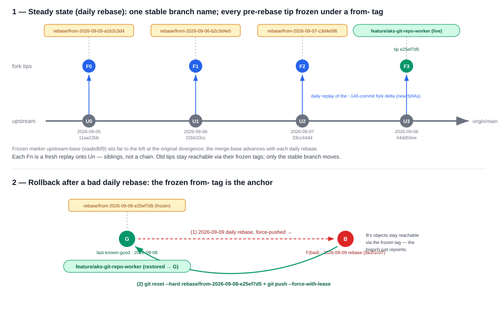

# PilotSwarm-SQL-staging → Transition Plan

> **Status:** Draft · **Owner:** @andrewkcchung · **Scope:** this fork only
> **This file is a fork-only artifact.** It must not be part of any PR to
> `affandar/PilotSwarm`. Delete it (or move it to the SQL-internal repo) once every
> capability it holds has landed upstream or moved to the SQL-internal repo.

## Table of contents

- [1. Purpose](#1-purpose)
- [2. Goals](#2-goals)
- [3. Current state](#3-current-state-as-of-this-draft)
- [4. The core problem](#4-the-core-problem)
- [5. IP classification](#5-ip-classification-what-goes-upstream-vs-internal)
- [6A. Fork-to-upstream audit](#6a-fork-to-upstream-audit-platform-contributions-in-the-fork)
- [6B. Reverse-direction audit](#6b-reverse-direction-audit-generic-platform-assets-currently-in-sqlmort)
- [7. Strategy A: reconcile the existing fork](#7-strategy-a--reconcile-the-existing-fork-default)
- [8. Strategy B: clean-room reimplementation](#8-strategy-b--clean-room-reimplementation-alternative)
- [9. Recommendation](#9-recommendation)
- [10. Execution plan](#10-execution-plan-phased)
- [11. Rebase protocol](#11-rebase-protocol)
- [12. Definition of done](#12-definition-of-done)
- [13. Open decisions](#13-open-decisions)

## 1. Purpose

This clone (`C:\src\PilotSwarm`) is effectively **PilotSwarm-SQL-staging** — its working
branch pushes to the private mirror, not to the public upstream. It exists so the SQL
team can collaborate on in-flight work without publishing internal IP. **A private fork
is a staging buffer, not a destination.** It must not diverge from upstream for long.

> **`PilotSwarm-SQL-staging` is intentionally short-lived.** It is not a permanent SQL
> distribution of PilotSwarm, a product repository, or a long-term integration branch. Its
> only purpose is to temporarily hold mixed work while each capability is routed to public
> PilotSwarm or `sqlmort`. Its delta must continuously shrink, and the repository must be
> deleted once nothing remains that exists only in the staging fork.

**The repos involved:**

| Role | Repo | URL |
| --- | --- | --- |
| 🌐 Public upstream (platform destination) | `affandar/PilotSwarm` | https://github.com/affandar/PilotSwarm |
| 🔒 Short-lived internal staging fork (temporary; delete after transition) | `azure-data/PilotSwarm-SQL-staging` | https://msft.ghe.com/azure-data/PilotSwarm-SQL-staging |
| 🔒 SQL-internal composition repo (IP and deployment home) | `azure-data/sqlmort` | https://msft.ghe.com/azure-data/sqlmort |

**Fork vs. SQL-internal composition — two different artifacts.** The **fork**
(`azure-data/PilotSwarm-SQL-staging`)
is a *complete copy of the entire PilotSwarm codebase* carrying all 142 divergence commits —
platform changes and SQL-specific changes tangled together in the same files. It mirrors
upstream's full tree and is meant to be temporary. **`sqlmort`** is *not* a copy of PilotSwarm;
it holds **only the SQL-specific pieces** — the thin slice of proprietary IP that must never
go upstream — composed on top of the public platform. Reconciliation splits the fork's tangled
diff into those two homes: platform → organic PR upstream, SQL-specific → `sqlmort`.

The end state: **every change in this fork is either (a) landed in public PilotSwarm via
an organic PR, or (b) moved to the SQL-internal repo.** Once nothing of value lives only in
the fork, it is deleted. This is capability routing, not a commit-by-commit burndown.

## 2. Goals

1. **Contribute platform / public functionality to PilotSwarm proper** (`affandar/PilotSwarm`).
   Generic runtime primitives (SDK, orchestration, UI, job-generator framework, deploy
   scaffolding, docs) belong upstream, not in a private fork.
2. **Keep SQL-internal concepts / proprietary IP in
   [`azure-data/sqlmort`](https://msft.ghe.com/azure-data/sqlmort), never in the public repo.**
3. **Retire the fork.** Once (1) and (2) are complete, `PilotSwarm-SQL-staging` has no reason
   to exist and is deleted.

> **Historical destination note:** the ADO `SQL-AI-Marketplace` branch was the original
> short-term home proposed for SQL composition. It has been superseded by `azure-data/sqlmort`
> and is not an active destination in this plan.

## 3. Current state (as of this draft)

> **Original divergence point:** [`eaabdbf9`](https://github.com/affandar/PilotSwarm/commit/eaabdbf9dbf5801b77ac9eef7cd36d2e6baa41c0)
> on `affandar/PilotSwarm`, retained as the frozen `upstream-base` marker. The successful
> 2026-09-08 integration advanced the current merge-base to `6df642ef`; future merges continue
> advancing it.


| Ref | Tip (code) | Ahead / behind `origin/main` | Visibility |
| --- | --- | :---: | --- |
| local `feature/aks-git-repo-worker` | `32f3438a` | 196 / 4† | — |
| `origin` = `affandar/PilotSwarm` `main` | `855aadca` | — | 🌐 public upstream |
| `ghe` = `azure-data/PilotSwarm-SQL-staging` | `32f3438a` | 196 / 4† | 🔒 internal org staging |

> † Snapshot taken **2026-09-11** after fetching public upstream. The live three-dot dashboard below
> replaces this snapshot after `oss/main` is refreshed.

```
   🌐 affandar/PilotSwarm   (upstream · main = the continuous horizontal trunk)
   Snapshot captured 2026-09-11

   …──o──o──o── … ──●──o──o──o──●   855aadca (2026-09-11)  ← origin/main
                    │ 6df642ef (2026-09-07) = current merge base
                    │
                    └──o──o──o── … ──o──►   32f3438a   ← feature/aks-git-repo-worker   🔒 ghe
                          our fork: +196 · 4 behind

   (original divergence eaabdbf9 sits far to the left, frozen as upstream-base; each merge advances
    the merge-base to the newest integrated upstream tip, while origin/main may move ahead again)
```

- **Last merged from** `origin/main` **`6df642ef`** on **2026-09-08**. At the
  **2026-09-11** snapshot, public upstream is at **`855aadca`**, so the fork is **4 commits behind**.
  (Original divergence was at **`eaabdbf9`**, still frozen as the `upstream-base` tag.)

- The fork-side divergence (`git diff origin/main...feature/aks-git-repo-worker`) at that snapshot =
  **317 files / +62,593 / −4,063 / 196 commits**.
  This is the scope to route — each capability lands upstream or moves internal, not a
  commit-by-commit burndown.
- **All 196** branch-only commits are internal-only on `ghe`; upstream `affandar` carries no
  divergent refs.

The internal staging repository maintains two OSS mirror refs for these comparisons:
`oss/main` is the upstream commit most recently integrated into the feature branch, while
`oss/head` is refreshed from the latest observed public `origin/main`.


> This comparison model is independent of whether integration uses rebase or merge. Rebase rewrites
> the feature-side commits while merge appends merge commits, but the three ref relationships remain
> the same. Under merge, dashboard A's **ahead commit count** includes merge-history commits and is
> not a drain metric; use its **Files changed** view for the fork delta and dashboard C for convergence.

- **A · Blue — Browse the accumulated fork delta since the last integration:**
  [`oss/main...feature/aks-git-repo-worker`](https://msft.ghe.com/azure-data/PilotSwarm-SQL-staging/compare/oss/main...feature/aks-git-repo-worker)
  — because `oss/main` is the last integrated upstream commit, this shows the feature branch's
  accumulated commits and file changes on top of that baseline. The fork-specific delta is drained
  when this dashboard reports **0 files changed**, even if public OSS has advanced since the baseline.
- **B · Orange — Browse upstream changes since the last integration — merge-risk dashboard:**
  [`oss/main...oss/head`](https://msft.ghe.com/azure-data/PilotSwarm-SQL-staging/compare/oss/main...oss/head)
  — this shows exactly how far public OSS has advanced since the last integration. Its commits and
  touched files are the new overlap surface that may produce textual or semantic merge conflicts.
- **C · Purple — Browse the current net tree delta — synchronization dashboard:**
  [`oss/head..feature/aks-git-repo-worker`](https://msft.ghe.com/azure-data/PilotSwarm-SQL-staging/compare/oss/head..feature/aks-git-repo-worker)
  — the two-dot comparison is the direct tip-to-tip diff. **0 files changed** here, together with
  **0 commits** in dashboard B, means the fork is also fully synchronized with current OSS; that is
  stronger than merely proving its unique delta has drained.
- **Browse the SQL-internal composition repo:**
  [`azure-data/sqlmort`](https://msft.ghe.com/azure-data/sqlmort) — the active "move it
  internal" destination for SQL-owned IP, deployment values, plugins, and scenarios.

### Remotes

```
origin     https://github.com/affandar/PilotSwarm.git                    (public upstream — rebase source)
ghe        https://msft.ghe.com/azure-data/PilotSwarm-SQL-staging.git    (internal staging — SAML SSO-governed, private)
```

## 4. The core problem

**Why fork at all?** To give SQL engineers a concrete place to build and iterate on platform
scenarios **without risking a leak of SQL-specific IP into the public OSS upstream** — e.g. the
internal IcM MCP endpoint/AAD scope (see §5). Work lands internally first; only
deliberately-scrubbed platform enhancements route back upstream.

**Why a separate repo, not a branch of the OSS repo? (TL;DR)** Git visibility is per-**repo**, not
per-branch — a branch of a public repo is public the moment you push it, so any SQL IP on it leaks
instantly. A separate internal repo is the only real privacy boundary; we still track upstream by
adding it as a git **remote** and rebasing (§11).

We diverged from PilotSwarm `main` at `eaabdbf9` (2026-08-08 — the current divergence point,
which advances each rebase). In that window the fork accumulated **two
kinds of value, tangled into the same commits/files:**
- **SQL-specific values that cannot live in an OSS repo** — real internal endpoints, AAD scopes,
  and CI-gate names (the Tier 1 IP in §5) that must stay in `sqlmort`.
- **Genuine platform enhancements** — scenarios we built here (durable orchestration, the
  job-generator lifecycle, worker/git-hydration, delegated MCP, …) that are real improvements to
  the platform and belong back **upstream** (§6A).

The problem is that these are mixed together, not that the fork exists. Left alone it also
*drifts* — every week upstream moves and the reconciliation cost grows.

We are **not freezing the divergence.** Instead we set up a standing protocol:
- (a) **Constantly rebase** the fork onto upstream so it never drifts — the fork stays a thin,
  current superset of `main` rather than a snapshot that rots (the §11 rebase protocol).
- (b) **Formalize the SQL-specific values in `sqlmort`** — a composition repo carrying
  environment-specific templates on top of a shared platform — so proprietary/SQL config
  lives in one place instead of tangled through the tree.
- (c) **Route generic platform work upstream** as themed PRs, draining the fork's delta over
  time (§6A).

The end state is two repos — a pure-platform core (fork → upstream) and `sqlmort` — kept
aligned by continuous rebase, not a one-time cutover.

## 5. IP classification (what goes upstream vs. internal)

This is the routing map: which parts of the divergence are proprietary (→ `sqlmort`) and
which are generic platform work (→ upstream PR). Three tiers.

### 🔴 Tier 1 — Domain behavior and composition → **SQL-internal repo (do NOT publish)**
Classification is based on domain ownership, not only whether a file contains a secret or
private endpoint. SQL-owned provider logic, operational policy, scenario definitions, prompts,
examples, tests, and deployment composition belong in `sqlmort`, even when their individual
values are not confidential.

The known extraction areas include:
- IcM and Kusto JobGenerator provider implementations, authentication details, response
  normalization, tests, and operational documentation.
- SQL-specific Kusto MCP deployment composition, environment values, and scenarios. The
  reusable MCP proxy/authentication host and public-sample Kusto reference adapter remain
  platform code.
- SQL scenario lifecycles and fixtures such as IncidentFix, Flakebuster, and
  SQL repository/fleet names.
- SQL environment composition: concrete images, identities, endpoints, cluster values, and
  plugin registration.

### 🟡 Tier 2 — Generic extension seams → **platform repo**
The platform owns contracts and mechanisms that do not enumerate or interpret SQL providers:
- Opaque JobGenerator provider IDs, a versioned module ABI, a generic provider runner, and the
  normalized out-of-process controller-to-runner protocol.
- Generic provider registration, credential references, response validation, guardrails, and
  lifecycle materialization. The runner owns HTTP, authentication, health, deadlines,
  cancellation, and shutdown; provider modules own only source-specific connector behavior.
- Generic MCP proxy/authentication primitives and plugin loading.
- Provider-neutral APIs and UI driven by registered descriptors rather than hard-coded source
  allowlists.

### 🟢 Tier 3 — Generic fixtures and public integrations → **platform repo**
Generic ADO PR observers, sample providers, tests, and documentation may remain only when they
use public interfaces and domain-neutral examples. Concrete JobGenerator source connectors,
including ADO WIQL modules used by SQL workflows, remain external sibling implementations in
the owning domain repository. Internal names and environment values must be replaced with
neutral placeholders before upstreaming.

**Bottom line:** the routing unit is an owned capability, not a count of files containing
private constants. Every fork-only surface must be either domain-neutral platform code or moved
to `sqlmort`.

## 6A. Fork-to-upstream audit: platform contributions in the fork

The functionality below is generic PilotSwarm runtime (no SQL specificity) and is the
substance of what this fork contributes back to `affandar/PilotSwarm`. Listed as themes,
not commits.

1. **AKS git-hydration worker fleet** — git-repo-worker DaemonSets + a node-local git-cache
   mirror, hostPath enlistment persistence (kills cold-start re-clone), workspace
   dehydrate/hydrate, repo-affinity routing, per-session ref pinning, and OS-split
   (Linux/Windows) fleets with truthful readiness.
2. **Job Generator framework + durable lifecycle state machine** — the generic job-generator
   (registration, hierarchy, lifecycle API resources, continuous materialization, durable
   state execution, canonical cross-source state references, E2E harness). *Domain source
   providers are registered externally and owned by their domain repositories.*
3. **Durable orchestration primitives** — keyed system waits, observed-condition waits,
   external-operation gates, durable response persistence, versioned orchestration snapshots,
   and bootstrap-turn folding.
4. **Delegated MCP + caller-auth** — connect to repo-defined MCP servers *as the caller*,
   per-audience token map with runtime audience discovery, fleet-default and caller-attached
   MCP servers, delegated tokens surfaced as env vars, external plugin-repo loading
   (PluginSpec), and JSONC `mcp.json` parsing.
5. **In-cluster MCP auth proxy** — delegated-only auth proxy with a pluggable upstream adapter
   (Kusto reference adapter, using the public sample cluster).
6. **Portal / observability UI** — durable job-transition timelines, worker-utilization
   visualization, live swimlane spans, queued bands, per-condition PR-gate rows, tree keyboard
   navigation, repo picker, and "load older" history hydration.
7. **Generic Azure DevOps integration** — observe ADO PR approval/completion and heterogeneous
   approval conditions on the PR gate; concrete ADO discovery connectors use the external
   provider ABI and remain in their owning domain repository.
8. **Worker platform hardening** — `beforeRunTurn` hook, platform-owned working directory +
   config/skill discovery, repo-less session pool routing, worker-registry host/build
   provenance, owner-affinity scheduling, and owner-managed logical cleanup.
9. **Devbox worker auth** — silent caller-token refresh, canonical worker identity across
   restarts, Azure CLI baked into the Windows base for popup-free auth, and signed-in
   Copilot-user model access.
10. **Reliability & deploy** — Postgres pool self-heal, duroxide pool/acquire resiliency,
    jittered retry backoff, orchestration lease/timeout tuning, session-poison diagnostics,
    blob/DB managed-identity decoupling, WAF fixes, and governance-restricted-subscription
    deploy overrides.

## 6B. Reverse-direction audit: generic platform assets currently in `sqlmort`

Section 6A addresses **false inclusion**: SQL-owned IP present in the fork that must not reach
OSS. This peer audit addresses the opposite **false exclusion** problem: generic PilotSwarm
mechanisms hidden in `sqlmort` that should be available in OSS. On **2026-09-10**, `sqlmort`
was audited for assets required by the new plugin boundary or suitable as genuine platform
contributions. No reverse-direction moves had been made when this audit was recorded.

The audit found the following candidates, in recommended execution order:

1. **Make the provider ABI consumable from PilotSwarm (boundary-completion priority).**
   SQLmort's three JobGenerator plugins each carry a structural copy of the canonical
   contract:
   - `plugins/job-generator/ado-wiql-provider/src/contracts.ts`
   - `plugins/job-generator/icm-provider/src/contracts.ts`
   - `plugins/job-generator/kusto-provider/src/contracts.ts`

   The authoritative ABI is
   `packages/job-generator-provider/src/contracts.ts` in PilotSwarm, with API version
   `pilotswarm.job-generator-provider/v1`. PilotSwarm should publish or otherwise expose a
   lightweight, stable contracts export that external repositories can consume. SQLmort
   should then reference that artifact and delete its mirrors. The plugins work today through
   TypeScript structural compatibility, so this is not an immediate runtime blocker, but it is
   required to prevent silent ABI drift and complete the ownership seam.

2. **Upstream the generic TypeScript PilotSwarm compatibility layer
   (platform contribution).** SQLmort TypeScript callers now use the published
   `pilotswarm-sdk` directly. Platform-neutral gaps are staged under
   `Clients/sdk/typescript/src/upstream-candidates/`, including authentication bootstrap,
   typed model responses, advanced session creation, delegated authentication, session-event
   handling, and JobGenerator APIs. Move these capabilities upstream using the existing
   PilotSwarm TypeScript SDK idioms, then remove the SQLmort compatibility implementations.

   Keep SQL-specific repository-to-audience mappings, service audiences, token policy, and
   other domain behavior under `Clients/sdk/typescript/src/sql-domain/`. The former SQLmort
   Python and .NET SDKs have been removed and are no longer upstream sources.

The following remain explicitly SQL-owned and are **not** reverse-migration candidates:
ADO WIQL, IcM, and Kusto connector implementations; provider authentication and response
normalization; plugin composition images; `deploy/values/*.env` and MCP registrations;
SQL fleet topology and layered Windows tooling; domain prompts, work-item fixtures,
acceptance playlists, and runbooks; and private repository-to-audience mappings.

**Recommended sequence:** first expose and consume the canonical provider contract; then
move the neutral client SDKs; then split deployment mechanics. Each move must leave SQLmort
with only a thin domain composition layer and must not make PilotSwarm depend on `sqlmort`.

## 7. Strategy A — Reconcile the existing fork (default)

Route the fork's work to its homes: contribute the generic platform work upstream as organic,
themed PRs, and move SQL-owned capabilities to the SQL-internal repo. When nothing of value
lives only in the fork, delete it. (Not a commit-by-commit burndown — the unit is a capability,
not a commit.)

1. **Freeze divergence.** No new feature work lands only in the fork; new platform work goes
   through upstream PRs from here on.
2. **Upstream the platform work as organic, themed PRs** (everything in §6A except Tier 1):
   - Group by theme (§6A): git-hydration/worker, job-generator framework, orchestration
     versioning, UI timeline, SDK auth/lifecycle, deploy, etc. Each theme is one reviewable PR.
   - Cut each PR from current `origin/main`. Prefer **path-scoped assembly**
     — bring over the theme's final file state and commit it clean — over replaying the
     entangled per-commit history; reserve commit-by-commit replay for the few themes whose
     history is already tight. Stack dependent PRs (foundation → features → UI/deploy).
   - Scrub Tier 2 terms as each PR is prepared.
3. **Extract Tier 1 providers to `sqlmort`.** ADO WIQL, IcM, and Kusto JobGenerator
   implementations move behind the opaque, normalized remote-provider contract. Continue
   with the remaining SQL-owned scenario and deployment surfaces.
4. **Resolve DELETE items** (anything experimental we don't want to publish or keep) — none
   identified yet; flag as found.
5. **Retire.** Once every §6A capability has landed upstream or moved internal — so the fork
   holds nothing not already in one of those homes — delete `PilotSwarm-SQL-staging`.

**Pros:** reuses the actual working, tested code (least rework); the scan shows the IP surface
is tiny (2 files), so this is low-risk. **Cons:** the PRs are large and entangled with weeks of
mixed commits; rebasing onto a moved `main` has conflict cost.

## 8. Strategy B — Clean-room reimplementation (alternative)

Treat the fork as a **reference/spec**, not a source of commits. Pick the specific
functionality we actually want, and reimplement it directly against current `origin/main`
(and the SQL-internal repo), without carrying the divergent history.

1. Enumerate the capabilities worth keeping (git-repo worker, job-generator lifecycle,
   orchestration versioning, worker timeline, caller-auth, etc.).
2. For each, write fresh commits on a branch cut from `origin/main`, using the fork only as a
   design reference. Land as clean, themed PRs.
3. Put SQL-specific pieces straight into `sqlmort` — never in the fork.
4. Delete the fork once the target capabilities exist upstream + internal.

**Pros:** no messy rebase; clean separation of concerns from the start; no risk of dragging
internal fixtures upstream by accident. **Cons:** discards working, tested code; higher
implementation effort; risk of behavioral drift from what already works.

## 9. Recommendation

Given the capability-routing requirement, **Strategy A (reconcile) is the default.** Reserve
**Strategy B** for any
capability whose commits are too entangled with SQL-specific concerns to cleanly split; those
few, reimplement clean rather than untangle.

## 10. Execution plan (phased)

This operationalizes §7 (Strategy A) and makes explicit the deployment-continuity model
§7 leaves implicit. The unit of work is a **capability — a logical diff of fork vs upstream** —
never a commit (nothing is cherry-picked).

### Phase 0 — Tip-level test confidence (complete)
The successful rebase onto current upstream, followed by green targeted and end-to-end suites,
provides sufficient confidence to continue the transition. We will not maintain a per-commit
coverage inventory or require retrospective `Covers:` trailers for the fork history.

Going forward, behavior changes should continue to ship focused tests in the same change. Integration
conflicts are validated against the current tip-level suite rather than a historical commit-by-commit
backfill.

### Phase 1 — Live fork, route-as-you-go
- Keep the fork the **active dev branch** for SQL-orchestration concepts upstream doesn't have
  yet; new work lands here first — expected, not a violation. (No hard "freeze".)
- **Classify at authoring** — every change knows its eventual home: **generic platform** →
  upstream (drained later via a theme PR); **SQL-specific** → `sqlmort` (or genericize in place).
- **Author upstream-first only when practical** (genuinely generic, no dependency on
  not-yet-upstreamed primitives); everything else is fork-first by necessity.
- Run a **constant rebase** cadence so the fork stays `origin/main + delta`, however that delta churns.
- Keep deploying from the fork for now (single deployable, as today).

### Phase 2 — Carve SQL out behind a plugin seam; `sqlmort` becomes the deployment repo (→ 2 repos)
- [x] Introduce the **provider plugin seam** in the fork: opaque provider IDs, a versioned
  module ABI, a platform-owned runner, normalized controller-to-runner HTTP, credential
  references, generic limits, persistence migration, and provider-neutral API/UI validation.
- [x] Extract ADO WIQL from JobGenerator core into a SQLmort-owned sibling module beside IcM.
  The domain module owns Azure DevOps query/authentication behavior while PilotSwarm's generic
  runner owns HTTP, authentication, health, deadlines, cancellation, validation, and process
  lifecycle.
- [x] Move `IcmEvaluator`, its MCP dependency, tests, endpoint/scope configuration, and
  operational documentation out of the platform implementation into **`sqlmort`**. The
  SQL-owned module contains only IcM connector behavior; its image composes that module over
  the platform runner. Kubernetes resources, controller registration, and coordinated rollout
  tooling remain deferred until the composition image can be exercised against a target stamp.
- [x] Validate the cross-repository provider boundary with SQLmort's `ado_wiql` sibling plugin
  and the deterministic mock-delivery lifecycle. On 2026-09-10 generator
  `fcadf52f-eae6-42e7-beab-54b361330425` loaded the external module through PilotSwarm's
  generic runner, discovered work item `5565721`, created one Job, and reached `Validated`
  after both durable mock waits.
- [x] Waive legacy in-process provider migration: no deployed use cases depend
  on the old ADO WIQL, IcM, or Kusto environment contracts, so remove their
  provider-specific startup guards instead of carrying migration scaffolding.
- [x] Extract the Kusto JobGenerator evaluator into a SQLmort-owned sibling module using the
  same provider ABI as ADO WIQL and IcM.
- [ ] Expose the canonical provider ABI as a consumable PilotSwarm package/export, update the
  three SQLmort providers to consume it, and delete their structural `contracts.ts` mirrors.
- [x] Extract the Kusto MCP deployment surface. The reusable adapter host and public-API
  Kusto reference adapter remain in the platform; SQL-specific endpoint values, fleet
  registrations, and acceptance scenarios live in `sqlmort`. The platform-managed `sqlwus2`
  instance passed the delegated-MCP and complete external suites on 2026-09-11, after which
  the copied sqlmort manifest and ad hoc build/apply wrappers were removed.
- **Make `sqlmort` the deployment/integration repo:** it depends on core (fork now, upstream
  later), injects the IcM plugin, and owns the compose→build→ship pipeline.
- **Split the deploy layer:** generic build recipes stay in **core** (to upstream); SQL-specific
  composition + env + infra (core-version pin, IcM injection, ACR/AKS/AFD/PG targeting,
  governance-restricted-subscription overrides) stay in **`sqlmort`**.
- [x] Neutralize identified fork-added SQL/org-specific comments and example paths in the SDK
  and git-cache deployment documentation.
- [x] Genericize PVS operation and policy fixtures and remove the hard-coded Private Validation
  Service UI label while preserving the generic external-operation and named-policy mechanisms.
- [x] Genericize remaining **Tier 2** examples in place: replace `StandardFix` and
  `DsMainDev` with neutral fixtures and remove the concrete ACR name.
- **Result:** deployment is now **core (fork) + `sqlmort` = 2 repos**, orchestrated *from
  `sqlmort`*; the fork is now a **pure-platform repo** (a precondition for retiring it).

> **⚠️ "Pure-platform" describes the *tree*, not the *history*.** After Phase 2 the fork's **working
> tree** is IP-free — the Tier-1 files (IcM endpoint, AAD scope, CI-gate names) now live in the
> `sqlmort`. But the **commit history still contains the IP**: Phase 2 removes it at the *tip* via
> *new* commits — it does **not** rewrite history, so the older commits that introduced the IP are
> still reachable in the branch. Consequence: the fork is safe to keep **private**, but must
> **never** be pushed — branch, tag, or mirror — to any **public** repo. A public branch exposes its
> full history, and checking out any historical commit leaks the IP (§4), and it cannot be
> un-published once cloned/forked/cached. This is precisely why **Phase 3 does not publish the fork
> branch**: it upstreams via **clean-room, path-scoped PRs re-originated from `origin/main`** (fresh
> commits, no entangled history). Treat "IP-less" as a claim gated on a **secret + full-history
> scan**, not one inferred from a clean tip.

### Phase 3 — Upstream the platform, theme by theme (slow track, external pace)
- Slice the fork-vs-upstream logical diff into the ~8+ capability themes of §6A.
- For each theme, in dependency order:
  - Cut a clean PR branch from **current `origin/main`** via **path-scoped assembly** (bring the
    theme's final file state, commit clean) — not a replay of entangled history.
  - Open the PR into `affandar/main` from a GitHub fork of `affandar` (a **contribution remote**,
    never a deploy input).
  - On merge, the next fork rebase **drains** that theme (its commits collapse to no-ops);
    reconcile if upstream modified or independently built it.
- Suggested order (foundation → top): **(3)** orchestration primitives → **(2)** job-generator /
  lifecycle → **(4)** delegated-MCP + seam → **(8)** worker hardening → **(1)** git-hydration fleet
  → **(9)** devbox auth → **(5)** MCP proxy → **(7)** ADO integration → **(6)** portal UI;
  **(10)** reliability / deploy fixes trickle in throughout.
- For any theme too entangled to lift — notably **(3)**, where upstream already added a parallel
  `orchestration_1_0_68/69` — use **Strategy B (clean-room on upstream's version)** instead of lifting.

### Phase 4 — Retire (gated on a behavioral shift, still 2 repos)
- This is **steady-state routing**, not a one-time burndown: new platform work flows in the top,
  merged themes drain out the bottom. "Drive to zero" is reachable only once the *inflow* of
  fork-first platform work slows.
- Delete the fork only when **(a)** the accumulated delta is drained **and (b)** new generic
  platform work has moved **upstream-first**, so nothing fresh keeps landing fork-only.
- Swap the deploy core **fork → upstream**: because `sqlmort` owns the pipeline, this is just
  **repinning `sqlmort`'s core dependency**, not moving any build logic.
- Delete `PilotSwarm-SQL-staging`; remove this plan doc.

> **Invariant throughout:** deployment is always **exactly 2 repos** — core (`fork`→`upstream`) +
> `sqlmort` — `sqlmort` owns composition, and "done" means the **fork-vs-upstream logical diff
> is empty**, not "all commits replayed."

## 11. Rebase protocol

The fork tracks upstream by **rebase, not merge** — that's what keeps history linear and the
fork-vs-upstream diff a clean "what we add" delta (a merge buries it under merge commits).
Rebasing rewrites published history, so it runs on a **candidate branch first**, gets validated,
then is swapped in and force-pushed. **The live deployable branch is never rebased in place.**

**Cadence.** Rebase little and often — weekly, and after each upstream theme merges. Frequent
small rebases keep the conflict surface tiny; a long gap lets it balloon (the current +46 gap
already yields ~36 conflicting files, including the `orchestration_1_0_68/69` add/add).

**One-time setup.**
- `git config rerere.enabled true` — records each conflict resolution and auto-reapplies it on
  later rebases (so you resolve the orchestration collision *once*, not every week).

**Branch & tag naming.**  Dates in tag names are the **committer date of the referenced commit**
(`YYYY-MM-DD`), not the day you happened to tag — so each tag is self-describing.
- **Live branch (stable, never renamed):** `feature/aks-git-repo-worker` — force-pushed in place on
  every rebase; all by-name references (`sqlmort` core pin, CI, PR policy) point here.
- **Divergence marker (frozen):** tag `upstream-base` = `eaabdbf9`.
- **Last-integrated OSS baseline:** branch `oss/main` — points to the upstream commit the feature
  branch was most recently rebased onto. Advance it only after a successful swap (step 7).
- **Current OSS mirror:** branch `oss/head` — a fast-forward-only mirror of the latest fetched
  public `origin/main`, refreshed before each rebase attempt (step 1). Together these GHE-only refs
  power in-repository comparisons because the private staging repo and public upstream do not share
  a GitHub fork network.
- **Candidate branch (ephemeral):** `cand/<upstreamDate>-<upstreamSha>` — deleted after swap.
  **Deliberately *not* named `rebase/onto-…`:** that name is the `onto-` *tag*, and git resolves a
  bare ref as a **tag before a branch** — a same-named branch + tag makes `reset`/`push` silently
  pick the tag (the upstream base, with **no fork commits**). Keep the candidate in its own `cand/`
  namespace so the two can never collide.
- **Per-rebase tags (immutable):** `rebase/from-<forkTipDate>-<forkTipSha>` (rollback point) and
  `rebase/onto-<upstreamDate>-<upstreamSha>` (the upstream tip rebased onto). Consumers needing a
  reproducible deploy pin to the `onto-` tag rather than the moving branch.
- **Initial baseline (before any rebase):** `rebase/from-2026-09-03-2dc49630` (the original fork tip)
  and `rebase/onto-2026-08-08-eaabdbf9` (the merge-base it rested on) — the first row of the audit trail.
- **Current tip (as of the 2026-09-08 rebase):** `rebase/from-2026-09-08-e25ef7d5`, replayed onto
  `origin/main` `6df642ef` (the newest `rebase/onto-…` row).

**Model.** The stable branch name never changes (so no script, CI ref, or PR policy breaks); every
pre-rebase tip is frozen under an immutable `from-` tag before the rewrite, so a bad force-push is
always recoverable by repointing the branch back onto the frozen tip. We **keep every tag** — the
full set is a permanent audit trail and rollback ledger.



> **Reading the diagram.** *(1) Steady state:* each fork tip `Fn` is a fresh replay of the ~140-commit
> delta onto the newest upstream tip `Un` (new SHAs — the tips are siblings, not a chain). Only the
> `feature/aks-git-repo-worker` branch moves; every older tip stays reachable via its frozen `from-` tag.
> *(2) Rollback:* a bad rebase force-pushed the branch to `B`; because the last-good tip `G` is still pinned
> by a pushed `from-` tag, its objects were never GC-eligible, so
> `git reset --hard rebase/from-2026-09-08-e25ef7d5 && git push --force-with-lease` restores the branch onto `G`.

**Per-rebase steps.**
1. Pull the new upstream `main`, then refresh the fast-forward-only current-OSS mirror:
   ```
   git fetch origin main
   git push ghe origin/main:refs/heads/oss/head
   ```
   The `oss/main...oss/head` dashboard now shows what has accumulated upstream since the last
   successful integration.
2. Backup the current fork tip for rollback:
   `git tag -a rebase/from-<forkTipDate>-<forkTipSha> feature/aks-git-repo-worker -m "pre-rebase fork tip"`.
3. Cut a candidate branch (or worktree) from the current fork tip:
   `git switch -c cand/<upstreamDate>-<upstreamSha> feature/aks-git-repo-worker`.
4. Replay the ~140 divergence commits onto the new upstream tip:
   `git rebase origin/main`  (equivalently `git rebase --onto origin/main upstream-base`).
5. Resolve conflicts **by class**:
   - **Theme already upstreamed** → the commit is now redundant; resolve to upstream's version, or
     `git rebase --skip` if fully absorbed (the theme *drains* out and the delta shrinks).
   - **Parallel implementation** (e.g. `orchestration_1_0_68/69`) → if the two sides implement the
     *same* behavior, adopt upstream's and delete the fork's divergent copy (the Strategy-B reconcile
     flagged in Open decisions). **But if the fork's copy layered fork-only behavior on top — e.g.
     owner-affinity routing minted as `orchestration_1_0_69` — this is a *version-number collision
     carrying a feature*, not a pure parallel impl.** Treat it exactly like a migration-version
     collision: re-mint the fork behavior on a *new* version number after upstream's head (freeze the
     current live orchestration, apply the fork delta, bump `DURABLE_SESSION_LATEST_VERSION`, register
     it). **Never** resolve it by adopting upstream's version and dropping the fork feature — that
     silently deletes shipped behavior (this is precisely how owner-affinity was lost on the
     2026-09-07 crank). See the no-defer invariant below.
   - **Migration version collision** (both sides define the same `cms-migrations.ts` version `NNNN`
     — *seen on the day-1 crank: upstream `0045 session_canvases` vs. fork `0045 session_git_state_pinning`*)
     → keep both and **renumber the fork block** to sit *after* upstream's new head. This has a
     **code half** (here) and a **DB half** (a deploy-time ledger re-stamp — see *Migration ledger
     reconciliation* below); do **both**, or an already-deployed fork DB silently skips upstream's
     migrations at the reused numbers.
     - **Code half.** With `U = max(upstream version)` on the newly-rebased tip, renumber the fork's
       migrations to `U+1 … U+n`. Compute the target from the fork's **divergence-baseline set** — the
       migrations added after `upstream-base`, in their original fork order, keyed by *name* — **not**
       from wherever they landed last cycle, so offsets don't compound. Update three places per
       migration (the list entry `version`, the SQL function name, and its definition) plus every test
       that asserts the number. Numbers must stay unique and ordered, so `rerere` can't reliably
       auto-resolve this — the target shifts each rebase.
     - **Idempotency invariant.** Every fork migration must be re-runnable (`CREATE … IF NOT EXISTS`,
       `ADD COLUMN IF NOT EXISTS`, `DROP CONSTRAINT IF EXISTS` then `ADD CONSTRAINT`) — the backstop
       that makes any accidental replay a harmless no-op. Keep it true for new fork migrations.
   - **Genuine fork-only work** → keep; reapply on top.

   > **No-defer invariant.** A dropped fork feature or unresolved divergence is **re-applied by
   > default**. Never silently defer, `--skip`, or adopt-upstream-and-drop a fork behavior. When a
   > divergence surfaces, surface it back to the owner and get **explicit approval before deferring**.
   > "It looks large" is not grounds to defer — it is grounds to *ask*. Offline unit tests do **not**
   > cover routing/deployment behavior (owner-affinity, worker tagging), so a green suite is not
   > evidence a fork feature survived; verify feature presence against the pre-rebase tip explicitly.

   Continue with `git rebase --continue` until the replay completes.
6. **Validate on the candidate — before swapping anything:**
   - build + unit/integration tests green,
   - smoke: bring up worker + portal, run one lifecycle-job E2E,
   - deploy to **non-prod** (`sqlmort` pinned at the candidate) and sanity-check.
7. **Swap in** once green. If the live branch gained new commits during validation, rebase those
   few onto the candidate first. Then capture the SHAs up front and swap **by SHA** — never by the
   ambiguous `rebase/onto-…` name (see the warning below):
   ```
   #   $CAND = validated candidate tip   (git rev-parse cand/<upstreamDate>-<upstreamSha>)
   #   $OLD  = live tip being replaced    (git rev-parse feature/aks-git-repo-worker)  # the from- tag target
   #   $BASE = upstream tip rebased onto  (git rev-parse origin/main)
   git tag -a rebase/onto-<upstreamDate>-<upstreamSha> $BASE -m "upstream base rebased onto"
   git branch -f feature/aks-git-repo-worker $CAND          # move the ref by SHA, no checkout, tree untouched
   git push ghe refs/tags/rebase/onto-<upstreamDate>-<upstreamSha> refs/tags/rebase/from-<forkTipDate>-<forkTipSha>
   git push ghe feature/aks-git-repo-worker --force-with-lease=feature/aks-git-repo-worker:$OLD
   git push ghe $BASE:refs/heads/oss/main            # 7b. advance the last-integrated OSS baseline
   ```
   > **Why by SHA, not name.** The `onto-` *tag* and (pre-2026-09) the candidate *branch* shared the
   > name `rebase/onto-…`; git resolves a bare ref as a **tag before a branch**, so `git reset --hard
   > rebase/onto-…` silently resolves to the *tag* — the bare upstream base with **no fork commits** —
   > and would reset the live branch to upstream, dropping all ~140 fork commits. Hardened form:
   > (a) the candidate lives in the `cand/` namespace so it can't collide with the tag; (b) move the
   > live branch with `git branch -f … $CAND` (explicit SHA, **no** checkout — leaves your working
   > tree and the candidate checkout untouched); (c) push tags via fully-qualified `refs/tags/…`
   > (not `--tags`, which also sprays unrelated local tags and can't disambiguate a name); (d) pin the
   > lease to the exact `$OLD` SHA so a stray background fetch can't defeat `--force-with-lease`.
   > **Stash uncommitted/untracked work first (`git stash push -u`), and never land a follow-up
   > commit on the ephemeral `cand/` branch — it is deleted in step 9; commit on the stable branch.**
8. **Re-measure & refresh:**
   ```
   git rev-list --count ghe/oss/main..ghe/oss/head  # upstream commits pending integration
   git diff --stat ghe/oss/main...HEAD               # accumulated fork delta
   git diff --stat ghe/oss/head HEAD                  # direct net tree delta
   ```
   Track the accumulated fork delta through
   [`oss/main...feature`](https://msft.ghe.com/azure-data/PilotSwarm-SQL-staging/compare/oss/main...feature/aks-git-repo-worker),
   upstream integration risk through
   [`oss/main...oss/head`](https://msft.ghe.com/azure-data/PilotSwarm-SQL-staging/compare/oss/main...oss/head),
   and the direct tree delta through
   [`oss/head..feature`](https://msft.ghe.com/azure-data/PilotSwarm-SQL-staging/compare/oss/head..feature/aks-git-repo-worker).
9. Clean up: delete the candidate branch (`git branch -D cand/<upstreamDate>-<upstreamSha>`); keep the
   `from-`/`onto-` tags as the permanent audit trail.

**Rollback.** If validation fails, discard the candidate — the live branch never moved. If a bad
rebase was already pushed, restore **by SHA** and force-push with an explicit lease:
`git branch -f feature/aks-git-repo-worker rebase/from-<forkTipDate>-<forkTipSha>` then
`git push ghe feature/aks-git-repo-worker --force-with-lease` — the `from-` tag name is
unambiguous (no branch shares it) and its objects were never GC-eligible, so the last-good tip is
always reachable.

**Migration ledger reconciliation (deployed fork DBs).** The migrator is a per-version **ledger**
(`copilot_sessions.schema_migrations`), not a high-water-mark: each migration runs iff its exact
`version` string is absent from the table (gaps are allowed — it can run `0085` while `0080` sits
unapplied). So the code renumber alone is **not** enough for an already-deployed fork DB: its ledger
still records the fork's DDL under the *old* numbers (this cycle: `0045–0057`, **13** fork
migrations — the divergence baseline is `0044`), which are exactly the numbers upstream's migrations
now occupy. On the next deploy the runner sees those strings as applied and
**silently skips upstream's migrations at those numbers** (per-version, so only the collided ones —
everything around them still applies), while the fork's renumbered entries are unrecorded.

Fix it with a **name-keyed re-stamp** (Variant B), run as a **pre-deploy hook in the same rollout**
as the rebased image (so no old-code boot lands on a half-re-stamped ledger). Key on `name` — stable
across cycles — **not** on the old number (which moves every rebase); that is what makes the recipe
survive repeated rebases:

```sql
BEGIN;
UPDATE copilot_sessions.schema_migrations m
SET version = v.newver
FROM (VALUES
  ('<fork migration name>', '<U+1>'),
  ...                                   -- one row per fork migration, in fork order
) AS v(name, newver)
WHERE m.name = v.name;                  -- expect n rows updated
COMMIT;
```

> **Derive the VALUES list from a name-keyed ledger-vs-code diff — never from the renumber commit's
> file diff.** The authoritative source set is *every* fork migration whose `name` is applied in the
> **deployed ledger** but sits at a **different `version` in the target code** (join deployed
> `schema_migrations.name` against the `version/name` pairs parsed from `cms-migrations.ts`). A
> migration can be renumbered *anywhere* in the rebase — not only inside the contiguous block the
> renumber commit touched — so the commit diff undercounts. **Day-1 incident:** the VALUES list was
> built from the renumber commit's diff (11 rows, `0047–0057`) and missed two fork migrations
> (`session_git_state_pinning` `0045→0077`, `fix_session_git_state_setter` `0046→0078`) that the
> rebase relocated elsewhere. The half-re-stamp left `0045/0046` still keyed to the old fork names, so
> the runner skipped upstream's new `0045 session_canvases` and then **stalled at `0064 canvas_kv`**
> (`relation "…session_canvases" does not exist`). Run the name-diff as a **pre-flight gate** and
> assert its row count equals the number of fork migrations above the divergence baseline before
> committing the re-stamp.

This unchecks the old numbers (upstream's `0047…0078` now run) and checks the new ones (the fork's
DDL is **skipped, not replayed**) — no data deleted, only `n` bookkeeping rows renamed. Run it against
**every** deployed fork DB. **Verify** read-only, before and after: the `n` fork rows are still at the
old numbers and nothing already occupies the target range beforehand; afterwards the old numbers are
gone, the target range is filled, and a fresh-DB dry-run of the candidate reaches the new max in
strict order. Snapshot the DB first — this writes to a shared/prod store.

> **Wording note (avoid a false-safety read).** The renumber commit's message says "*Migrations stay
> name-keyed, so DDL already applied under the old numbers is recognized and skipped*." Read that as
> describing the **re-stamp**, not the runner. The runner (`pg-migrator.ts`) is strictly
> **per-version** — it builds its applied-set from the `version` column and skips on
> `appliedSet.has(migration.version)`; the `name` column is stored but never consulted for the skip
> decision. So recognition-and-skip only happens *after* the name-keyed re-stamp has moved the ledger
> rows to the new numbers. Without the re-stamp the runner does **not** self-recognize by name — do
> not treat the deploy as safe on that assumption.

**Preventing the old-worker re-run race (advisory-lock gate).** The re-stamp and the new-image
rollout are not naturally atomic: migrations run on process **boot** only — `PgSessionCatalog.initialize()`
(`cms.ts`) is guarded by `this.initialized`, so an already-running pod never re-runs DDL, but a pod
that **(re)starts** after the re-stamp and before it is replaced *will*. Old (pre-rebase) code whose
migration list still puts the fork DDL at the old numbers (`0045–0057`) would then see those numbers as absent (we moved
them to `0077–0089`) and **re-insert the fork rows at the old numbers**, recreating the exact collision
— and idempotent (`IF NOT EXISTS`) DDL does **not** save you, because it is the ledger re-insert, not
the DDL, that re-poisons the state. On spot node pools (the git-worker DaemonSets tolerate
`scalesetpriority=spot`) a restart can happen at any moment, so the window is real.

Close it with the **same advisory lock the migrator itself respects** — no code change required. The
runner acquires a **session-level** `pg_try_advisory_lock` keyed on `hashSchemaName(schema, CMS_LOCK_SEED)`
(polling form: a blocked worker sleeps with *no* open transaction and retries every 100 ms). For
`schema = copilot_sessions`, `CMS_LOCK_SEED = 0x636D73`, that key is **`420573475`**. Hold it across
the whole cutover and every booting worker — old or new — parks in the poll loop until you release:

1. Admin session: `SELECT pg_advisory_lock(420573475);` — acquire and **hold** (session-scoped, so it
   survives the re-stamp's `BEGIN…COMMIT`).
2. In that **same held session**, run the re-stamp `UPDATE … COMMIT` and assert `n` rows changed.
3. **Still holding the lock**, roll the rebased image across **every** workload. The fleet upgrades by
   **two different mechanisms** — get this wrong and the roll either silently reverts or deadlocks:
   - **The Deployments are Flux-managed** (`portal` + `worker` Kustomizations own `pilotswarm-portal`
     and `copilot-runtime-worker`, reconciled from an Azure blob **Bucket** source on a **2-minute
     interval**). A bare `kubectl set image` is **reverted on the next reconcile**, *and* the sanctioned
     `--steps …,rollout` path blocks on `kubectl rollout status` (which hangs inside the lock window —
     new pods never go Ready). So during the window, **suspend Flux and drive the Deployments directly**:
     1. `flux suspend kustomization worker-worker portal-portal -n flux-system` — stop reconciles from
        reverting our in-window changes.
     2. `kubectl set image` the new tag directly on `pilotswarm-portal` and `copilot-runtime-worker`
        (no env re-render → **zero config drift**; new pods park on the lock). *(Leave `kusto-mcp` —
        a different, non-fork image — untouched.)*

     **Do not `flux resume` until the Bucket carries the new tag** — resuming against a stale (old-tag)
     Bucket reverts the Deployments to old code and re-opens the race. After release (step 5) make the
     Bucket authoritative and *then* resume: `npm run deploy -- worker sqlwus2 --steps manifests,rollout
     --image-tag <tag>` and the same for `portal` (uploads the new-tag tree + reconciles; readiness wait
     is safe post-release), then `flux resume kustomization worker-worker portal-portal -n flux-system`.
   - **The git-worker DaemonSets are not yet Flux-managed** → `kubectl set image`
     per DaemonSet, bumping **both** the `git-repo-worker` container and the
     `wait-for-mirror` initContainer.
   - **Git-cache ownership is per instance.** Suspend
     `git-cache-<instance>-git-cache-<instance>`, update its DaemonSet directly
     inside the lock window, then publish the new authoritative image with
     `deploy.mjs git-cache ... --steps manifests` and resume the Kustomization
     after release. (See the per-DaemonSet loop in
     `SDLC_ORCHESTRATION_TESTING.md`.)
   Old pods terminate; new pods boot and **block on `420573475`** — no migrations run.
   > **Do not wait for readiness inside the lock window.** Because new pods block at `initialize()`
   > while you hold the lock, they never become Ready — so `kubectl rollout status` and Flux's own
   > `rollout` wait step **hang** if run here. Gate on *specs updated to the new tag (+ old-tag pods
   > drained so none can grab the lock at release)*, **not** on Ready. Run `rollout status` / readiness
   > checks **after** step 5.
4. **Verify zero old-tag pods remain** (all workloads on the new tag; delete any lingering old-tag pod
   so only new code can acquire the lock at release).
5. Only then `SELECT pg_advisory_unlock(420573475);` (or end the session). New pods take the lock and
   migrate against the corrected ledger — upstream's reused numbers run, the fork's re-stamped numbers
   are skipped. *Now* wait for Ready / `rollout status` to confirm the cutover, make the Bucket
   authoritative for the Deployments (`--steps manifests,rollout`), and **`flux resume`** the suspended
   Kustomizations (see step 3 — never resume against a stale-tag Bucket).

The gate turns the race into a controlled cutover: the only code that can migrate after the re-stamp is
code that first takes the lock, and you do not release until the fleet is provably all-new. **Two
hardening rules:** (a) the lock lives in one DB session — if that holder dies the lock auto-releases and
the gate opens early, so keep it alive and **scale the worker `Deployment` to 0 first** to shrink the
restart surface to near-zero (portal and the DaemonSets are still covered by the lock, since they call
`initialize()` on boot too); (b) if any old-tag pod lingers at step 4, **do not release** — delete it or
wait it out. A full **stop-the-world** (scale worker to 0 + cordon the git-worker node pools, re-stamp,
roll, uncordon) is the simpler bulletproof alternative when a short fleet downtime is acceptable.

> **Known risk — reduced capacity / no uptime guarantee during the lock window.** While the lock is
> held (steps 3–5), new pods block at `initialize()` and are **not Ready**, so fleet serving capacity
> is degraded for the duration of the roll: fewer pods are able to serve customer workloads, and if the
> whole fleet cycles at once there can be a short window with **no** Ready pods. **We do not currently
> promise 100% uptime across a re-stamp rollout.** Mitigations today: keep the lock window short, roll
> DaemonSets in batches so some old-tag pods keep serving until their replacements are ready, and prefer
> off-peak execution. A zero-downtime cutover (e.g. surge/blue-green or draining behind a load balancer)
> is deferred — **TODO: revisit to eliminate the capacity gap.**

## 12. Definition of done

- [x] **Phase 0** — successful rebase and green tip-level validation provide sufficient test
      confidence; no historical per-commit coverage inventory or backfill is required.
- [ ] Constant rebase cadence established and maintained — fork tracks `origin/main` (keeps the
      delta current and drainable) until retirement.
- [x] Provider module ABI and platform-owned runner implemented; ADO WIQL, IcM, and Kusto
      concrete
      implementations, tests, configuration, and image composition moved to `sqlmort`
      *(ADO WIQL, IcM, and Kusto committed 2026-09-10; no legacy deployment
      migration is required)*.
- [x] Cross-repository loading and execution validated locally through SQLmort's `ado_wiql`
      plugin and the mock-delivery state machine, including authenticated provider dispatch,
      real Azure DevOps discovery, Job materialization, and terminal `Validated` state.
- [x] Legacy provider rollout waived because no deployed definitions depend on
      the removed in-process ADO WIQL, IcM, or Kusto environment contracts.
- [ ] External providers consume a canonical PilotSwarm-owned ABI artifact; SQLmort contains
      no copied provider-contract definitions.
- [x] Generic MCP-over-HTTP deployment is platform-owned while SQL-specific Kusto values,
      fleet registrations, and acceptance tests are sqlmort-owned; the platform-managed
      instance passed the complete external suite and the copied deployment was removed.
- [ ] Remaining Tier 1 providers and scenarios routed to their domain owners.
- [ ] `sqlmort` owns the compose→build→ship pipeline; deployment = core + `sqlmort` (2 repos);
      the fork is a pure-platform repo.
- [x] Tier 2 genericized in place (fork-added comments/examples, PVS, StandardFix,
      DsMainDev, and the concrete ACR reference are neutralized; Tier 3 is benign —
      no action; see §5).
- [ ] All §6A platform capabilities landed upstream as organic, themed PRs (Tier 1 excluded):
  - [ ] (1) AKS git-hydration worker fleet
  - [ ] (2) Job Generator framework + durable lifecycle state machine *(generic runner/module
        ABI implemented; ADO WIQL and IcM evaluators moved to SQLmort sibling plugins)*
  - [ ] (3) Durable orchestration primitives *(reconcile vs. upstream `orchestration_1_0_68/69`)*
  - [ ] (4) Delegated MCP + caller-auth *(incl. the `PluginSpec` seam)*
  - [ ] (5) In-cluster MCP auth proxy
  - [ ] (6) Portal / observability UI
  - [ ] (7) Generic Azure DevOps integration
  - [ ] (8) Worker platform hardening
  - [ ] (9) Devbox worker auth
  - [ ] (10) Reliability & deploy
- [ ] New generic platform work is authored upstream-first (inflow stopped) and the
      fork's logical diff vs upstream is empty.
- [ ] Deploy core repinned fork → upstream; `PilotSwarm-SQL-staging` deleted; this file removed.

## 13. Open decisions

1. **Theme 3 orchestration versioning** — upstream independently added `orchestration_1_0_68/69`,
   so this is a *reconcile two implementations* problem, not an add. Decide per subsystem: adopt
   upstream's version (clean-room, Strategy B) vs. push ours. First conflict every fork rebase
   hits, so decide early. *(The one known Strategy-B candidate; default stays A per §9.)*
2. **Deploy-layer split** — enumerate which `deploy/` files are generic (→ core, upstreamed) vs
   SQL-specific (→ `sqlmort`: core-version pin, IcM injection, ACR/AKS/AFD/PG targeting, governance
   overrides). Reconcile SQLmort's apply wrappers and generic-worker manifest against existing
   PilotSwarm deployment support rather than creating duplicate implementations. Must be settled
   before `sqlmort` can own the pipeline (§10 Phase 2 and §6B).
3. **Rebase cadence** — pin the trigger/frequency (e.g., weekly + on each upstream theme merge).
4. **Provider contract distribution** — choose a stable package/export shape and versioning
   policy for external provider authors, then migrate SQLmort off its three structural mirrors.
5. **TypeScript SDK ownership** — migrate SQLmort's generic compatibility candidates into the
   published PilotSwarm TypeScript SDK, preserve compatibility for current SQLmort callers, and
   keep SQL-owned audience mappings isolated in SQLmort.
