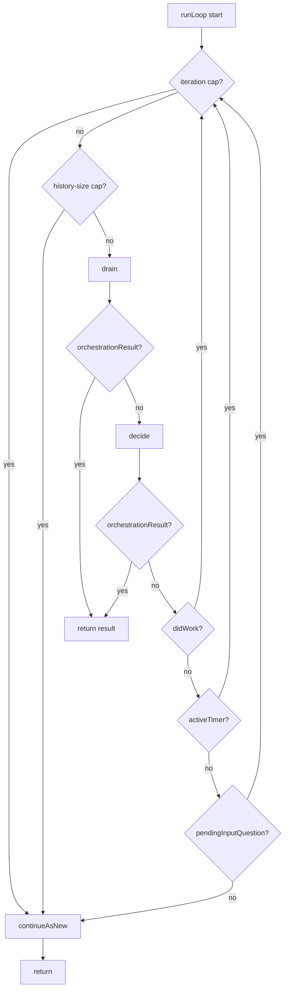
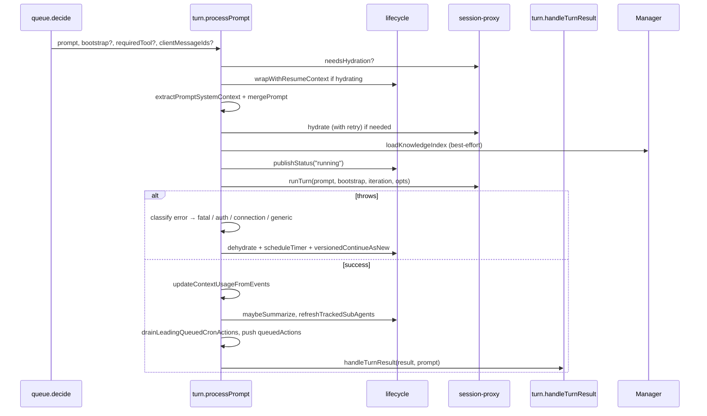
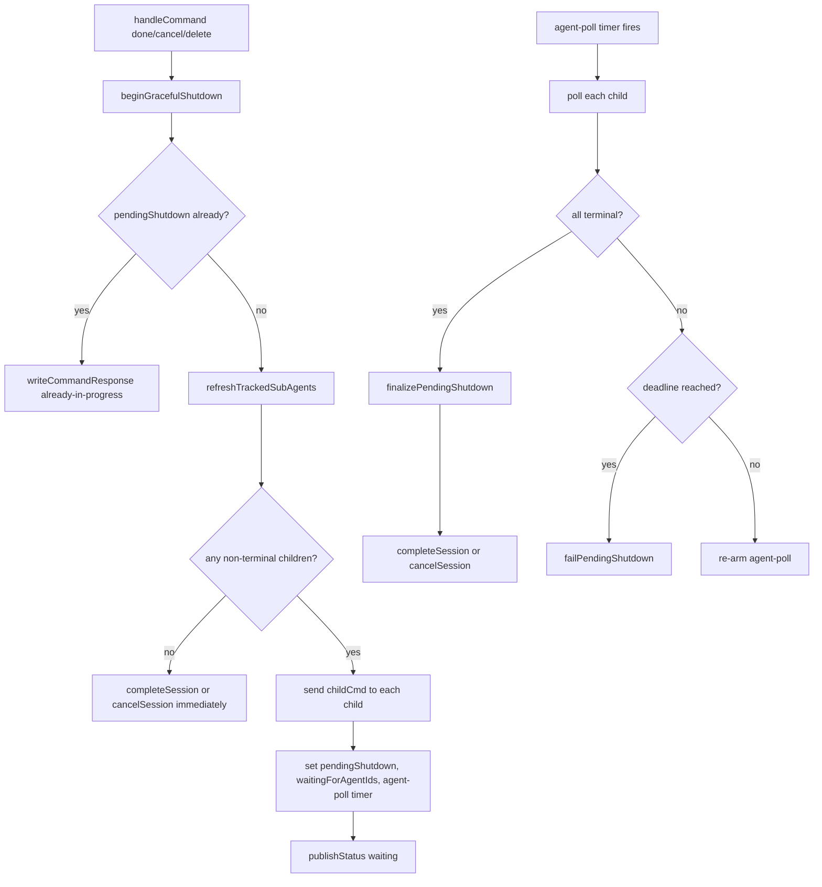
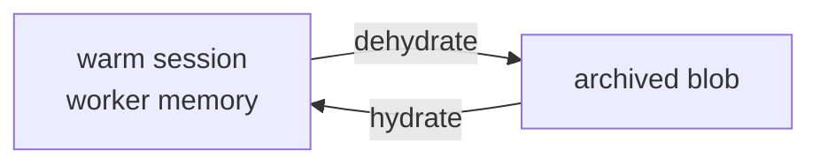
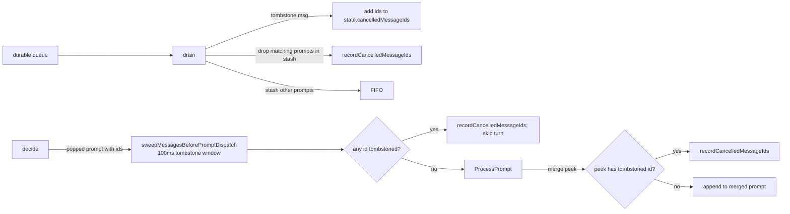

# Orchestration Design

This document is the canonical reference for the durable session orchestration:
its module layout, runtime model, control flow, and replay invariants.

The orchestration is the durable coordinator for a session. It dequeues client
and child events, decides when to run an LLM turn, manages timers and
hydration, and bounds duroxide history with continue-as-new.

It does **not** own tool implementations or Copilot SDK session state. Those
live in worker activities and the session manager.

Primary source: [`packages/sdk/src/orchestration/`](../packages/sdk/src/orchestration/).
The current latest version is `1.0.52`. Frozen prior versions live as sibling
files (`packages/sdk/src/orchestration_1_0_47.ts` … `_1_0_51.ts`) and run
unchanged for any in-flight execution that started against them.

---

## 1. Module Layout

```text
src/orchestration/
  index.ts       durable entrypoint (5 lines: createRuntime then runLoop)
  runtime.ts     createRuntime, runLoop, startup gates, versioned tracing
  state.ts       DurableSessionState, DurableSessionRuntime, createInitialState, constants
  utils.ts       pure helpers — prompt parsing, context-usage reducer, error classifiers
  lifecycle.ts   status, response/command writers, dehydrate, checkpoint, summarize,
                 child digest, cron action, cancellation tombstones, continueAsNew, handleCommand
  queue.ts       KV FIFO primitives, drain, decide, processAnswer, processPendingChildDigest
  turn.ts        processPrompt, handleTurnResult, processTimer, retry / lossy-handoff
  agents.ts      sub-agent tracking, tool actions (spawn/message/check/etc.), shutdown cascade
```

### Dependency direction

```text
index.ts ──► runtime.ts
              │
              ├─► state.ts ──► utils.ts
              ├─► lifecycle.ts
              └─► queue.ts ──► turn.ts ──► lifecycle.ts ──► agents.ts ──► lifecycle.ts
                                            │                              │
                                            └─► agents.ts ─────────────────┘
```

Cycle between `lifecycle.ts ↔ agents.ts` is intentional: `handleCommand` calls
into `beginGracefulShutdown`, and shutdown writers call back into
`writeCommandResponse` / `publishStatus`. ES module function references resolve
at call time, so this is safe.

---

## 2. Runtime And State

Every helper takes a single `runtime: DurableSessionRuntime`:

```ts
interface DurableSessionRuntime {
    ctx:      DuroxideOrchestrationCtx;   // duroxide primitives
    input:    OrchestrationInput;          // wire input for this execution
    versions: { currentVersion; latestVersion };
    manager:  SessionManagerProxy;
    session:  SessionProxy;                // mutable — replaced when affinity rotates
    state:    DurableSessionState;         // mutable orchestration state
    options:  DurableSessionOptions;       // immutable per-execution thresholds
}
```

`state` is the durable control state. Helpers mutate `runtime.state.*` directly
— there is no closure of `let`s and there are no adapter shapes.

`options` holds per-execution thresholds derived from input
(`dehydrateThreshold`, `idleTimeout`, `inputGracePeriod`, `checkpointInterval`,
`isSystem`, `parentSessionId`, `nestingLevel`, `baseSystemMessage`). These do
not change inside an execution.

### Key state fields

| Field | Carried across CAN | Notes |
|---|---|---|
| `iteration` | yes | LLM-turn counter |
| `loopIteration` | no | resets each execution; bounded by `MAX_ITERATIONS_PER_EXECUTION` |
| `config` | yes | session config; mutated by `set_model`, agent merge, task-context injection |
| `affinityKey` | yes | rotates on dehydrate |
| `needsHydration` / `preserveAffinityOnHydrate` | yes | hydration flags |
| `pendingPrompt` / `pendingSystemPrompt` / `pendingRequiredTool` / `bootstrapPrompt` | yes | dispatch on next turn |
| `pendingToolActions` | yes | replay queue for multi-action turns |
| `subAgents` | yes | child tracking table |
| `cronSchedule`, `taskContext`, `nextSummarizeAt` | yes | recurring task / summarization |
| `contextUsage` | yes | last context-window snapshot |
| `activeTimer` | yes (as `activeTimerState`) | wait/cron/idle/agent-poll/input-grace |
| `pendingInputQuestion`, `waitingForAgentIds` | yes | suspension points |
| `interruptedWaitTimer`, `interruptedCronTimer` | yes | auto-resume state |
| `pendingChildDigest`, `pendingShutdown` | yes | batched updates / shutdown cascade |
| `lastResponseVersion`, `lastCommandVersion`, `lastCommandId` | reread from KV at start | monotonic counters in KV |
| `cancelledMessageIds`, `emittedCancelledMessageIds` | no | tombstone sets, replay-rebuilt |
| `legacyPendingMessage` | no | one-shot legacy carry-forward |
| `orchestrationResult` | no | sentinel — when non-null, runLoop returns it |

The full type is in [state.ts](../packages/sdk/src/orchestration/state.ts).

---

## 3. The Main Loop

```ts
// index.ts
function* durableSessionOrchestration_1_0_52(ctx, input) {
    const runtime = yield* createRuntime(ctx, input, {
        currentVersion: CURRENT_ORCHESTRATION_VERSION,
        latestVersion:  DURABLE_SESSION_LATEST_VERSION,
    });
    if (runtime.state.orchestrationResult !== null) return runtime.state.orchestrationResult;
    return yield* runLoop(runtime);
}
```

`createRuntime` builds the runtime, restores the active timer from CAN input,
applies legacy pending-message carry-forward, runs creation-policy and
top-level agent-config gates, and returns the runtime. If a gate sets
`orchestrationResult`, the entrypoint returns it without entering the loop.

`runLoop`:

```ts
function* runLoop(runtime) {
    while (true) {
        state.loopIteration++;

        // CAN trigger 1: per-execution iteration cap (10).
        if (state.loopIteration > MAX_ITERATIONS_PER_EXECUTION) {
            yield* versionedContinueAsNew(runtime, continueInput(runtime));
            return "";
        }

        // CAN trigger 2: duroxide history-size cap (every 3 iterations, > 800 KB).
        if (state.loopIteration % HISTORY_SIZE_CHECK_INTERVAL_ITERATIONS === 0) {
            const stats = yield manager.getOrchestrationStats(input.sessionId);
            if (stats.historySizeBytes >= MAX_HISTORY_SIZE_BEFORE_CONTINUE_AS_NEW_BYTES) {
                yield* versionedContinueAsNew(runtime, continueInput(runtime));
                return "";
            }
        }

        yield* drain(runtime);                   // queue + timer fires → KV FIFO
        if (state.orchestrationResult !== null) return state.orchestrationResult;

        const didWork = yield* decide(runtime);  // pop one unit, dispatch
        if (state.orchestrationResult !== null) return state.orchestrationResult;

        if (didWork)                  continue;
        if (state.activeTimer)        continue;  // drain will race the timer next iteration
        if (state.pendingInputQuestion) continue; // drain will block waiting for an answer

        // CAN trigger 3: idle.
        yield* versionedContinueAsNew(runtime, continueInput(runtime));
        return "";
    }
}
```

Three CAN triggers: iteration cap, history-size cap, idle (no buffered work,
no timer, no pending input). The loop never returns a non-empty string itself
— termination strings (`"done"`, `"cancelled"`, `"deleted"`, `"failed"`,
policy-rejection strings) come from `state.orchestrationResult` set by command
handlers and shutdown.



---

## 4. drain — Queue + Timer → KV FIFO

`drain` greedily moves durable queue events and fired timers into a KV-backed
FIFO buffer. It loops up to `MAX_DRAIN_PER_TURN = 50` times. Each iteration
picks one of four dequeue modes:

| Mode | When | Behavior |
|---|---|---|
| **legacy carry-forward** | `state.legacyPendingMessage !== undefined` | replay one already-dequeued message from a pre-v1.0.32 input |
| **active-timer race** | `activeTimer` set, OR pending child digest waiting to ripen | `race(dequeueEvent, scheduleTimer(remainingMs))`. Timer-side wins push a `{kind:"timer", timer, firedAtMs}` into the stash |
| **blocking dequeue** | nothing else to do (no timer, no FIFO, no pending prompt/tool actions) | `dequeueEvent` blocks; only allowed on the first drain iteration |
| **non-blocking dequeue** | otherwise | `race(dequeueEvent, scheduleTimer(NON_BLOCKING_TIMER_MS=10ms))`; timer-side breaks the loop |

Each dequeued message is routed by shape:

| Shape | Action |
|---|---|
| `{cancelPending: ["id1", …]}` | add ids to `state.cancelledMessageIds`; drop matching prompts already in stash |
| `{type: "cmd", …}` | flush stash to FIFO, then `handleCommand` |
| `{prompt: "[CHILD_UPDATE from=… type=…]\n…"}` | `applyChildUpdate` (deduped per drain pass), maybe `bufferChildUpdate`, maybe resolve `wait_for_agents` |
| `{answer, wasFreeform}` | stash `{kind:"answer", answer, wasFreeform}` |
| `{prompt, bootstrap?, requiredTool?, clientMessageIds?}` | possibly augment with timer-interrupt context, then stash `{kind:"prompt", …}` |
| else | log and skip |

After the loop, any items still in the stash are appended to the FIFO via
`appendToFifo`.

### KV FIFO buckets

`FIFO_BUCKET_COUNT = 20` keys (`fifo.0` … `fifo.19`), each capped at
`MAX_BUCKET_BYTES = 14 KB`. Items are appended to the highest non-empty bucket;
when serialized size would exceed the cap, a new bucket is allocated.
`popFifoItem` pulls from the lowest non-empty bucket; `popFirstFifoItemMatching`
takes the first match (used to prioritize interactive prompts/answers ahead of
queued timer fires).

### Prompt timer-interrupt augmentation

When a user prompt arrives while `activeTimer` is set, drain captures the
timer's remaining time, saves it to `interruptedWaitTimer` /
`interruptedCronTimer`, clears `activeTimer`, and appends a `[SYSTEM: …]`
context block to the prompt explaining the interrupt. `handleTurnResult` later
auto-rearms the saved timer once the LLM responds.

For an `idle` timer the prompt simply cancels the timer. For `agent-poll`,
drain also clears `waitingForAgentIds` so the wait-for-agents resumes
naturally.

---

## 5. decide — Pop One Unit Of Work

```ts
function* decide(runtime) {
    drainLeadingQueuedCronActions(runtime);

    // Priority 1 — replay queued tool actions (multi-action turn carry-forward).
    if (state.pendingToolActions.length > 0) {
        const action = state.pendingToolActions.shift();
        yield* handleTurnResult(runtime, action, "");
        return true;
    }

    // Priority 2 — pendingPrompt (CAN carry-forward or queueFollowup output).
    // Held while waiting on agents so confirmations can merge with agents-done.
    if (state.pendingPrompt && !state.waitingForAgentIds) {
        const prompt = state.pendingPrompt;  // capture
        state.pendingPrompt = undefined;
        // …
        yield* processPrompt(runtime, prompt, isBootstrap, requiredTool);
        return true;
    }

    // Priority 3 — FIFO item (interactive prompt/answer prioritized over timers).
    const item = popNextDispatchFifoItem(runtime);
    if (item) {
        switch (item.kind) {
            case "prompt":      // (with predispatch sweep + prompt batching)
            case "answer":      yield* processAnswer(runtime, item); break;
            case "timer":       yield* processTimer(runtime, item);  break;
            case "agents-done": queueFollowup(runtime, item.summary); break;
        }
        return true;
    }

    // Priority 4 — buffered child digest (if ripe and not waiting on agents).
    if (state.pendingChildDigest?.ready && state.pendingChildDigest.updates.length > 0
        && !state.waitingForAgentIds) {
        yield* processPendingChildDigest(runtime);
        return true;
    }

    return false;
}
```

### Prompt batching

When a `prompt` FIFO item with `clientMessageIds` is popped, decide first runs
`sweepMessagesBeforePromptDispatch` (a 100ms tombstone sweep). If still alive,
it greedily peeks subsequent FIFO items and merges any that are also `prompt`
into one combined turn (joined with `\n\n`, ids concatenated, bootstrap
OR-merged, requiredTool first-wins). Non-prompt items are pushed back. This
collapses rapid-fire user messages into a single LLM turn.

### Pending child digest

A child update buffered into `pendingChildDigest` is held for
`CHILD_UPDATE_BATCH_MS = 30s` (the digest "ripens"). When ripe and decide
reaches priority 4, `processPendingChildDigest`:

- if `activeTimer.type === "wait" | "cron"`, save the remaining time as
  `interruptedWaitTimer` / `interruptedCronTimer` (kind `"child"`) and dispatch
  the digest as a system-only turn; the timer auto-rearms after the turn
- if `activeTimer.type === "idle" | "agent-poll"`, just clear the timer
- otherwise dispatch the digest immediately as a system-only turn

---

## 6. Turn Lifecycle

### processPrompt



### Error / retry classification

| Error | Action |
|---|---|
| Contains `SESSION_STATE_MISSING_PREFIX` | publishStatus failed, updateCmsState failed, **throw** (fatal — duroxide will mark execution failed) |
| `isAuthFailureError` | publishStatus error with `authFailure: true`, **return** (no retry; admin must update key) |
| `isCopilotConnectionClosedError` and `retryCount ≤ COPILOT_CONNECTION_CLOSED_MAX_RETRIES (3)` | dehydrate, scheduleTimer 15s, CAN with `retryCount++` |
| `isCopilotConnectionClosedError` and retries exhausted | record `session.lossy_handoff` event, dehydrate with handoff message, CAN with `rehydrationMessage` and `retryCount = 0` |
| any other error and `retryCount < MAX_RETRIES (3)` | dehydrate, scheduleTimer `15 * 2^(retryCount-1)` seconds, CAN with `retryCount++` |
| any other error and retries exhausted | publishStatus error with `retriesExhausted: true`, **return** (waits for next user input) |

The same classifier handles both `runTurn` throws and `TurnResult` of type
`error` — phase tag distinguishes them in emitted events.

### handleTurnResult

The big switch on `result.type`. Two pre-passes:

1. `coerceChildQuestionToWait` — if a child returns `completed` with content
   beginning `QUESTION FOR PARENT:`, rewrite to a 60s `wait` so the child
   stays alive waiting for the parent's reply.
2. `synthesizeWaitInterruptReplyIfNeeded` — if a user-interrupt timer is
   pending and the LLM replied with empty content, synthesize
   `"I'm here. Resuming the timer."` as a visible assistant message.

| `result.type` | Behavior |
|---|---|
| `completed` | `writeLatestResponse`; if sub-agent, notify parent (system sub-agents return immediately); forgotten-timer safety check; auto-resume `interruptedWaitTimer` / `interruptedCronTimer`; else if `cronSchedule` set, arm cron timer; else if blob+idleTimeout enabled, arm idle timer; else fall through (loop will CAN) |
| `wait` | clear `interruptedWaitTimer`; ensure `taskContext`; notify parent if sub-agent; `planWaitHandling` decides whether to dehydrate; `writeLatestResponse` if `content`; arm wait timer |
| `cron` | `applyCronAction` — set or cancel `cronSchedule` in state |
| `input_required` | `writeLatestResponse`; set `pendingInputQuestion`; arm `input-grace` timer if blob and `inputGracePeriod > 0`, else dehydrate (`= 0`) or fall through (`< 0`) |
| `cancelled` | trace and return |
| `spawn_agent` / `message_agent` / `check_agents` / `list_sessions` / `wait_for_agents` / `complete_agent` / `cancel_agent` / `delete_agent` | `handleSubAgentAction(runtime, result)` |
| `error` | retry classifier (above) |

### processTimer

Fired timers reach decide as `{kind:"timer", timer, firedAtMs}`. `processTimer`
dispatches by `timer.type`:

| `timer.type` | Behavior |
|---|---|
| `wait` | record `session.wait_completed`; build resume system-prompt with original `waitReason` and `taskContext`; `processPrompt(systemPrompt + timerPrompt, bootstrap=false)` |
| `cron` | record `session.cron_fired`; `processPrompt(cronPrompt, bootstrap=true)` (with resume context if `shouldRehydrate`) |
| `idle` | `dehydrateForNextTurn("idle")` |
| `agent-poll` | poll each non-terminal child via `getSessionStatus`; if all done, `maybeResolveAgentWaitCompletion`; else if shutting down past deadline, `failPendingShutdown`; else re-arm with shutdown-poll or 30s |
| `input-grace` | `dehydrateForNextTurn("input_required")` |

---

## 7. Sub-Agents

Sub-agents are first-class orchestration state. The parent tracks them in
`state.subAgents: SubAgentEntry[]`.

### Spawn / message / control

`handleSubAgentAction` dispatches eight tool-shaped results:

| Action | Effect |
|---|---|
| `spawn_agent` | enforce nesting cap (`MAX_NESTING_LEVEL = 2`) and count cap (`MAX_SUB_AGENTS = 50`); resolve agent definition if `agentName` given; build child config (model / tools / system message); `manager.spawnChildSession`; push entry; queueFollowup `[SYSTEM: Sub-agent spawned…]` |
| `message_agent` | `manager.sendToSession(child, msg)` |
| `check_agents` | poll `getSessionStatus` for each tracked agent, update local status, return summary as followup |
| `list_sessions` | `manager.listSessions(filters)` and return as followup |
| `wait_for_agents` | set `waitingForAgentIds`; arm 30s `agent-poll` timer |
| `complete_agent` | send `done` cmd to child |
| `cancel_agent` | send `cancel` cmd to child |
| `delete_agent` | if child is terminal, `deleteSession` directly; else send `delete` cmd |

Each branch ends with `queueFollowup(...)` so the parent's next turn sees the
result of the action.

### Child update routing

When a child calls `wait` or `completed` it sends a
`[CHILD_UPDATE from=<sessionId> type=<update>]\n<content>` prompt to the
parent's `messages` queue. drain parses this, calls `applyChildUpdate` (which
updates the local `subAgents` entry and the agent's `getSessionStatus`), then
`bufferChildUpdate` (which adds it to `pendingChildDigest`).

`pendingChildDigest` batches updates for 30s before dispatching them as a
single system turn. This prevents N children producing N parent turns.

If the parent is in `wait_for_agents`, `maybeResolveAgentWaitCompletion`
checks whether all `waitingForAgentIds` are terminal and, if so, queues the
agents-done summary and clears the wait.

---

## 8. Graceful Shutdown Cascade

Three commands trigger graceful shutdown: `done`, `cancel`, `delete`. All
three flow through `beginGracefulShutdown(runtime, mode, cmdMsg)`.



`SHUTDOWN_TIMEOUT_MS = 60s`, `SHUTDOWN_POLL_INTERVAL_MS = 5s`.

`completeSession` / `cancelSession` set `state.orchestrationResult` to the
termination string (`"done"` / `"cancelled"` / `"deleted"` / `"failed"`).
`runLoop` returns it on the next check.

For `delete`, `cancelSession` additionally enumerates descendants via
`getDescendantSessionIds` and calls `deleteSession` on each before deleting
self.

---

## 9. Continue-As-New

`versionedContinueAsNew(runtime, canInput)`:

1. Capture the active timer's remaining time into `canInput.activeTimerState`.
2. If `!canInput.needsHydration`, run a best-effort warm checkpoint
   (`session.checkpoint`) so the next worker can resume without rehydration.
3. Stamp `canInput.sourceOrchestrationVersion = runtime.versions.currentVersion`.
4. Yield `ctx.continueAsNewVersioned(canInput, latestVersion)`.

`continueInput(runtime, overrides?)` builds the wire `OrchestrationInput`. It
includes every field in [§2](#2-runtime-and-state) marked "carried across
CAN". `pendingPrompt` and friends merge with overrides;
`continueInputWithPrompt` extracts any system context from the override prompt
before merging.

CAN happens in five places:
- `runLoop` idle (no work, no timer, no pending input)
- `runLoop` iteration cap (>10 per execution)
- `runLoop` history-size cap (≥800 KB, checked every 3 iterations)
- `handleCommand("set_model")` after writing the response, so the new model
  takes effect on the next execution
- `processPrompt` retry / lossy-handoff paths after `scheduleTimer`

The latest handler must accept `OrchestrationInput` produced by every
registered prior version (down to
`DURABLE_SESSION_COMPATIBILITY_FLOOR_VERSION`). Wire-shape additions are
backward-compatible by default (older inputs simply lack the new fields).

---

## 10. Hydration / Dehydration

A **warm** session has live in-memory `CopilotSession` state on a worker. A
**dehydrated** session has its state archived to blob storage and the in-memory
state torn down. Hydration is the inverse.



### When to dehydrate

`dehydrateForNextTurn(runtime, reason, resetAffinity?, eventData?)`:

| Trigger | Reason tag |
|---|---|
| `wait`/`cron` timer arming and `planWaitHandling.shouldDehydrate` | `"timer"` / `"cron"` |
| `idle` timer fires | `"idle"` |
| `input_required` with `inputGracePeriod === 0` | `"input_required"` |
| `input-grace` timer fires | `"input_required"` |
| Connection-closed error during retry | `"error"` |
| Connection-closed retries exhausted | `"lossy_handoff"` |

Guarded against double-firing: if the session is already marked dehydrated, or
the last live-session action was already a dehydrate, skip and just clear
`activeTimer`.

### planWaitHandling

`packages/sdk/src/wait-affinity.ts` computes `{ shouldDehydrate, resetAffinityOnDehydrate, preserveAffinityOnHydrate }` from `(blobEnabled, seconds, dehydrateThreshold,
preserveWorkerAffinity?)`. The orchestration just consults it.

### Lossy handoff

`session.dehydrate` may return `{ lossyHandoff: { message } }` if the live
session state was already gone. The orchestration logs it and continues —
`needsHydration` stays false because there is nothing to rehydrate; the next
runTurn will start a fresh CopilotSession.

### Affinity rotation

Dehydrate with `resetAffinity = true` rotates `state.affinityKey` to a fresh
GUID and rebuilds `runtime.session`. Any subsequent hydrate gets a new worker
unless `preserveAffinityOnHydrate` is set.

### Hydrate retry

`processPrompt` hydrate has its own retry: up to 3 attempts with exponential
backoff (10 / 20 / 40 s). If the blob is missing entirely (404 /
`BlobNotFound` / `Session archive not found`), hydrate is skipped and the
session starts fresh. If hydrate fails terminally, `processPrompt` returns
without running the turn.

---

## 11. Cancellation Tombstones

The client can cancel pending messages by id. The cancel envelope is itself a
durable message: `{cancelPending: ["id1", "id2", …]}`.



`state.cancelledMessageIds` is replay-deterministic: the cancel envelope is a
durable message processed in queue order. `state.emittedCancelledMessageIds`
suppresses duplicate `pending_messages.cancelled` events.

Both sets are not carried across CAN — they're rebuilt during replay.

---

## 12. Replay Invariants

The orchestration runs inside duroxide's deterministic replay engine. Every
running execution replays its history when a worker picks it up, and the new
worker's code must produce the same sequence of yields.

### A change requires a new orchestration version when

- adding, removing, or reordering `yield` statements
- changing the value yielded (different activity name or different args)
- adding or removing `setCustomStatus` calls (they're recorded in history)
- changing `ctx.setValue` / `ctx.clearValue` order or keys
- changing the `OrchestrationInput` shape in a way that breaks deserialization
  for in-flight handoffs
- changing CAN semantics so older carried state would resume incorrectly

### Safe changes — no version bump needed

- non-yielding logic (string formatting, classification helpers)
- changing activity bodies — they run as normal async code, not replayed
- changing `ManagedSession` / tool implementations
- changing CMS queries
- adding new helper functions, splitting/merging modules (this refactor)

### Versioning model

```
src/orchestration_1_0_47.ts   ┐
src/orchestration_1_0_48.ts   │ frozen — replay only
src/orchestration_1_0_49.ts   │
src/orchestration_1_0_50.ts   │
src/orchestration_1_0_51.ts   ┘
src/orchestration/            ← current latest (1.0.52)
```

All registered versions are listed in
[`orchestration-registry.ts`](../packages/sdk/src/orchestration-registry.ts).
The registry retains five versions below current. Older versions are pruned
from the repo.

A frozen version is replay-only. New starts and every CAN target the current
latest. The latest must accept `OrchestrationInput` produced by the oldest
retained version (the `DURABLE_SESSION_COMPATIBILITY_FLOOR_VERSION`).

---

## 13. Determinism Rules

Inside the orchestration generator (and any helper called from it) you MUST
NOT use:

- `Date.now()` — use `yield ctx.utcNow()`
- `Math.random()` / `crypto.randomUUID()` — use `yield ctx.newGuid()`
- direct I/O — fetch, fs, network — must go through activities
- non-deterministic branching before yields (`Map` iteration order over
  externally-derived keys, `Set` order, etc.)
- top-level async work — generators are sync between yields

Activities (`session.runTurn`, `manager.recordSessionEvent`, etc.) run as
normal async code on the worker. Their **inputs** are recorded in history so
replay can short-circuit them; their outputs are recorded the first time and
replayed verbatim afterwards.

---

## 14. Glossary

- **CAN** — `continueAsNew`. Re-enter the orchestration as a fresh execution
  with a snapshot of state, bounding history size.
- **FIFO** — the KV-backed work buffer in the current orchestration. Owned by
  `queue.ts`.
- **drain** — the phase that moves durable queue events and fired timers into
  the FIFO.
- **decide** — the phase that pops one item from the FIFO (or pendingPrompt /
  pendingToolActions / pendingChildDigest) and dispatches it.
- **affinity key** — a per-session GUID that pins the active session to a
  specific worker via duroxide affinity. Rotated on dehydrate.
- **tombstone** — a recorded cancellation for a client message id that
  suppresses any prompt that arrives with that id.
- **digest** — a 30-second batched summary of child updates dispatched as a
  single parent turn.

---

## See Also

- [Architecture](./architecture.md) — system-wide layering
- [Component Interactions](./component-interactions.md) — runtime contracts
- [System Reference](./system-reference.md) — primitives reference
- [Implemented proposal: flat event loop](./proposals-impl/orchestration-flat-event-loop.md)
- [Implemented proposal: directory refactor](./proposals-impl/orchestration-directory-refactor.md)
