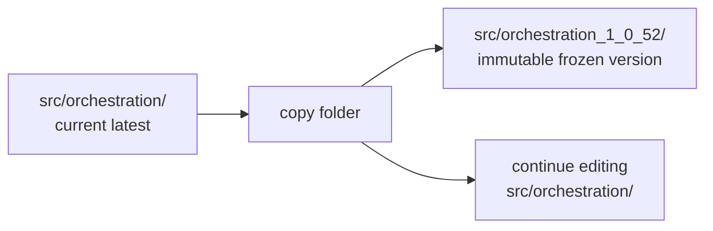
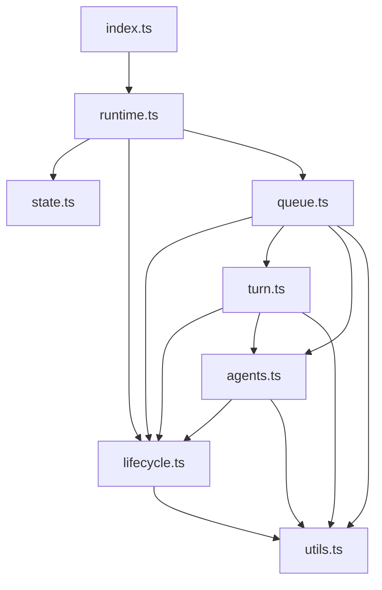
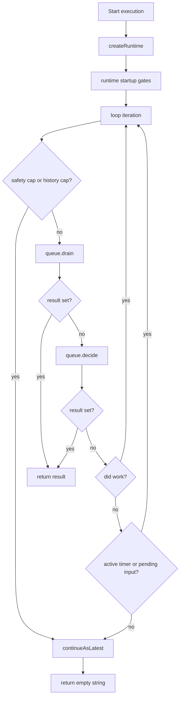
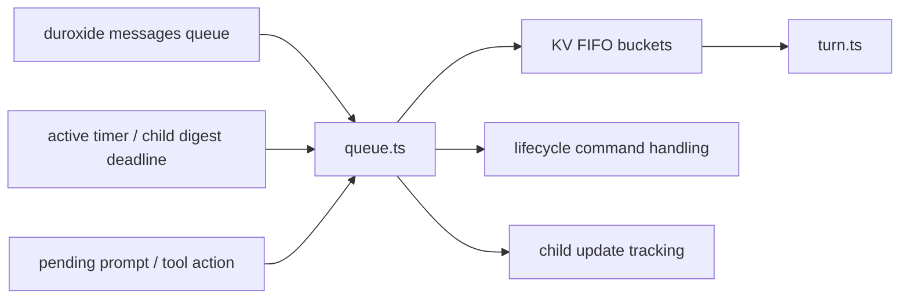
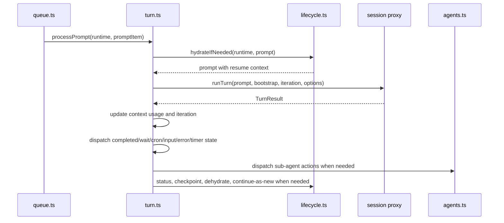
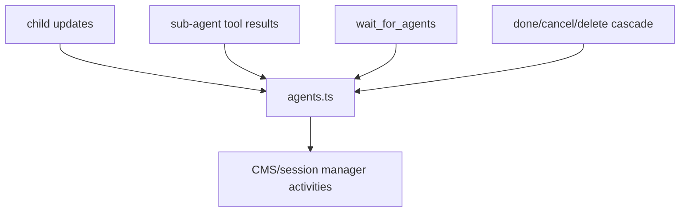

# Proposal: Versioned Orchestration Directory Refactor

**Status:** Implemented (2026-05-02)
**Date:** 2026-05-02

> The implementation followed the proposal's structure but with one notable
> deviation worth recording: the proposal initially landed as a partial split
> (helpers extracted into modules with adapter-shape interfaces while the bulk
> of the orchestration stayed as a 2148-line closure in `runtime.ts`). The
> final pass — completing Option A from the design discussion — introduced
> `DurableSessionRuntime` / `DurableSessionState` with mutable state, deleted
> all five adapter interfaces, moved `processPrompt` / `handleTurnResult` /
> `processTimer` into `turn.ts`, and `drain` / `decide` into `queue.ts`.
> `runtime.ts` collapsed to 222 lines (createRuntime + runLoop only).
>
> See [Orchestration Design](../orchestration-design.md) for the current
> state.

## Summary

Refactor the durable session orchestration from a single large `orchestration.ts` file into a versioned directory of focused modules. The current latest orchestration lives in `packages/sdk/src/orchestration/`; frozen versions live in sibling directories named with the same version convention used today, for example `packages/sdk/src/orchestration_1_0_52/`.

This keeps the duroxide replay boundary obvious: a frozen orchestration is an entire immutable folder, not one frozen file plus mutable shared helpers.

The same change should trim registered durable-session orchestration versions to the five versions below the current latest. If the refactor creates `1.0.52`, the runtime registry keeps `1.0.47` through `1.0.51`, plus current `1.0.52`.

## Problem

`packages/sdk/src/orchestration.ts` has become a large orchestration monolith. It currently combines:

- version identity and tracing setup
- orchestration input normalization
- custom status and command response persistence
- prompt/system-context parsing
- hydration, dehydration, checkpoint, and title summarization
- durable KV FIFO buffering
- message drain and timer race logic
- command handling
- graceful shutdown cascade
- sub-agent tracking and child digest batching
- LLM turn execution and retry/handoff handling
- `TurnResult` dispatch for waits, cron, input, errors, and sub-agent tools
- continue-as-new input serialization

That shape makes the code difficult to review, test, and evolve. It also becomes risky to split naively, because helper code imported by frozen orchestrations would become part of their replay behavior and could drift later.

## Goals

1. Make the latest orchestration readable by moving focused behavior into focused modules.
2. Preserve durable replay safety by freezing complete orchestration folders.
3. Keep the public/latest import surface stable during migration.
4. Trim registered historical versions to five below current.
5. Make future orchestration version bumps a mechanical copy-folder operation.
6. Add focused unit coverage for pure and low-yield modules where practical.

## Non-Goals

- Do not change durable behavior as part of the mechanical split unless explicitly needed for the version bump.
- Do not make frozen orchestration folders import helpers from the current latest folder.
- Do not introduce a new orchestration framework or runtime abstraction outside the existing duroxide generator model.
- Do not prune historical proposal docs or changelog entries that mention older versions.

## Proposed File Layout

The split should favor a small number of durable domains over many small helper files. The target is seven implementation modules plus the entrypoint:

```text
packages/sdk/src/
  orchestration.ts                         # compatibility shim for latest
  orchestration-version.ts                 # latest + compatibility floor constants
  orchestration-registry.ts                # registers retained frozen versions + latest

  orchestration/                           # current latest implementation only
    index.ts                               # durable version entrypoint
    runtime.ts                             # runtime creation, initial gates, main loop
    state.ts                               # state types + initial input normalization
    lifecycle.ts                           # status, responses, commands, persistence, CAN
    queue.ts                               # KV FIFO, drain, decide, prompt batching
    turn.ts                                # runTurn, retries, timers, TurnResult dispatch
    agents.ts                              # child tracking, sub-agent tools, shutdown cascade
    utils.ts                               # prompt/context usage pure helpers

  orchestration_1_0_51/                    # frozen previous latest
    index.ts
    runtime.ts
    state.ts
    lifecycle.ts
    queue.ts
    turn.ts
    agents.ts
    utils.ts

  orchestration_1_0_50/
    index.ts
    ...
```

`packages/sdk/src/orchestration.ts` remains as a compatibility shim so existing tests and callers that import `../../src/orchestration.ts` continue to work:

```ts
export {
    CURRENT_ORCHESTRATION_VERSION,
    durableSessionOrchestration_1_0_52,
} from "./orchestration/index.js";
```

## Versioning Model

### Current And Frozen Directories



When creating a new durable version:

1. Copy the current folder to a frozen folder, for example `orchestration_1_0_52/`.
2. Bump `DURABLE_SESSION_LATEST_VERSION` in `orchestration-version.ts`.
3. Rename the latest handler in `orchestration/index.ts` to the new version.
4. Update `orchestration.ts` shim exports.
5. Update `orchestration-registry.ts`.
6. Prune registered versions older than five below current.

### Registry After Refactor

If current latest is `1.0.52`, the registry shape should be:

```ts
import { durableSessionOrchestration_1_0_47 } from "./orchestration_1_0_47/index.js";
import { durableSessionOrchestration_1_0_48 } from "./orchestration_1_0_48/index.js";
import { durableSessionOrchestration_1_0_49 } from "./orchestration_1_0_49/index.js";
import { durableSessionOrchestration_1_0_50 } from "./orchestration_1_0_50/index.js";
import { durableSessionOrchestration_1_0_51 } from "./orchestration_1_0_51/index.js";
import { durableSessionOrchestration_1_0_52 } from "./orchestration/index.js";
import { DURABLE_SESSION_LATEST_VERSION } from "./orchestration-version.js";

export const DURABLE_SESSION_ORCHESTRATION_REGISTRY = [
    { version: "1.0.47", handler: durableSessionOrchestration_1_0_47 },
    { version: "1.0.48", handler: durableSessionOrchestration_1_0_48 },
    { version: "1.0.49", handler: durableSessionOrchestration_1_0_49 },
    { version: "1.0.50", handler: durableSessionOrchestration_1_0_50 },
    { version: "1.0.51", handler: durableSessionOrchestration_1_0_51 },
    { version: DURABLE_SESSION_LATEST_VERSION, handler: durableSessionOrchestration_1_0_52 },
];
```

Use explicit `/index.js` imports. Node ESM directory imports are avoidable friction.

## Module Map



The merges are intentional:

- `policy.ts` folds into `runtime.ts`; policy is part of runtime startup.
- `status.ts`, `continue-as-new.ts`, `commands.ts`, and `persistence.ts` fold into `lifecycle.ts`; these all serialize or mutate durable session lifecycle state.
- `fifo.ts`, `drain.ts`, and `decide.ts` fold into `queue.ts`; these form one scheduler.
- `turn-runner.ts`, `turn-results.ts`, and `timers.ts` fold into `turn.ts`; timers are the way turns suspend and resume.
- `child-agents.ts`, `sub-agent-actions.ts`, and `shutdown.ts` fold into `agents.ts`; shutdown is mostly child-agent cascade behavior.
- `prompt-context.ts` and `context-usage.ts` fold into `utils.ts`; they are pure support reducers/helpers.

## Runtime Object

Every implementation module should accept a single `runtime` object and read or mutate `runtime.state`. This avoids passing long argument lists and makes the mutable orchestration state explicit.

```ts
export interface DurableSessionRuntime {
    ctx: any;
    input: OrchestrationInput;
    versions: {
        currentVersion: string;
        latestVersion: string;
    };
    manager: ReturnType<typeof createSessionManagerProxy>;
    session: ReturnType<typeof createSessionProxy>;
    state: DurableSessionState;
}
```

The state object replaces the current large closure of local `let` variables:

```ts
export interface DurableSessionState {
    iteration: number;
    loopIteration: number;
    config: SerializableSessionConfig;
    affinityKey: string;
    preserveAffinityOnHydrate: boolean;
    needsHydration: boolean;
    blobEnabled: boolean;
    retryCount: number;
    pendingPrompt?: string;
    pendingRequiredTool?: string;
    pendingSystemPrompt?: string;
    bootstrapPrompt: boolean;
    pendingRehydrationMessage?: string;
    pendingToolActions: TurnAction[];
    subAgents: SubAgentEntry[];
    activeTimer: ActiveTimer | null;
    pendingInputQuestion: PendingInputQuestion | null;
    waitingForAgentIds: string[] | null;
    pendingChildDigest: PendingChildDigest | null;
    pendingShutdown: PendingShutdownState | null;
    interruptedWaitTimer: InterruptedWaitTimer | null;
    interruptedCronTimer: InterruptedCronTimer | null;
    cronSchedule?: CronSchedule;
    contextUsage?: SessionContextUsage;
    lastResponseVersion: number;
    lastCommandVersion: number;
    lastCommandId?: string;
    lastLiveSessionAction: "session-activity" | "dehydrate";
    orchestrationResult: string | null;
}
```

## Core Logic After Refactor

### Entrypoint

```ts
// orchestration/index.ts
export const CURRENT_ORCHESTRATION_VERSION = DURABLE_SESSION_LATEST_VERSION;

export function* durableSessionOrchestration_1_0_52(ctx, input) {
    const runtime = yield* createRuntime(ctx, input, {
        currentVersion: CURRENT_ORCHESTRATION_VERSION,
        latestVersion: DURABLE_SESSION_LATEST_VERSION,
    });

    if (runtime.state.orchestrationResult) {
        return runtime.state.orchestrationResult;
    }

    return yield* runLoop(runtime);
}
```

### Main Loop



Pseudocode:

```ts
export function* runLoop(runtime) {
    while (true) {
        runtime.state.loopIteration += 1;

        if (yield* shouldContinueAsNewForSafety(runtime)) {
            yield* continueAsLatest(runtime);
            return "";
        }

        yield* drain(runtime);
        if (runtime.state.orchestrationResult) return runtime.state.orchestrationResult;

        const didWork = yield* decide(runtime);
        if (runtime.state.orchestrationResult) return runtime.state.orchestrationResult;

        if (didWork) continue;
        if (runtime.state.activeTimer) continue;
        if (runtime.state.pendingInputQuestion) continue;

        yield* continueAsLatest(runtime);
        return "";
    }
}
```

### Queue Scheduler



`queue.ts` owns all scheduling mechanics: KV FIFO buckets, cancellation tombstones, drain, decide, and prompt batching.

```ts
export function* drain(runtime) {
    const stash = [];
    const seenChildUpdates = new Set();

    for (let i = 0; i < MAX_DRAIN_PER_TURN; i += 1) {
        const item = yield* nextDrainMessageOrTimer(runtime);
        if (!item) break;

        if (isCancelTombstone(item)) {
            yield* recordCancellation(runtime, item, stash);
        } else if (isCommand(item)) {
            appendToFifo(runtime, stash);
            stash.length = 0;
            yield* handleCommand(runtime, item);
        } else if (isChildUpdate(item)) {
            yield* routeChildUpdate(runtime, item, seenChildUpdates);
        } else if (isAnswer(item)) {
            stash.push(toAnswerFifoItem(item));
        } else if (isPrompt(item)) {
            stash.push(yield* toPromptFifoItem(runtime, item));
        }

        if (runtime.state.orchestrationResult) return;
    }

    appendToFifo(runtime, stash);
}

export function* decide(runtime) {
    if (yield* processPendingToolAction(runtime)) return true;
    if (yield* processPendingPrompt(runtime)) return true;
    if (yield* processNextFifoItem(runtime)) return true;
    if (yield* processReadyChildDigest(runtime)) return true;
    return false;
}
```

### Turn Execution And Suspension



`turn.ts` owns one LLM turn from prompt preparation through result dispatch. It also owns timer behavior because timers are the durable suspension mechanism for turns.

```ts
export function* processPrompt(runtime, promptItem) {
    let prompt = yield* hydrateIfNeeded(runtime, promptItem.prompt);
    const turnSystemPrompt = consumeTurnSystemPrompt(runtime, prompt);

    runtime.state.config.turnSystemPrompt = turnSystemPrompt;
    publishStatus(runtime, "running", { iteration: runtime.state.iteration + 1 });

    let rawResult;
    try {
        runtime.state.lastLiveSessionAction = "session-activity";
        rawResult = yield runtime.session.runTurn(prompt, promptItem.bootstrap, runtime.state.iteration, turnOptions(runtime, promptItem));
    } catch (error) {
        runtime.state.config.turnSystemPrompt = undefined;
        yield* handleRunTurnThrow(runtime, error, promptItem, turnSystemPrompt);
        return;
    }

    runtime.state.config.turnSystemPrompt = undefined;
    runtime.state.retryCount = 0;

    const result = normalizeTurnResult(rawResult);
    const observedAt = yield runtime.ctx.utcNow();
    runtime.state.contextUsage = updateContextUsageFromEvents(runtime.state.contextUsage, result.events, observedAt);
    runtime.state.iteration += 1;

    yield* maybeSummarize(runtime);
    yield* refreshTrackedSubAgents(runtime);
    yield* handleTurnResult(runtime, result, prompt);
}

export function* handleTurnResult(runtime, result, sourcePrompt) {
    result = coerceChildQuestionToWait(runtime, result);
    result = synthesizeWaitInterruptReplyIfNeeded(runtime, result);

    switch (result.type) {
        case "completed": return yield* handleCompleted(runtime, result);
        case "wait": return yield* startWaitTimer(runtime, result, sourcePrompt);
        case "cron": return applyCronAction(runtime, result, sourcePrompt);
        case "input_required": return yield* startInputRequired(runtime, result);
        case "error": return yield* handleTurnResultError(runtime, result, sourcePrompt);
        case "cancelled": return;
        default: return yield* handleSubAgentAction(runtime, result);
    }
}
```

### Agent Control



`agents.ts` owns all parent/child session state. That includes child update parsing, child digest batching, sub-agent tool actions, `wait_for_agents`, and graceful shutdown cascades.

```ts
export function* handleSubAgentAction(runtime, result) {
    switch (result.type) {
        case "spawn_agent": return yield* spawnAgent(runtime, result);
        case "message_agent": return yield* messageAgent(runtime, result);
        case "check_agents": return yield* checkAgents(runtime, result);
        case "list_sessions": return yield* listSessions(runtime, result);
        case "wait_for_agents": return yield* waitForAgents(runtime, result);
        case "complete_agent": return yield* closeAgent(runtime, result, "done");
        case "cancel_agent": return yield* closeAgent(runtime, result, "cancel");
        case "delete_agent": return yield* closeAgent(runtime, result, "delete");
    }
}

export function* beginGracefulShutdown(runtime, mode, cmdMsg) {
    if (runtime.state.pendingShutdown) {
        yield* reportShutdownAlreadyInProgress(runtime, cmdMsg);
        return;
    }

    yield* refreshTrackedSubAgents(runtime);
    const targetAgents = runningTrackedAgents(runtime);
    if (targetAgents.length === 0) return yield* finalizeSessionShutdown(runtime, mode, cmdMsg);

    yield* sendShutdownCommandToChildren(runtime, mode, targetAgents);
    runtime.state.pendingShutdown = createPendingShutdown(runtime, mode, cmdMsg, targetAgents);
    runtime.state.waitingForAgentIds = runtime.state.pendingShutdown.targetAgentIds;
    runtime.state.activeTimer = createShutdownPollTimer(runtime);
    publishStatus(runtime, "waiting", shutdownWaitStatus(runtime));
}
```

## Module Responsibilities And Pseudocode

### `index.ts`

Durable entrypoint only. It should not contain orchestration business logic.

```ts
export const CURRENT_ORCHESTRATION_VERSION = DURABLE_SESSION_LATEST_VERSION;

export function* durableSessionOrchestration_1_0_52(ctx, input) {
    const runtime = yield* createRuntime(ctx, input, versionInfo());
    if (runtime.state.orchestrationResult) return runtime.state.orchestrationResult;
    return yield* runLoop(runtime);
}
```

### `runtime.ts`

Creates the runtime, installs versioned tracing, runs initial gates, and owns the top-level loop. Startup policy and top-level named-agent config live here because they only run at orchestration entry.

```ts
export function* createRuntime(ctx, input, versions) {
    installVersionedTracing(ctx, input, versions);
    const state = createInitialState(input);
    const manager = createSessionManagerProxy(ctx);
    const session = createSessionProxy(ctx, input.sessionId, state.affinityKey, state.config);
    const runtime = { ctx, input, versions, state, manager, session };

    yield* restoreActiveTimer(runtime);
    yield* enforceCreationPolicy(runtime);
    if (runtime.state.orchestrationResult) return runtime;

    yield* resolveTopLevelAgentConfig(runtime);
    normalizeLegacyPendingMessage(runtime);
    return runtime;
}
```

### `state.ts`

Owns `DurableSessionRuntime`, `DurableSessionState`, timer/shutdown/digest state types, and initial input normalization. It should not yield.

```ts
export function createInitialState(input) {
    return {
        iteration: input.iteration ?? 0,
        loopIteration: 0,
        config: { ...input.config },
        affinityKey: input.affinityKey ?? input.sessionId,
        needsHydration: input.needsHydration ?? false,
        blobEnabled: input.blobEnabled ?? false,
        retryCount: input.retryCount ?? 0,
        pendingPrompt: input.prompt,
        pendingSystemPrompt: input.systemPrompt,
        pendingToolActions: [...(input.pendingToolActions ?? [])],
        subAgents: [...(input.subAgents ?? [])],
        activeTimer: null,
        pendingInputQuestion: input.pendingInputQuestion ?? null,
        waitingForAgentIds: input.waitingForAgentIds ?? null,
        pendingChildDigest: clonePendingChildDigest(input.pendingChildDigest),
        pendingShutdown: clonePendingShutdown(input.pendingShutdown),
        contextUsage: cloneContextUsage(input.contextUsage),
        orchestrationResult: null,
    };
}
```

### `lifecycle.ts`

Owns session lifecycle IO: custom status, latest response payloads, command responses, command handling, hydration/dehydration, checkpointing, title summarization, and continue-as-new serialization.

```ts
export function publishStatus(runtime, status, extra = {}) {
    runtime.ctx.setCustomStatus(JSON.stringify(statusPayload(runtime, status, extra)));
}

export function* handleCommand(runtime, cmdMsg) {
    yield recordCommandReceived(runtime, cmdMsg);
    switch (cmdMsg.cmd) {
        case "set_model": return yield* setModelAndContinue(runtime, cmdMsg);
        case "list_models": return yield* listModels(runtime, cmdMsg);
        case "get_info": return yield* writeCommandResponse(runtime, buildInfoResponse(runtime, cmdMsg));
        case "done":
        case "cancel":
        case "delete": return yield* beginGracefulShutdown(runtime, cmdMsg.cmd, cmdMsg);
        default: return yield* writeCommandResponse(runtime, unknownCommand(cmdMsg));
    }
}

export function* continueAsLatest(runtime, overrides = {}) {
    const input = buildContinueInput(runtime, overrides);
    input.sourceOrchestrationVersion = runtime.versions.currentVersion;
    if (!input.needsHydration) yield* maybeCheckpoint(runtime);
    yield runtime.ctx.continueAsNewVersioned(input, runtime.versions.latestVersion);
}
```

### `queue.ts`

Owns the scheduler: KV FIFO primitives, drain, decide, cancel tombstones, prompt batching, and message/timer races.

```ts
export function* drain(runtime) {
    const stash = [];
    for (let i = 0; i < MAX_DRAIN_PER_TURN; i += 1) {
        const item = yield* nextDrainMessageOrTimer(runtime);
        if (!item) break;
        yield* routeDrainedItem(runtime, item, stash);
        if (runtime.state.orchestrationResult) return;
    }
    appendToFifo(runtime, stash);
}

export function* decide(runtime) {
    if (yield* processPendingToolAction(runtime)) return true;
    if (yield* processPendingPrompt(runtime)) return true;
    if (yield* processNextFifoItem(runtime)) return true;
    if (yield* processReadyChildDigest(runtime)) return true;
    return false;
}
```

### `turn.ts`

Owns the LLM turn lifecycle and all timer-driven suspension/resume behavior: prompt preparation, `runTurn`, retry/handoff, context usage update, result dispatch, wait/cron/idle/input timers, and timer firing.

```ts
export function* processPrompt(runtime, promptItem) {
    const prompt = yield* preparePromptForTurn(runtime, promptItem);
    const rawResult = yield* runTurnWithRetries(runtime, prompt, promptItem);
    if (!rawResult) return;

    const result = normalizeTurnResult(rawResult);
    runtime.state.contextUsage = updateContextUsageFromTurn(runtime, result);
    runtime.state.iteration += 1;
    yield* maybeSummarize(runtime);
    yield* refreshTrackedSubAgents(runtime);
    yield* handleTurnResult(runtime, result, prompt);
}

export function* processTimer(runtime, timerItem) {
    switch (timerItem.timer.type) {
        case "wait": return yield* completeWaitTimer(runtime, timerItem.timer);
        case "cron": return yield* fireCronTimer(runtime, timerItem.timer);
        case "idle": return yield* dehydrateForNextTurn(runtime, "idle");
        case "agent-poll": return yield* pollAgents(runtime, timerItem.timer);
        case "input-grace": return yield* dehydrateForNextTurn(runtime, "input_required");
    }
}
```

### `agents.ts`

Owns all parent/child session behavior: child update parsing, digest batching, child status refresh, sub-agent tool actions, `wait_for_agents`, and graceful shutdown cascades.

```ts
export function* routeChildUpdate(runtime, item, seenChildUpdates) {
    const update = parseChildUpdate(item.prompt);
    if (!update || alreadySeen(seenChildUpdates, update)) return;

    const tracked = yield* applyChildUpdate(runtime, update);
    if (tracked && !runtime.state.pendingShutdown) {
        bufferChildUpdate(runtime, update, yield runtime.ctx.utcNow());
    }
    if (tracked && runtime.state.waitingForAgentIds) {
        yield* maybeResolveAgentWaitCompletion(runtime);
    }
}

export function* handleSubAgentAction(runtime, result) {
    switch (result.type) {
        case "spawn_agent": return yield* spawnAgent(runtime, result);
        case "message_agent": return yield* messageAgent(runtime, result);
        case "check_agents": return yield* checkAgents(runtime, result);
        case "list_sessions": return yield* listSessions(runtime, result);
        case "wait_for_agents": return yield* waitForAgents(runtime, result);
        case "complete_agent": return yield* closeAgent(runtime, result, "done");
        case "cancel_agent": return yield* closeAgent(runtime, result, "cancel");
        case "delete_agent": return yield* closeAgent(runtime, result, "delete");
    }
}
```

### `utils.ts`

Pure helpers only: prompt/system-context parsing and formatting, context usage event reduction, finite number guards, auth/transport error classifiers, and small formatting helpers. It should not yield or call activities.

```ts
export function extractPromptSystemContext(rawPrompt) {
    if (!rawPrompt) return {};
    if (isWholeSystemBlock(rawPrompt)) return { systemPrompt: unwrapSystemBlock(rawPrompt) };
    if (hasTrailingSystemBlock(rawPrompt)) return splitTrailingSystemBlock(rawPrompt);
    return { prompt: rawPrompt };
}

export function updateContextUsageFromEvents(previous, events, observedAt) {
    let next = cloneContextUsage(previous);
    for (const event of events ?? []) next = reduceContextUsageEvent(next, event, observedAt);
    return next;
}
```

## Safety Notes

### Replay Safety

Every helper in `packages/sdk/src/orchestration/` is part of the latest orchestration code. When the latest code changes, create a new version. Frozen folders must not import from the current folder.

Allowed imports from frozen folders should be limited to stable external runtime/API modules that frozen files already depend on, such as:

- `../types.js`
- `../session-proxy.js`
- `../wait-affinity.js`
- `../orchestration-version.js` only when the old version intentionally continues as new into the latest version

Do not move behavior shared by frozen versions into a mutable common helper unless it is provably serialization-only and replay-inert. The safer default is version-local duplication.

### Directory Freeze Invariant

After a folder is frozen, edits to that folder should be treated like edits to historical migration files: avoid them unless fixing a compile break caused by an external type change, and even then verify replay behavior.

### Continue-As-New Compatibility

The latest orchestration must continue to normalize inputs from retained frozen versions only. After trimming to five below current, update `DURABLE_SESSION_COMPATIBILITY_FLOOR_VERSION` to match the oldest retained registered version.

## Migration Plan

### Phase 1: Freeze And Prune

1. Copy current latest into `orchestration_1_0_51/` or keep it as a temporary single-file frozen version until the folder split lands.
2. Bump latest to `1.0.52`.
3. Update `orchestration-registry.ts` to retain only five versions below current.
4. Update `DURABLE_SESSION_COMPATIBILITY_FLOOR_VERSION`.
5. Update tests that import pruned old versions.

### Phase 2: Introduce Folder Shell

1. Create `packages/sdk/src/orchestration/index.ts`.
2. Change `packages/sdk/src/orchestration.ts` to re-export from the folder.
3. Keep behavior equivalent while the implementation is still mostly monolithic.

### Phase 3: Extract Low-Risk Support Code

1. Extract `utils.ts` first: prompt/system-context helpers, context usage reducers, error classifiers, and small formatting helpers.
2. Extract `state.ts`: runtime/state types plus initial input normalization.
3. Add focused tests around pure helpers and state initialization.

### Phase 4: Introduce Runtime And Lifecycle Boundaries

1. Add `runtime.ts` and move startup gates plus the main loop into it.
2. Add `lifecycle.ts` and move custom status, response/command payloads, command handling, persistence helpers, and continue-as-new serialization into it.
3. Keep the orchestration behavior equivalent while the queue/turn/agent code may still live temporarily in the folder entrypoint.

### Phase 5: Extract Operational Domains

1. Extract `queue.ts`: KV FIFO, drain, decide, prompt batching, cancellation tombstones, and message/timer races.
2. Extract `turn.ts`: prompt execution, retries, result dispatch, and timer behavior.
3. Extract `agents.ts`: child updates, sub-agent tool actions, `wait_for_agents`, and shutdown cascades.
4. Collapse `index.ts` to the durable entrypoint only.

### Phase 6: Final Verification

Run focused orchestration tests first:

```bash
cd packages/sdk
npx vitest run test/local/orchestration-version-upgrade.test.js
npx vitest run test/local/orchestration-warm-resume.test.js
npx vitest run test/local/orchestration-history-size-can.test.js
npx vitest run test/local/cancel-pending-orchestration.test.js
```

Then run the broader local suite:

```bash
./scripts/run-tests.sh
```

## Test Updates

Tests that import old frozen files should be updated to retained versions.

Current known cases:

- `packages/sdk/test/local/orchestration-version-upgrade.test.js` imports `1.0.40`, `1.0.41`, and `1.0.42`.
- `packages/sdk/test/local/orchestration-warm-resume.test.js` imports `1.0.30` and `1.0.43`.

After pruning, replace these with retained floor/current-near versions such as `1.0.47`, `1.0.50`, and `1.0.51`, depending on what behavior each test is intended to preserve.

Add focused tests for:

- FIFO bucket append/pop/interactive priority.
- prompt/system-context extraction and merge.
- context usage event reduction.
- continue-as-new serialization of active timers, pending child digest, pending shutdown, and pending prompt state.
- command response version counters.

Those tests should target the consolidated modules:

- `utils.ts` for prompt and context usage reducers.
- `state.ts` for input normalization.
- `lifecycle.ts` for status payloads, command responses, and continue-as-new input construction.
- `queue.ts` for FIFO and dispatch ordering.

## Open Questions

1. Should pruned historical orchestration folders be deleted entirely, or moved to a non-compiled archive outside `src` for archaeology?
2. Should the registry enforce the five-version window with a test that compares `DURABLE_SESSION_LATEST_VERSION` to registered frozen versions?
3. Should frozen folders include a small `README.md` warning that the directory is immutable replay code?
4. Should `orchestration.ts` remain indefinitely as a shim, or be removed after internal imports are migrated?

## Recommendation

Use the versioned-directory layout and treat folder boundaries as durable replay boundaries. Keep the current latest in `orchestration/`, freeze complete folders as `orchestration_1_0_XX/`, and register only the five versions below current.

This gives the refactor room to breathe while preserving the most important invariant: old replay histories run against old code, byte-for-byte within their version folder.