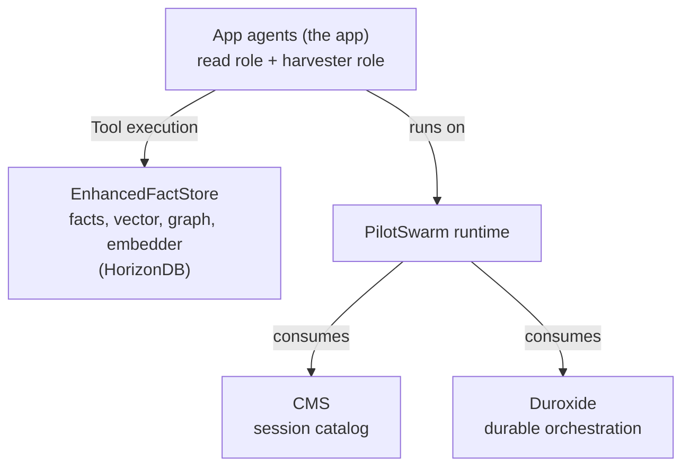

# EnhancedFactStore — Functional Specification

> Status: Proposal · Incubation package: `@incubator/horizon-facts`
> Companion docs: [02-api-reference.md](./02-api-reference.md) ·
> [03-design.md](./03-design.md) · [04-test-spec.md](./04-test-spec.md)

## 1. Purpose

The **EnhancedFactStore** is a strict superset of PilotSwarm's existing
`FactStore`. It keeps the full key/value (KV) facts API unchanged and adds three
capabilities on top:

1. **Multi-signal retrieval** — lexical, semantic (vector), and graph-aware
   search over the same fact corpus.
2. **An open knowledge graph** — a free-form graph of nodes/edges that a harvesting
   ("crawler") agent populates from facts, with no fixed ontology.
3. **A provider-internal embedding generator** — facts are embedded durably and
   automatically, entirely inside the database.

The first concrete provider is **HorizonDB** (Azure HorizonDB preview), but the
interface is database-agnostic. The embedding endpoint is an OpenAI/Azure-OpenAI
HTTP contract that any provider can consume.

## 1a. Where the EnhancedFactStore sits (logical view)



**Reading the view (logical, not physical)**

- **App agents = the app.** The same app acts in a **read role** and a
  **harvester role**. Logically, agents **call tools directly** on the
  EnhancedFactStore — the arrow labelled **Tool execution** is exactly that. The
  physical mechanics (prompts through `PilotSwarmClient`, durable turns on
  duroxide, the worker dispatching tool handlers) are intentionally omitted here.
- **Agents run on PilotSwarm.** The application executes on top of the PilotSwarm
  runtime.
- **PilotSwarm sits on duroxide and consumes CMS.** The runtime consumes both the
  **CMS** (session catalog) and **Duroxide** (durable orchestration) as its
  substrate.
- **The EnhancedFactStore is the app's knowledge surface**, physically resident in
  HorizonDB (facts + pgvector + AGE graph + the in-DB embedder).

> Physical detail — for the record: a tool call travels LLM → worker-internal tool
> handler → `EnhancedFactStore` API (e.g. `factStore.storeFact(...)`) → stored proc
> / typed Cypher → HorizonDB. It does **not** route back out through
> `PilotSwarmClient`. The logical view above collapses that path to the single
> **Tool execution** arrow.

## 2. Scope & non-goals

**In scope**

- A drop-in superset of `FactStore` (existing callers keep working).
- Lexical + semantic + graph retrieval and hybrid fusion.
- A durable, in-database embedding pipeline with a simple lifecycle
  (configure → start → stop → status).
- An open graph interface (nodes, edges, neighbourhood, merge,
  delete).

**Adjacent (PilotSwarm core, prerequisite)**

- **Separate connection target for the enhanced store.** PilotSwarm gains an
  optional `enhancedFactsDatabaseUrl` (+ `enhancedFactsSchema`) so the
  EnhancedFactStore can live on its own HorizonDB while orchestration (`store`)
  and CMS (`cmsFactsDatabaseUrl`) stay on plain Postgres. Resolution is
  `enhancedFactsDatabaseUrl ?? cmsFactsDatabaseUrl ?? store`, so all three MAY be
  the same database. See [03-design.md §1a](./03-design.md). `packages/sdk` change.

- **Orchestration schema isolation.** PilotSwarm's duroxide state provider and
  HorizonDB's pg_durable both default to the `duroxide` schema. PilotSwarm's
  default orchestration schema is renamed to **`ps_duroxide`** via an **online,
  single-transaction** migration that renames and arms a recreation guard
  atomically — old workers fail loud but cannot recreate the old store (no fleet
  drain, no rolling-deploy split-brain). See [03-design.md §6](./03-design.md).
  This is a `packages/sdk` change, not part of the incubator, but is a
  prerequisite for co-located deployments.

**Non-goals (for this iteration)**

- A fixed ontology or schema for graph predicates (predicates are free text).
- A contractual link between the KV facts store and the graph. **The harvester
  agent manages the facts KV and the facts graph as two separate lifecycles; the
  linkage between them is by convention, not enforced by this contract.**
- Cascade deletion from facts into the graph (see §6.4).
- Cross-database or multi-tenant graph isolation.
- Production-grade secret handling for the embedding key (see §5.4).

## 3. Actors

The **crawler/harvester is not a separate party — it is a role the application
plays.** Both the application's read path and its harvesting path are the same
"app"; either can write facts and/or assert graph nodes/edges into the graph. The
table below separates these by *role*, not by deployment boundary.

| Actor | Role |
|-------|------|
| **Application (read role)** | Reads facts and runs search / similar queries (incl. base `readFacts` lineage scope). |
| **Application (harvester/crawler role)** | Writes facts (KV) and/or asserts graph nodes/edges into the graph. The harvester is **part of the app itself**, not an external service. |
| **Provider runtime** | Configures the store, runs migrations, owns the durable embedding generator. |
| **HorizonDB / Postgres** | Executes stored procedures, pgvector ops, AGE Cypher, and the pg_durable embedding loop. |

> Because the harvester is just the app in its write role, the KV facts and the
> graph are written by the **same application**, but still as two separate
> lifecycles linked only by convention (see §2 non-goals and §6.4). "Harvester
> agent" elsewhere in these docs means the app acting in this role.

## 4. Functional requirements — retrieval (EnhancedFactStore)

### 4.1 Base FactStore (unchanged)

`storeFact`, `readFacts`, `deleteFact`, `deleteSessionFactsForSession`,
`getSessionFactsStats`, `getFactsStatsForSessions`, `getSharedFactsStats`,
`initialize`, `close` behave exactly as today. All access is ACL-scoped
(shared / session / granted / unrestricted).

`storeFact` remains the write primitive and doubles as upsert (create/replace).
Any content change re-marks the fact **pending for embedding** (recomputes
`content_hash`) and **resets crawl state** (`last_crawled_at → NULL`, §6.6) in
stores that track those columns.

### 4.2 `searchFacts(query, opts, access)` — facts store only

Retrieval **over the facts store only**. `mode ∈ { lexical, semantic, hybrid }`
(default `hybrid`). **There is no `graph` mode** — graph retrieval is a separate
API (§6). Signal type (text/semantic/hybrid) is orthogonal to *which store* you
query; `searchFacts` is purely the facts store.

- **lexical** — BM25 keyword match over fact key + value text. `query` is a
  **keyword/terms query**, not a natural-language sentence.
- **semantic** — pgvector cosine kNN over `facts.embedding` (query embedded at
  call time via the Node embedding client). `query` is **natural language**.
- **hybrid** — weighted fusion of lexical + semantic; a missing signal
  contributes 0. `query` is used **both ways** (BM25 + embedded).

The `query` argument's expected shape therefore depends on `mode`; tool layers
that expose `searchFacts` to an LLM must make this explicit so the model passes
keywords (not a sentence) in lexical mode.

Every hit is ACL-filtered **after** ranking and carries per-signal score
contributions for debuggability. `searchFacts` output (an array of fact
scopeKeys) is the natural **seed** for a follow-on graph query (§6.5) — that is
how the "semantic entry point → graph expansion" pattern is composed by the
caller, rather than being hidden inside a `graph` mode.

### 4.3 `similarFacts(scopeKey, opts, access)`

Pure **semantic** nearest-neighbours of a known fact (cosine kNN over the fact's
**stored** vector — no re-embedding, no query string). Never touches the graph.
Returns ACL-filtered `ScoredFact[]` with a `semantic` signal. Distinct from
`searchFacts` by **anchor type**: an existing fact key, not query text.

> **No dedicated `relatedFacts`.** Graph-aware relatedness belongs to the graph
> API: `searchGraphNodes({ seeds: [...] })` expands from seed facts/nodes, then
> `readFacts` on the connected fact keys returns facts. This keeps facts
> retrieval (this section) orthogonal to graph traversal (§6).

> **No dedicated `lineageFacts`.** Lineage scoping is already in the base `FactStore`:
> `readFacts({ sessionId, scope: "descendants" }, { grantedSessionIds })` reads
> spawn-tree facts. To rank them, pass the query through `searchFacts` (which is
> ACL-filtered the same way). No dedicated lineage retrieval method is needed.

## 5. Functional requirements — embedding generator

### 5.1 Lifecycle (the only public embedding surface)

| Operation | Behaviour |
|-----------|-----------|
| `configureEmbedder(endpoint)` | Record the embedding endpoint config (url, model, dim, key, key header, input field) into durable config. |
| `startEmbedder({ intervalSeconds, batch })` | Launch a single durable, eternal loop that embeds pending facts in batches. Idempotent. |
| `stopEmbedder()` | Cancel the loop. No-op if already stopped. |
| `embedderStatus()` | Report `{ running, instanceId?, status? }`. |

Callers never trigger embedding directly and never wait on a durable instance.
They write facts and observe the **outcome**: the vector appears and semantic
search returns the fact.

### 5.2 What "pending" means

A fact needs embedding when `embedding IS NULL OR last_embedded_hash IS DISTINCT
FROM content_hash`. Storing a fact with changed content re-marks it pending, so
the loop re-embeds it on its next tick. Content hashing makes re-embedding
idempotent (no re-billing for unchanged content).

### 5.3 Batch embedding

The loop embeds a **batch per tick** using the endpoint's array-input API
(`input: [t1, t2, …]` → `data[]` in order) — one HTTP request per batch, not per
fact. Vectors are mapped back to facts positionally.

### 5.4 Configuration & secrets

- url / model / dim / key header / input field are stored as **durable function
  variables** (`df.setvar`), sourced from `.env` or the Kubernetes secret at
  start time.
- The **API key** is, for now, also placed in a durable variable. This is
  plaintext-at-rest (per-user RLS only). **This is a known, accepted limitation
  for incubation**; a follow-up will move the secret to a runtime-injected
  credential. The code and design doc must carry an explicit TODO.

### 5.5 Preconditions (fail fast)

`initialize()` verifies the cluster has the required extensions and capabilities
(`vector`, `age`, `pg_durable` with `df.http` present and usage granted). If any
are missing, initialization **throws a precise error** naming the missing piece
and the fix. There are no feature flags or silent fallbacks.

## 6. Functional requirements — open graph (crawler)

### 6.1 Model

A free-form property graph: **graph nodes** (free-text `kind`, `name`, `aliases`)
connected by `REL` edges (free-text `predicate`, `confidence`, `observations`,
optional `evidence`). There is **no fixed ontology** — predicates are invented by
the app's harvester role. **Graph nodes carry no embeddings** — the graph is
navigated by text match (`nameLike`), by `kind`, and by traversal from seeds; it
does not have a vector index. The query entry point for "what connects to these
facts" is the **facts'** vector index (via `searchFacts` seeds), not node vectors.

### 6.2 The harvest sequence (search → resolve → assert)

```
1. Harvest    : read facts (readFacts / searchFacts)
2. Extract    : LLM proposes (kind, name) nodes and (from, predicate, to) edges
3. Resolve    : searchGraphNodes({ kind, nameLike }) → match existing or mint new
4. Upsert ends: upsertGraphNode(GraphNodeInput) for each endpoint → canonical nodeKey
5. Upsert edge: upsertGraphEdge(GraphEdgeInput) → create or reinforce (merge semantics)
6. Accrue     : re-call upsertGraphNode/upsertGraphEdge with new evidence[] to union in
```

### 6.3 Write semantics (upsert + merge)

- **`upsertGraphNode(GraphNodeInput)`** — create, or merge `aliases` (and union
  optional `evidence`) into the existing node. Returns canonical `GraphNodeRef`.
- **`upsertGraphEdge(GraphEdgeInput)`** — create, or reinforce an existing edge
  (noisy-OR `confidence`, `observations++`) and **union** any supplied
  `evidence`. This single verb also serves as the evidence-linking primitive:
  call it again with only new evidence to add provenance to an edge.
- **Evidence is OPTIONAL.** Evidence-less assertions are accepted rather than
  rejected. *(TODO: re-evaluate mandatory evidence for graph trust.)*
- **`mergeGraphNodes(fromKey, intoKey, reason)`** — node resolution / dedup:
  union aliases onto the survivor, repoint in/out edges, delete the duplicate.

### 6.4 Delete API

| Operation | Behaviour |
|-----------|-----------|
| `deleteGraphNode(nodeKey)` | `DETACH DELETE` the node and all incident `REL` / evidence edges. Returns whether a node matched. |
| `deleteGraphEdge(fromKey, toKey, predicateKey)` | Delete one exact edge triple. Returns whether an edge matched. |

**No cascade.** Deleting a fact via `deleteFact` does **not** touch the graph.
Because the KV/graph linkage is by convention, a deleted fact may remain
referenced by graph provenance until a harvester or maintenance pass removes it.
This is intentional for this iteration.

### 6.5 Read API

- **`searchGraphNodes(GraphNodeQuery)`** — find/expand graph nodes. Inputs are
  combinable: `kind`, `nameLike` (lexical match on name/aliases), and
  **`seeds: string[]`** — an array of **fact scopeKeys OR node keys** that anchors
  the query. Seeds let the caller feed `searchFacts` output straight into the
  graph (fact seeds pivot via `EVIDENCED_BY`; node seeds expand directly). `depth`
  (1..5) bounds traversal from the seeds. Each returned node carries its
  `EVIDENCED_BY` fact scopeKeys so the caller can `readFacts` in one follow-on
  hop.
- **`searchGraphEdges(GraphEdgeQuery)`** — two modes only: **anchor-and-explore**
  (`fromKey`/`toKey` set) or **exact-predicate** (`predicate` / `predicateKey`,
  exact equality, no fuzzy match).
- **`graphNeighbourhood(nodeKey, depth)`** — bounded subgraph (depth clamped
  1..5) around an anchor node.

### 6.6 Crawl tracking (harvester support)

To make the harvester easy to write, the facts table carries a **`last_crawled_at`**
column that marks whether a fact has already been incorporated into the graph.

- **Reset on write.** Whenever a fact's content changes via `storeFact`
  (upsert/create/replace), `last_crawled_at` is reset to `NULL`. This is
  enforced by a DB trigger keyed on `content_hash` change, so no write path can
  forget it.
- **Pending crawl = `last_crawled_at IS NULL`.** A freshly created or freshly
  updated fact is, by definition, uncrawled until the harvester re-incorporates
  it.
- **`readUncrawledFacts(opts)`** — enhanced-store read that returns facts with
  `last_crawled_at IS NULL` (bounded by `limit`), ACL-scoped like any read. This
  is the harvester's work queue.
- **`markFactsCrawled(scopeKeys)`** — enhanced-store write that stamps
  `last_crawled_at = now()` for the given facts after they have been incorporated
  into the graph. Returns `{ marked }`.

The harvester loop becomes: `readUncrawledFacts` → extract → `upsertGraphNode` /
`upsertGraphEdge` → `markFactsCrawled`. Because any later edit resets the column,
stale facts automatically re-enter the queue. `last_crawled_at` is independent of
the embedding pending-state (`content_hash` vs `last_embedded_hash`); a write
resets both.

## 7. Phase 2 — compound cross-store reads (context APIs)

> **Phasing.** Everything above is **Phase 1**: the orthogonal primitives
> (`searchFacts`, `similarFacts`, the graph API) plus the harvester support that
> *populates* the graph. The two APIs below are **Phase 2** — they *compose*
> those primitives into one call. They are gated behind Phase 1 because **they
> only return useful results once a harvester has populated `EVIDENCED_BY`**
> links between facts and graph nodes. Against an empty/unharvested graph they
> degrade to "just the seed facts" — correct, but unremarkable. Ship Phase 1
> first; turn these on once the graph has evidence.

Both methods perform the cross-store join a caller would otherwise wire by hand
(`searchFacts`/`similarFacts` → `searchGraphNodes({ seeds })` → `readFacts`) and
return a **single normalized, relationship-aware bundle** an LLM can read. The
Phase 1 primitives stay pure; this is an additive "context" surface on top.

### 7.1 `searchGraphContext(query, opts, access)` — query → graph → facts

Entry by **query text**. Pipeline:

1. `searchFacts(query, { mode, limit: seedLimit }, access)` → seed facts.
2. `searchGraphNodes({ seeds: seedScopeKeys, depth }, access)` → reached nodes
   plus their `EVIDENCED_BY` fact keys.
3. `readFacts` over every referenced fact key (seeds + evidence), ACL re-applied.

Returns a `GraphContextResult` (02-api-reference §8): the entry descriptor, the
scored seed facts, the reached `nodes`, the `edges` among them, and a deduped
`facts` map keyed by `scopeKey` so every node/edge/seed resolves back to its
source fact without a second call.

### 7.2 `similarGraphContext(scopeKey, opts, access)` — known fact → similar cluster → graph → facts

Entry by an **existing fact**. Pipeline:

1. `similarFacts(scopeKey, { k }, access)` → a semantically-related **cluster**.
2. Seed the graph with the **anchor + the whole cluster** and expand
   (`searchGraphNodes({ seeds, depth })`).
3. `readFacts` over all referenced fact keys.

Because multiple related facts pivot in together, the result also surfaces the
relationships **among** the cluster. It returns a `SimilarGraphContextResult`
that extends the bundle above with **`factLinks`** — derived fact↔fact links
("these two facts are related *because* both evidence node X via predicates …"),
the structure that makes the cluster legible to an LLM. `factLinks` is bounded
(capped pairs; shared-node hops only) so the derivation stays cheap.

### 7.3 Requirements

- Both re-apply ACL on the final `readFacts`; a fact unreachable to the caller
  never appears, even if a reachable node evidences it.
- Both are **read-only** and side-effect free; they never write the graph or
  mutate crawl state.
- With no graph evidence, `nodes` / `edges` / `factLinks` are empty and `facts`
  equals the seed set — a graceful, correct degenerate.
- Bounding knobs (`seedLimit`, `depth` clamped 1..3, `expandLimit`, `factLimit`)
  cap each stage; the tool wrapper (05-tools-spec §6) collapses them into a
  single `breadth` preset for LLM callers.

## 8. Acceptance criteria

1. All existing `FactStore` behaviour is preserved (base CRUD, ACL, stats).
2. `searchFacts` returns correctly ranked, ACL-filtered results in `lexical`,
   `semantic`, and `hybrid` modes over the **facts store only** (no graph mode).
3. `similarFacts` (semantic kNN of a known fact, no re-embedding) is distinct
   from `searchFacts` (query-text anchored).
4. The graph API (`searchGraphNodes` with `seeds[]`, `searchGraphEdges`,
   `graphNeighbourhood`) performs graph retrieval independently; feeding
   `searchFacts` output as `seeds` returns graph-expanded connections that pure
   facts search would miss.
5. **Crawl tracking:** a new fact has `last_crawled_at IS NULL`; `markFactsCrawled`
  stamps it; any subsequent `storeFact` content change resets it to
   `NULL`; `readUncrawledFacts` returns exactly the pending set.
6. `startEmbedder` creates exactly **one** durable instance; a second start is a
   no-op returning the same instance; `stopEmbedder` cancels it; a second stop is
   a no-op.
7. After `startEmbedder`, pending facts get embedded and changed facts get
   re-embedded — observed via the vector/search outcome, never via df internals.
8. `initialize()` fails fast with a precise error when an extension is missing.
9. Graph upsert/merge/delete behave per §6, with evidence optional.
10. All data access (relational + vector) goes through stored procedures; graph
    access goes through a typed Cypher layer; all DDL ships as numbered
    migrations (no SQL embedded in TypeScript source).

**Phase 2 (compound context reads — gated behind a populated graph):**

11. `searchGraphContext` returns the seed facts, the nodes/edges reached via
    their `EVIDENCED_BY` seeds, and a deduped `facts` map — equivalent to the
    manual `searchFacts → searchGraphNodes → readFacts` pipeline in one call.
12. `similarGraphContext` additionally returns `factLinks` connecting cluster
    facts through shared nodes; against an unharvested (evidence-free) graph both
    APIs degrade to exactly the seed facts (empty `nodes`/`edges`/`factLinks`).
13. Both context APIs re-apply ACL on the final read and never mutate the graph
    or crawl state.
