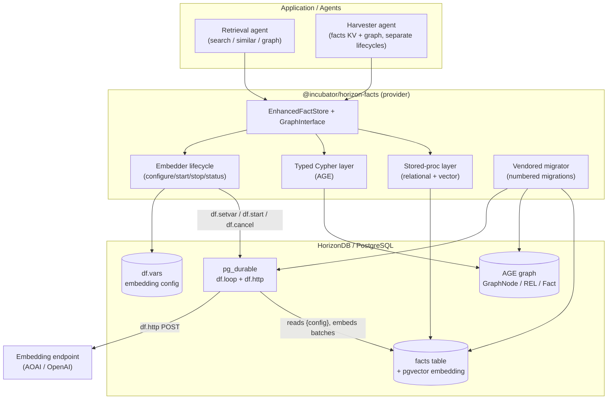
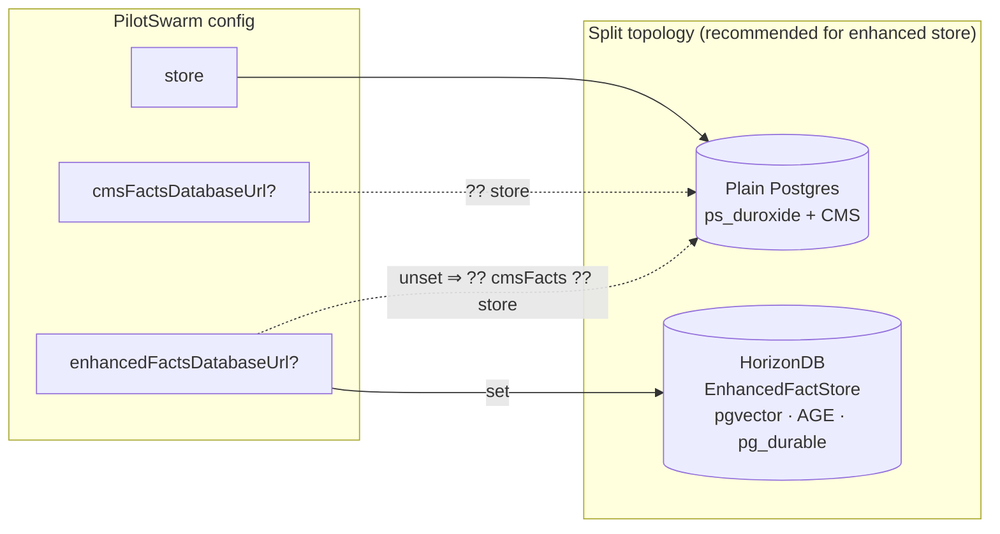
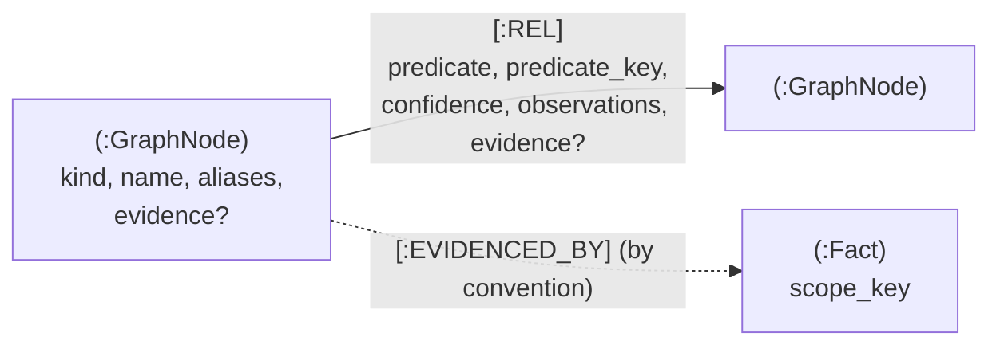
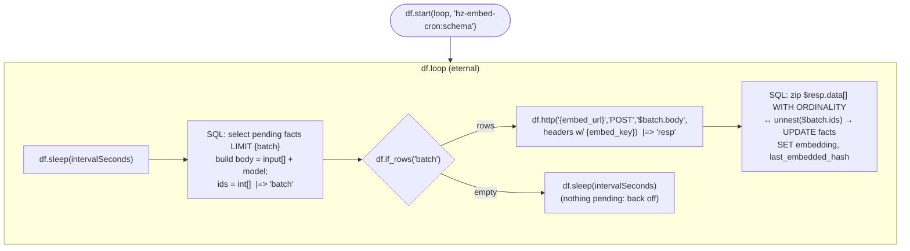
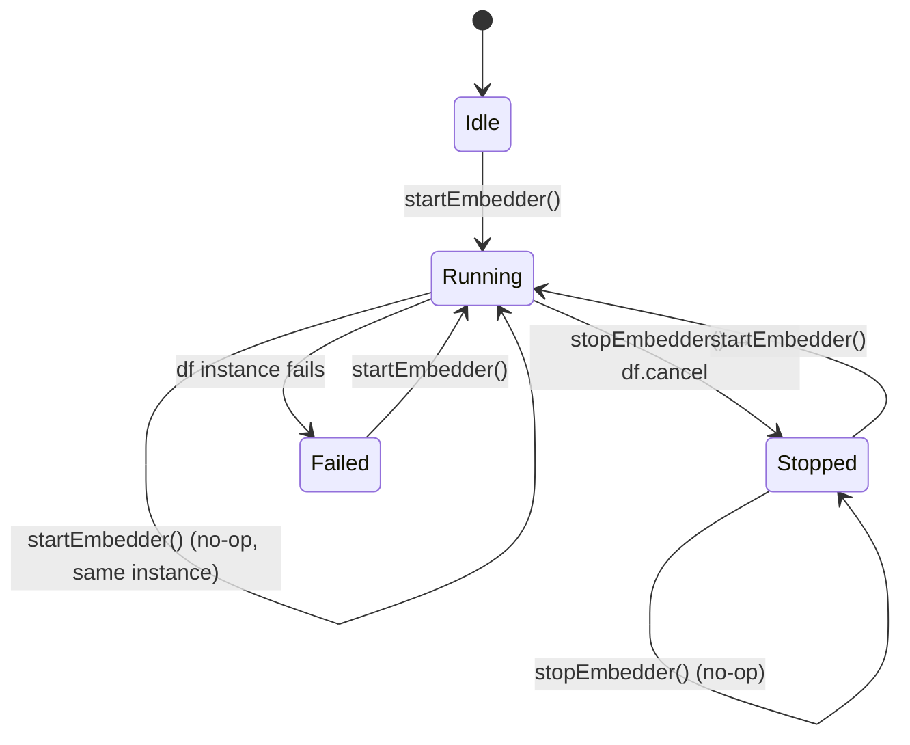
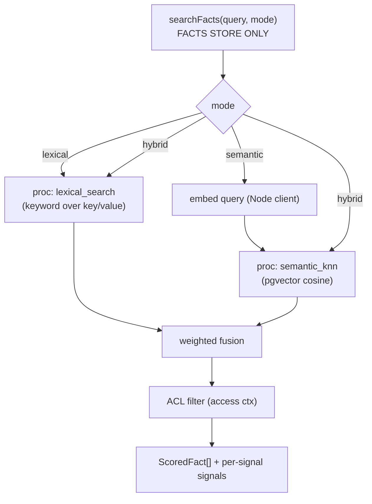
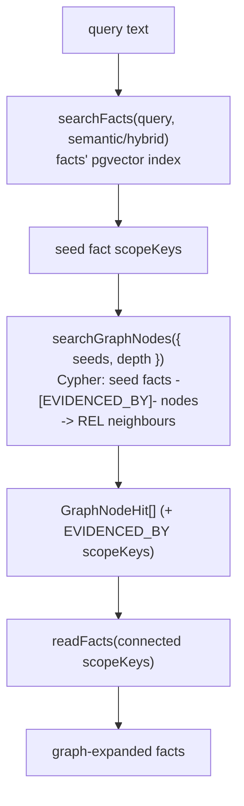
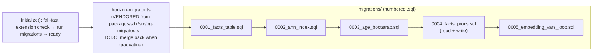
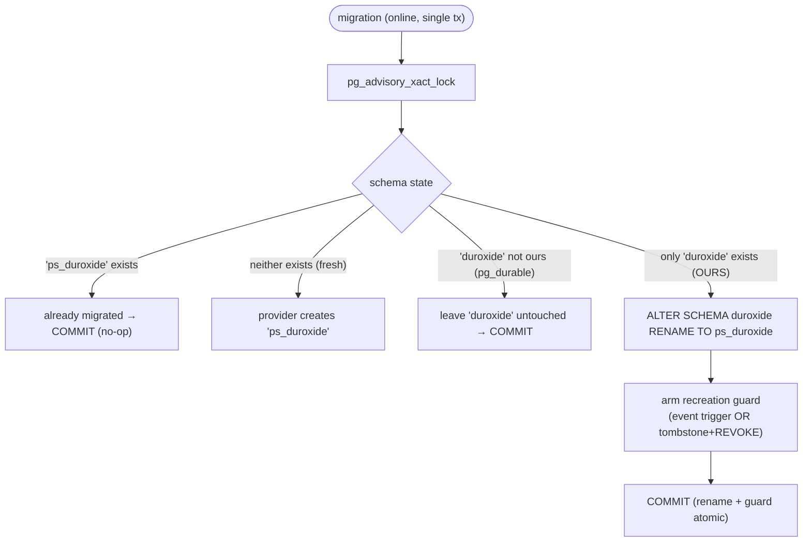

# EnhancedFactStore — Design

> Status: Proposal · Companion: [01-functional-spec.md](./01-functional-spec.md) ·
> [02-api-reference.md](./02-api-reference.md) · [04-test-spec.md](./04-test-spec.md)

## 1. Component overview



**Layering decision**

- **Relational + vector** access (facts CRUD, lexical search, semantic kNN,
  stats) goes through **stored procedures**. No inline SQL in TypeScript, matching
  the main SDK convention.
- **Graph** access (AGE Cypher) goes through a **typed Cypher layer** in
  TypeScript (`graph-queries.ts`), not plpgsql-wrapped Cypher. Wrapping Cypher in
  procs would mean plpgsql building Cypher strings — strictly worse to maintain.
- **All DDL** ships as **numbered migrations** via a vendored migrator.

## 1a. Deployment topology — three connection targets

PilotSwarm exposes **three independent connection strings**. They MAY all point at
the same database (today's default), or be split so the EnhancedFactStore lives on
its own HorizonDB while orchestration and CMS stay on plain Postgres.

| Target | Config key | Stores | Engine needs |
|--------|-----------|--------|--------------|
| Orchestration | `store` | duroxide orchestration (`ps_duroxide`) | plain Postgres |
| CMS | `cmsFactsDatabaseUrl` | session catalog (CMS) | plain Postgres |
| Enhanced facts | `enhancedFactsDatabaseUrl` *(new)* | EnhancedFactStore (facts + pgvector + AGE + pg_durable) | **HorizonDB** |

**Resolution chain (back-compat):**

```
enhancedFactsDatabaseUrl ?? cmsFactsDatabaseUrl ?? store
cmsFactsDatabaseUrl      ?? store
```

So unsetting the new key reproduces today's behaviour (facts co-located with CMS),
and unsetting both collapses to a single database for all three. The matching
schema knobs stay independent: `duroxideSchema` (→ `ps_duroxide`), `cmsSchema`
(`copilot_sessions`), `factsSchema`/`enhancedFactsSchema` (`horizon_facts`).



**Topology consequences**

- **Split (recommended):** the enhanced store gets HorizonDB-only capabilities
  (pgvector/AGE/pg_durable) without forcing orchestration + CMS onto HorizonDB; the
  in-DB embedder loop and AGE queries don't compete with orchestration load.
- **Split largely sidesteps §6.** If the enhanced store's HorizonDB is a *separate
  database* from `ps_duroxide`, the `duroxide` ↔ pg_durable schema collision can't
  occur — different databases. The §6 rename migration becomes the **safety net**
  for the single-database case, not the primary path.
- **Single database (allowed):** point all three keys at one HorizonDB. Then §6's
  online rename + recreation guard is what keeps PilotSwarm's `ps_duroxide` and
  pg_durable's `duroxide` from colliding.
- **Consistency caveat:** with a split, facts and CMS are not transactionally
  consistent (e.g. session-delete → fact-cleanup becomes two independent writes).
  This is already true today whenever `cmsFactsDatabaseUrl` differs from `store`,
  so it is not a new class of problem — just explicit.

> This three-target config is a **PilotSwarm core (`packages/sdk`) change**
> (`enhancedFactsDatabaseUrl` + `enhancedFactsSchema`, additive and back-compat),
> separate from the incubator. It is the clean way to host the EnhancedFactStore on
> HorizonDB.

## 2. Data model

### 2.1 Relational facts (`facts`)

| Column | Purpose |
|--------|---------|
| `scope_key` | Canonical ACL scope key (`shared:<key>` / `session:<id>:<key>`). |
| `key`, `value` | The KV fact. |
| `content_hash` | Hash of embeddable content; drives re-embedding. |
| `embedding` | `vector(dim)` — pgvector column. NULL until embedded. |
| `last_embedded_hash` | Hash at last embed; `IS DISTINCT FROM content_hash` ⇒ pending. |
| `embedded_at`, `embedding_model` | Provenance of the embedding. |
| `last_crawled_at` | `timestamptz` NULL — when the fact was last incorporated into the graph. `NULL` ⇒ pending crawl. Reset to `NULL` on content change (trigger). |
| ACL / tags / timestamps | As today. |

ANN index: `pg_diskann` (allow-listed) or pgvector HNSW; `auto` prefers diskann.

**Write-resets-pending-state (trigger).** A `BEFORE INSERT OR UPDATE` trigger
recomputes `content_hash` from key/value; when it changes it (a) leaves
`last_embedded_hash` stale so the embedder re-embeds, and (b) sets
`last_crawled_at = NULL` so the harvester re-crawls. This makes `storeFact`
(upsert/create/replace) reset crawl/embedding state with no per-proc bookkeeping.
`readUncrawledFacts` selects `last_crawled_at IS NULL`; `markFactsCrawled` stamps
`now()`.

### 2.2 Open graph (AGE)



- `GraphNode` — free-text `kind` + `name`, normalized to `node_key =
  <kind>:<normalized-name>`; `aliases[]`; optional `evidence[]`. **No embedding**
  — nodes are found by `nameLike` / `kind` / seed traversal, not by vector.
- `REL` — free-text `predicate` + normalized `predicate_key`; `confidence`
  (noisy-OR across observations), `observations`, optional `evidence[]`.
- `Fact` nodes / `EVIDENCED_BY` edges are **convention-level** links to KV facts.
  The graph does not enforce that a referenced `scope_key` exists in `facts`.
  These links are also the **pivot** a query uses to enter the graph from a
  semantic facts hit (§4.1).

### 2.3 KV ↔ graph linkage is by convention

```mermaid
flowchart LR
  subgraph KV["Facts KV (relational)"]
    K1["fact: skills/jsonb"]
  end
  subgraph G["Facts Graph (AGE)"]
    N1["GraphNode jsonb-subscript"]
    R1["REL supersedes"]
  end
  K1 -. "scope_key referenced as evidence<br/>(NOT enforced)" .-> N1
  K1 -. .-> R1
```

The harvester manages both stores. Deleting a fact does **not** delete graph
provenance (no cascade); a deleted fact may remain referenced until a harvester
or maintenance pass cleans it up.

## 3. Embedding generator (the corrected design)

### 3.1 Why the previous design was wrong

The old loop scheduled a plpgsql procedure that, **per fact**, started a child
`df.http` instance and blocked on `df.wait_for_completion`. That is a durable
instance nested inside a durable instance ("df-in-df") — fragile, and it only
existed because we believed `df.http` bodies were static. They are not.

`df.http` supports runtime substitution in url/body/headers via:

- **`{var}`** — durable variables (`df.setvar`) snapshotted at `df.start`,
  immutable during the run (used for config + secret).
- **`$name`** — a step's result named with `|=>`, substituted at runtime
  (used for the dynamic batch body).

So a single eternal loop can build a batch body in SQL and feed it straight into
one `df.http` call. No nesting.

### 3.2 The single eternal loop



- **One** `df.start`, **one** eternal instance, identified by a stable label.
- **Batch per tick** via the array-input embedding API → one HTTP per batch.
- `df.if_rows` skips the HTTP when nothing is pending.
- Positional zip-back (`WITH ORDINALITY`) maps `data[i]` to `ids[i]`.

### 3.3 Config & secret flow

```mermaid
sequenceDiagram
  participant Env as .env / k8s secret
  participant Host as Provider (Node)
  participant Vars as df.vars
  participant Loop as df eternal loop
  participant Ext as Embedding endpoint

  Env->>Host: url, model, dim, key, key_header, input_field
  Host->>Vars: df.setvar(embed_url/model/dim/key/...)
  Host->>Loop: df.start(loop, label)
  Note over Vars,Loop: {embed_*} snapshotted at start, immutable for the run
  Loop->>Ext: df.http('{embed_url}', body=$batch.body, headers {embed_key})
  Ext-->>Loop: data[] embeddings
  Loop->>Loop: UPDATE facts SET embedding=…
```

> ⚠️ **Security TODO (incubation):** the API key currently lives in `df.vars`
> (plaintext at rest, per-user RLS only). A follow-up must move it to a
> runtime-injected credential. Documented as an accepted incubation limitation.

### 3.4 Lifecycle state machine



`embedderStatus()` derives `running` from the latest instance with the schema
label (`pending`/`running` ⇒ running; terminal ⇒ not running).

## 4. Retrieval design

**`searchFacts` is facts-store-only** (lexical / semantic / hybrid). Graph
retrieval is a separate path (`searchGraphNodes`) that the caller composes by
feeding `searchFacts` output in as `seeds`.



- **`similarFacts`** = the `semantic_knn` proc anchored on a known fact's stored
  vector (no query embedding, no fusion, no graph).
- **Lineage** = base `readFacts({ scope: "descendants" })` (rank via `searchFacts`).
- **Graph retrieval is NOT a `searchFacts` mode.** `relatedFacts` is removed.

### 4.1 Graph retrieval & the fact-pivot (replaces the old `graph` mode)

Graph nodes have **no vector index** — a free-text query cannot kNN its way to a
node. So the query entry point rides the **facts'** vector index, then pivots
into the graph via the `EVIDENCED_BY` convention links. The caller composes it:



- **Entry point = facts' index**, never node vectors. `nameLike` (lexical on
  node name/aliases) is the alternative direct entry when the caller already has
  a name.
- **Seeds** accepted by `searchGraphNodes` are fact scopeKeys (pivot via
  `EVIDENCED_BY`) or node keys (expand directly). `depth` bounds the traversal.
- Each returned node carries its `EVIDENCED_BY` scopeKeys, so the round-trip back
  to facts is a single `readFacts`.

## 5. Migrations & code structure



- Advisory-lock migration runner (vendored copy of the SDK's `pg-migrator`, with
  a header comment requiring merge-back).
- All DDL — facts table, ANN index, AGE bootstrap, read/write procs, embedding
  vars + loop helper procs — lives in numbered migrations.
- Inline DDL in `http-embedding.ts` and the standalone `sql/006_embeddings_http.sql`
  are deleted once migrated.

## 6. Schema namespace isolation (PilotSwarm duroxide vs pg_durable)

### 6.1 The collision

Two **independent** duroxide-pg state providers both default to the schema
name `duroxide`:

- **PilotSwarm** — the Node `duroxide` npm `PostgresProvider`, default
  `DEFAULT_DUROXIDE_SCHEMA = "duroxide"`.
- **pg_durable** (inside HorizonDB) — its embedded Rust duroxide-pg owns
  `duroxide.*` (runtime state) plus `df.*` (the DSL). These names are **fixed by
  the extension** and cannot be changed.

If PilotSwarm's orchestration store and pg_durable ever share the **same
database**, both fight over `duroxide.*` → corruption. (Schemas are per-database,
so separate databases never collide — but we will **not assume** the deployment
topology guarantees that.)

Only PilotSwarm's side is movable, so PilotSwarm is the one that renames.

### 6.2 Decision: online single-transaction rename to `ps_duroxide`

Change PilotSwarm's default orchestration schema from `duroxide` to
**`ps_duroxide`** via an **online, single-transaction** migration that renames the
schema **and** installs a recreation guard atomically. No fleet drain is required.

The safety principle: old-version workers failing is acceptable; **recreating the
old schema is not**. Because the rename and the guard commit in the *same*
transaction, there is no window where `duroxide` is both gone and unguarded — so a
straggler old worker can never recreate it.

```sql
BEGIN;
  SELECT pg_advisory_xact_lock(<key>);            -- single migrator
  ALTER SCHEMA duroxide RENAME TO ps_duroxide;     -- atomic, lossless
  -- guard (one of the two variants in §6.5) armed in the SAME tx
COMMIT;
```

- **Fresh installs** default to `ps_duroxide`; the migration is a no-op.
- **Existing installs** run the migration once (advisory-locked, idempotent). New
  workers deploy as a normal rolling update; old workers error out until replaced
  but cannot fork the store.



### 6.3 Worker-start behaviour (no auto-rename)

Worker start still **never renames live** — the migration is an explicit deploy
step, not a side effect of `start()`. Detection on start:

| Detected state | Worker action |
|----------------|---------------|
| Configured schema (`ps_duroxide`) exists | use it |
| Fresh (neither schema) | create `ps_duroxide` |
| Only legacy `duroxide` exists, no `ps_duroxide` | **refuse to start** with an actionable error: "run the orchestration-schema rename migration" |
| `DUROXIDE_SCHEMA` pinned by operator | honour it verbatim (escape hatch) |

### 6.4 Back-compat matrix

| Existing state | Migration action | Result |
|----------------|------------------|--------|
| Fresh DB | none | provider creates `ps_duroxide` |
| Legacy PilotSwarm (`duroxide` only) | single-tx rename + guard | history preserved, atomic; old workers fail loud, cannot recreate |
| Already migrated (`ps_duroxide` exists) | none | idempotent no-op |
| Operator pinned `DUROXIDE_SCHEMA=duroxide` | none | behaves exactly as today |
| `duroxide` present but NOT ours (pg_durable) | none | guard refuses to rename |

### 6.5 The recreation guard (armed in the same transaction)

Two interchangeable variants; pick by available privilege:

**(a) Event trigger (needs event-trigger creation right; available to HorizonDB `hdbadmin` — see §6.7).**

```sql
-- fires when any tx tries to CREATE SCHEMA duroxide → raises → that tx rolls back
CREATE EVENT TRIGGER ps_block_duroxide_recreate ON ddl_command_end
  WHEN TAG IN ('CREATE SCHEMA') EXECUTE FUNCTION ps_guard_duroxide();
-- ps_guard_duroxide(): if any pg_event_trigger_ddl_commands().object_identity
-- = 'duroxide' then RAISE EXCEPTION 'duroxide schema is retired; use ps_duroxide'
```
Filters on the schema name (not all `CREATE SCHEMA`) so it is safe on a shared
database. The raise occurs inside the offending transaction, so the recreate is
rolled back — the guard works even though it fires at `ddl_command_end`.

**(b) Tombstone schema + REVOKE (needs only schema ownership — PaaS-friendly).**

```sql
-- after the rename, in the SAME tx:
CREATE SCHEMA duroxide AUTHORIZATION <admin_role>;   -- empty tombstone
REVOKE CREATE ON SCHEMA duroxide FROM <app_role>;    -- app cannot add tables
```
Then an old worker's `CREATE SCHEMA IF NOT EXISTS duroxide` is a no-op (it
exists) and `CREATE TABLE duroxide.*` fails with *permission denied* — it fails
loud and still cannot materialize a shadow store. No superuser required.

Either way: **old workers fail; they never recreate the orchestration store.**

### 6.7 Conformance check (verified on live HorizonDB)

The migration strategy is backed by a re-runnable conformance script,
[`incubator/horizon-facts/scripts/verify-schema-migration.mjs`](../../../incubator/horizon-facts/scripts/verify-schema-migration.mjs).
It is **safe to run against a live cluster**: it never touches `duroxide`, `df`,
or pg_durable state — it uses throwaway schema names (`ps_mig_src` → `ps_mig_dst`),
a name-specific guard, and cleans up everything it creates.

Run it before enabling co-location on any new target cluster:

```bash
cd incubator/horizon-facts
node scripts/verify-schema-migration.mjs   # needs HORIZON_DATABASE_URL
```

Results on the current HorizonDB (run as `hdbadmin`, `rolsuper = false`) — **9/9
passed**:

| Check | Property proven | Result |
|-------|-----------------|--------|
| seed source schema | fixture setup | ✅ |
| rename preserves rows | `ALTER SCHEMA … RENAME` is **lossless** | ✅ |
| source name gone after rename | rename is real, atomic | ✅ |
| `CREATE EVENT TRIGGER` permitted | **variant (a) works on HorizonDB despite non-superuser** | ✅ |
| guard blocks retired name | recreation of `duroxide` raises | ✅ |
| blocked `CREATE` rolled back | no shadow schema after a blocked attempt | ✅ |
| guard ignores other names | filter is name-specific (safe on shared DB) | ✅ |
| tombstone + `REVOKE CREATE` | variant (b) installs | ✅ |
| `REVOKE CREATE` denies non-owner | variant (b) blocks table creation | ✅ |

This script is a **design artifact**: it is the gate a cluster must pass before
PilotSwarm and pg_durable are allowed to share a database, and it is referenced by
the test spec ([04-test-spec.md §6](./04-test-spec.md)).

### 6.6 Properties & constraints

- **Atomic rename + guard** — both commit in one transaction; no unguarded window.
- **Atomic & lossless rename** — `ALTER SCHEMA … RENAME` preserves all tables,
  indexes, sequences, and in-flight orchestration history. No replay, no reset.
- **Online** — no fleet drain; tolerates old workers running (they error out and
  are replaced by the rolling deploy) precisely because recreation is blocked.
- **Idempotent + race-safe** — `pg_advisory_xact_lock`; re-running is a no-op.
- **Lock contention** — `ALTER SCHEMA … RENAME` may briefly block on old workers'
  open transactions, then commit; acceptable for a one-shot migration.
- **Privilege** — rename needs schema-owner / `ALTER`; guard variant (a) needs
  event-trigger creation rights, variant (b) needs only ownership. **Empirically,
  HorizonDB's `hdbadmin` can create event triggers despite not being a classic
  superuser**, so variant (a) is usable there; variant (b) remains the fallback
  for roles that lack it.
- **Co-location guard** — only rename a `duroxide` schema recognizably PilotSwarm's
  (duroxide-pg's known tables present) and only when `ps_duroxide` doesn't exist;
  never rename a `duroxide` owned by pg_durable.

> This is a **PilotSwarm core (`packages/sdk`) change**, separate from the
> horizon-facts incubator work, but captured here because the EnhancedFactStore /
> HorizonDB provider is what surfaces the collision. It is a prerequisite for any
> deployment where PilotSwarm and pg_durable could share a database.

## 7. Open risks / follow-ups

| Risk | Mitigation / follow-up |
|------|------------------------|
| Whole-body `$batch.body` substitution escaping | Verify at build; fall back to per-fact `"$f.text"` template loop if whole-body substitution is unsafe. |
| API key in `df.vars` (plaintext) | Accepted for incubation; TODO to move to runtime-injected secret. |
| `mergeGraphNodes` recreates edges (no APOC) | Harden + cover with tests; possible duplicate/observation drift. |
| Provenance rot (no cascade) | Optional future `gcGraph()` maintenance pass. |
| AGE Cypher quirks (no startNode/endNode/UNWIND on var-length) | Encapsulated in the typed Cypher layer; covered by graph tests. |
| Orchestration schema rename on existing clusters | Online single-transaction `ALTER SCHEMA` + recreation guard (atomic); old workers fail loud but cannot recreate `duroxide`; guarded against non-PilotSwarm `duroxide` (§6). |
| Recreation guard privilege (event trigger needs superuser) | Verified that HorizonDB `hdbadmin` CAN create event triggers (non-superuser); variant (a) works there. Tombstone + `REVOKE CREATE` (§6.5b) remains the ownership-only fallback. |
