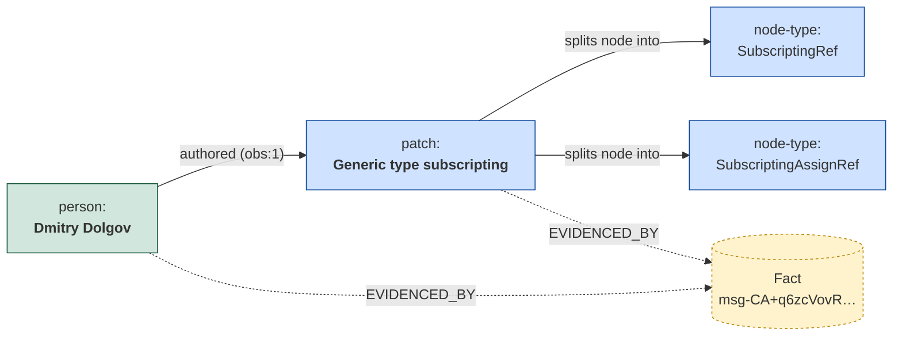
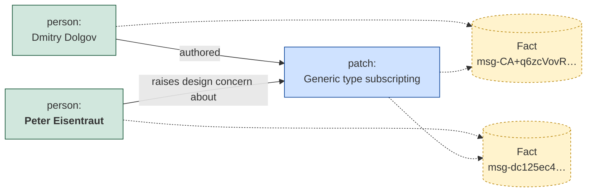
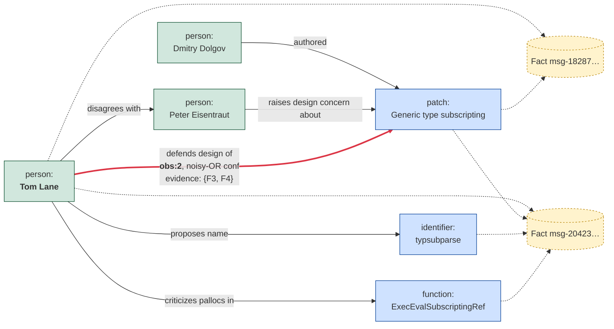
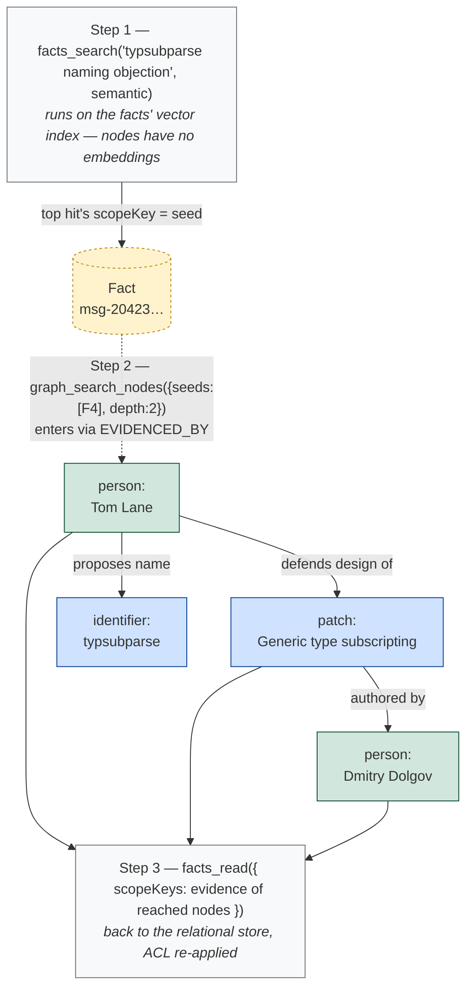

# EnhancedFactStore — Agent Tools Spec

> Status: Proposal · Companion to [01-functional-spec.md](./01-functional-spec.md) ·
> [02-api-reference.md](./02-api-reference.md) · [03-design.md](./03-design.md) ·
> [04-test-spec.md](./04-test-spec.md)
>
> **Shape alignment ([07-pilotswarm-integration.md](./07-pilotswarm-integration.md) is
> canonical):** the graph is a **separate injected `GraphStore`** (provider
> `HorizonDBGraphStore`), the crawl queue lives on the **base `FactStore`**, the
> enhanced provider is **`HorizonDBFactStore`**, the package is
> **`@pilotswarm/horizon-store`**. Read `GraphInterface` as `GraphStore` below.
without reading the TypeScript API. Each tool maps 1:1 onto an EnhancedFactStore
/ GraphStore method (02-api-reference). Tool names below use the default
prefixes `facts_` (facts store) and `graph_` (open graph); a host may rechoose
the prefix.

**How these tools light up.** The host selects the facts-store provider in the
PilotSwarm initializer (02-api-reference §1b). When the provided store is an
`EnhancedFactStore`, the worker registers these tools in addition to the base
fact tools, and the base agent instructions name the matching skill to load for
the store provided (base store → base fact tools/skill only; enhanced store →
this surface). The crawl-queue tools (§2) and graph write tools (§4) are
registered **only for the harvester role** — they are privileged (see §2).

The audience is two app roles over the **same** corpus:

- **Reader** — answers questions: `facts_search`, `facts_similar`, `facts_read`,
  plus the graph read tools to follow connections.
- **Harvester** — turns facts into a knowledge graph: the crawl-queue tools plus
  the graph write tools.

---

## 0. Mental model (read this first)

There are **two stores** and they are **orthogonal**:

1. **Facts store** — key/value facts with text + a vector embedding. You search
   it by a **search query** (`facts_search`) or by an **existing fact**
   (`facts_similar`). It has **no** notion of the graph.
2. **Open graph** — free-form **nodes** (people, patches, files, threads…) joined
   by free-text **edges** (predicates). Nodes have **no embeddings**; you reach
   them by name, by `kind`, or by **seeding** from facts you already found.

The bridge between them is **evidence**: every graph node/edge can carry the
`scope_key`s of the facts that justify it (`EVIDENCED_BY`). That is also how you
pivot: *semantic search the facts → seed the graph with those fact keys → expand
by graph hops*.

**The graph is shared.** There is no per-node/edge ACL: node names, aliases and
edge predicates are visible to **every** reader. What stays scoped is the
*facts* layer — fact bodies are ACL-checked on read, and the `evidence` arrays
you get back from graph tools only ever contain fact keys **you** are allowed
to read (connections through facts you can't see still work; you just don't see
their keys).

**Golden rules for the harvester**

0. **Harvesting is publishing.** Incorporating a fact puts its extracted
   entities and relationships into a graph every reader can see, regardless of
   the source fact's ACL. You are privileged so you can make this call: stick
   to the corpus/namespace you were deployed to harvest, and do not incorporate
   private material that shouldn't be shared — extracted content cannot be
   retroactively scoped.

1. **Resolve before you create.** Always `graph_search_nodes` for an existing
   node (by name/alias) before `graph_upsert_node`. This is how `"tgl"` attaches
   to the existing *Tom Lane* node instead of spawning a duplicate.
2. **Predicates are free text.** Invent the verb that fits (`"comments on"`,
   `"revives argument from"`). Re-stating the same relationship later **reinforces**
   the edge — you do not need to dedupe edges yourself. (Reinforcement counts
   when you bring *new* evidence — ≥1 scopeKey not already on the edge — or no
   evidence at all; re-asserting with only already-known evidence is a harmless
   no-op, so replays cannot inflate confidence.)
3. **Pass evidence.** Evidence is *optional in the contract* (an assertion
   without it is accepted), but as a harvester you should always pass the
   `scope_key` of the fact you are reading — it is the provenance for any
   node/edge you derive from it, and it is what makes reinforcement dedup work.
4. **Mark work done.** After incorporating a fact into the graph, call
   `facts_mark_crawled` with the fact's `scopeKey` **and the `contentHash` you
   read** so it leaves the queue. If the fact was edited while you worked, your
   stamp is skipped and the fact stays queued — that is correct; just move on.
   Editing a fact later re-queues it automatically.

---

## 1. Retrieval tools (reader + harvester)

### `facts_search`

**Purpose.** Find facts by a search query over the **facts store only**. The
query is interpreted by `mode`: **keywords** for `lexical` (BM25), **natural
language** for `semantic`, a keyword-rich phrase for `hybrid`.

**When to use.** You have a question or a topic in words and want the most
relevant facts. This is your main entry point.

**When NOT to use.** You already have a specific fact and want “more like this”
(use `facts_similar`); or you want graph connections (use `graph_search_nodes`).

> **The shape of `query` depends on `mode` — this matters.**
> - `mode: "lexical"` → `query` is a **BM25 full-text search query**, not a
>   sentence. Pass **keywords / terms** (e.g. `jsonb subscript vacuum`), optionally
>   with text-search operators. A full natural-language sentence here just adds
>   stop-words and dilutes the match — strip it to the salient terms.
> - `mode: "semantic"` → `query` is **natural language**. The full sentence is
>   embedded and matched by meaning; phrasing and context help.
> - `mode: "hybrid"` → `query` is used **both ways** (BM25 + embedded). Prefer a
>   short, keyword-rich phrase: specific enough for BM25, descriptive enough to
>   embed well.

| Param | Type | Req | Meaning |
|-------|------|-----|---------|
| `query` | string | ✓ | The search query. **Interpretation depends on `mode`** (see box above): keywords for `lexical`, natural language for `semantic`, a keyword-rich phrase for `hybrid`. |
| `mode` | `"lexical" \| "semantic" \| "hybrid"` | | Default `hybrid`. `lexical` = BM25 keyword match (terms, not sentences), `semantic` = embedding/meaning (natural language), `hybrid` = both fused. **No `graph` mode** — the graph is a separate tool. |
| `namespace` | string | | Key-prefix filter, e.g. `"archive/pgsql-hackers"`. |
| `tags` | string[] | | Restrict to facts carrying all these tags. |
| `limit` | number | | Max results (default 20). |

**Returns.** `{ count, mode, facts: [{ scopeKey, key, value, tags, score, signals }] }`.
Use the `scopeKey` values as **seeds** for `graph_search_nodes`.

---

### `facts_similar`

**Purpose.** Given a fact you already have, return the **semantically nearest**
other facts (vector kNN over the fact's stored embedding — no query text, no
re-embedding).

**When to use.** “Find more facts like this one.” Clustering, dedup hunting,
expanding context around a known fact.

| Param | Type | Req | Meaning |
|-------|------|-----|---------|
| `scopeKey` | string | ✓ | The anchor fact's `scope_key`. |
| `k` | number | | Top-k neighbours (default 8). |
| `minScore` | number | | Drop neighbours below this cosine score (0..1). |

**Returns.** `{ count, facts: [...] }`, anchor excluded.

---

### `facts_read`

**Purpose.** Read facts directly by key/tags/scope — **no ranking**.

**When to use.** You already know the keys (e.g. the evidence keys returned by a
graph node) and want the raw fact rows. Also the way to read **lineage**:
`scope: "descendants"` returns the spawn-tree's facts.

| Param | Type | Req | Meaning |
|-------|------|-----|---------|
| `keyPattern` | string | | Key prefix/pattern filter. |
| `scopeKeys` | string[] | | Read an explicit set of facts by `scope_key` — the way to resolve graph `evidence` back into facts. Inaccessible/unknown keys are silently omitted. |
| `tags` | string[] | | Must carry all tags. |
| `scope` | `"accessible" \| "shared" \| "session" \| "descendants"` | | Visibility scope (default accessible). |
| `limit` | number | | Max rows. |

**Returns.** `{ count, facts: [...] }` (each fact carries its `scopeKey`).

> To rank a lineage, call `facts_read({ scope: "descendants" })` then pass those
> keys/topic through `facts_search`. There is no separate “lineage” tool.

---

## 2. Crawl-queue tools (harvester)

These make the harvester loop trivial: pull the backlog, do work, stamp done.

> **Privileged.** Crawling is a trusted, host-granted capability: these tools
> see **all** facts (shared + every session), regardless of the calling
> session, and are registered only for the harvester role — ordinary reader
> agents never get them.

### `facts_read_uncrawled`

**Purpose.** Return facts **not yet incorporated into the graph**
(`last_crawled_at IS NULL`). This is the harvester's **work queue**.

| Param | Type | Req | Meaning |
|-------|------|-----|---------|
| `namespace` | string | | Restrict the queue to a key prefix, e.g. `"archive/pgsql-hackers"`. |
| `limit` | number | | Max facts to pull this batch (default 20). |

**Returns.** `{ count, facts: [{ scopeKey, key, value, tags, contentHash }] }` —
keep each fact's `contentHash`; it is the receipt `facts_mark_crawled` needs.

**Note.** A fact is uncrawled when it is new or was edited since it was last
crawled. You do not manage this flag on writes — it resets automatically.

### `facts_mark_crawled`

**Purpose.** Stamp facts as incorporated (`last_crawled_at = now()`) so they
**leave the queue**. Call this **after** you have upserted the nodes/edges for a
fact.

| Param | Type | Req | Meaning |
|-------|------|-----|---------|
| `stamps` | `{ scopeKey, contentHash }[]` | ✓ | One stamp per processed fact, with the `contentHash` returned by `facts_read_uncrawled`. |

**Returns.** `{ marked, skipped }` — a stamp is **skipped** (not an error) when
the fact's content changed since you read it; the fact stays in the queue and
you will see its new version on a later pull.

---

## 3. Graph read tools (reader + harvester)

### `graph_search_nodes`

**Purpose.** Find / expand graph nodes. This is both the **resolve** step
(does this entity already exist?) and the **pivot** step (turn fact hits into
graph nodes).

| Param | Type | Req | Meaning |
|-------|------|-----|---------|
| `kind` | string | | Free-text node kind filter (`"person"`, `"patch"`…). |
| `nameLike` | string | | Lexical match on node name **or any alias**. The resolve key. |
| `seeds` | string[] | | Fact `scope_key`s **or** node keys to anchor from. Fact seeds pivot via `EVIDENCED_BY`; node seeds expand directly. |
| `depth` | number | | Hops to expand from `seeds` (1..5). |
| `limit` | number | | Max nodes. |

**Returns.** `[{ nodeKey, kind, name, aliases, evidence }]` — each hit carries its
`EVIDENCED_BY` fact `scope_key`s, **filtered to the ones you can read**, so you
can feed `evidence` straight into `facts_read` and every key will resolve.
(Seeds you can't read are silently ignored.)

**Resolve pattern (do this before every create):**
```
graph_search_nodes({ kind: "person", nameLike: "tgl" })
  → if a hit: reuse its nodeKey (and the surface form becomes an alias on upsert)
  → if empty: graph_upsert_node({ kind: "person", name: "Tom Lane", aliases: ["tgl"] })
```

**Pivot pattern (facts → graph):**
```
hits  = facts_search({ query: "jsonb subscript", mode: "semantic" })
nodes = graph_search_nodes({ seeds: hits.facts.map(f => f.scopeKey), depth: 2 })
facts = facts_read({ scopeKeys: nodes.flatMap(n => n.evidence) })   // back to facts
```

### `graph_search_edges`

**Purpose.** Find edges, two ways only: **anchor-and-explore** (set `fromKey`
and/or `toKey`) or **exact-predicate** (set `predicate`/`predicateKey`, exact
equality — no fuzzy match).

| Param | Type | Req | Meaning |
|-------|------|-----|---------|
| `predicate` | string | | EXACT predicate text. |
| `predicateKey` | string | | EXACT normalized key (preferred, surface-stable). |
| `fromKey` | string | | Anchor source node. |
| `toKey` | string | | Anchor target node. |
| `minConfidence` | number | | Drop edges below this combined confidence. |
| `limit` | number | | Max edges. |

**Returns.** `[{ fromKey, toKey, predicate, predicateKey, confidence, observations, evidence }]`.

### `graph_neighbourhood`

**Purpose.** Bounded subgraph around a node — the fast way to “show me everything
connected to X”.

| Param | Type | Req | Meaning |
|-------|------|-----|---------|
| `nodeKey` | string | ✓ | Anchor node. |
| `depth` | number | ✓ | Hops (clamped 1..5). |

**Returns.** `{ nodes: [...], edges: [...] }`.

---

## 4. Graph write tools (harvester)

### `graph_upsert_node`

**Purpose.** Create a node, or merge into an existing one. **Idempotent** — safe
to call repeatedly; aliases and evidence union in.

| Param | Type | Req | Meaning |
|-------|------|-----|---------|
| `kind` | string | ✓ | Free text: `person`, `patch`, `code_file`, `thread`… |
| `name` | string | ✓ | Canonical surface form. |
| `aliases` | string[] | | Other observed surface forms (merged in). |
| `evidence` | string[] | | Fact `scope_key`s that justify this node. **Always pass the source fact.** |

**Returns.** `{ nodeKey, kind, name, aliases, created }` — `created:false` means it
merged into an existing node. **Use the returned `nodeKey`** for edges.

### `graph_upsert_edge`

**Purpose.** Assert a free-text relationship, or **reinforce** an existing one.
Re-stating the same `(fromKey, predicate, toKey)` does **not** duplicate — it
bumps `observations` and combines `confidence` (noisy-OR) and unions evidence.

| Param | Type | Req | Meaning |
|-------|------|-----|---------|
| `fromKey` | string | ✓ | Source node key (or a fact `scope_key`). |
| `toKey` | string | ✓ | Target node key (or a fact `scope_key`). |
| `predicate` | string | ✓ | Free-text verb, e.g. `"revives argument from"`. |
| `confidence` | number | | 0..1 for THIS observation (default 1.0). |
| `evidence` | string[] | | Fact `scope_key`s justifying the edge. **Pass the source fact.** |

**Returns.** `{ fromKey, toKey, predicate, predicateKey, confidence, observations, reinforced }`.

**Pitfalls.**
- Pass the **resolved** `nodeKey`s from `graph_upsert_node` / `graph_search_nodes`,
  not raw names. Edges to a mistyped name create a phantom endpoint.
- One verb per relationship. Don't pack `"comments on and revives"` into a single
  predicate — assert two edges.

### `graph_merge_nodes`

**Purpose.** Entity resolution: fold a duplicate node into the survivor (union
aliases, repoint edges, delete the duplicate). Use when you discover two nodes
are the same entity after the fact.

| Param | Type | Req | Meaning |
|-------|------|-----|---------|
| `fromKey` | string | ✓ | Duplicate to remove. |
| `intoKey` | string | ✓ | Survivor to keep. |
| `reason` | string | ✓ | Why they're the same (audit). |

### `graph_delete_node` / `graph_delete_edge`

**Purpose.** Remove a node (and all its edges — `DETACH DELETE`) or one exact
edge triple. Returns whether something matched. **No cascade** to facts; deleting
a fact never deletes graph provenance.

| Tool | Params |
|------|--------|
| `graph_delete_node` | `nodeKey` |
| `graph_delete_edge` | `fromKey`, `toKey`, `predicateKey` |

---

## 5. The canonical harvester loop

```text
repeat:
  batch = facts_read_uncrawled({ namespace, limit: 10 })
  if batch.count == 0: stop

  for each fact in batch.facts:
    # 1. RECALL related context (optional but improves linking)
    ctx = facts_search({ query: <topic of fact>, mode: "hybrid", limit: 5 })

    # 2. EXTRACT (your own reasoning): entities + free-text relationships

    # 3. RESOLVE + UPSERT each entity (resolve-before-create!)
    for each entity:
      hit = graph_search_nodes({ kind, nameLike: entity.name })
      node = hit ? hit : graph_upsert_node({ kind, name, aliases, evidence: [fact.scopeKey] })

    # 4. ASSERT each relationship with the source fact as evidence
    for each rel:
      graph_upsert_edge({ fromKey, toKey, predicate, confidence,
                          evidence: [fact.scopeKey] })

    # 5. MARK done (with the contentHash you read; a skip means the fact
    #    changed under you — it stays queued, move on)
    facts_mark_crawled({ stamps: [{ scopeKey: fact.scopeKey,
                                    contentHash: fact.contentHash }] })
```

**What “correct” looks like** (the eval asserts these):

- Two surface forms of the same person (`"Tom Lane"`, `"tgl"`) become **one**
  node with `"tgl"` as an alias — not two person nodes.
- The same relationship seen in two messages is **one reinforced edge**
  (`observations == 2`, confidence combined by noisy-OR), not two edges.
- Every edge carries ≥1 evidence `scope_key`.
- After the run, no fact in the namespace remains uncrawled.

---

## 5a. Worked example — what the graph actually looks like

A concrete walkthrough of the harvest loop over the first messages of the
**real** pgsql-hackers corpus
([`eval/corpus/pgsql-hackers-real.json`](../../../incubator/horizon-facts/eval/corpus/pgsql-hackers-real.json)
— the "[PATCH] Generic type subscripting" thread). Conventions in the
diagrams: solid boxes = `GraphNode`s (label = `kind:name`), cylinders =
`:Fact` anchor nodes (content-free pointers, created **lazily** on first
evidence citation — facts never auto-mirror into the graph), solid arrows =
`[:REL]` edges, dotted arrows = `[:EVIDENCED_BY]`.

> Recall the two physical forms of evidence (03-design §2.2): a **node's**
> evidence is a real `EVIDENCED_BY` edge to a `:Fact` anchor (traversable —
> it is what seed-pivoting matches); a **REL edge's** evidence is a
> `scope_key[]` property on the edge (property graphs have no edge-to-edge
> links). The API surfaces both as `evidence: string[]`.

### Step 1 — first message harvested (the patch submission)

Sixty facts were seeded; the graph starts empty. Harvesting Dmitry Dolgov's
submission mints the first nodes — `kind`s are free text invented by the
harvester — and the first (and only) anchor:



Facts table: 60 rows. Graph: 4 nodes, **1 anchor** — the other 59 facts have
no graph presence at all.

### Step 2 — second message (resolve-before-create reuses the patch node)

Peter Eisentraut objects to the design. `graph_search_nodes({ nameLike })`
finds the existing patch node, so it is **reused, not duplicated** — it just
gains a second `EVIDENCED_BY`:



### Step 3 — Tom Lane, twice: the reinforced edge

Tom Lane defends the design in one message (`msg-18287`) and reviews the
same patch in depth in another (`msg-20423`). Re-asserting the same triple
from a **different** fact reinforces the edge — `observations: 2`, noisy-OR
confidence, evidence union — rather than duplicating it. New concept nodes
(`typsubparse`, `ExecEvalSubscriptingRef`) appear from the review:



The thick edge is the scale-scenario reinforcement invariant
(06-provider-test-plan §10, SC1b): one edge, two observations, evidence from
two distinct messages. A replay carrying only already-known evidence leaves
it untouched (SC2). Note: a procedural message (e.g. David Steele's
commitfest ping) may contribute almost nothing — it is still
`facts_mark_crawled`; **crawled ≠ in the graph**.

### Step 4 — the reader pivot through the anchors

Facts are the searchable layer (vectors + BM25); GraphNodes are the
connective layer (no embeddings); the `:Fact` anchors are the turnstile
between them — every entry into the graph and every exit back to readable
content crosses an `EVIDENCED_BY` hop:



---

## 6. Phase 2 — compound context tools (reader)

> **Phase 2.** These two tools do `facts_search`/`facts_similar` →
> `graph_search_nodes` → `facts_read` **in one call** and hand back a
> relationship-aware bundle. They only pay off **after a harvester has built the
> graph** (the `EVIDENCED_BY` links). On an unharvested corpus they just return
> the seed facts — so prefer the Phase 1 tools until the graph exists.

### `facts_context_search`

**Purpose.** One-shot "find facts about X **and** how they connect": search the
facts store, pivot the hits into the graph, and return the seed facts, the
entities/relationships reached, and every referenced fact.

| Param | Type | Req | Meaning |
|-------|------|-----|---------|
| `query` | string | ✓ | Search query — keywords for lexical, natural language for semantic (same rule as `facts_search`). |
| `mode` | `"lexical" \| "semantic" \| "hybrid"` | | Entry search mode (default per host). |
| `breadth` | `"narrow" \| "normal" \| "wide"` | | One knob over seed/depth/expand limits (default `normal`). |

**Returns.** `{ entry, seeds[], nodes[], edges[], facts{} }` — `facts` is a map
keyed by `scopeKey` so every node/edge/seed resolves to its source fact.

### `facts_context_similar`

**Purpose.** One-shot "given this fact, show the related cluster **and** why they
relate": expand `facts_similar` into the graph and return the bundle plus
**`factLinks`** — explicit fact↔fact links through shared entities.

| Param | Type | Req | Meaning |
|-------|------|-----|---------|
| `scopeKey` | string | ✓ | The anchor fact. |
| `breadth` | `"narrow" \| "normal" \| "wide"` | | One knob over cluster size + graph expansion (default `normal`). |

**Returns.** `{ entry, seeds[], nodes[], edges[], facts{}, factLinks[] }`. Read
`factLinks` as: *"fact A and fact B are related because both evidence node N via
predicates […]."*

> Both are **read-only**. ACL is applied on entry and again on the final read, so
> you only ever see facts you're allowed to see.

---

## 7. Quick reference

| Tool | Role | One-liner |
|------|------|-----------|
| `facts_search` | read | Search facts; `query` is keywords (lexical/BM25) or natural language (semantic). |
| `facts_similar` | read | A fact → semantically nearest facts. |
| `facts_read` | read | Raw facts by key/tags/scope (incl. lineage). |
| `facts_read_uncrawled` | harvest | The crawl backlog (`last_crawled_at IS NULL`). |
| `facts_mark_crawled` | harvest | Stamp facts incorporated → leave the queue. |
| `graph_search_nodes` | read/harvest | Resolve a node / pivot from fact seeds. |
| `graph_search_edges` | read | Edges by anchor or exact predicate. |
| `graph_neighbourhood` | read | Bounded subgraph around a node. |
| `graph_upsert_node` | harvest | Create/merge a node (idempotent). |
| `graph_upsert_edge` | harvest | Assert/reinforce a free-text relationship. |
| `graph_merge_nodes` | harvest | Fold a duplicate node into a survivor. |
| `graph_delete_node` / `graph_delete_edge` | harvest | Remove node / exact edge. |
| `facts_context_search` *(Phase 2)* | read | Query → graph → facts, one bundle. |
| `facts_context_similar` *(Phase 2)* | read | Fact → similar cluster → graph, with `factLinks`. |
