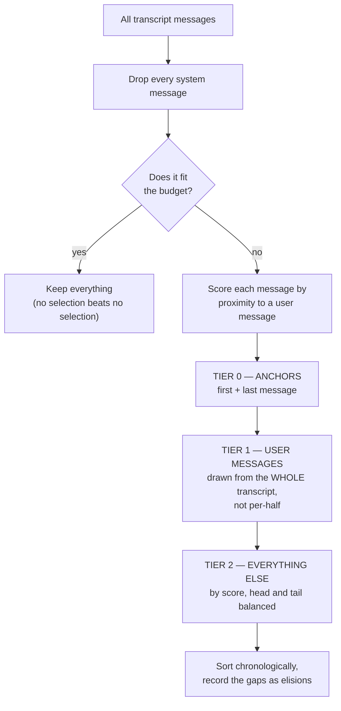

# Session Regeneration — Mechanism, Distillation Algorithm, and Validation

Status: current as of 2026-07-26 · Supersedes nothing; **complements**
[`session-regen-and-footprint.md`](./session-regen-and-footprint.md), which
remains authoritative for epoch identity, storage layout, retention, CMS
migrations, and rollback. This document covers what that one predates: the
**transcript selection (distillation) algorithm**, the **chunked archive**, and
the **validation strategy** that keeps both honest.

Related: [`regen-distiller-observability.md`](./regen-distiller-observability.md).

---

## 1. What regeneration is, and why compaction is not enough

A long-running PilotSwarm session accumulates a Copilot conversation that grows
without bound. Two different mechanisms shrink it, and conflating them is the
most common source of confusion:

| | **Compaction** | **Regeneration** |
|---|---|---|
| Owner | The Copilot SDK | PilotSwarm |
| Scope | The live context window | The whole session |
| Input | What is currently in the window | The durable CMS transcript |
| Direction | Forward-only, lossy, irreversible | Re-reads history from the source of truth |
| Failure mode | Thrashes when non-evictable overhead is large | Explicit, observable, retryable |
| Result | A smaller window | A **new epoch** with a fresh Copilot session |

Compaction cannot recover what has already scrolled out of the window, because
it only ever sees the window. Regeneration re-reads `session_events` from
Postgres, so it can reach back to the first message of the session no matter how
many compactions have happened since.

The practical trigger is that compaction stops being able to help. On the
motivating production session, the window held roughly **67,400 tokens of
non-evictable overhead** (~42.5k system prompt + ~24.9k tool definitions) inside
a 200k window. Compaction was firing constantly and reclaiming ~59–73k tokens
each time, but the floor never moved, so it thrashed at ~37% utilization. No
amount of compaction fixes a floor. Regeneration does: the new epoch starts from
a distilled package rather than a compacted history.

### Epoch rebirth in one paragraph

Regeneration mints a new **epoch** for the same logical session. Session id,
owner, groups, shares, facts, artifacts, and the child roster all survive; the
underlying Copilot session is replaced. The new epoch is seeded with a
**bootstrap** rendered from a `ResumePackage` — a structured summary of what the
agent was doing, what it was told, and where it stands. Storage keys are
epoch-scoped, with epoch 0 being the legacy layout (see the companion doc, §6).

---

## 2. Pipeline

Stages recorded on `state.regen.stage`, each a durable activity:

```
requested ──► archived ──► distilling ──► distilled ──► epoch committed
    │             │             │              │
    └─────────────┴─────────────┴──────────────┴──► session.regenerate_failed
                                                     {attemptId, stage, error}
```

1. **`requested`** — the attempt is recorded with an `attemptId`. Requester may
   supply a `handoff`, free-text `instructions`, and distiller model settings.
2. **`archived`** — `runRegenArchive` scans the transcript, selects a subset,
   and writes it as one or more artifacts. Returns `archiveArtifactId` (first
   chunk), `archiveChunkIds`, `selectionStrategy`, `selectionStats`,
   `elidedCount`.
3. **`distilling` / `distilled`** — either the deterministic packager or an
   LLM distiller service session produces a `ResumePackage`, persisted as
   `package-e<E>-<attemptId>.json`.
4. **committed** — the epoch flips and the reborn session starts from the
   rendered bootstrap.

Every stage is **idempotent on retry**: archive chunks short-circuit per chunk
via `artifactExists`, and `runRegenDistill` re-renders from a stored package
rather than re-distilling. This matters because these run as durable
activities — a retry must not double-write or produce a different result.

### Failure is loud

A failure at any stage records `session.regenerate_failed` carrying the
**stage** and the **error**, which the UI surfaces inline in the chat history
(red, stage-labelled, error clipped to 120 chars). Before this, a failed regen
looked to the user like nothing happened at all — which is exactly how the
`ARTIFACT_TOO_LARGE` bug below survived in production unnoticed.

---

## 3. The archive

### 3.1 Scan wide, select narrow

```
ARCHIVE_SCAN_LIMIT   = 10_000   // how many transcript events we READ
ARCHIVE_EVENT_LIMIT  =  1_000   // how many we KEEP (the selection budget)
```

The old behavior was a tail cap: keep the most recent N messages. On a long
session that means the mission statement and every standing instruction have
already scrolled out of the archive before the distiller ever sees it. So we
scan a wide window and let the selection strategy decide what survives.

### 3.2 Chunking (the bug that started this work)

`TEXT_ARTIFACT_MAX_BYTES` is **1 MiB** and is not configurable. A real archive
on the `waldemort chk` environment was **1.8 MB**, so the upload threw
`ARTIFACT_TOO_LARGE` and aborted regeneration at the `requested` stage — before
the distiller, and before the deterministic fallback *that does not need the
archive at all*. The user saw silence.

Archives are now written as chunks:

```
ARCHIVE_CHUNK_MAX_BYTES = floor(TEXT_ARTIFACT_MAX_BYTES * 0.9)   // 943 718

chunkArchiveLines(lines, maxBytes):
    accumulate lines while (bytes + len(line) + 1) <= maxBytes
    split ONLY on line boundaries — never mid-record
    a single line larger than maxBytes becomes its own chunk
      (the store then rejects it loudly rather than us truncating silently)
    if no lines at all, emit ONE EMPTY CHUNK
```

Naming: a single-chunk archive keeps the un-suffixed name
`transcript-e<E>-<attemptId>.jsonl`, so pre-chunking consumers are unaffected.
Multi-chunk archives use `transcript-e<E>-<attemptId>.partNNN.jsonl`, and
`archiveArtifactId` remains the first chunk.

The empty-chunk rule is not cosmetic: with zero chunks, `runRegenArchive`
returned an `archiveArtifactId` naming an artifact it had never uploaded, and
the distiller's first read 404'd.

### 3.3 Record shape

Each archived line is:

```json
{"seq": 1, "type": "user.message", "at": "…", "data": { … }}
```

Note **`type`**, not `eventType` — `eventType` is the CMS row shape. The
distiller's `read_transcript_page` reads `evt.type ?? evt.eventType` (the
fallback keeps older archives readable). Getting this wrong is silent and
severe: reading only `eventType` classified **every** archived message as
`system`, erasing the entire user/assistant structure the selection algorithm
exists to preserve. See §6.3 for why the test suite did not catch it.

---

## 4. The distillation algorithm

Implemented in `packages/sdk/src/transcript-selection.ts`. The module is
**pure and dependency-free**: no CMS, no artifact store, no clock, no
randomness. That is a hard requirement, not a style preference — it runs inside
a durable activity, where a retry must reproduce a byte-identical result. It
also makes the algorithm testable in isolation, which is what §6 relies on.

### 4.1 Salience, defined structurally

A long agent transcript is mostly assistant self-talk: cron re-arms, "no new
signal" cycle reports, tool churn. What carries intent are the **exchanges** —
a user says something, the agent responds, possibly over several turns.

So salience is *distance to the nearest user message*, not a keyword list.
No model call, nothing to tune per deployment, and it degrades sensibly on
transcripts with few user messages (it simply keeps more context per exchange).

```
scoreByExchangeProximity(messages, window = 6) -> number[]

  sinceUser[i] = distance back to the nearest user message at or before i
  untilUser[i] = distance forward to the nearest user message at or after i

  for each i:
    if role(i) == "user":
        score = +Infinity                       // never dropped while budget remains
    else:
        after  = sinceUser[i] <= window ? 1 - (sinceUser[i] - 1)/(window+1) : 0
        before = untilUser[i] <= window ? (1 - (untilUser[i] - 1)/(window+1)) * 0.5 : 0
        score  = max(after, before, 0)
```

Plotted around a single user message, with the default window of 6:

```
        offset  score
  asst      -8   0.00
  asst      -7   0.00
  asst      -6   0.14   ███
  asst      -5   0.21   ████
  asst      -4   0.29   ██████
  asst      -3   0.36   ███████
  asst      -2   0.43   █████████
  asst      -1   0.50   ██████████          <- lead-ins peak at 0.5
  USER       0    INF   ████████████████████
  asst      +1   1.00   ████████████████████ <- the reply peaks at 1.0
  asst      +2   0.86   █████████████████
  asst      +3   0.71   ██████████████
  asst      +4   0.57   ███████████
  asst      +5   0.43   █████████
  asst      +6   0.29   ██████
  asst      +7   0.00
  asst      +8   0.00
```

The curve is **deliberately asymmetric**. Replies outrank lead-ins at equal
distance (the `* 0.5`): the answer to a question is the substance, whereas the
turns *preceding* a question are usually the routine the user interrupted.
Outside the window a message scores 0 — it is unattached to any exchange, and
that is what gets dropped first.

### 4.2 Selection — tiered global reservation

#### The one idea

There are **two independent questions**, and the whole design is about
answering them *in the right order*:

1. **Who matters most?** A user's question outranks the reply to it, which
   outranks background chatter.
2. **Am I covering the whole conversation?** Not only the opening, not only
   the last few minutes.

**Tiers answer the first question. Halves answer the second.** The original
algorithm answered the second one first, and that was the bug.

Picture seating a theatre with 1000 seats and 5000 people queued outside.

- **Old way** — split the theatre into a left room and a right room, 500 seats
  each, and let each room pick its own guests. If the VIPs happen to be queued
  on the left, the left room starts turning VIPs away at seat 501 — while the
  right room seats walk-ins, because walk-ins are all *it* has. The two rooms
  never compare guests against each other.
- **New way** — seat every VIP first, drawing from the whole queue at once.
  *Then* fill the seats that remain, keeping both rooms represented.

That is the entire change. Everything below is bookkeeping.



Each tier spends from what the previous tier left. Coverage (the head/tail
split) is applied *within* a tier, never across tiers — which is precisely why
a user message can no longer lose a seat to filler.

#### What a selection actually looks like

A realistic watch session: 136 eligible messages, 6 user turns, budget 30.
`#` = kept, `.` = dropped, `^` = a user message.

```
strategy | #####..........................######...........................####
naive    | ....................................................................
users    | ^                               ^                                ^

strategy | ##...........................######..........................#######
naive    | ......................................##############################
users    |                               ^                                ^  ^

users kept ->  strategy 6/6      naive tail cap 2/6
```

Two things to read out of that picture:

- The strategy's output **clusters around every `^`** and at both ends. The
  long `....` runs are the cron chatter between exchanges — exactly what should
  go first.
- The naive tail cap (the behavior this replaced) is one solid block at the
  end. It keeps 2 of 6 user turns and **loses the mission entirely**, because
  the opening scrolled out long ago.

#### Worked example, step by step

20 messages, budget 8. `U` = user, `A` = assistant.

```
m1  m2  m3  m4  m5  m6  m7  m8  m9  m10 | m11 m12 m13 m14 m15 m16 m17 m18 m19 m20
U   A   A   A   U   A   A   A   A   A   | A   A   A   A   A   U   A   A   A   A
└──────────────── head half ────────────┘ └──────────────── tail half ──────────┘
```

**Step 3 — score.** Users are `INF`; everyone else scores by closeness to a
user message:

```
m1=INF   m2=1.00  m3=0.86  m4=0.71  m5=INF   m6=1.00  m7=0.86  m8=0.71  m9=0.57  m10=0.43
m11=0.29 m12=0.29 m13=0.36 m14=0.43 m15=0.50 m16=INF  m17=1.00 m18=0.86 m19=0.71 m20=0.57
```

`m2 = 1.00` because it directly answers `m1`. `m11 = 0.29` because it is
stranded halfway between two exchanges. That is the whole scoring idea.

**Step 4 — Tier 0 (anchors).** Reserve `m1` and `m20`. The opening states the
job; the closing states where it stands. Neither is recoverable from anything
else in the transcript.
→ *2 seats used, 6 left.*

**Step 5 — Tier 1 (users).** Remaining users are `m5` and `m16`. Both fit in 6
seats, so both are seated — **regardless of which half they sit in**. This is
the fix: they are drawn from the whole transcript at once rather than from a
per-half allowance.
→ *4 seats used, 4 left.*

**Step 6 — Tier 2 (everything else).** Now the last 4 seats split for coverage,
2 per half:

| half | candidates, best first | takes |
|---|---|---|
| head | `m2`(1.00) `m6`(1.00) `m3`(0.86) `m7`(0.86) … | **m2, m6** |
| tail | `m17`(1.00) `m18`(0.86) `m19`(0.71) `m15`(0.50) … | **m17, m18** |

**Result** (actual output):

```
KEPT:  m1(U) m2(A) m5(U) m6(A) m16(U) m17(A) m18(A) m20(A)
GAPS:  after m2  -> m3-m4    (2 dropped)
       after m6  -> m7-m15   (9 dropped)
       after m18 -> m19      (1 dropped)
```

Read it back: **every question, every direct answer, and the final state.** The
12 dropped messages are precisely the drift between exchanges.

#### Order is preserved

The intermediate steps genuinely scramble the order, so this is worth being
explicit about.

- `takeTopScored` sorts by **score**, so mid-selection the indices are in
  importance order, not time order.
- The tiers insert into a `Set` in **tier** order. For the example above that
  is `{m1, m20, m5, m16, m2, m6, m17, m18}` — nowhere near chronological.

Order is restored at three points, the last of which is authoritative because
it is the only place all three tiers meet:

```ts
return ordered.slice(0, count).sort((a, b) => a - b);   // takeTopScored, per pick
return headPick.concat(tailPick);                       // fillHalves: head < mid <= tail
return finish([...kept].sort((a, b) => a - b));         // select(): across all tiers
```

Since Step 1 sorted the input by `seq` before anything else ran, index order
**is** original transcript order. With unique seqs the output is strictly
increasing; with colliding seqs it is non-decreasing, ties falling back to
array position per the contract on `SelectableMessage.seq` (CMS seq is a
monotonic per-session counter, so collisions cannot occur in production).

**Relative order, not adjacency.** `m2` and `m5` are neighbours in the output
but had `m3, m4` between them. That is what `elisions` are for: without an
explicit record of each gap, a distiller reading the compressed sequence would
infer that the user's second question immediately followed the first reply.

#### Reference: the algorithm

```
select(messages, {budget = 1000, headFraction = 0.5, exchangeWindow = 6}):

  STEP 1 — NORMALIZE
      sort by seq; drop role == "system" entirely
      eligible = the survivors;  mid = floor(len(eligible) / 2)

  STEP 2 — EARLY EXIT
      if len(eligible) <= budget: return everything

  STEP 3 — SCORE
      scores = scoreByExchangeProximity(eligible, exchangeWindow)

  STEP 4 — TIER 0: ANCHORS
      reserve index 0 and index len-1

  STEP 5 — TIER 1: USER MESSAGES
      pool = every unreserved user message
      fillHalves(pool, budget - reserved, headFraction, mid)

  STEP 6 — TIER 2: EVERYTHING ELSE
      pool = all remaining unreserved messages
      fillHalves(pool, budget - reserved, headFraction, mid)

  STEP 7 — EMIT
      selected = reserved indices, sorted chronologically
      elisions = every gap between kept messages
```

`fillHalves` — *"spend N seats on this group, keeping both ends represented."*
Called once per tier; the group changes, the both-ends rule does not.

```
fillHalves(pool, scores, budget, headFraction, mid):
    head = pool ∩ [0, mid)          tail = pool ∩ [mid, len)
    headBudget = min(budget, round(budget * headFraction))
    tailBudget = budget - headBudget

    headPick = takeTopScored(head, headBudget, prefer = "earliest")
    tailPick = takeTopScored(tail, tailBudget, prefer = "latest")

    // SLACK: one redistribution pass. A pool too small to spend its share
    // hands the remainder to the other side rather than under-filling.
    if headSlack > 0 and tail has more candidates: refill tail with tailBudget + headSlack
    elif tailSlack > 0 and head has more candidates: refill head with headBudget + tailSlack
```

`takeTopScored` — the `prefer` argument is a tie-break **direction**. In the
head half ties go to the earlier message, in the tail half to the later one, so
each half hugs its own outer edge. Without it, "first 500 / last 500" would
quietly become "1000 from the muddle in between."

```
takeTopScored(pool, scores, count, prefer):
    if len(pool) <= count: return pool
    sort by score DESCENDING, ties by position (earliest in head, latest in tail)
    return the first `count`, restored to chronological order
```

#### Why slack is load-bearing now

In the original positional design, slack was effectively **dead code**. Pools
were whole halves, so `headPool.length == floor(n/2)`, and the branch required
`floor(n/2) < round(budget × headFraction)` while `n > budget` — contradictory
at the default `headFraction = 0.5`, and production never sets `headFraction`.
Exhaustive enumeration over eligible 2…3000 × nine budgets found **zero**
reachable cases.

Under tiering, pools are the *unreserved remainder*, which can be empty. On the
600-user/600-filler case slack fires **twice, in opposite directions**:

```
[tier 1] budget=998  headPool=599  tailPool=0    → tail's 499 slots flow to head; head takes all 599
[tier 2] budget=399  headPool=0    tailPool=599  → head's 200 slots flow to tail; tail takes 399
RESULT: userKept 600/600, total 1000
```

Without redistribution, tier 1 stops at its 499-slot share (+1 anchor = **500 of
600 users**) — precisely the old bug's number, for the same reason. Slack is
what turns "each half spends its own budget" into "the budget follows where the
content actually is."

#### The comparator (a cautionary note)

`takeTopScored` originally compared scores by **subtraction**. Because user
messages score `+Infinity`, `Infinity - Infinity` is `NaN`; a `NaN` comparator
result is coerced to "equal"; and V8's stable sort then preserved ascending
order. So `prefer: "latest"` silently degraded to `"earliest"`, and on any
user-dense transcript **the newest messages were dropped** — the exact opposite
of the intent, and the single thing a resumed session most needs.

It is now written as two one-sided comparisons so that a `NaN` score
(unreachable today, one refactor away) falls through to the positional
tie-break rather than making the comparator non-antisymmetric:

```ts
if (scores[a] > scores[b]) return -1;
if (scores[b] > scores[a]) return 1;
return prefer === "earliest" ? a - b : b - a;
```

### 4.3 Invariants

These are the properties the tests exist to defend:

1. **Exact budget fill** — `selectedCount == min(budget, eligible)`.
2. **Chronological output** — strictly increasing seq (non-decreasing if seqs
   collide).
3. **Anchors** — the first and last eligible messages are always kept.
4. **User retention** — no user message is dropped while budget remains.
5. **No system messages** — dropped up front, never counted against budget.
6. **Full accounting** — `selectedCount + Σ elision.count == eligible`.
7. **Determinism** — same input, same output; input order is irrelevant for
   unique seqs.
8. **Elisions well-formed** — disjoint, increasing, `afterSeq` names a kept
   message, and no seq is both kept and elided.

Note on (7): duplicate seqs are deliberately order-*dependent* — the contract on
`SelectableMessage.seq` says ties break on array position, and CMS seq is a
monotonic per-session counter so duplicates cannot arise in production.

### 4.4 Pluggability

Strategies register in a map and resolve by name, with `exchange-clustered` as
the default and the fallback for unknown names:

```ts
registerSelectionStrategy(strategy)
resolveSelectionStrategy(name?)   // unknown → default, never throws
listSelectionStrategies()
selectTranscript(messages, { strategy?, budget?, headFraction?, exchangeWindow? })
```

`runRegenArchive` passes `input.selectionStrategy` through, so an alternative
can be swapped in without touching the archive path. Uniform, hierarchical, and
tail-only strategies were prototyped and **deliberately removed** — stratified
salience subsumed them and three unused strategies is three untested code paths.

---

## 5. Distillation paths

### 5.1 Deterministic (default)

`deterministicPackage(closure)` builds a `ResumePackage` from
`assembleRegenClosure` — which reads **CMS, not the archive**:

- `mission` ← first user message (clipped to 1000 chars)
- `recentTail` ← verbatim transcript tail
- `childRoster` ← live roster
- `artifactsMap` ← artifact names
- `currentState` ← a fixed "re-anchor via `read_facts`" instruction

Fast, dependency-free, always usable. **It does not need the archive at all** —
which is why the `ARTIFACT_TOO_LARGE` failure was so bad: an optional input's
failure blocked a path that never consumes it.

### 5.2 LLM distiller (opt-in)

Gated by `PILOTSWARM_REGEN_LLM_DISTILLER=1`. Spawns a **regen-distiller service
session** — a visible, read-only, sweeper-reclaimed session class — which
map-reduces the archive into a `ResumePackage` using the `read_transcript_page`
tool. Multi-chunk archives are listed in the seed prompt in order.

Any failure, or a breach of the overall deadline, **falls back deterministically
rather than blocking the flip**. `PILOTSWARM_REGEN_DETERMINISTIC_ONLY=1`
(checked in `session-proxy.ts`) forces the deterministic path fleet-wide.

Untrusted content (transcript tail, requester handoff/instructions) is wrapped
in fences whose delimiter carries an **unguessable per-call nonce**. A literal
`==== END ====` delimiter is forgeable — crafted transcript content could close
the fence and inject text positioned to read as trusted.

### 5.3 Distiller model controls

The distiller runs on deployment machinery config rather than the served
session's model, so the regenerate dialog exposes explicit pickers for
**model**, **reasoning effort**, and **context tier**; empty means "deployment
default". Effort and tier lists follow the *selected* model, so an unsupported
combination cannot be submitted. Values are validated server-side
(`normalizeDistillerEffort` / `normalizeDistillerTier`) because they arrive as
raw strings on an HTTP body.

The context tier matters more than it looks: the motivating session held **1,825
transcript messages / ~2.85 MB ≈ 700k tokens** against gpt-5.4's 200k window.

### 5.4 ResumePackage

```ts
{ version, mission, standingInstructions[], currentState, workingSet[],
  commitments[], childRoster[], factsMap[], artifactsMap[], workspaceMap[],
  pitfalls[], openQuestions[], recentTail, requesterInstructions? }
```

`normalizePackage` schema-normalizes and throws on junk, so a malformed LLM
response degrades to the deterministic fallback instead of committing a broken
epoch.

---

## 6. Validation

The algorithm's claim — "a resumed agent can continue from this subset" — is
partly structural and partly semantic. The strategy uses different tools for
each, and a third layer to check that the tools themselves work.

### 6.1 Structural tests (deterministic, no network)

`packages/sdk/test/local/transcript-selection.test.js`, 30 cases. Each invariant
in §4.3 has a test. The ones worth calling out:

| Test | Defends |
|---|---|
| `keeps the newest messages when users exceed the budget` | The NaN-comparator bug. 400 alternating messages, budget 40, asserts `last === 400` **exactly**. |
| `keeps user messages that sit in the crowded half` | The tiering fix. 600 users + 600 filler at budget 1000 → `userKept === 600`. |
| `splits the budget by headFraction and redistributes slack` | The slack branch, with a fixture that actually reaches it (110 messages vs a 90-slot head budget). |
| `beats a naive tail cap on the property that matters` | An **anti-baseline**: the naive tail loses the mission; the strategy keeps it and strictly more user turns. |
| `reports elisions that are disjoint, increasing, and correctly anchored` | Elision well-formedness. |
| `handles degenerate inputs without throwing` | Empty, all-system, `budget: 0`, `budget: 1`. |

Plus a **500-transcript property fuzz** (`holds every invariant across 500
randomized transcripts`) over random length, role mix, and budget — asserting
budget fill, chronology, anchors, no-system, user retention, full accounting,
and order-independence. The PRNG is **seeded**: `Math.random()` would make a
failure unreproducible, and an unreproducible CI failure is a flake nobody can
act on.

### 6.2 The LLM judge, and proving it can fail

Unit assertions can prove structure. They cannot answer *could an agent actually
resume from this?* So one test renders the full transcript and the selected
subset and asks a model:

> would it still know (a) its mission, (b) the instructions the user gave it,
> and (c) the current state of the work?

The prompt **forbids inference** — a judge allowed to reason "this is clearly an
incident watch, so the mission survives" would pass a subset that dropped the
mission outright.

A judge that answers `true` to everything would pass that test while detecting
nothing. So there is a **mutation suite** that breaks the selection in specific
ways and requires the *same* judge — same helper, same prompt, same model — to
reject each one:

| Mutant | Breaks | Required verdict |
|---|---|---|
| **M1 head-only** | keeps the oldest N; the ending is gone | `currentState: false` |
| **M2 tail-only** | a naive tail cap; the mission scrolls out | `mission: false` |
| **M3 salience flip** | comparator sign inverted → keeps only filler | `mission` or `instructions` false |

The shared `judgeResumability()` helper is the point of the design: if the
negative cases used a different prompt or model from the positive one, their
passing would say nothing about the judge that actually grades the algorithm.

**Honest limitation:** on the standard fixture, the pre- and post-fix selectors
produce byte-identical output at every budget, so the judge suite was *blind* to
the NaN-comparator bug. The deterministic test in §6.1 is what pins that bug —
not the judge. The mutation suite validates the judge; it does not substitute
for structural tests.

### 6.3 Testing the tests

Two rules, both learned the hard way here:

**A test must be shown to fail.** Every regression test above was verified by
reverting its fix and confirming the failure:

```
revert comparator  → × keeps the newest messages when users exceed the budget
revert empty chunk → × always yields at least one chunk for an empty transcript
revert type/eventType → × 2 tests in distiller-tools-gate
```

Before the fixture correction, that last one failed **zero** tests.

**A test must not re-implement its subject.** Three tests in this suite were
found to be tautological and rewritten:

- an archive round-trip test that re-implemented `roleOf()` inline instead of
  importing the real handler — it could not fail if `distiller-tools.ts`
  regressed. Now drives the actual `createDistillerTools` handler.
- a determinism test that called `selectTranscript(x)` twice on the **same**
  array and asserted equality — `f(x) === f(x)` on a documented pure function.
- the pre-existing unit fixture that used `{"eventType": …}`, a shape the
  archive **never** produces. That fixture is *why* the role bug shipped: the
  assertion passed against a reader that mis-classified every real message.

### 6.4 End-to-end

`runRegenArchive` against a real `FilesystemArtifactStore`:

- **empty transcript** → exactly one chunk, artifact present on the store,
  downloads as zero bytes. This is the step no unit test can reach: whether the
  store *accepts* a zero-byte upload. It does; if it did not, the empty-chunk
  fix would be worse than the bug it replaced.
- **normal transcript** → line count matches `selectionStats.selectedCount`,
  records carry `type`, system events are excluded, strategy is reported.

Chunk-name readability (`transcript-e3-a1.part001.jsonl` passing the archive
name gate) is asserted in the unit suite — it is load-bearing for every
multi-chunk regen.

### 6.5 Suite inventory

| Suite | Command | Count |
|---|---|---|
| Selection + archive + judge | `npm run test:local:selection` (sdk) | 31 |
| SDK unit (incl. distiller gate) | `npm run test:unit` (sdk) | 83 |
| UI core | `npm run test:ui` (app) | 110 |
| Repo integration | `npm test` | 13 (+5 skipped) |

Note that `test/unit` imports from `dist/`, so a source fix requires
`npm run build` before the unit suite reflects it.

---

## 7. Footprint — reporting compaction honestly

The footprint sensor previously derived failed compactions as
`unmatchedStarts`, which counted the trailing in-flight start and reported
outcomes it could not actually know. On the motivating session this produced
"57 failed compactions" from 67 starts / 4 completes — while
`conversationTokens` demonstrably dropped 59–73k between starts, i.e. the
compactions were *working*.

It now reports:

```ts
const stuck = trailingStartIsStuck ? 1 : 0;
const unknownCompactions = Math.max(0, unmatchedStarts - 1);
```

`unknownCompactions` is a distinct field from failures. An unmatched start means
we did not observe the completion — not that it failed. Reporting unknown as
failure turned a metric artifact into a false alarm and sent an investigation in
the wrong direction.

---

## 8. Known limits and open questions

1. **Slack is one pass per `fillHalves` call**, not one overall. Leftover budget
   does carry forward via `budget - kept.size` into the next tier, and the fuzz
   shows exact budget fill across 500 transcripts — but sufficiency in general
   is evidenced, not proven.
2. **The judge is single-vote.** No adversarial panel, no majority. Adequate for
   a regression gate; not adequate to *rank* competing strategies.
3. **`headFraction` is never set in production.** The realistic slack trigger is
   the tier structure, not a skewed fraction. The `headFraction` test therefore
   exercises the branch by a route production does not take.
4. **`ARCHIVE_SCAN_LIMIT = 10_000` is a hard ceiling.** A session with more than
   10k transcript events silently loses its oldest history before selection ever
   runs. The anchor guarantee is relative to the *scanned* window, not the
   session.
5. **Salience is structural, not semantic.** A long unattended stretch
   containing something important but never discussed by the user scores as
   filler. This is the deliberate trade for having no model call and no tuning.
6. **`TEXT_ARTIFACT_MAX_BYTES` is hardcoded.** Chunking works around it; making
   it configurable (as the binary cap already is) would be cleaner.

---

## 9. Change log — defects this work found and fixed

| Severity | Defect | Fix |
|---|---|---|
| Critical | `Infinity - Infinity = NaN` in the score comparator dropped the newest messages on any user-dense transcript | Two one-sided comparisons; exact-value regression test |
| Critical | Head/tail split by position let zero-score filler beat `+Infinity` user messages, dropping 100 of 600 users at production budget | Tiered global reservation (anchors → users → salience) |
| Critical | `ARTIFACT_TOO_LARGE` at 1.8 MB aborted regen at `requested`, blocking a deterministic path that needs no archive | Chunked archives under a 0.9 × 1 MiB cap |
| High | Distiller read `eventType`; archive writes `type` → every message classified `system` | `evt.type ?? evt.eventType`; unit fixture corrected to the real shape |
| High | Empty transcript returned an `archiveArtifactId` for an artifact never uploaded | Always emit at least one chunk; end-to-end test against a real store |
| Medium | Regen failures were silent in the UI | `session.regenerate_failed` surfaced inline with stage + error |
| Medium | Unmatched compaction starts reported as failures | Separate `unknownCompactions` field |
| Medium | `DistillerModelPickers` declared inside `ModalLayer` → remounted every render, losing focus | Hoisted to module scope |
| Low | `headSelected`/`tailSelected` reported a split that had not happened on the fits-entirely path | Counted by position on all paths |
| Low | Three tautological tests | Rewritten to drive real code and assert independent properties |
