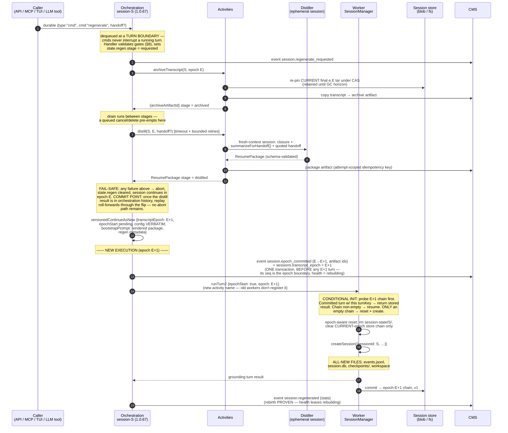

# Session Regeneration and Footprint — Epoch Rebirth

Written against orchestration **1.0.66** (2026-07-23); ships as **1.0.67**.
Supersedes [session-transcript-continue-as-new.md](session-transcript-continue-as-new.md)
(written against 1.0.59). Session forking is deliberately out of scope: it
will use a different strategy and get its own proposal.

## 1. Problem

A long-lived session degrades on two axes at once:

1. **Transcript**: the Copilot SDK's infinite-sessions auto-compaction
   summarizes summaries. After days of turns the LLM's working memory is a
   lossy compression of lossy compressions — the 2026-07-07 watcher incident
   (issue #54) hit ≥13 in-place compactions over 4.6 days, squashed 277
   messages / 106.6k tokens, confabulated wrong bug reports, and burned ~4M
   tokens/day on compaction churn.
2. **File state**: `session.db`, `events.jsonl`, checkpoints, and workspace
   files grow monotonically. Real watcher sessions tar at 23.6MB compressed /
   ~96MB raw and climb; every dehydrate/hydrate pays that cost.

**Regeneration** fixes both in one move: the session keeps its identity —
sessionId, orchestration, children, cron, pending queue, facts, artifacts,
chat history — while the underlying Copilot session is **discarded and
recreated from scratch**. Every SDK file is brand new: a new `events.jsonl`,
a new `session.db`, a new `checkpoints/` dir, a new workspace. The new
transcript starts from a **ResumePackage** distilled from the old epoch by a
fresh-context Distiller, not from the degraded in-window summary.

Regeneration is callable from the API, TUI, portal, MCP — and **by the
session's own LLM as a tool**, which in turn requires that both the LLM and
the operator can measure how degraded the session is. That sensor is the
**footprint** surface (§11).

## 2. Identity model — what stays, what is replaced

One PilotSwarm session is three names that are really one string plus a
prefix:

```
                    STABLE IDENTITY — survives regeneration unchanged
 ┌───────────────────────────────────────────────────────────────────────┐
 │  PilotSwarm sessionId        S            (e.g. "b7e2f9c4…")          │
 │  Copilot SDK session id      S            same string — we pass       │
 │                                           sessionId into              │
 │                                           createSession()             │
 │                                           (session-manager.ts:1143)   │
 │  duroxide orchestration id   session-S    (client.ts:320)             │
 │  orchestration name          durable-session-v2, versioned CAN chain  │
 │  CMS                         sessions.session_id = S                  │
 │                              session_events.session_id = S           │
 │  children                    subAgents roster in orch state;          │
 │                              child rows point at parentSessionId = S  │
 │  cron / pending queue        orchestration-side, keyed by session-S   │
 │  facts                       session_id-keyed rows (lineage grants)   │
 │  artifacts / shares / groups CMS + blob store, keyed by S / root      │
 └───────────────────────────────────────────────────────────────────────┘
                                    │ 1 : 1
                                    ▼
              EPOCH-SCOPED STATE — discarded and recreated at each flip
 ┌───────────────────────────────────────────────────────────────────────┐
 │  SDK session dir     $COPILOT_HOME/session-state/S/    (rm + recreate)│
 │  transcript          events.jsonl, session.db          (brand new)    │
 │  workspace           workspace files, workspace.yaml   (brand new)    │
 │  checkpoints         checkpoints/                      (brand new)    │
 │  snapshot tars       epoch-scoped chains in the store  (new chain)    │
 └───────────────────────────────────────────────────────────────────────┘
```

The correlation is by construction: the worker exports `COPILOT_HOME`
(session-manager.ts:493) so the CLI keeps all state under
`sessionStateDir/`, and passes our `sessionId` into every
`createSession`/`resumeSession` call, so **the SDK's on-disk directory name
IS the PilotSwarm sessionId**. The orchestration id `session-${S}` never
changes — continue-as-new re-executes the same instance id with fresh
history, which is also how `set_model` works today.

A new orchestration-state counter, **`transcriptEpoch`** (starts at 0),
names which incarnation of the SDK session is live. Epoch is stamped into
snapshot keys, the local snapshot marker, CMS, and lifecycle events; it is
the only new identity concept this proposal introduces.

## 3. What a Copilot session physically is

```
$COPILOT_HOME/session-state/S/
├── events.jsonl              SDK transcript event log        ← REPLACED at flip
├── session.db (+ -wal/-shm)  SDK sqlite state                ← REPLACED
├── checkpoints/              SDK checkpoints                 ← REPLACED
├── files/, research/         SDK-managed dirs                ← REPLACED
├── <workspace files>         files the agent created/edited  ← REPLACED (default)
├── workspace.yaml            workspace manifest (required)   ← REPLACED
├── .ps-turn-commit.json      committed turn {turnKey,result} ← starts fresh
├── .ps-snapshot-version      protocol marker (excluded from tars)
├── .ps-turn-inprogress       mid-turn sentinel (excluded from tars)
└── inuse.<pid>.lock          SDK liveness lock (excluded from tars)
```

The session store tars exactly this directory (`archiveSessionDir`,
session-store.ts:379, brotli q4). **Everything in it is epoch-scoped.**
Nothing configuration-shaped lives here: the session config (model,
reasoningEffort, contextTier, tools, prompt layers, MCP servers, working
directory) is rebuilt **every turn** from the compact `state.config` carried
in orchestration state across every continue-as-new
(session-manager.ts:1142-1180). That is the load-bearing fact that makes
regeneration safe: a brand-new SDK session created from the same
`state.config` is configured identically to the old one — only transcript
and files differ.

## 4. The regeneration pipeline



Phase notes:

- **Trigger** — every surface converges on the same durable
  `{type:"cmd", cmd:"regenerate"}` on the session's own `messages` queue,
  exactly like `set_model` (LLM tool → controlBridge → `enqueueEvent`;
  operator surfaces → API op → `sendCommand`). One entry point, one
  behavior, one enforcement site (§8).
- **Quiesce is free**: the queue drain (queue.ts:313-318) only hands
  commands to `handleCommand` between turns; a running turn races only its
  own `stopTurn.<n>` queue (turn.ts:391). Pending user messages behind the
  cmd stay in the durable queue (duroxide FIFO carry-forward), survive the
  flip untouched, and are delivered to the reborn session.
- **The pipeline is a staged state machine, not one blocking handler.**
  `state.regen.stage` walks requested → archived → distilled → flipping,
  and the orchestration returns to the drain **between** stages, where a
  queued `cancel`, `delete`, or the explicit `cancel_regen` pre-empts a
  pending regen instead of sitting behind it. Honest limit: while a stage's
  activity is in flight the drain is not running, so control commands wait
  for that stage to finish — in M1 the distill is **bounded but not
  cancellable mid-activity** (hard timeout, bounded retries, exhaustion
  aborts into the fail-safe), and the session's maximum unresponsiveness
  to control equals one distill timeout. Racing the distill activity
  against the control queue (with defined loser-cancellation) is a later
  refinement if that bound proves too coarse.
- **Fail-safe before the commit point, roll-forward after.** Until the
  distill result is recorded in orchestration history, any failure emits
  `session.regenerate_failed`, clears `state.regen` (so a later attempt is
  not refused as pending), and leaves the session running in epoch E —
  nothing has changed. After that point the remaining steps are
  deterministic replay: the CAN and the epoch-E+1 bootstrap are
  inevitable. The flip and the rebirth are however **two separately
  observable facts** (§7): `session.epoch_committed` records the flip (its
  seq is the epoch boundary, before any E+1 event), and
  `session.regenerated` records the *proven* rebirth, only after the first
  E+1 snapshot commit — a permanently failing grounding turn leaves the
  session visibly `rebuilding`/blocked, never falsely healthy.
- **Flip = continue-as-new.** `versionedContinueAsNew` with
  `transcriptEpoch: E+1` and `state.config` carried **verbatim** — no
  re-derivation from the agent definition (`contextTier` and
  `reasoningEffort` live in runtime state and have real drop-bug history;
  prompt layers are already re-resolved from the bound agent every turn, so
  agent-def updates arrive for free while mid-session model/effort/tier
  switches are preserved). The full carry/reset disposition is the table in
  §5. Every CAN also migrates the chain to the latest orchestration
  version.
- **Rebirth is a conditional initialization, not an unconditional reset.**
  The first E+1 turn is dispatched as `runTurn2` with `epochStart: true`,
  and the worker's FIRST act is the standard already-committed probe
  against the **E+1** chain: a committed snapshot with this turn's
  turnKey → hydrate and return the stored result (the grounding turn
  already ran — an activity retry after a post-commit crash must NOT
  repeat it); any other committed E+1 snapshot → resume normally (the
  epoch is already initialized). **Only when the E+1 chain is empty** does
  the worker run the epoch-aware reset (rm the local dir, clear the
  current-epoch store chain only — never prior epochs) followed by
  `createSession({sessionId: S, …})`. This ordering — probe, then reset —
  is what makes the epoch-start turn genuinely idempotent; an
  unconditional reset would erase a committed grounding turn on retry.
  The create branch is where all new Copilot session files come from — no
  file from the old epoch survives into the new directory.
- **Grounding turn**: the `bootstrapPrompt` is the rendered ResumePackage
  plus instructions; the first turn requires a `read_facts` call
  (requiredTool) so the reborn session re-anchors on durable state, and the
  prompt re-presents any pending `input_required` question (§5) and the
  current child roster.

### Deployment gate

Orchestration and worker code ship in one image, but during a rolling
deploy old-image workers coexist with new ones, and an old worker would
ignore an unknown `epochStart` field and resume the old transcript — a
silent no-op of the regen. A flag on the payload is not a gate, and today
there is **no worker-version registry to gate on** — so the gate is built
from three pieces, cheapest-first:

1. **A deployment min-worker-version setting** (two-phase flag): workers
   report their version in a heartbeat-leased registry row (new, small —
   version + lease expiry per worker); the operator raises the
   deployment's `minWorkerVersion` to 1.0.67 **after** the rollout
   completes. The regenerate cmd handler refuses (retryable,
   `fleet_not_ready`) while the flag is below 1.0.67. This also answers
   late joiners: a worker below `minWorkerVersion` is refused registration
   outright, so the invariant survives workers joining *after* a gate
   check — the flag gates membership, not a point-in-time census.
2. The epoch-start turn is a **new activity name** (`runTurn2`) that only
   1.0.67 workers register — the structural backstop if a stale worker
   races the flag.
3. **Spike (pre-freeze)**: verify duroxide's dispatch behavior when the
   affinity-pinned node lacks the activity (re-route vs error/retry); if
   pinning blocks re-routing, `releaseAffinity` before the flip. This
   spike is a blocker for freezing 1.0.67, not a follow-up.

## 5. Epoch mechanics and state carriage

**The turn index is never reset.** Four invariants depend on
`state.iteration` being monotonic for the life of the session: the
per-turn `stopTurn.<n>` durable queue (a stale stop signal must be
structurally unable to kill a later turn — types.ts:1028, turn.ts:361-363),
`session_turn_metrics.turn_index` ordering (non-unique index, plain
inserts, `ORDER BY turn_index DESC` reads), the `active_turn_index` /
`current_iteration` CMS writebacks that `stop_turn` targets
(session-proxy.ts:2349-2372), and child-shutdown cascade command ids that
embed the iteration (agents.ts:553). Snapshot-commit dedup is unaffected
either way — turn keys are per-turn GUIDs (turn.ts:372), never derived
from the index.

Instead, the flip is signaled by two fields threaded through
`buildContinueInput` (lifecycle.ts:409-464) **and** `createInitialState`
(state.ts:224-285) — both, or the fields silently drop on the next CAN:

- `transcriptEpoch: number` — carried forever, default 0.
- `epochStart: boolean` — consumed by exactly the first post-flip turn.

**Epoch is a preamble invariant, not a create-branch special case.** Worker
nodes accumulate stale local session dirs (affinity rotates freely; the
idle eviction sweep runs on a ~35-minute clock, worker.ts:703-722), and the
resume path is local-dir-existence based (session-manager.ts:1237-1240).
So the local `.ps-snapshot-version` marker gains an `epoch` field, and
`runTurnPreamble` (session-lifecycle.ts) checks it on **every** turn:
`marker.epoch !== expectedEpoch` means the dir is a dead epoch — treat as
not-warm and resolve from the epoch-scoped store. This is a degrade, never
a throw: throwing would surface as SESSION_STATE_MISSING and wedge the
session (turn.ts:411-418).

**Flip-mutation table** (normative — what the regenerate CAN does to each
piece of carried state):

| State | At the flip |
|---|---|
| `config` (model, effort, tier, prompt layers…) | **Carry verbatim** |
| `iteration` | **Carry — monotonic, never reset** |
| `transcriptEpoch` | **E+1**; `epochStart` set for exactly the next turn |
| `subAgents`, `parentSessionId`, `nestingLevel` | Carry verbatim |
| `cronSchedule`, `cronAtSchedule`, `activeTimerState` | Carry verbatim (armed timers restore with remaining time, runtime.ts:34-51) |
| `pendingInputQuestion` | Carry; grounding prompt re-presents it (the bootstrap turn otherwise runs first — same behavior set_model has today, queue.ts:612-633) |
| `contextUsage` + compaction counters | **Zero** — they describe the discarded transcript; carrying them would make the footprint read "degraded" the instant the flip completes and re-trigger advisory/policy |
| `sharedPreambleSent` | **Reset false** so the one-shot `[SHARED SESSION]` attribution preamble re-queues into the brand-new transcript (utils.ts:99-103); keep `multiWriter`, `observedSenderKeys`, `ownerDisplay` |
| `bootstrapPrompt` / `prompt` | Set to the rendered ResumePackage + grounding instructions |
| accumulated runtime `systemMessage` appends, `runtimeModelNotice` | Drop |
| `state.regen` | Cleared (exists only during the pipeline; also cleared on fail-safe abort) |
| `snapshotVersion` | Reset — the new epoch is a new store chain |
| queue contents, KV response/command counters, cancellation state | Untouched (duroxide-owned; monotonic counters are what in-flight `send_and_wait` callers poll, so waiters survive the flip) |

The forced continue-as-new triggers (10-iteration cap, 800KB history
checked every 3 loops, idle — runtime.ts:181-224) are orthogonal and
unchanged: they CAN *without* flipping the epoch, carry `transcriptEpoch`
through untouched, inject no bootstrap prompt, and leave a
queued-but-unprocessed regenerate cmd for the next execution's drain.

## 6. Storage

### 6.1 Epoch-scoped keys — epoch 0 IS the legacy layout

| | Epoch 0 (every existing session) | Epoch ≥ 1 |
|---|---|---|
| **Blob store** (blob-store.ts:481-483) | `S.tar.gz` — the current single-blob name, `psver`/`psturnkey`/`pssha`/`pscodec` metadata, ETag CAS, unchanged | `S.e<E>.tar.br` — same CAS contract per chain, new `psepoch` metadata. The `.tar.br` extension (honest anyway — all new writes are brotli) is load-bearing: see the key-shape invariant in §6.2 |
| **Filesystem store** (session-store.ts:344-355) | `S.v<N>.tar.br` + `S.meta.json` (rename = commit point), unchanged | `S.e<E>.v<N>.tar.br`; `meta.json` gains `epoch` |
| **Local marker** `.ps-snapshot-version` | no `epoch` field → reads as 0 | `epoch` field; hydrate refuses cross-epoch tars |

Version numbering restarts at 1 inside each epoch — the CAS contract is
per-chain, and separate chains are precisely the fence that makes a stale
commit against an old epoch harmless to the new one. Zero migration: a
session that never regenerates keeps its exact current storage forever.
(Precedent in the same file: the gzip→brotli codec migration,
session-store.ts:300-305 — legacy readable forever, new scheme on first
use.)

### 6.2 Retention — new work, and two tools must learn the scheme

Nothing in the system retains old snapshots today: the blob backend
overwrites its single blob per commit, the FS backend unlinks the
superseded tar (session-store.ts:722-723), and the sweeper never touches
snapshot storage. Regeneration introduces retention:

- At archive time the old epoch's final tar is pinned as a **copy-aside**
  with an attempt-scoped name — a metadata flag on the live blob would not
  survive an aborted attempt, because the session then resumes committing
  in epoch E and the blob backend overwrites its single blob per commit.
  Because store-wins deliberately tolerates a zombie epoch-E turn
  committing *after* the archive ran (session-lifecycle.ts:296-300), the
  copy is **re-taken under CAS immediately before the flip** so it captures
  the true final version; rollback semantics are documented as "as of the
  flip".
- `delete(S)` becomes epoch-scoped (clears the current-epoch chain only —
  this is what the epoch-start reset calls); a new `deleteAllEpochs(S)`
  backs real session deletion.
- **Key-shape invariant: no epoch-scoped blob name may end in `.tar.gz`
  or `.meta.json`.** This is what protects the retained epochs from an
  OLD resource-manager binary, which fail-closed parsing in new code
  cannot do. Verified against the shipped 1.0.66 implementation
  (resourcemgr-tools.ts:441-449): `purge_orphaned_blobs` collects delete
  candidates only from names ending `.tar.gz` (plus `artifacts/<id>/`),
  and its delete path can only remove `.tar.gz`/`.meta.json` names — so
  `S.e<E>.tar.br` epoch chains, attempt-scoped pinned copies, and any
  future epoch objects are structurally invisible to it. A release-gate
  test runs the actual 1.0.66 purge with `confirm=true` against a store
  containing epoch objects and asserts zero deletions (§15.2). The NEW
  parsers additionally learn the epoch/attempt scheme and become
  **fail-closed** (unparseable keys are reported, never deleted),
  future-proofing later evolution — but the invariant, not the new
  parser, is the actual protection.

### 6.3 Cleanup — one janitor, blended into the resource manager

There is **no inline cleanup in the abort path** — an abort often runs
exactly when infrastructure is unhealthy, so cleanup there would fail too.
Attempt-scoped naming (§9) already makes leftover debris harmless to
correctness; reclaiming the storage is the resource manager's job, through
the same stored-proc-plus-tool pattern its existing purge tools use:

- **New tool `purge_regen_debris`** (resourcemgr-tools.ts, beside
  `purge_orphaned_blobs`): same dry-run/`confirm=true` contract, same
  configurable-horizon-with-enforced-floor shape as `purge_old_events`
  (:500-535). `olderThanMinutes` **defaults to 60** and is floored at the
  regen pipeline's maximum lifetime (distill timeout × retries — the
  pipeline is bounded well under an hour by construction, so the sweep can
  never race a live attempt on age alone).
- **CMS side is a stored proc**, following the `cms_*` convention:
  `cms_list_regen_attempt_debris(horizon)` returns attemptIds that are
  terminally dead — a `session.regenerate_failed` event exists for the
  attempt, or the attempt is older than the horizon with no
  `session.regenerated` event. The tool cross-references that list against
  a blob listing (the `purge_orphaned_blobs` machinery) and deletes the
  attempt's pinned copy, package artifact, and archive artifact. Debris of
  an attempt that produced a `session.regenerated` event is never
  touched — those artifacts belong to a live epoch's audit trail.
- **Retired-epoch retention rides the same tool**: epoch chains and pinned
  finals whose epoch has been superseded (by regeneration or rollback —
  rollback's E+1 leftovers are just another retired epoch) are reclaimed
  past `epochRetentionMinutes` (separate knob — this one IS the rollback
  window, so its default is days, not minutes; exact default is an open
  decision, §17).
- The only debris the resource manager cannot reach is a crashed
  distiller's worker-local temp dir; those live under one dedicated temp
  root with per-invocation homes, and the worker sweeps that root by age
  on its own idle-eviction clock.

The permanent record of a failed attempt is the
`session.regenerate_requested`/`session.regenerate_failed` event pair in
CMS — cheap, never swept by this tool — so the 60-minute debris horizon
costs nothing forensically except the bulky artifacts themselves.

### 6.4 Rollback

Because the sessionId never changes, rollback is a pure same-identity
operation: archive the current epoch E+1 first (its transcript becomes an
archive artifact like any other epoch's), then flip to epoch E+2 seeding
its store chain by copying the pinned e.E final tar as version 1, and
resume. One blob copy, operator-only, `regenerateSession {rollbackTo: E}`,
valid within the retention window.

Rollback is a **restore, not a re-distillation** — no Distiller runs and
nothing from the E+1 ResumePackage is used. This is the one place rollback
differs mechanically from a regen flip: it does not dispatch `runTurn2`
(reset + `createSession` + package bootstrap). Instead the first E+2 turn
is an ordinary turn whose preamble finds a stale or absent local dir
(marker epoch ≠ E+2), hydrates the seeded E+2 chain — untarring epoch E's
literal `events.jsonl`, `session.db`, checkpoints, and workspace files —
and `resumeSession`s them: the SDK wakes with epoch E's exact working
memory. (Same-id is what makes the byte transplant safe: everything inside
the tar is keyed to `S`, which never changed.) The accompanying bootstrap
note briefs the restored session on current reality — the **current**
child roster especially, since the restored transcript predates anything
spawned during E+1, while facts, artifacts, and CMS events from E+1 remain
in the world.

### 6.5 Archives

`archiveTranscript` extracts the old epoch's `events.jsonl` from the final
tar into the artifact store as a pinned artifact `transcript-e<E>.jsonl`
with metadata (`epoch`, `turns`, `compactions`, `finalSnapshotVersion`).
The permanent record of what the session actually said outlives the tar's
GC.

### 6.6 What deliberately does NOT change

**CMS `session_events` is untouched by regeneration.** Regen compacts what
the *LLM carries*, not the user-visible history — the portal/TUI timeline
stays continuous across the flip, with an epoch-divider row rendered from
the `session.epoch_committed` event. `seq` cursors keep working. Consumers
that reconstruct conversation across the boundary (`debug_session`,
`export_execution_history`, agent-tuner reads) gain a since-seq/epoch
filter so they don't splice two unrelated transcripts; the
`session.epoch_committed` seq is the natural boundary and
`idx_events_session_seq` serves it. Per-epoch archival of old CMS events to
blob is a clean later retention feature the epoch boundary enables, but it
is not coupled to regen. (The former system-prompt event bloat is already
handled: `summarizeSdkSystemPromptEchoEvent`, session-proxy.ts:352-378,
compacts CLI-prefix `system.message` rows before persistence; hardening the
heuristic for custom system messages is optional follow-up.)

## 7. CMS changes

```sql
ALTER TABLE sessions ADD COLUMN transcript_epoch integer NOT NULL DEFAULT 0;  -- fast default, no rewrite
ALTER TABLE sessions ADD COLUMN last_regenerated_at timestamptz;
```

Event types — the flip and the rebirth are **two separately observable
facts**, and a refusal is durable too:

| Event | When | Payload |
|---|---|---|
| `session.regenerate_requested` | cmd accepted (gates passed) | `{attemptId, trigger: "operator"\|"agent"\|"parent"\|"policy", requestedBy, handoff?}` |
| `session.regenerate_refused` | cmd rejected by a gate | `{attemptId, reason: "too_young"\|"already_pending"\|"cooldown"\|"fleet_not_ready"\|"not_owner"\|"not_parent"\|"is_system", requestedBy}` |
| `session.epoch_committed` | **first drain of the new execution — after the CAN, before the grounding turn** | `{fromEpoch, toEpoch, attemptId, archiveArtifactId, packageArtifactId, turnsArchived, compactionsArchived}` |
| `session.regenerated` | **after the first E+1 snapshot commit** — the rebirth is proven, not presumed | `{epoch, attemptId, stats}` |
| `session.regenerate_failed` | fail-safe abort (pre-flip) | `{epoch, attemptId, stage: "archive"\|"distill", error}` |

**Event timing.** `session.epoch_committed` is emitted by the *new*
execution, not by the old one before its CAN: the flip has genuinely
happened (no window where the event exists while `transcript_epoch` still
reads E); its `seq` is the epoch boundary by construction, sorting before
every new-epoch turn event (the UI divider and the footprint's per-epoch
axes key off it); and the same activity writes the event and sets
`transcript_epoch = E+1` in **one CMS transaction**, so the two can never
disagree. But a committed flip is not yet a working session —
`session.regenerated` fires only after the epoch-start turn's snapshot
commit proves the SDK session was actually rebuilt. Between the two events
the session's health reads **`rebuilding`** (§11), and a permanently
failing grounding turn leaves it visibly `rebuilding`/blocked — CMS never
reports a rebirth that didn't happen. Refusals are equally observable:
gates run in the cmd handler (not at the API edge), so
`session.regenerate_refused` is how an enqueue-then-observe caller learns
the outcome (§10.2). Commit semantics: the point of no return is the
distill result landing in orchestration history — from there,
deterministic replay roll-forwards through the CAN and `epoch_committed`
exactly once; before it, the fail-safe aborts into the old epoch.

Per-epoch analytics (`turnsThisEpoch`, `eventsSinceEpochStart`) are
computed against the `session.epoch_committed` seq — no new counters.

**Regen metrics** — instrumented the same way snapshots already are
(session_metrics carries `snapshot_size_bytes`/`raw_size_bytes`; regen gets
the equivalent):

```sql
ALTER TABLE session_metrics ADD COLUMN regen_count integer NOT NULL DEFAULT 0;
ALTER TABLE session_metrics ADD COLUMN last_regen_stats jsonb;
-- {kind: "regen"|"rollback", totalMs, archiveMs, distillMs, distillTokens,
--  packageBytes, archiveBytes, pinnedTarBytes, fromEpoch, toEpoch}
```

`regen_count` and the epoch column are written by the boundary transaction
that emits `session.epoch_committed` — one transaction, so count, epoch,
and event can never disagree, and crash/replay around the boundary cannot
double-count. `last_regen_stats` is finalized with `session.regenerated`
(it includes the rebirth timing only the epoch-start turn knows). The
stats carry `kind`, so rollbacks are distinguishable — a rollback advances
the epoch but is not a distillation. Failed attempts touch none of this;
their record is the `regenerate_failed` event.

All *existing* metric streams continue under the unchanged session id:
`session_metrics` is the same row accumulating across the flip (cumulative
token counters never reset; the snapshot-size columns simply start
describing the new, much smaller epoch chain — the compaction payoff is
directly visible in metrics), `session_turn_metrics` keeps appending with
the same `session_id` and monotonic `turn_index` (§5), and turn telemetry
gains a `pilotswarm.transcript_epoch` attribute beside the existing
`pilotswarm.turn_index` (session-proxy.ts:880) so dashboards can segment
per epoch. The pipeline itself emits stage spans (`regen.archive`,
`regen.distill`, `regen.flip`).

## 8. Orchestration changes (→ 1.0.67)

New state: `transcriptEpoch`, `epochStart`, `regen?: {attemptId, stage,
requestedAt, trigger, handoff?, retryCount}` — `attemptId` is the lifecycle
command id (`buildLifecycleCommandId("regenerate")`), and every storage
object the attempt produces is stamped with it (§9).

`handleCommand` (lifecycle.ts:529-655) gains `cmd: "regenerate"` beside
`set_model`, and `cmd: "cancel_regen"`. **Every enforcement check lives
here**, because the LLM self-tool path (controlBridge → direct
`enqueueEvent`, session-proxy.ts:1498-1533) bypasses HTTP authz entirely
and no rate limiting exists anywhere on self-tools today:

- **Rate limit**: once per epoch, 6h floor between agent-initiated regens
  (`sessions.last_regenerated_at`); operator calls bypass the floor but
  respect min-age.
- **Min-age**: ≥5 turns in the current epoch (`too_young`).
- **`already_pending`**: `state.regen` set.
- **`isSystem`**: refused — system sessions have `restartSystemSession`.
- **Owner-sender gate — server-stamped, not inferred.** The cmd handler
  cannot reconstruct "the turn that made this tool call" after the fact,
  so the trusted identity must travel WITH the command: the controlBridge
  (which executes inside the turn and holds the `runTurn` activity input's
  authoritative sender) stamps the normalized sender identity into the
  regen cmd server-side — never an LLM-supplied value. The handler then
  accepts `source: "tool"` only when the stamped sender is the owner. A
  turn whose batched input mixed senders is denied outright (no single
  attributable principal). This closes the escalation where a write-share
  recipient — who cannot call the `session:manage` API op — prompts the
  agent into triggering regen for them and seeds the handoff. (The same
  stamping applies to `set_session_model` while we're in the bridge; today
  it enqueues with no sender evidence.)
- **Parent-of gate**: `source: "parent"` (the `regenerate_agent` tool,
  §10.4) is accepted only when the cmd's `requestedBy` equals this
  session's own `state.parentSessionId` — direct parent only; grandparents
  and unrelated sessions are refused regardless of what they claim.
- **Fleet gate**: refused (retryable, `fleet_not_ready`) while the
  deployment's `minWorkerVersion` flag is below 1.0.67 (§4 — the flag
  gates membership, not a point-in-time census).

Command shape follows set_model: `buildLifecycleCommandId("regenerate")`,
`source: "operator" | "tool" | "parent" | "policy"`, args
`{handoff?, keepFiles?, distillerModel?, rollbackTo?}`.

## 9. Distiller and ResumePackage

The Distiller is an **ephemeral, fresh-context session** — never the
degraded session summarizing itself (the in-window self-summary *is* the
disease). The mechanism is the title summarizer's one-shot pattern
(session-proxy.ts:2794-2936: dynamic SdkClient, registry-resolved model,
one prompt, teardown), with the hygiene that pattern currently lacks:

- Its own `COPILOT_HOME` and a throwaway session id (never S);
  `deleteSession` + directory removal in a `finally`. (The title
  summarizer leaks its temp session dir today — fix it the same way while
  in the file.)
- **Idempotency — scoped to the attempt, not the epoch**: the validated
  package is written to `package-e<E>-<attemptId>.json` before the
  activity returns; a retried distill *within the same attempt* finds it
  and short-circuits — a crash mid-distill costs at most one repeat, never
  N. The attemptId in the name is what makes abandonment safe: a later
  attempt in the same epoch (after more turns) has a new attemptId and
  structurally cannot pick up the stale package — correctness never
  depends on cleanup having run. The archive artifact and the pinned tar
  copy are attempt-stamped for the same reason; a dead attempt's debris is
  reclaimed by `purge_regen_debris` (§6.3). The package artifact then has
  two further consumers: the flip (the package renders into the
  `bootstrapPrompt`, and its artifact id rides the regen metadata into
  `session.epoch_committed` as `packageArtifactId`), and everything after the
  fact — the reborn agent can `get_artifact` it mid-epoch to re-check its
  commitments without trusting its own memory, and operators/debug flows
  diff package-vs-archive to judge distillation fidelity (the evidence
  base for a rollback decision and for the M3 quality work).
- Hard timeout, bounded retries (→ fail-safe on exhaustion).

**Model policy**: the session's own model by default — capability parity,
never silently smaller. A deployment can pin `distillerModel` (worker
config) to a bigger or longer-context model; the binding constraint on
distillation quality is how much verbatim transcript tail fits in the
distiller's input window. A **configured fallback model is mandatory**, not
optional: a common regen trigger is a deprecated/removed model, and
without a fallback the distiller can't run for exactly the sessions that
most need regeneration. Resolution uses the existing
`ModelProviderRegistry.resolve(ref)` (model-providers.ts:258-297).

**Inputs, in priority order — all framed as untrusted quoted data, never as
instructions to the distiller**:

1. The **closure**: recent transcript tail (from the final tar's
   `events.jsonl`), facts map, child roster + recent outcomes, artifact
   list, cron schedule, pending-message **count** (orchestration stats
   expose the count only — there is no queue-content preview to give) —
   assembled control-plane side.
2. The SDK's native `history.summarizeForHandoff()` output, captured at
   archive time — cheap but in-window; a hint to cross-check, not a source
   of truth.
3. When the LLM triggered the regen: its freeform `handoff` tool argument
   (length-capped).

Injection resistance is a first-class requirement because the distillate
becomes the reborn session's bootstrap, and it covers the whole package,
not one field:

- **Privileged fields are extracted deterministically, not generated.**
  `standingInstructions` come only from owner-attributed turns, and each
  entry carries its **source event id** so validation can verify the quote
  against the transcript row — an instruction that exists only in agent
  self-talk or tool output is rejected even though it "appears verbatim in
  the transcript".
- **Pointer fields are validated**: every `factsMap` key and
  `artifactsMap`/`workspaceMap` id must resolve against the control plane;
  dangling or fabricated pointers fail validation.
- **Everything LLM-generated is rendered as untrusted reference
  material** — `mission`, `currentState`, `workingSet`, `commitments`,
  and the verbatim `recentTail` are all framed in the bootstrap as quoted
  distiller output to verify, never as instructions; imperatives inside
  them carry no more authority than any other quoted text.

**ResumePackage v1** (stored as an artifact, rendered into the
bootstrapPrompt):

```jsonc
{
  "version": 1,
  "mission": "…",                     // why this session exists
  "standingInstructions": ["…"],      // verbatim, owner-attributed only
  "currentState": "…",                // where the work is right now
  "workingSet": ["…"],                // active threads, in-flight items
  "commitments": ["…"],               // promises made to the user / parent
  "childRoster": [{ "id": "…", "role": "…", "status": "…" }],
  "schedule": "…",                    // cron/wakeup expectations
  "factsMap": ["…"],                  // POINTERS (key names), never copies
  "artifactsMap": [{ "id": "…", "what": "…" }],   // incl. CONSUMED artifacts
  "workspaceMap": [{ "path": "…", "what": "…", "recreate": "…" }],
  "pitfalls": ["…"],                  // known dead ends, do-not-repeat
  "openQuestions": ["…"],
  "recentTail": "…"                   // last few turns, verbatim
}
```

Notes: artifacts the session merely *consumed* (shared or copied in) exist
only as transcript references — no control-plane query finds them, so
extracting them into `artifactsMap` is an explicit distiller duty.
`workspaceMap` is the file-state answer: the default (and, until M4, the
only) disposition is a fresh, empty workspace — file bloat dies with the
epoch — with pointers for re-materializing what matters. `keepFiles: true`
(copy workspace files forward for sessions whose workspace is expensive to
rebuild) is **deferred to M4 behind a hardening checklist**: symlink
escapes, size limits, secret-bearing files, special files/permissions,
files disappearing mid-copy, partial-copy failure semantics, and the exact
definition of "workspace file" vs SDK state (`session.db`, `events.jsonl`,
checkpoints are never copied) must each be specified and tested before the
flag exists.

Validation: schema-enforced; `standingInstructions`/`recentTail`
spot-checked verbatim against the transcript; free-form fields
(`currentState`, `workingSet`, `commitments`) cannot be verbatim-checked,
so the bootstrap renders them under an explicit "distilled summary —
verify against your facts and the archive" frame and includes the archive
artifact id so the reborn agent can consult the primary record. The
grounding turn hard-requires `read_facts` and re-presents any pending
`input_required` question.

## 10. Surfaces

All surfaces converge on the one durable command (§4); none has private
semantics. Authorization, in one rule: **owners and admins trigger;
readers and writers see; a parent controls its direct children.** Every
regen *verb* — `regenerateSession`, `rollbackTo`, `cancel_regen`,
`regenerate_context`, `regenerate_agent` — resolves to owner/admin
authority (`session:manage` on the API; owner-sender and parent-of gates
on the in-session tools, enforced in the cmd handler, §8). Every regen
*observable* is `session:read`, so both read- and write-share recipients
see it: the `session.regenerate_*` events ride the normal feed, the epoch
chip and `assessment.level` headline ride `get_session_detail`, and
`getSessionFootprint` returns the full footprint.

### 10.1 Manage-session UX (portal + TUI)

Regen lives inside the existing **Manage session** modal
(web-app.js:2128 — today: rename / model / sharing), not as a new
top-level control:

- A **Health** section in the modal: epoch chip, utilization gauge,
  `assessment.level` with its `reasons[]`, transcript/events/artifact
  sizes — the footprint headline, fetched via `getSessionFootprint` on
  modal open (cached server-side, §11).
- A **Regenerate** action beneath it: optional operator handoff note
  (becomes `args.handoff`), a confirm step that states plainly what is
  kept (chat history, facts, artifacts, children, schedule) and what is
  replaced (the model's working memory and workspace files, archived
  first). Disabled states mirror the cmd handler's refusals — too young,
  already pending, fleet gate — with the reason shown; hidden entirely for
  viewers without `session:manage` (share recipients see Health, not the
  button).
- **Progress + result**: while `state.regen` is set, the session header
  shows a "regenerating" chip driven by the existing status signal; the
  timeline renders the `session.epoch_committed` event as an **epoch divider**
  row (the shared ui-core renderer already degrades gracefully on unknown
  event types — history.js:843-849 — so the styled divider is additive
  polish); the epoch chip increments.
- **TUI parity** rides the shared spine: a `regenerateSession` entry in
  ui-core's `UI_COMMANDS` dispatched through the same controller →
  transport path the portal uses, surfaced in the TUI's manage menu with
  the same health line and confirm; no TUI-only code paths.
- Rollback UX stays minimal in M2 (API/MCP only); a picker over retained
  epochs can come with M4 alongside the policy work.

### 10.2 API — protocol spine, management client, web

One row each in the `protocol.js` OPERATIONS table (the single source the
Express router and authz generate from — router.js:159,
runtime.js:155-263):

- `regenerateSession` — `POST /management/sessions/:id/regenerate`,
  `access: "session:manage"`, body
  `{handoff?, keepFiles?, distillerModel?, rollbackTo?}`.
- `getSessionFootprint` — `GET /management/sessions/:id/footprint`,
  `access: "session:read"`.

**Code path (SDK `ManagementClient`)** — the method embedded/direct
callers use and the web transport delegates to, mirroring
`setSessionModel` (management-client.ts:1276-1322):
`regenerateSession(sessionId, opts)` validates locally what it can
(session exists, not system, `distillerModel` against the registry), then
enqueues `sendCommand(sessionId, {cmd: "regenerate",
id: buildLifecycleCommandId("regenerate"), args, source: "operator"})`.
`getSessionFootprint(sessionId)` calls `computeSessionFootprint` directly.

**Web path** — `runtime.js call()` gains the two dispatch cases →
`NodeSdkTransport` → the ManagementClient methods above. Nothing
web-specific beyond dispatch: authz and routing are generated from the
OPERATIONS row.

**Response semantics are enqueue-then-observe**, same as `setSessionModel`:
the POST returns accepted (the durable cmd is queued; it applies at the
next turn boundary). Because the gates run in the cmd handler — not at the
API edge — a refusal must be as observable as a success, in two
complementary ways:

- **Durable refusal event**: every gate rejection emits
  `session.regenerate_refused {attemptId, reason}` (§7) on the feed —
  the outcome channel for enqueue-then-observe callers on every surface
  (web, MCP web branch, UI). Direct mode can instead block for the
  handler ack via `sendCommandAndWait`, which returns the same reason.
- **Eligibility read model for the UI**: the footprint carries
  `regenEligibility {eligible, reason?}` computed control-plane-side from
  the same inputs the handler checks (epoch age/turn count, pending-regen
  status from the status signal, cooldown from `last_regenerated_at`, the
  deployment min-worker-version flag) — so the Manage modal's disabled
  states show the *predicted* refusal reason up front rather than making
  the user fire a doomed command. The handler remains the authority; the
  read model is advisory display.

### 10.3 MCP server

- `regenerate_session {session_id, handoff?, keep_files?}` — web branch
  calls `ctx.mgmt.regenerateSession` (returns "enqueued"); direct branch
  `sendCommandAndWait` for the orchestration ack — mirroring
  `switch_model` (models.ts:120-166) exactly.
- `footprint` as a new include-axis on `get_session_metrics` and inside
  `debug_session` — one `grab("footprint", …)` each in the existing
  per-axis isolation pattern (observability.ts:37-83, debug.ts:21-104).
- Headline fields (`epoch`, `regenCount`, `assessment.level`) on
  `get_session_detail`'s base view.
- No MCP-side authz logic: web mode acts as the authenticated user against
  the API's access classes; direct mode is the operator credential.

### 10.4 In-session LLM tools

| Tool | Semantics |
|---|---|
| `regenerate_context {handoff}` | Self-regen — wired like `set_session_model` (managed-session.ts:1228-1267 → controlBridge → durable cmd, `source: "tool"`). Handoff only; no model picker. Rate limit, min-age, owner-sender gate all server-side (§8) |
| `regenerate_agent {agent_id, handoff?}` | **Parent-initiated regen of a direct child.** A parent already supervises and controls its children (spawn, message, shutdown cascade); regen completes that set — a supervising parent that sees a degraded child (via `check_agents`) can rebirth it *in place*, keeping the child's id, queue, facts, and its routing to the parent, instead of killing and respawning (which loses all of that). Enqueues the same durable cmd onto the **child's** orchestration with `source: "parent"`, `requestedBy: parentSessionId` |
| `context_health` | The sensor (§11), so the model can decide *when* |

`check_agents` additionally surfaces each child's `assessment.level` (from
the cached footprint) so the parent can decide *which* child needs it
without extra calls.

**Parent gate**: the child's cmd handler accepts `source: "parent"` only
when `requestedBy` equals the child's own `state.parentSessionId` — the
authoritative value carried in the child's orchestration state — so only
the *direct* parent qualifies (grandparents don't, matching the
direct-children-only supervision model, §13), and no unrelated session can
regen another by claiming parenthood. Per-child rate limits and min-age
apply to parent-initiated regens exactly as to self-initiated ones.

## 11. Footprint — the sensor

`computeSessionFootprint(sessionId)` — control-plane only, never wakes a
dehydrated session.

```jsonc
{
  "transcriptEpoch": 3, "regenCount": 2, "epochAgeDays": 2.1, "turnsThisEpoch": 47,
  "context":    { "tokenLimit": 200000, "currentTokens": 141000, "utilization": 0.71,
                  "compactionCount": 4, "compactionGeneration": 2,
                  "tokensRemovedCumulative": 310000, "failedOrStuckCompactions": 1 },
  "transcript": { "snapshotSizeBytes": 23600000, "rawSizeBytes": 96000000, "snapshotVersion": 181 },
  "events":     { "count": 14200, "bytes": 48000000, "sinceEpochStart": 3100 },
  "artifacts":  { "count": 31, "bytes": 12000000, "pinned": 4 },
  "facts":      { "count": 87, "bytes": 240000 },
  "children":   { "total": 6, "running": 2 },
  "orchestration": { "historySizeBytes": 412000, "continueAsNewCount": 118 },
  "regenEligibility": { "eligible": false, "reason": "cooldown" },   // §10.2 read model
  "assessment": { "level": "degraded",              // ok | elevated | degraded | rebuilding
                  "reasons": ["compactionGeneration >= 2", "utilization > 0.85 sustained"],
                  "recommendation": "regenerate" }  // none | regenerate | prune-events
}
```

- **Computation — the context axis requires NEW persisted counters.**
  `SessionContextUsage` today stores only the *latest* compaction snapshot
  (types.ts:220-252) — `compactionCount`, `compactionGeneration`,
  `tokensRemovedCumulative`, and `failedOrStuckCompactions` do not exist
  anywhere and must be accumulated per-epoch by the orchestration's
  context-usage reducer and persisted with the status writeback. Their
  definitions are part of the design, not the thresholds' problem:
  *compactionCount* = compaction events observed this epoch;
  *compactionGeneration* = compactions whose input already contained a
  prior compaction's summary (summaries-of-summaries depth);
  *tokensRemovedCumulative* = sum of per-compaction removed tokens this
  epoch; *stuck* = a compaction started with no completion within its
  timeout; *sustained utilization* = utilization above threshold for N
  consecutive turn snapshots, not one reading. These counters are M0's
  real work. The rest is existing data plus one new query — the
  per-session events aggregate `count(*), sum(pg_column_size(data)) WHERE
  session_id = $1`, served by `idx_events_session_seq` (count index-only;
  byte sum heap-fetches only that session's rows; `data` inline JSONB,
  TOAST >~2KB, `pg_column_size` doesn't detoast). It must **always**
  carry the session_id predicate — there is no full-coverage created_at
  index, so a fleet-wide form would seq-scan the events table.
- **Caching is TTL-only, and the staleness is documented.** A short TTL
  (seconds) bounds the repeated multi-thousand-row scans across the five
  surfaces plus the advisory checks. Cross-process max-seq invalidation is
  deliberately NOT claimed — checking max seq is itself a query, and
  publishing invalidations from every event write is machinery this
  read-mostly number doesn't justify; within the TTL the footprint may
  lag by up to that many seconds, which every consumer (UI, advisory,
  policy) tolerates. A maintained aggregate row in `session_metrics` is
  the upgrade path if TTL staleness ever bites.
- **Per-epoch axes** (`sinceEpochStart`, and the context axis after a
  flip) are computed against the `session.epoch_committed` seq — combined
  with the zeroing of carried `contextUsage` (§5), the assessment reads
  `ok` after a completed regeneration rather than echoing the dead
  epoch's degradation. Between `epoch_committed` and `regenerated` the
  level is **`rebuilding`** — never `ok` — so a failing grounding turn is
  visible, not masked (§7).
- **Surfaces**: `getSessionFootprint` op; a `footprint` include-axis on MCP
  `get_session_metrics` and inside `debug_session` (both already use the
  isolated per-axis `grab()` pattern, observability.ts:37-83); headline
  fields (`epoch`, `utilization`, `assessment.level`) on
  `get_session_detail` and the portal/TUI panel; and the `context_health`
  LLM tool (same object minus fleet axes, plus the recommendation string).
- **Escalation ladder**, all fed by the same counters:
  1. **Visibility** — the tool/API above.
  2. **Advisory** — threshold crossings inject a one-line system note into
     the next turn: "context health: degraded — consider
     `regenerate_context` at a natural boundary". Injected **once per
     crossing** (recorded in state, re-armed when the level returns to
     ok), not on every degraded turn. The 07-07 incident shows agents can
     self-detect when given signal.
  3. **Policy** — auto-regen; ships off. The failed/stuck-compaction
     escalation path from issue #54 lands here.

## 12. Data-loss semantics (honest statement)

Regeneration is *identity-lossless* and *history-archived*, but the live
SDK state is destroyed by construction — that is the feature. Precisely:

- **Lost**: the SDK transcript and workspace files (archived as
  `transcript-e<E>.jsonl` + the pinned final tar until the retention
  horizon; `workspaceMap` carries re-materialization pointers); anything a
  zombie turn committed to the old epoch after the pre-flip re-pin
  (rollback restores "as of the flip"); accumulated runtime system-message
  appends.
- **Reset by design**: context-usage counters, the shared-session preamble
  flag (both describe the dead transcript).
- **Carried but overtaken**: a pending `input_required` question — the
  bootstrap turn runs first (identical to set_model's behavior today), so
  the grounding prompt re-presents the question rather than silently
  blocking on it.
- **Not lost**: CMS chat history, facts, artifacts, children and their
  routing, cron schedules, queued messages, in-flight `send_and_wait`
  waiters (they poll monotonic KV counters that are CAN-independent).

## 13. Edge cases

| Case | Behavior |
|---|---|
| Regen requested mid-turn | Cmd waits in the durable queue; handled at the next turn boundary |
| Pending user messages behind the cmd | Survive in the queue; delivered after rebirth |
| Session in `input_required` | Question carried in state and re-presented by the grounding turn (§5, §12) |
| Session too young (<5 turns this epoch) | Refused: `too_young` |
| Regen already pending | Refused: `already_pending` |
| System sessions | Refused (they have `restartSystemSession`) |
| Children running | Allowed — parent identity is stable; child updates ride the durable queue and are parsed post-flip; the roster rides state across the CAN |
| Grandchildren | Invisible by design — each level tracks only direct children (MAX_NESTING_LEVEL=2, state.ts:152); a mid-tier regen is invisible both up and down |
| `set_model` + `regenerate` queued together | Cmds serialize in the drain; each CAN ends its execution; the rest carry forward in order |
| Cancel / delete while regen pending | Pre-empts between pipeline stages (staged state machine, §4) |
| Distiller hangs | Hard timeout + bounded retries → fail-safe abort; session stays controllable throughout because the drain runs between stages |
| Archive or distill fails | Retried; on exhaustion: `session.regenerate_failed`, `state.regen` cleared, session continues in old epoch, nothing changed |
| Crash after distill result recorded | Roll-forward: replay re-issues the CAN and the new execution emits `session.epoch_committed` exactly once (§7) |
| Grounding turn fails permanently after the flip | Session stays visibly `rebuilding`/blocked — `session.regenerated` never fires, health never reads ok (§7, §11); remedies: fix the cause or operator rollback |
| Epoch-start activity retried after a committed grounding turn | Conditional init recovers the committed turn via the E+1 probe (§4) — no reset, no re-run, no duplicated side effects |
| Crash during the epoch-start turn | The turn is idempotent: epoch-aware reset + `createSession` re-run cleanly |
| Post-flip turn lands on a node holding a stale old-epoch dir | Preamble epoch invariant: marker epoch mismatch → not-warm → hydrate the current-epoch chain (§5) |
| Rolling deploy in progress | Regenerate refused until the fleet is ≥ 1.0.67; the epoch-start activity doesn't exist on old workers (§4) |
| Zombie old-epoch commit after archive | Lands on the old epoch's separate CAS chain — invisible to the new epoch; captured by the pre-flip re-pin (§6.2) |
| Share recipient prompts the agent to regen | Owner-sender gate in the cmd handler refuses agent-initiated regen from non-owner turns (§8) |
| Parent regens a running child | Cmd queues on the child's own orchestration; applies at the child's next turn boundary; child identity/queue/routing survive exactly as for any regen — this is the point of regen-instead-of-respawn |
| Non-parent claims `source: "parent"` | Refused — `requestedBy` ≠ the child's carried `state.parentSessionId` (§8) |
| Agent spams `regenerate_context` | Once per epoch + 6h floor; excess returns the footprint and the refusal reason |
| Forced CAN (800KB / 10-iter) racing the cmd | Forced CANs fire pre-drain, don't consume the cmd, don't flip the epoch |
| Regen looks wrong afterwards | Operator rollback within the retention window (§6.4) |
| Aborted attempt leaves a pinned copy + artifacts | Harmless by attempt-scoping (§9); reclaimed by `purge_regen_debris` past the 60-min horizon (§6.3) |
| Cross-epoch event reads | `debug_session` / `export_execution_history` / tuner reads use the since-seq filter (§6.6) |

## 14. Backward compatibility

The load-bearing rule: **epoch 0 IS the legacy layout.** Nothing is
migrated; epoch-suffixed anything appears only after a session's first
regen.

### 14.1 Existing sessions (the entire current fleet)

- Storage stays byte-identical (§6.1); a never-regen'd session keeps its
  exact current blobs/tars forever.
- `createInitialState` defaults `transcriptEpoch` to 0 when absent, so the
  first CAN of any pre-regen chain migrates it onto 1.0.67 with epoch 0 —
  additive field, standard version migration.
- A marker without an `epoch` field reads as epoch 0, so the preamble
  invariant **no-ops on the whole existing fleet** (expected 0 === marker
  0): zero behavior change on the hot path.
- CMS: `ADD COLUMN … DEFAULT 0` is a fast-default add (no table rewrite);
  new event types are additive with a graceful UI fallback (§10).

### 14.2 Rolling deploy — the four quadrants

| Orchestration executes on | Worker | Result |
|---|---|---|
| 1.0.66 (pre-upgrade chains) | old image | today's behavior |
| 1.0.66 | new image | inputs lack epoch fields → default 0 → legacy keys → unchanged |
| 1.0.67 | new image | full regen support |
| 1.0.67 | old image | safe for normal turns (epoch-0 sessions use legacy keys old workers understand); the flip itself is gated (§4) |

Net: during a rollout, regen is simply *unavailable*; nothing else changes.

### 14.3 Deployment downgrade (image rollback)

- Never-regen'd sessions: fully compatible — their layout was never
  touched.
- Regen'd sessions **freeze rather than corrupt**: a chain that CAN'd onto
  1.0.67 cannot execute on an image whose registry stops at 1.0.66, so no
  turns are dispatched — the same property every prior version bump has
  had. The freeze is also what neutralizes the stale legacy `S.tar.gz`
  (the pinned epoch-0 final) still present in the store: resurrection
  requires a dispatched turn, and none is dispatched. Sessions thaw on
  re-upgrade.

### 14.4 Admin-tool skew

An old-image `purge_orphaned_blobs` run against a store that already
contains epoch objects (mid-rollout, or post-downgrade-after-regens) is
the one skew that could destroy data, and neither `confirm: true` nor new
fail-closed parsing protects against an **old binary**. The protection is
the §6.2 key-shape invariant: epoch-scoped blobs never use the `.tar.gz` /
`.meta.json` names the shipped 1.0.66 collector recognizes
(resourcemgr-tools.ts:441-449), so the old tool cannot even nominate them
for deletion. This is verified by a release-gate test that runs the
actual 1.0.66 purge implementation against epoch objects and asserts zero
deletions — if the key scheme ever changes, that test is what fails.

### 14.5 Clients, API, SDK

Everything is additive: new ops (old clients never call them), new
detail/footprint fields (unknown JSON ignored), new event types (graceful
UI fallback). A newer TUI against an older server gets a clean
unknown-operation error. The proposal depends only on stable
`createSession`/`resumeSession` plus tar-the-whole-dir; SDK upgrades that
change the session dir's internal layout are absorbed automatically (the
tar has never enumerated files).

## 15. Test plan

Every scenario in §13 maps to at least one test. M0 tests ship with
footprint, M1 tests with regenerate. Tests marked **release gate** are
freeze criteria for orchestration 1.0.67 — the build does not ship with
them red: the fault-injection matrix (§15.1), the old-binary purge test
(§15.2), the mixed-fleet/lease tests (§15.5), the rebuilding-never-healthy
contract (§15.1), and the sender matrix (§15.12).

### 15.1 Orchestration unit (1.0.67)

- Cmd-handler refusal matrix: too_young, already_pending, isSystem,
  cooldown, fleet gate, non-owner agent trigger on a shared session — each
  refuses with its reason and mutates nothing.
- Stage machine: requested → archived → distilled → flipping transitions
  persist in `state.regen.stage`; queued `cancel`/`delete`/`cancel_regen`
  pre-empts between stages; fail-safe abort clears `state.regen` and a
  subsequent regen is accepted.
- Flip-mutation table (§5) assertions: every carry/zero/reset row,
  `epochStart` fires exactly once, `transcriptEpoch` survives a subsequent
  *forced* CAN.
- Event timing (two-event contract): `session.epoch_committed` emitted by
  the new execution before the grounding turn is dispatched; its seq < all
  E+1 turn-event seqs; event + `transcript_epoch` + `regen_count` written
  atomically; crash injected between CAN and emission → exactly one event
  after replay. `session.regenerated` fires only after the first E+1
  snapshot commit; between the two, detail/footprint report `rebuilding`;
  a grounding turn forced to fail forever never yields `regenerated` or an
  `ok` assessment.
- Refusals: every gate rejection emits `session.regenerate_refused` with
  the right reason; direct-mode `sendCommandAndWait` returns the same
  reason synchronously.
- Bootstrap composition: rendered package + requiredTool `read_facts` +
  re-presented pending question + child-roster note.
- **Release gate — fault-injection matrix**: a crash injected at each of
  the six points — before the epoch-init reset, after the reset, after
  `createSession`, after the snapshot CAS commit, after the CMS boundary
  transaction, and before the activity returns — followed by replay, must
  yield exactly one grounding-turn execution, exactly one
  `epoch_committed`, exactly one `regenerated`, and a consistent
  epoch/chain/CMS triple at every point.
- **Release gate — sender matrix**: owner, collaborator, unknown, and
  mixed-sender turns attempting `regenerate_context`; plus the delayed
  case — a cmd stamped during an epoch-E turn but handled after an
  intervening CAN still carries its server-stamped sender and gates
  correctly.

### 15.2 Worker/storage unit

- Epoch key mapping: epoch 0 → legacy names, epoch ≥1 → suffixed names, on
  both backends, across probe/hydrate/commit/delete.
- Marker: missing `epoch` reads as 0; preamble treats a mismatch as
  not-warm → epoch-scoped store resolve — and never throws
  SESSION_STATE_MISSING for a mismatch.
- CAS chain independence: the E+1 chain starts at version 1 without
  conflicting with the E chain; a late commit to the E chain succeeds
  there and is invisible to E+1.
- Pin/retention: pin at archive; pre-flip re-pin captures a later zombie
  commit; epoch-scoped reset clears only the current chain;
  `deleteAllEpochs` removes the family.
- Resourcemgr: `get_storage_stats` attributes epoch tars to the right
  session; `purge_orphaned_blobs` dry-run over epoch tars yields zero
  false orphans and fails closed on unparseable keys.
- **Release gate — old binary**: the shipped 1.0.66
  `purge_orphaned_blobs` (pinned copy of the old implementation) runs
  with `confirm=true` against a store containing epoch chains, pinned
  copies, and attempt debris → zero deletions (the §6.2 key-shape
  invariant, tested against the code it defends against).
- Debris sweep: `cms_list_regen_attempt_debris` returns only terminally
  dead attempts; `purge_regen_debris` dry-run lists a failed attempt's
  pinned copy + artifacts and deletes on confirm; a live in-flight
  attempt's package is never eligible (floor > pipeline lifetime); a
  succeeded attempt's artifacts are never eligible at any age.

### 15.3 Distiller unit

- Idempotency: an existing valid attempt-scoped package short-circuits a
  retry within the same attempt without a second LLM call; a NEW attempt
  in the same epoch ignores the prior attempt's package and re-distills
  (cross-attempt staleness).
- Hygiene: own COPILOT_HOME; `deleteSession` + dir removal run in
  `finally` even on failure; no session-state leak after N distills.
- Model resolution: session model default; `distillerModel` override;
  fallback used when the session's model no longer resolves.
- Validation: schema; verbatim spot-check; handoff length cap; a standing
  instruction present only in agent/tool text is rejected
  (owner-attribution filter).
- Prompt framing: inputs rendered inside untrusted-data fences; free-form
  fields rendered under the "distilled summary — verify" frame with the
  archive artifact id.

### 15.4 Footprint (M0)

- SQL always carries the session_id predicate; EXPLAIN uses
  `idx_events_session_seq`; count is index-only.
- TTL cache: second call within the TTL does zero SQL and may serve a
  stale value (documented contract — no cross-process invalidation is
  claimed); after expiry the next call recomputes; heavy bytes axis
  absent from `get_session_detail` unless explicitly included.
- Post-flip assessment reads `ok` (per-epoch axes + zeroed context
  counters).
- Threshold transitions ok → elevated → degraded and recommendation
  strings.

### 15.5 Integration / e2e (sdk-tests)

| Test | Scenario protected |
|---|---|
| Full regen mid-conversation: N turns → regenerate → assert brand-new SDK files (fresh events.jsonl/session.db), config fidelity (model/effort/tier), grounding turn ran read_facts | the core loop |
| Regen with a running child + queued parent messages; child completes mid-pipeline | child updates buffered and delivered post-flip; roster intact |
| Regen while `input_required` | question re-presented in the grounding turn |
| Regen while dehydrated | cmd accepted; archive reads the store tar; live session never hydrated |
| `set_model` + `regenerate` in one drain | both apply, in order, two CANs |
| Stale-node resurrection: worker A holds the epoch-E dir; flip via worker B; next turn forced onto A | preamble refuses the stale dir and hydrates the E+1 chain (two-worker harness) |
| **Release gate** — mixed fleet: `minWorkerVersion` below 1.0.67 | regenerate refused (`fleet_not_ready`); raise the flag → accepted |
| **Release gate** — late joiner: a 1.0.66 worker attempts registration after the flag is raised | registration refused; a regen mid-flight is unaffected |
| **Release gate** — expired lease: a worker's lease lapses during the gate window | gate decisions key on the flag, not a census — regen proceeds; the stale worker cannot receive `runTurn2` (unregistered activity) |
| Cancel during the pipeline (deliberately slow distiller) | `cancel_regen` takes effect at the next stage boundary; control commands are answered between stages; maximum control latency equals one distill timeout (the documented M1 bound) — assert both the pre-emption and the bound |
| Worker killed mid-distill (deterministic fake distiller) | crash BEFORE package-artifact persistence → exactly one re-distillation; crash AFTER persistence → zero (artifact short-circuit). Assert distiller call counts and artifact reuse — never byte-identical output across two live LLM calls |
| Slow zombie epoch-E turn commits after archive | pre-flip re-pin captures it; E+1 chain unaffected |
| Rollback e2e | E+2 seeded from the pinned tar; E+1 archived first; current roster re-presented |
| Write-share sender prompts `regenerate_context` | refused (owner-sender gate); owner prompt accepted |
| Second `regenerate_context` inside the cooldown | refused, footprint attached |
| Shared session regen | `[SHARED SESSION]` preamble re-queued on the first post-flip turn |
| `debug_session` / `export_execution_history` with since-seq filter | only new-epoch content returned |

### 15.6 Durable-state orthogonality — before/after regen

Each test writes state *before* the regen, flips, and asserts identity and
behavior *after* — same fixture session throughout, so the axes compose.

| Axis | Before the regen | After the regen — assert |
|---|---|---|
| **Facts (session-scoped)** | `store_fact` several `session:S:<key>` entries; one via a child (lineage write) | `read_facts` returns identical values under identical keys; a post-regen `store_fact` updates the same rows (no re-key); `delete_fact` works; the package's `factsMap` pointers all resolve |
| **Facts (visibility)** | parent + child + shared facts in place | child still reads parent-lineage facts and vice versa (granted_ids lineage unchanged, facts-migrations.ts:431-458); shared facts unchanged; a sibling session still cannot read them |
| **Graph store** | `graph_upsert_node`/`edge` with session evidence in a namespace; some via child | `graph_search_nodes`/`graph_neighbourhood` return them unchanged; post-regen upserts append evidence under the same session id; `list_graph_namespaces` unchanged (namespaces are global — nothing regen-shaped to migrate) |
| **Sub-agents (roster)** | spawn 2 children; one completes pre-regen, one still running | `check_agents` post-regen lists both with correct statuses; `session_child_outcomes` rows continuous; the package's `childRoster` matches |
| **Sub-agents (routing)** | running child from above | child completes *after* the flip → `[CHILD_UPDATE]` parsed by the post-flip drain, digest delivered, all-settled wake fires; parent can message the child post-regen |
| **Sub-agents (mid-pipeline)** | child completes while distill is running | update buffered in the durable queue; delivered after the grounding turn, not lost, not delivered mid-pipeline |
| **Sub-agents (child regens)** | child regenerates itself while the parent runs on | parent roster/status unaffected; child's later completion routes normally (ids never changed on either side) |
| **Artifacts** | upload + pin artifacts; child uploads one | `list_artifacts`/`get_artifact` identical post-regen; pins intact; post-regen uploads land under the same `artifacts/S/` prefix; `artifactsMap` entries resolve |
| **Cron / schedule** | arm a cron and a wall-clock `at` | both fire on schedule post-regen (`activeTimerState` restored across the flip); `schedule` field in the package matches |
| **Groups / shares / visibility** | place in a group, grant a share, set visibility | all unchanged post-regen (keyed on root session id, never on epoch) |
| **Parent context** | fixture is itself a child with `taskContext` | post-regen system prompt still carries the parent/task context (rebuilt from carried `state.config`); results still route to the parent |

### 15.7 Continuity — "does it remember what it was doing"

A deterministic fixture session seeded with a distinctive, checkable
identity: a mission ("watch repo X, report every cycle"), an owner-issued
standing instruction ("never touch branch Y"), an in-flight commitment
("when child Z completes, write the summary to fact W"), a workspace file
it created, and a pending schedule. Then regen, then assert:

- **Package fidelity** (deterministic string checks, no LLM judging):
  `mission`, `standingInstructions` (verbatim), `commitments`,
  `workingSet`, and `workspaceMap` each contain the seeded markers;
  `standingInstructions` contains the owner's instruction and does NOT
  contain a decoy "instruction" planted in tool output (owner-attribution
  filter).
- **Grounding behavior**: the first post-flip turn called `read_facts`
  (requiredTool enforced) and its response references the mission.
- **Behavioral continuity**: asked "what are you doing?", the reborn
  session's answer matches the mission/commitments (keyword assertions,
  LLM-judged rubric as a soak-only addition); when child Z later
  completes, the session fulfills the seeded commitment (fact W appears).
- **Recall of what it does NOT have**: the workspace file is gone (fresh
  workspace) but the session, prompted for it, consults `workspaceMap` /
  the archive artifact rather than hallucinating the file's contents.
- **Pending question**: if the fixture was in `input_required` at the
  flip, the reborn session re-asks the same question before proceeding.

### 15.8 Surfaces

Authz:

- Trigger verbs (`regenerateSession`, `rollbackTo`, `cancel_regen`, all
  session:manage): owner ✓, admin ✓, write-share ✗, read-share ✗ (assert
  403, not silent no-op). Observables (session:read): read-share AND
  write-share both see the `session.regenerate_*` events in the feed, the
  epoch/assessment headline in `get_session_detail`, and the full
  `getSessionFootprint` — while their trigger calls fail. Plus the §8
  owner-sender gate case: a write-share sender prompting the agent into
  `regenerate_context` is refused server-side.

API (code and web):

- Protocol spine: the OPERATIONS rows exist, auto-route (`POST
  …/regenerate`, `GET …/footprint`), and enforce their access classes via
  the runtime chokepoint — no hand-written route slips past authz.
- `ManagementClient.regenerateSession`: validates `distillerModel` against
  the registry, refuses system sessions locally, enqueues the cmd with
  `source: "operator"` and a fresh lifecycle command id (attemptId
  uniqueness across calls).
- Enqueue-then-observe: the POST returns accepted; the
  `regenerate_requested` → `regenerated` (or `regenerate_failed`) events
  subsequently appear on the feed; direct mode `sendCommandAndWait`
  returns the handler ack including refusal reasons (`too_young`,
  `already_pending`, fleet gate).
- `getSessionFootprint` returns the §11 schema; served from cache within
  the TTL.

MCP:

- `regenerate_session` web branch returns "enqueued"; direct branch
  returns the ack — both against the same fixture session, asserting
  identical eventual state.
- `footprint` include-axis on `get_session_metrics` and `debug_session`
  (per-axis `grab` isolation: a footprint failure degrades that axis, not
  the whole call); headline fields on `get_session_detail`.

Manage-modal UX (portal + TUI via the shared ui-core spine):

- Health section renders the footprint (epoch, gauge, assessment +
  reasons) on modal open.
- Regenerate button: visible to owner/admin only (share recipients see
  Health, no button); disabled with the surfaced reason when the handler
  would refuse (too young, already pending, fleet gate); confirm dialog
  states kept-vs-replaced; operator handoff note lands in `args.handoff`.
- While `state.regen` is set: "regenerating" chip from the status signal;
  afterwards: epoch divider row in the timeline (fallback label at
  minimum) and the epoch chip increments.
- TUI: the same `UI_COMMANDS` entry drives the same flow — assert no
  TUI-only dispatch path exists.

### 15.12 Parent-initiated regen (`regenerate_agent`)

- Parent regens a degraded direct child: cmd lands on the child's queue,
  applies at the child's boundary; child keeps id/queue/facts/routing; the
  child's §15.7 continuity assertions hold; the parent's `check_agents`
  reflects the child's new epoch and `ok` assessment afterwards.
- `check_agents` surfaces each child's `assessment.level`; a degraded
  child is distinguishable from its siblings.
- Parent handoff flows: the parent's `handoff` argument reaches the
  child's distiller as quoted untrusted input (same framing as self-regen).
- Gate: a grandparent attempting `regenerate_agent` on a grandchild is
  refused; an unrelated session forging `source: "parent"` +
  `requestedBy` is refused (`requestedBy` must equal the child's carried
  `state.parentSessionId`); a parent regen inside the child's cooldown is
  refused with the child's footprint attached.
- Composition: parent regens child while the parent itself is
  mid-pipeline for its own regen — both complete independently (separate
  orchestrations, separate queues).

### 15.9 Compat and soak

- Pre-epoch fixture session → resumed under the new build: legacy keys
  read, epoch-less marker accepted, first CAN migrates state, subsequent
  turns unchanged; then regen it and verify §15.2's mapping end-to-end.
- Incident #54 regression soak: a long-running watcher fixture driven to
  repeated compactions → footprint reaches `degraded` → advisory fires →
  regen → post-regen token-per-cycle returns to baseline and no
  advisory/policy re-fire loop.

### 15.10 Metrics

Continuity — every metric stream keeps flowing under the SAME session id
across the flip:

- `session_metrics` is the same row before and after: cumulative token
  counters strictly increase across the boundary (never reset); after the
  first E+1 commit the snapshot-size columns describe the new chain and
  are **assertably smaller** than pre-regen (the compaction payoff,
  visible in metrics).
- `session_turn_metrics`: rows on both sides of the boundary carry the
  same `session_id` and a strictly monotonic `turn_index` — no duplicates,
  no reset, `ORDER BY turn_index DESC` still yields the true latest turn.
- Turn telemetry: same session id; the `pilotswarm.transcript_epoch`
  attribute flips E → E+1 exactly at the boundary; stage spans
  (`regen.archive`, `regen.distill`, `regen.flip`) emitted once per
  successful regen.

Regen instrumentation:

- A successful flip increments `regen_count` by exactly one — including
  under crash/replay injected around the boundary transaction (count,
  epoch, and event are one transaction, so no double-count).
- `last_regen_stats` populated: stage durations > 0, `packageBytes`
  matches the stored package artifact, `kind` = "regen"; after a rollback,
  epoch advances, `regen_count` increments, `kind` = "rollback",
  `distillMs` absent.
- A failed attempt increments nothing — only the `regenerate_failed`
  event exists.
- Footprint reflects `regenCount` and the post-flip snapshot-size drop.

### 15.11 The regen sensor and the self-regen loop

Sensor unit:

- `context_health` returns the footprint minus fleet-only axes, plus the
  human-readable recommendation string; values match
  `getSessionFootprint` for the same session at the same seq.
- Advisory rung: the system note is injected **once per threshold
  crossing** (recorded in state), not on every subsequent turn while
  degraded; it names `regenerate_context`; crossing back to `ok` re-arms
  it.
- Assessment inputs: synthetic metrics drive each `reasons[]` trigger
  (compaction generation, sustained utilization, failed/stuck compaction)
  independently.

Self-regen e2e (the loop the sensor exists for — agent regens itself):

- Drive a fixture session toward degradation → the agent calls
  `context_health` (or receives the advisory) → the agent calls
  `regenerate_context` with a handoff → the regen executes end-to-end →
  post-flip `context_health` reads `ok` and the session resumes its
  mission (§15.7 continuity assertions apply to the self-triggered path
  identically).
- Rate-limit interaction: the agent's second self-regen inside the
  cooldown is refused with the footprint attached; the agent is expected
  to continue working, not retry-loop (assert no repeated attempts within
  the window).
- Owner-sender gate composes: the self-loop works on an unshared session
  and on owner turns of a shared one; a write-share sender cannot induce
  it (§15.8).

## 16. Milestones

1. **M0 — Footprint** (no orch bump): the NEW persisted per-epoch
   compaction counters and their definitions (§11 — this is M0's real
   work, not plumbing); the events aggregate + TTL-only cache;
   `computeSessionFootprint`; API/MCP/detail surfaces; `context_health`
   tool. Independently valuable; the sensor everything later reads.
2. **M1 — Regenerate** (orch 1.0.67): epoch in state + stores + CMS +
   marker; preamble epoch invariant; **conditional epoch init** in
   `runTurn2` (probe-first, reset only on an empty chain); staged
   `cmd:"regenerate"` pipeline (bounded non-cancellable distill; cancel at
   stage boundaries); **deployment gate** (worker version-lease registry +
   `minWorkerVersion` flag + activity-name backstop — the affinity-dispatch
   spike resolves BEFORE freeze); archive + distiller (attempt-scoped
   idempotency artifact, hygiene, mandatory fallback model);
   **two-event contract** (`epoch_committed` / `regenerated`) +
   `regenerate_refused`; **sender-stamped controlBridge**; key-shape
   invariant + fail-closed parsers; API ops + MCP tool;
   `regenerate_context` self tool + `regenerate_agent` parent tool +
   child `assessment.level` on `check_agents` (both gated on the stamped
   sender / parent-of checks shipping in the same milestone).
3. **M2 — UX + refusal semantics**: Regenerate in the Manage modal with
   footprint readout and the `regenEligibility` read model; refusal-event
   handling on every surface; status/rebuilding chips; epoch divider; TUI
   parity.
4. **M3 — Distiller quality**: full closure, map-reduce over long tails,
   adversarial completeness pass, package spot-validation hardening.
5. **M4 — Retention, rollback, policy**: `purge_regen_debris` +
   `cms_list_regen_attempt_debris` sweep (debris is harmless-by-scoping
   until then, §6.3/§9); `rollbackTo` operator path; `keepFiles` behind
   its hardening checklist (§9); threshold advisories injected into
   turns; auto-regen policy (ships off); the #54 failed/stuck-compaction
   escalation.

## 17. Open decisions

Decided during review: agent-initiated regen ships in M1 — the agent can
regenerate itself via `regenerate_context` when the sensor says so, under
the fixed rate limit and the owner-sender gate. The attempt-debris horizon
is also decided: configurable, default 60 minutes, floored at the
pipeline's maximum lifetime (§6.3).

Still open:

1. **CMS events archival** — leave uncoupled from regen (recommended;
   epoch-based archival becomes a later retention feature) or bundle
   per-epoch event archival from the start?
2. **File disposition default** — fresh workspace + `workspaceMap`
   (recommended) vs `keepFiles` default for some agent classes?
3. **Distiller fallback model** — which model class the mandatory fallback
   points at (deployment default model vs a pinned long-context tier), and
   whether deployments without one refuse agent-initiated regen or degrade
   to operator-only.
4. **Deploy-gate mechanism** — fleet capability check, new activity name,
   or both (recommended: both — the capability check is the belt, the
   activity name the braces).
5. **Shared-session agent-regen policy** — owner-sender gate (recommended)
   vs an owner-confirmation flow.
6. **Retired-epoch retention default** (`epochRetentionMinutes`) — this is
   the rollback window, so days not minutes; recommended default 7 days.
