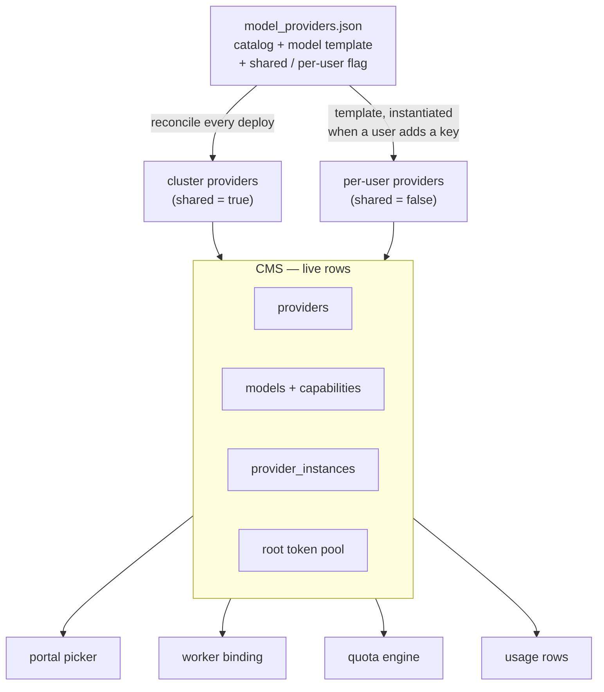
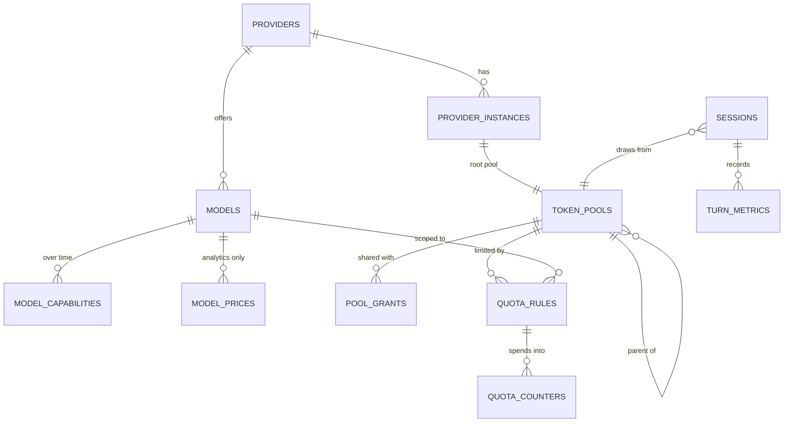
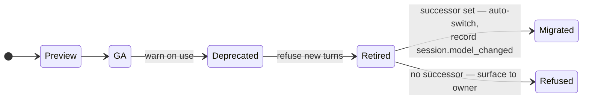
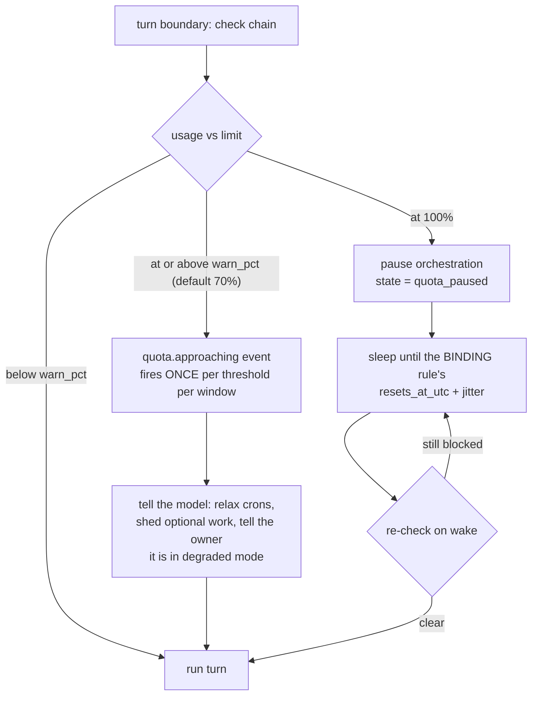

# Token ledger — usage accounting, token pools, and budgets at the turn boundary

Status: PROPOSAL (2026-08-15). Design agreed in discussion; nothing built yet
except step 1a (real `agent_id` on turn metrics, already landed).
Companion visual: the "Token Ledger" artifact page (same diagrams, rendered)

## What we are building

A **token quota system for the cluster**: every token spent is attributed, every
pool has a budget, and budgets hold at turn boundaries without breaking a
running session.

| | Requirement |
|---|---|
| R1 | Every token spent is attributed to a provider **credential**, a model, a user, an agent, and a pool. |
| R2 | Budgets are set per pool, counted in **tokens**, over calendar windows (day/week/month), optionally scoped to a single model. A pool may carry several windows at once. |
| R3 | Pools **nest**, and every chain roots at a provider credential's pool. A child may narrow its parent, never widen it. |
| R4 | **Admins own quotas** on shared pools. Users subdivide their own allocation however they like. |
| R5 | Admins **create pools and open them** to selected users or to everyone. |
| R6 | Users **see the pools they can use** and set a default. The model picker only offers providers they can pay for; choosing a specific pool is optional. |
| R7 | Enforcement runs at **turn boundaries**: warn at 70%, pause at 100%, auto-resume at the reset. |
| R8 | A refusal says **which pool and which rule** bound it, and when it clears. |
| R9 | **No existing session breaks.** Migration is phased, additive, and dark-launched before it enforces. |

Out of scope for the first build: cost-based budgets (cost is recorded for
dashboards only), rate limiting (designed as token buckets, deferred), and
cross-provider pools.

## The problem today

Three separate gaps, each of which blocks the next thing you would want to build.

**1. Usage rows cannot say who produced them.**

```
session_turn_metrics today:
  agent_id      -> was hardcoded NULL on every row ever written (fixed 2026-08-15)
  model         -> the BARE name, provider prefix stripped upstream
  provider      -> does not exist as a column at all
  owner/user    -> not on the row; only reachable by joining sessions -> session_owners
  cost          -> arrives on every usage event, discarded
```

Two users with their own GitHub Copilot keys both produce rows saying
`gpt-5.6-terra`. Same string, different credentials, different money. Any
per-provider or per-user report is guesswork.

**2. The model catalog is a file, read two different ways.**

The portal reads a baked copy; workers read the `waldemort-model-providers`
ConfigMap. They drift, so the picker offers models workers cannot run. There is
also no pricing anywhere: `ModelEntry.cost` is a display tier (`low`, `medium`,
`high`), not money.

**3. There is no quota machinery of any kind.**

No table could hold a limit, and nothing on the token path reads one. The only
enforced caps are structural: `MAX_SUB_AGENTS = 50`, the turn wall clock, and
byte caps on artifacts.

The visible cost: a hand-built "Token Consumption" dashboard agent burned 8.6M
tokens because the read API offers per-session metrics or fleet-wide
aggregates, with nothing in between. It polled 61 sessions every ten minutes and
summed them in the model. It also could not attribute usage by agent, because of
gap 1.

## What this proposes

```
model_providers.json  =  the catalog of what MAY exist
CMS                   =  the live rows everything reads
token pool            =  the thing a budget attaches to, rooted at a credential
quota rule            =  (pool, model?, window, limit) — many per pool
enforcement           =  at the turn boundary, against O(1) counters
```

Budgets count **tokens**. Cost is captured for dashboards and never enforced.
Every window, reset and timestamp is **UTC**, and the column names say so.

## 1. The shred

`model_providers.json` stops being the runtime truth. It becomes the catalog of
what may exist: which provider types can be added at all, which models each may
expose, and whether it is cluster-wide or per-user.



### Models belong to the provider, not to the instance

This is what keeps per-user providers cheap. A user's key produces a credential
and a root pool — not a private copy of the model list. Add a model to the
template and it appears for every existing instance at once. There is no
per-user migration to run.

### Two sync paths, one file

| | Cluster provider (`shared: true`) | Per-user provider (`shared: false`) |
|---|---|---|
| Provider + models | Reconciled into the CMS every deploy | Reconciled into the CMS every deploy |
| Credential | Cluster secret reference | Supplied by the user, stored as a reference |
| Instance | Exactly one, created at deploy | One per user, created when they add a key |
| Root pool | Everyone draws from it; admin sets quotas | Private to that user |

### Reconcile rules

```
in the file, not in the CMS   -> insert
in the CMS, not in the file   -> mark DEPRECATED (never delete)
returns to the file           -> un-deprecate back to GA
capabilities/prices changed   -> new effective-dated row, never an overwrite
```

Deleting is wrong: quota rules and years of usage rows point at that model id.
A deprecated model still resolves for reporting. It just stops being offered for
new turns.

The template may also carry a default quota for the root pool it creates. That
gives a user's own BYOK pool a safety cap, so a runaway crawler cannot spend
their personal Copilot allowance overnight. Admins can override it later.

## 2. Reference data

The table doing the most work is `provider_instances`: a provider plus the
credential paying for it. A shared provider has one instance on cluster
credentials. A BYOK provider has one instance per user who supplied a key. Each
instance owns exactly one root pool.



Secrets: the CMS stores a **reference** — Key Vault URI, secret name, version —
and never a value. Rotating a credential changes `secret_ref` and leaves the
instance id alone, so accounting continuity survives rotation.

There is no credentials table today. Per-user GitHub Copilot keys are handled ad
hoc in `session-manager.ts`, so this is new ground rather than a migration.

## 3. The admin UX repivot

The current screen frames a key as an override:

> "Per-user override for the GitHub Copilot model provider token. When set, this
> key is used instead of the worker's env-supplied `GITHUB_TOKEN` for sessions
> you own. Clearing the key reverts to..."

Two problems. It describes patching a shared setting rather than standing up
your own provider. And on chk that fallback does not exist — the shared worker
token has been a sentinel since 2026-07-25, so clearing reverts to nothing.

What it should say:

> "Add GitHub Copilot with your own key. You get your own provider, your own
> token pool, and usage that counts against you rather than the shared cluster
> budget. Available models are set by the cluster catalog."

The words change less than the mechanics. Adding a key now creates a
`provider_instance` owned by that user, plus a private root pool, instead of
writing an override that shadows a cluster setting.

## 4. Lifecycles



Capabilities and prices are effective-dated, never overwritten. A model that
gains vision in September must not make an August decision look wrong, and a
repricing must not rewrite what last month cost. Usage rows key on `model_id`,
so retirement never orphans history.

Provider credentials rotate without changing the instance id, so a key rotation
does not split a pool's accounting in two.

## 5. Pools and overcommit

Every pool chain terminates at a provider instance's root pool. That single rule
closes the obvious hole: a user can subdivide their allocation forever and never
widen it, because the chain ends at a pool they do not control.

```
Azure OpenAI (shared, cluster credential)
  root pool                    [admin: 40M tokens/day; gpt-5.6-max 8M/day]
    Alice                      [10M/day]
      crawlers                 [6M/day]
      interactive
    Bob                        [10M/day]
    system user                [warn only, never pauses]

GitHub Copilot (BYOK, Alice's key)
  root pool — Alice only       [her own default cap]
```

Rules of the tree:

- **Parent is a ceiling.** The effective limit at any node is the minimum along
  the chain to the root. A child may narrow, never widen.
- **Usage counts at every level.** A turn increments its own pool *and* every
  ancestor. Otherwise the root's budget is fiction.
- **Admins set enforcing quotas** on shared trees. A user's own pool is theirs
  to split.
- **Cluster config** decides whether a new user folds into the provider root or
  gets a proportional sub-pool.
- **Admins may run unpooled.** Usage is still recorded, against an unenforced
  pool, so the ledger stays complete. Not enforced is not the same as not
  counted.

### Overcommit is the allocation mechanism

A pool's quota may exceed its parent's, deliberately. That permission lets
admins build either policy with no extra machinery. Slices that sum to the
parent give reservations. Everyone at the full parent gives pure overcommit,
first-come-first-served.

```
Provider pool 100M/day, two users at 100M each:

  azure-openai · root   [##########] 100.0M / 100M   EXHAUSTED — binds both
    Alice               [######### ]  90.0M / 100M   10M of her own left
    Bob                 [#         ]  10.0M / 100M   90M of his own left, still blocked
```

Bob is starved by Alice, and that is the intended consequence. The error he sees
must name the **root** pool as the binding rule, not his own. Otherwise he
stares at a meter reading 10% and files a bug.

## 6. Choosing a pool

### Who can use which pool

Admins create pools and open them up. A grant targets **selected users** or
**everyone**, so a shared team pool does not need N individual grants and does
not become a maintenance chore as people join.

```
pool_grants(pool_id, user_id, role)          -- a named user
pool_grants(pool_id, user_id = NULL, role)   -- everyone (the all-users grant)
```

A user's usable set is: pools granted to them, pools granted to everyone, pools
they own, and the root pool of any provider instance they own (their own BYOK
key). Everything else is invisible to them.

Every pool carries a **friendly name** — "Azure OpenAI · shared", "Crawlers",
"Alice's Copilot" — because pool ids are never what someone wants to read.

### Defaults

A user picks a default pool from their usable set, stored in
`users.profile_settings` alongside the other per-user preferences. Resolution
for a new session, first match wins:

```
1. the pool explicitly chosen in the create flow
2. the user's default pool          (if still accessible — grants can be revoked)
3. the cluster's admin-configured default pool
4. the root pool of the provider that owns DEFAULT_MODEL
```

Step 2 must re-check access every time. A revoked grant that still resolves as a
default is how a user ends up spending from a pool they were removed from.

The model default follows the pool: the pool's provider's default model, or the
cluster `DEFAULT_MODEL` when it belongs to that provider.

### The create flow keeps its shape

Pools do not become a step. The flow stays what it is today — model provider and
model, then reasoning, context, agent — with one change: **the provider list is
filtered to providers the user has a usable pool for.**

```
today:    model provider + model -> reasoning -> context -> agent
becomes:  the same, with providers filtered to what the user can pay for
          + an optional "Pool" tab in the same dialog
```

Two things fall out of the filter. A user with no Copilot pool never sees
Copilot models, so the picker stops offering what the user cannot pay for — the
same class of fix as no longer offering what workers cannot run. And the common
case gains zero clicks: most people have one pool per provider and never open
the tab.

The pool tab is for the case where someone has several pools on the same
provider and cares which one pays — a crawler budget versus an interactive one.
It shows the usable pools for the currently chosen provider, with the resolved
default marked, and it is skipped entirely when there is only one.

### Which pool pays

The chosen model determines the provider instance, and a pool can only pay for
its own instance. So resolution is the default order, filtered to that set:

```
among the user's usable pools rooted at the chosen model's provider instance:
  1. the pool chosen in the dialog's Pool tab
  2. the user's default pool     (only if it is in that set)
  3. the cluster default pool    (only if it is in that set)
  4. that provider instance's root pool
```

Step 2's constraint is the one worth getting right: a default pool on Azure
OpenAI cannot pay for a Copilot model. Falling through to the next candidate,
rather than failing or silently charging the wrong pool, is what keeps the
common case invisible.

### Where users see this

The admin console's Usage section, which non-admins can also open, listing only
their usable pools: friendly name, what it is rooted at, their current
consumption against each rule, and a control to set the default.

## 7. Windows and resets

A pool carries as many rules as it needs, and each rule is one window. A daily
ceiling and a weekly ceiling on the same pool are simply two rows. Both are
checked at every turn boundary and both must pass. This is the same mechanism
that lets an all-models rule sit beside a per-model one.

```
Alice's pool — three rules, one binding:

  day  · all models      [#### ······] 42%    4.2M / 10M
  week · all models      [##########] 95%   47.5M / 50M   BINDING, until Mon 00:00Z
  day  · gpt-5.6-max     [#### ······] 45%    0.9M /  2M
```

Two meters look healthy and the pool is nearly stopped. This is the same
legibility problem as a parent starving a child, and needs the same answer: the
error names the binding rule, and a pool's UI shows a **stack** of meters rather
than one bar.

What a window means:

- `day`, `week`, `month` are calendar periods aligned to UTC — midnight, Monday
  midnight, the first of the month.
- `anchor_utc` shifts the boundary when the default is wrong: a week that turns
  over on Wednesday, or a billing month starting on the 12th.
- **Sleep on the binding rule.** When the weekly blocks, the pause timer must
  target the weekly's reset. Waking at the daily reset would find the pool still
  blocked and go straight back to sleep.
- **Warnings are per rule.** Crossing 70% of the weekly and 70% of the daily are
  different pieces of news. Each fires once and names its own rule.

### Resets never cascade

Each rule carries its own window and anchor, so each counter resets on its own
schedule. A parent reset frees the parent and touches nothing below it.

```
                    18:00Z        00:00Z        06:00Z        12:00Z
provider root   |============= exhausted =====|===== free ==============|
                                        reset ^
Bob's pool      |======== 10M / 20M used ===================|=== free ==|
                                                      reset ^
```

Read the middle. At 00:00Z the root frees its full 100M, but Bob's own window
has not turned over. His counter still reads 10M of 20M, so he may spend 10M,
not 100M. His allowance returns at 12:00Z.

Effective allowance is always the **minimum remaining** along the chain,
evaluated against each counter's own window.

Cascading resets would be wrong: a child could bank headroom it never earned by
exhausting its daily slice and waiting for the parent's monthly reset.

## 8. Windows now, buckets later

"How much this month" and "how fast right now" are different questions with
different storage. **Only the first ships.** `quota_rules` carries a `kind`
column from day one so the second can land later as a new table and one branch,
with no migration of anything already written.

| | `kind = period` (building now) | `kind = rate` (designed, deferred) |
|---|---|---|
| Storage | counter keyed by `window_key_utc` | bucket: `available_tokens`, `last_refill_utc` |
| Rows | one per rule per window | one per rule, forever |
| Reset | window turns over | none; refills continuously |
| Warn ramp | yes, at 70% | no |
| Wait | until `resets_at_utc` | `(needed - available) / refill_per_second` |

What deferring costs: nothing paces a burst inside the window. Fifty sub-agents
can spend a daily budget in a minute, and the only consequence is the pool
blocking for the rest of the day. The overspend is paid for by the remainder of
the window, bluntly rather than smoothly.

### Why the deferred design is a bucket, not a clock-minute

Recorded so it is not re-litigated later. Counting per fixed clock-minute is
cheaper and lets a pool spend at twice its rate without breaking the rule:

```
limit = 1M tokens / minute
  10:00:59   spend 1M   -> legal, minute 10:00 is now full
  10:01:00   spend 1M   -> legal, minute 10:01 is fresh
             2M in one second
```

A bucket has no boundary to game. Capacity flows back continuously, and the
refill is computed lazily on read, so nothing runs on a timer:

```
elapsed   = now_utc - last_refill_utc
available = min(burst_capacity_tokens,
                available_tokens + elapsed_seconds * refill_per_second)
```

The bucket is also allowed to go negative, which is how it absorbs an
overspending turn: the debt drains at the refill rate and throttles the next
turns automatically.

## 9. The exceed ramp

Three stages on period budgets. Rate rules, when they land, skip the ramp — a
bucket at 70% is instantaneous and noisy, and warning on it would fire
constantly.



Details that decide whether this is pleasant or maddening:

- **The warning is edge-triggered.** It fires when the counter crosses
  `warn_pct`, once per window, recorded as `last_warned_pct` on the counter.
  Level-triggering would emit an event every turn for the rest of the day.
- **Jitter scales to the wait.** `min(5 min, 10% of the wait)`. Five minutes of
  spread suits a daily reset and would be absurd for a short one.
- **Wake re-evaluates the whole chain.** The rule that unblocks may not be the
  rule that binds next.
- **The user's own hold** is the same pause with a different origin:
  `quota_hold_until_utc` (null means indefinite), set by command, effective at
  the next turn boundary, cleared by an explicit resume.

### The error must be legible to three audiences

The orchestration branches on it, the portal renders it, and the model is
expected to reason about it. That means a typed payload, not a message string.

```json
{
  "code": "quota_exceeded",
  "pool":   { "id": "…", "name": "Azure OpenAI · root", "level": "ancestor" },
  "rule":   { "id": "…", "kind": "period", "window": "day", "model": null },
  "used_tokens": 100000000,
  "limit_tokens": 100000000,
  "window_start_utc": "2026-08-15T00:00:00Z",
  "resets_at_utc":    "2026-08-16T00:00:00Z",
  "retry_after_s": 34918
}
```

`level` is what prevents the support ticket. It tells Bob the binding rule was
an ancestor he does not own, so his own 10%-full meter is not the problem.

## 10. Enforcement at the turn boundary

```mermaid
sequenceDiagram
  participant O as Orchestration
  participant C as CMS
  participant L as LLM

  O->>C: resolve session -> pool, user, model, provider_instance
  O->>C: one recursive query: pool chain + rules + counters
  C-->>O: [sub -> user -> root] used/limit/resets_at_utc

  alt any rule exhausted
    O->>C: write quota.paused event
    O-->>O: pause; timer = binding rule's resets_at_utc + jitter
  else any rule at or above warn_pct, not yet warned
    O->>C: write quota.approaching (edge-triggered)
    O->>L: run turn, with degraded-mode instruction
  else clear
    O->>L: run turn
  end

  L-->>O: usage events (tokens; cost recorded, not enforced)
  O->>C: idempotent increment keyed by (session, turn_index)
```

The check must be one round trip and O(1) in usage volume, which is what the
counter rows buy. Chain depth is small — root, user, sub-pool — so the walk is a
handful of indexed reads.

### Accepted: a runaway turn overshoots

Checks happen between turns, so a turn that burns 900k tokens blows through a
limit it started under. This is a deliberate accepted risk. With windows only,
the overspend leaves the counter above its limit and the pool blocked until the
window turns over — the rest of the window pays for it.

### Must be fixed: the counter has to be exact

Today's usage writeback is wrapped in `cmsRetryBestEffort`. A CMS hiccup
silently drops a turn. That is fine for a dashboard and disqualifying for a
budget, because dropped usage means overspend. It has to become an idempotent
increment on a durable path, keyed by `(session_id, turn_index)` so a retry
cannot double-count.

## 11. Token Manager system agent

A system agent that owns the ledger conversationally. Every tool below exists to
make its refresh loop a single call, rather than the 61-call grind that cost
8.6M tokens.

What it does:

- **Reports** consumption across pools, users, agents, models and providers.
- **Forecasts** exhaustion against current burn. "This pool runs dry Thursday"
  beats "78%".
- **Explains** why a session is paused, naming the binding rule and clear time.
- **Proposes** reallocations and quota changes for an admin to approve. It never
  applies an enforcing change to a shared tree on its own initiative.
- **Maintains** the admin dashboard canvas, on a cron, from one query.

Behaviour:

- Wakes on a low-frequency cron (30 min default), on quota events, and on direct
  admin prompts. It does not poll.
- One call per refresh. Iterating sessions is the failure mode it exists to
  retire.
- Runs on a cheap model. Every tool returns pre-aggregated numbers, so nothing
  needs strong reasoning. That is a constraint on the tools, not a hope about
  the prompt.
- Writes execute on the **asking user's** authority, not the system's, so it
  cannot be talked into granting quota an admin would not.
- Its own pool is a system pool: warn-only, never pauses (see below).

### Tools

Tool definitions are resident context on every turn, so the count is a budget of
its own. Six rich tools with action enums beat fifteen thin ones.

| Tool | Takes | Answers |
|---|---|---|
| `get_usage_report` | `since_utc`, `until_utc`, `bucket` (hour/day/week), `group_by[]` (pool/user/agent/model/provider/session), filters, `top_n` | The whole dashboard in one response: totals, per-dimension breakdowns, time series |
| `get_pool_status` | `pool_id?`, `include_descendants` | Live state: every rule with used/limit, percent, `resets_at_utc`, and which rule binds |
| `explain_session_quota` | `session_id` | The pool chain, every rule along it, which bind, spend so far, when it clears |
| `get_provider_catalog` | `include_instances`, `include_drift` | Providers, instances, models, lifecycle state, and drift between the JSON and the CMS |
| `manage_pool` | `action`: create / rename / reparent / grant / revoke / bind_session | Pool structure and access |
| `set_pool_quota` | `action`: set / remove; `pool_id`, `model_id?`, `window`, `limit_tokens`, `warn_pct`, `anchor_utc` | The enforcing knob. Admin-only on shared trees |
| `release_quota_hold` | `session_id` | Clears a user-set hold. Cannot override an exhausted quota — only the window can |

`get_usage_report` must return numbers already summed and already ranked. If the
agent has to add anything up, the tool is wrong. That is exactly how a
monitoring loop turns into millions of tokens.

### System pools are warn-only

System pools count usage and raise the 70% event, but never pause. If they could
exhaust, the sweeper, facts-manager and Token Manager would stop — including the
one agent whose job is to explain why everything stopped.

### Hide the machinery by parentage, not by flag

`is_system` is the wrong predicate. It is also set on sessions that hand off
from a user's own work, which the user should keep seeing. What should disappear
is the cluster machinery.

```
hidden from non-admins  <=>  COALESCE(root_session_id, session_id) = <pilotswarm root>
```

One indexed column, no parent walking, and it covers the whole subtree — so a
sub-agent the sweeper spawns is hidden too, with no list to maintain. Admins see
everything and may grant read on one session to one user through the existing
share path.

The regen distiller is unaffected: `regen-worker.ts` spins an ephemeral Copilot
subprocess rather than a CMS session under the root, so it never matches this
predicate.

## 12. Admin console — Usage

The console is already a left nav with section bodies (`ghcp`, `packages`, and
an admin-only `workers`, built in `packages/app/ui/core/src/selectors.js`).
Usage is one more nav entry, admin-gated the same way, reading the same
`get_usage_report` and `get_pool_status` the agent uses.

```
USAGE                                window: day    provider: all

FLEET                    tokens    sessions
  today                   47.2M          61
  this week              312.9M         188

POOLS
  azure-openai · root         [########··]  78%   39.1M / 50M    resets 00:00Z
    Alice                     [######····]  61%   12.2M / 20M    resets 00:00Z
      crawlers                [#########·]  91%    5.5M /  6M    resets 00:00Z  !
    Bob                       [###·······]  28%    5.6M / 20M    resets 00:00Z
  github-copilot · alice      [##········]  19%    1.9M / 10M    resets Mon 00:00Z
    week · all models         [#########·]  95%   47.5M / 50M    resets Mon 00:00Z  BINDING

TOP CONSUMERS (today)
  generic-crawler    18.4M    12 sessions
  r2d-watcher         9.1M     3 sessions
  daraffan@…          6.7M     8 sessions

PAUSED BY QUOTA
  7caa5b04  Facts Manager   14m   bound by azure-openai · root (day)   resumes 00:00Z
```

Rules the view has to follow:

- **Every rule gets its own meter.** A pool with a daily and a weekly limit
  shows two bars. Collapsing them hides the binding constraint, which is the
  most confusing thing about this system.
- **Say which rule binds,** in the row and in the paused list.
- **Paused sessions get their own block,** not a filter someone has to discover.
  It is the first thing an admin looks for during an incident.
- **Live and historical both belong on screen.** Counters answer "why is this
  stopped". The report answers "where did it go".
- **Actions live where the problem is:** set a quota from a pool row, release a
  hold from a paused row.

## 13. What lands in the CMS

| Table | Carries | Notes |
|---|---|---|
| `providers` | type, `shared`, base_url, lifecycle | The vendor integration |
| `provider_instances` | provider, `owner_user_id`, `secret_ref`, status | The billing identity; one root pool each |
| `models` | wire_name, qualified_name, lifecycle, successor | One catalog for picker, runtime, quotas |
| `model_capabilities` | vision, efforts, tiers, `effective_from_utc` | Effective-dated |
| `model_prices` | per-Mtok rates, `effective_from_utc` | Dashboards only, never enforced |
| `token_pools` | instance, parent, owner, kind, `warn_pct`, tz | Overcommit permitted by design |
| `pool_grants` | pool, user, role | Mirrors session sharing |
| `quota_rules` | pool, model?, `kind`, `limit_tokens`, `window`, `anchor_utc` | day/week/month; many per pool |
| `quota_counters` | `window_key_utc`, `used_tokens`, `resets_at_utc`, `last_warned_pct` | One row per rule per window — needs a prune job that is actually wired up |
| `quota_buckets` | `available_tokens`, `last_refill_utc` | Deferred; added when rate rules ship |
| `sessions` += | `pool_id`, `quota_hold_until_utc`, quota-paused state | Pause survives restarts |
| `session_turn_metrics` += | `provider_instance_id`, `model_id`, `pool_id`, `owner_user_id`, cost | Every slice becomes answerable |

Note on `quota_counters` pruning: `cms_prune_turn_metrics` already exists in this
codebase with **zero callers**, and `session_turn_metrics` has grown unbounded
ever since. Do not repeat that here — wire the prune into the sweeper when the
table lands.

## 14. Build order

Each stage is useful on its own, and each is a prerequisite for the next.

| Stage | Lands | Unlocks |
|---|---|---|
| **1 · Identity at capture** | provider instance, model id, pool, owner, cost on every turn row; qualified model keeps its prefix | Every slice becomes answerable; agent attribution starts working |
| **2 · Reference data** | Catalog shredded into the CMS; import path; admin tools | Picker and workers stop drifting |
| **3 · Batch read** | `get_usage_report`; admin console Usage section | Dashboards stop costing millions of tokens |
| **4 · Pools** | Tree, grants, session binding, durable idempotent counters | Accounting per pool, no enforcement yet |
| **5 · Enforcement** | Period rules, warn/pause ramp, typed errors, Token Manager | Budgets hold at the turn boundary |
| **5b · Migration** | Phases A-E on each stamp, dark-launched before enforcing | Existing sessions keep running throughout (R9) |
| **6 · OTel** | Metrics SDK, OTLP export, Collector | Kusto analytics off the same labels (see `runtime-metrics.md`) |

Stage 1a is already done: `session_turn_metrics.agent_id` was hardcoded `null`
and now carries the session's resolved agent identity.

## 15. Migration

The hard requirement is R9: **no existing session breaks.** Every phase below is
additive and reversible, and enforcement is dark-launched before it bites —
the same pattern `AUTHZ_ENFORCE_OWNERSHIP` already uses in this codebase.

### What a live stamp looks like today (waldemortchk)

```
providers   azure-openai      cluster credential, SHARED
                              base catalog + per-stamp model-provider-additions.json
                              (gpt-5.6-luna / -sol / -terra added on chk)
            github-copilot    BYOK per user. GITHUB_TOKEN is EMPTY and the KV
                              github-token is a sentinel — there is NO cluster
                              credential for it on chk
default     DEFAULT_MODEL=azure-openai:gpt-5.4
sessions    carry `model`; some qualified, some bare. No pool. ~61 live.
users       users + session_owners. "system" owns the machinery sessions.
```

### Phases

**A — schema only.** Create the reference, pool and quota tables. Add nullable
`sessions.pool_id` and the new `session_turn_metrics` columns. Nothing reads
them. Zero behavior change; safe to deploy on its own.

**B — import and backfill, still nothing reads.**

1. Import providers and models from the base catalog **merged with the
   per-stamp additions file**. Missing the merge is the most likely way to
   break chk: `gpt-5.6-luna/-sol/-terra` live only in
   `model-provider-additions.json`, and they are the models actually in use.
2. Create `provider_instances`: one per **shared** provider with a cluster
   credential, and one per user who already holds a BYOK key.
3. Create a root pool per instance, plus per-user sub-pools if cluster config
   says so.
4. Backfill `sessions.pool_id` for every existing session by resolving
   `model -> provider -> instance -> root pool`.
5. Backfill recent `session_turn_metrics` rows best-effort. Older rows keep
   NULLs and reports show "unattributed" before the cutover date. An honest gap
   beats a guessed backfill.

**C — dual read.** Portal and workers read the catalog from the CMS, falling
back to the file when the CMS is empty. The acceptance test is boring on
purpose: *the model picker shows exactly the same list as before.*

**D — pool selection.** The pool picker, defaults, and the Usage view. Sessions
start recording `pool_id` from their own choice rather than the backfill.
Still no enforcement.

**E — dark-launch enforcement.** Quota rules exist with `action = 'alert'`.
The engine evaluates every rule and logs what it *would* have blocked, without
blocking. Watch a full window — a week, so the weekly rules get exercised —
and read the would-have-blocked list. Only then flip actions to `block`.

Rollback: A and B are additive (drop the columns, drop the tables). C has a
fallback flag. D is feature-flagged. E is one column flip back to `alert`.

### The specific ways this breaks, and the guard for each

| Risk | Guard |
|---|---|
| **Per-stamp additions missed on import** — chk loses its three real models | Import merges base + `MODEL_PROVIDER_ADDITIONS_FILE`; assert the post-import model count matches what the picker offered before |
| **A cluster instance created for github-copilot on chk**, whose credential is a sentinel — every session bound to it fails at runtime | Only create a cluster instance when the provider has a *real* cluster credential. On chk, `github-copilot` gets provider + models but **no cluster instance** |
| **Bare vs qualified model names** in existing rows — `gpt-5.4` and `azure-openai:gpt-5.4` both appear | Resolve bare names through the catalog. If a bare name matches two providers, **fail the migration loudly** rather than guess. chk has no collision today; a future stamp might |
| **Sessions bound to a retired model** | Pool resolution goes through the *provider*, so it succeeds even when the model row is deprecated |
| **BYOK holders missed** — their sessions lose their credential | Enumerate existing key holders in phase B and create an instance for each. Count them before and after |
| **System sessions unpooled when enforcement flips** — the sweeper pauses | Assign the system pool in phase B and mark it warn-only *before* phase E |
| **A user with no pool** (joined after config, before grants) | Falls back to the provider root pool, per the default resolution order |
| **Counters wrong on day one** because the usage writeback is best-effort | Make the increment idempotent and durable in phase D, before anything enforces on it |

### Verification at each gate

```
after A   schema present; sessions still create and run; picker unchanged
after B   every session has a pool_id; instance count == shared providers
          with real creds + BYOK holders; model count matches the picker
after C   picker list identical to the pre-migration list (diff it)
after D   new sessions record the pool the user chose; defaults resolve
after E   would-have-blocked log is empty of surprises for a full week
```

## 16. Settled

- Budgets count **tokens**. Cost is recorded for dashboards, never enforced.
- **UTC everywhere**, stamped in the column names.
- **Overcommit permitted** — it is how admins express reservations or a
  free-for-all.
- **Many windows per pool** — a daily and a weekly ceiling are two rules, both
  checked.
- **Resets never cascade.** Each rule owns its window and anchor.
- **Warn at 70%** (configurable, edge-triggered), **pause at 100%** with a
  jittered wake on the binding rule.
- **Windowed budgets only for now.** Rate limits are designed as token buckets
  and deferred; `kind` ships now so they cost no migration.
- **System pools warn but never pause.**
- **Runaway single-turn overshoot is accepted.**
- **Machinery hides by root parentage**, not by the system flag.
- **The JSON is a catalog and template**, reconciled on deploy; removals
  deprecate, never delete.
- **Admins open pools to selected users or to everyone**; users pick a default
  and a per-session pool.
- **The create flow is unchanged** — provider and model as today, with the
  provider list filtered to what the user has a pool for, and pool choice as an
  optional tab in the same dialog.
- **Migration is phased and dark-launched.** Enforcement only flips to `block`
  after a full window of would-have-blocked evidence.

## Related

- `runtime-metrics.md` — the OTel metrics pipeline (stage 6). Its token counters
  are labelled `agent_id` + `model` only; they need `provider` and the corrected
  identity from stage 1 before they mean anything.
- `multitenant-pilotswarm.md` — states plainly that quotas are "sketched but not
  built". This is the build.
