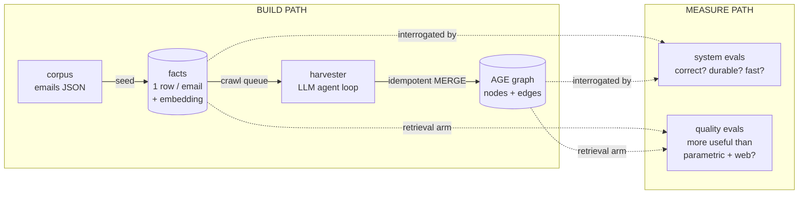
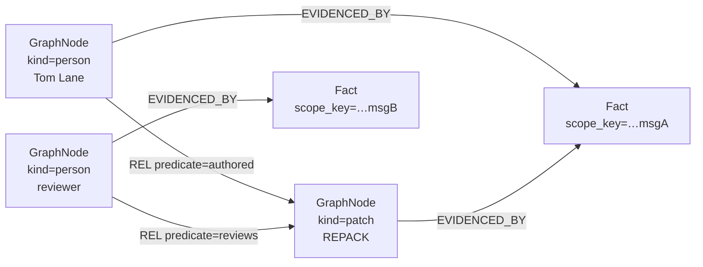
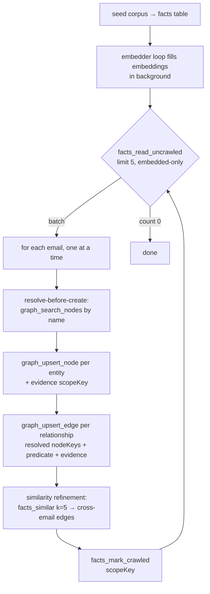
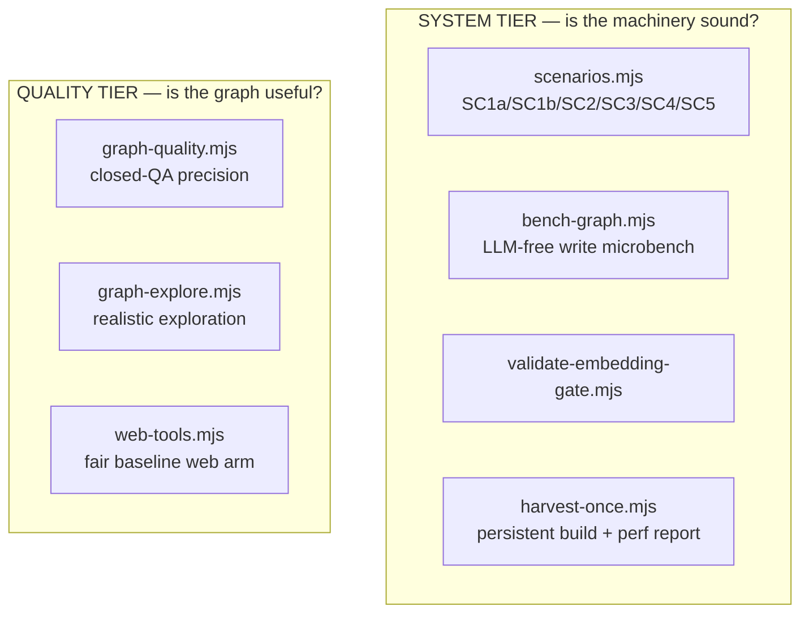
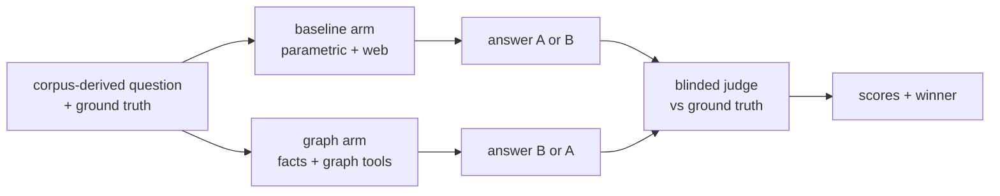

# The pgsql-hackers Harvester & Evaluation System

> **Scope.** This document describes the `incubator/horizon-facts` archive
> **harvester** (how a PostgreSQL `pgsql-hackers` knowledge base is *built*) and
> its **evaluation system** (how that knowledge base is *proven* correct,
> durable, fast, and genuinely useful). It complements
> [`eval/README.md`](../eval/README.md) — which documents only the scenario tier
> — by treating the build path and the full eval surface as one system.
>
> It documents the **incubator only**. The provider contract and tool/test specs
> it builds on live under
> [`docs/proposals/enhancedfactstore/`](../../../docs/proposals/enhancedfactstore/).

---

## Part I — Framing & mental model

### The one-sentence version

A small LLM agent reads a mailing-list archive one email at a time and
incrementally builds a **dual knowledge base** — a flat, embedded **facts**
table plus an **entity-relationship graph** — and a two-axis evaluation harness
proves both that the build machinery is sound and that the resulting graph lets
an LLM answer questions better than parametric knowledge plus live web search.

### Two mirrored halves over one knowledge base

Everything here is organized as a **build path** and a **measure path** that meet
at a single shared knowledge base:



### Four ideas the rest of the doc rests on

1. **Dual representation, one join.** The KB is *flat facts* (one embedded fact
   per email) **plus** an *entity–relationship graph* (Apache AGE:
   `GraphNode` + `REL` edges). They are stitched together by `scope_key`:
   every graph node is anchored to its source emails by `EVIDENCED_BY` edges
   pointing at `:Fact {scope_key}` nodes. Every claim in the graph therefore
   traces back to a real email. This join is the mechanism behind the
   "search → pivot into graph → ground in facts" retrieval flow.

2. **The harvester is an LLM agent loop over a durable crawl queue.**
   `facts.last_crawled_at IS NULL` is the work ledger. The agent reads facts in
   small batches, extracts entities and relationships, and writes them with
   **idempotent MERGE** semantics — so the loop is crash-safe, resumable, and
   replay-immune.

3. **Evaluation has two independent axes.** *System* evals prove the machinery
   (harvest correctness, replay determinism, incremental resume, write
   performance, the embedding gate). *Quality* evals prove the **payoff** — that
   a harvested graph beats a strong "parametric knowledge + live web" baseline,
   judged blind against corpus-derived ground truth.

4. **Fairness is a first-class design concern.** A quality eval only means
   something if the baseline is real. That drives the substitute web tools, the
   blinded A/B judge, corpus-as-ground-truth, and explicit, stated caveats.

---

## Part II — The knowledge base

Two stores share one PostgreSQL schema (token `{{SCHEMA}}`, substituted by the
migrator). Both are created and versioned by the migration runner under
[`migrations/`](../migrations/).

### II.1 The facts table

One row per email. Defined in
[`migrations/0001_facts_table.sql`](../migrations/0001_facts_table.sql):

| column | role |
|---|---|
| `scope_key` | **the join key** — stable unique id used everywhere (graph anchors, reader grounding) |
| `key`, `value` (JSONB) | PilotSwarm-parity fact payload; the email lives in `value` (`subject`/`body`/…) |
| `search_text` (generated) | `key` + full `value::text`, concatenated — the lexical text |
| `last_crawled_at` | `NULL` ⇒ pending crawl. **This is the harvester work queue.** |
| `embedding vector(dim)` | `NULL` until the embedder fills it |
| `embedded_at`, `embedding_model` | embedding provenance and model gate |
| `last_embed_error`, `last_embed_error_at`, `embed_retry_at` | minimal embedder failure/retry state |
| `shared`, `agent_id`, `session_id`, `tags` | access-control + provenance (PilotSwarm parity) |

Two partial indexes back the two work queues:
`idx_facts_uncrawled WHERE last_crawled_at IS NULL` and
`idx_facts_needs_embedding WHERE embedding IS NULL`.

A **write-resets-pending-state** trigger watches `key` / `value`; when content
changes it sets `last_crawled_at → NULL`, clears the stored embedding/model, and
clears embed retry/error state. Identical-content writes change nothing — the
basis for replay-immunity (Part VI).

### II.2 The AGE graph

Created by [`migrations/0003_age_bootstrap.sql`](../migrations/0003_age_bootstrap.sql).
The graph is **open** — node *kinds* and edge *predicates* are free-text owned by
the harvester/app, not enumerated in the schema. Concretely:

- **`GraphNode`** vertices, with `kind ∈ {person, patch, code_file, thread, concept}`
  as a *property* (not an AGE label), plus `node_key`, `name`, `aliases`.
- **`Fact`** vertices — thin anchors carrying just `scope_key`.
- **`REL`** edges — the semantic relationships; the verb is a `predicate`
  *property* (e.g. `authored`, `reviews`, `comments on`).
- **`EVIDENCED_BY`** edges — `GraphNode → Fact`, the provenance anchors.



### II.3 The `scope_key` join (why the graph is groundable)

The bridge between the two stores is one Cypher pattern
([`src/graph-queries.ts`](../src/graph-queries.ts), `searchGraphNodes` with
`seeds`):

```cypher
MATCH (f:Fact)<-[:EVIDENCED_BY]-(n:GraphNode)
WHERE f.scope_key IN [<fact scopeKeys from a facts_search>]
RETURN DISTINCT n.node_key, n.kind, n.name, n.aliases
-- then expand to adjacents:
MATCH (s:GraphNode)-[:REL*1..<depth>]-(n:GraphNode)
WHERE s.node_key IN [<those node_keys>]
```

That is: *"given the emails a search just found, return the entities they
evidence, plus their N-hop neighbours."* This is the literal facts → graph
pivot, and it is what every reader (and the quality-eval graph arm) uses.

Access control: inaccessible fact seeds are **silently ignored** (byte-identical
to unknown seeds) so seeding can never probe private facts.

---

## Part III — The harvester

### III.1 What it is

The harvester is a **GitHub Copilot SDK agent** driven in a re-prompt loop. It is
not a hand-written ETL pass — the extraction logic lives entirely in the system
prompt ([`eval/tools.mjs`](../eval/tools.mjs) `HARVESTER_SYSTEM_PROMPT`) and the
model executes it using the provider's own tools. The canonical persistent
driver is [`eval/harvest-once.mjs`](../eval/harvest-once.mjs); the same loop runs
inside the scenario tier as SC1a/SC1b.

### III.2 The loop



Key disciplines encoded in the prompt:

- **Small batches (5).** Keeps extraction quality high and bounds the blast
  radius of a stalled round.
- **One email at a time.** Finish entities → edges → similarity → mark before
  starting the next, so a crash never leaves a half-incorporated email *marked*.
- **Resolve before create.** `graph_search_nodes(kind, nameLike)` first; a short
  handle (`tgl`) for an existing person merges in as an alias rather than minting
  a duplicate node.
- **Carry one namespace.** Use the same namespace string for facts and graph,
  for example `corpus/acme`: `facts_read_uncrawled({ namespace })`,
  `facts_search({ namespace })`, `graph_search_nodes({ namespace, ... })`, and
  `graph_upsert_node` / `graph_upsert_edge` with `namespace`. Graph namespace is
  a property, so `corpus/acme` also includes descendants such as
  `corpus/acme/services`.
- **Re-assert, never merge evidence.** A follow-up email restating a relationship
  asserts it **again** with the new email's evidence, reusing the **exact same
  predicate**. Same verb reinforces an edge; a synonym fragments it.
- **Mark last.** `facts_mark_crawled` only after incorporation; marking without
  incorporating permanently loses that email's knowledge.

### III.3 The embedding gate (defer, don't drop)

Similarity refinement (`facts_similar`) needs a fact's **stored embedding**. A
fact that isn't embedded yet would produce a thinner graph, so the queue read is
gated ([`migrations/0006_facts_read_uncrawled_embedded_gate.sql`](../migrations/0006_facts_read_uncrawled_embedded_gate.sql)):

```sql
WHERE f.last_crawled_at IS NULL
  AND (p_ns_prefix IS NULL OR f.key LIKE p_ns_prefix)
  AND (NOT p_embedded_only OR f.embedding IS NOT NULL)   -- the gate
```

With `embeddedOnly: true`, an un-embedded fact is **skipped now, not stamped, and
re-served later** once the in-DB embedder loop
([`migrations/0005_embedder_workflow.sql`](../migrations/0005_embedder_workflow.sql))
fills its embedding.

**The correctness invariant:** the *read* is gated but the *done-check*
(`queueCount`) is **ungated**. The loop only terminates when *every* uncrawled
fact is gone, embedded or not — so it keeps spinning while the embedder catches
up instead of falsely declaring victory. The harvester sets `embeddedOnly` from
`HAS_EMBED`, so with no embedder configured the gate is off and facts crawl
immediately (lexical only) rather than the gated read starving forever. Asserted
by [`eval/validate-embedding-gate.mjs`](../eval/validate-embedding-gate.mjs).

### III.4 The embedder

An "eternal" `pg_durable` workflow — one durable instance per schema
(`hz-embed-cron:<schema>`) — batch-embeds via a single HTTP call per batch
(array-input API), guarded so a fact edited mid-flight stays pending. If a batch
fails, its rows are marked with `embed_retry_at` and retried one at a time; a row
that still fails gets `last_embed_error` set, is stamped crawled for
embedded-only harvesters, and stops blocking later rows until its content
changes. It is
started idempotently under an advisory lock on `initialize()`. Details in
[`migrations/0005_embedder_workflow.sql`](../migrations/0005_embedder_workflow.sql)
and [`migrations/0008_embedder_failure_recovery.sql`](../migrations/0008_embedder_failure_recovery.sql).

### III.5 Reliability

HorizonDB (preview) intermittently drops idle pooled TLS connections. The
harvester is hardened in layers:

- **Driver guard** — an `uncaughtException` handler swallows *only* transient
  socket errors (`ECONNRESET|ENOTCONN|EPIPE|ETIMEDOUT|Connection terminated`);
  any in-flight query rejection still surfaces as a tool error and is retried.
- **Store-level retry** — hot store procs and `GraphQueries.withAge` are wrapped
  in `withDbRetry` (see Part VI).
- **Durable resume** — because the crawl queue is durable and writes are
  idempotent, a crashed harvest resumes cheaply by re-running into the **same**
  schema.

---

## Part IV — The tool surface

### IV.1 One contract, two roles

Tools come from the product itself —
[`src/agent-tools.ts`](../src/agent-tools.ts) `createFactsTools(store, { role })`
— and are bridged 1:1 into the Copilot SDK by
[`eval/tools.mjs`](../eval/tools.mjs) `buildSdkTools`. There is **no adapter**:
the tools the model sees *are* the provider's descriptors.

| tool | role | backing store method |
|---|---|---|
| `facts_search` | reader + harvester | `searchFacts` (lexical / semantic / hybrid) |
| `facts_similar` | reader + harvester | `similarFacts` (pgvector cosine) |
| `facts_read` | reader + harvester | `readFacts` (full email by scopeKey) |
| `facts_read_uncrawled` | harvester | gated queue read |
| `facts_mark_crawled` | harvester | stamp `last_crawled_at` |
| `graph_search_nodes` | reader + harvester | `searchGraphNodes` (namespace + seeds + depth) |
| `graph_search_edges` | reader + harvester | `searchGraphEdges` (namespace-aware) |
| `graph_neighbourhood` | reader | `graphNeighbourhood(nodeKey, depth, namespace?)` |
| `graph_upsert_node` | harvester | idempotent node MERGE + optional namespace stamp |
| `graph_upsert_edge` | harvester | idempotent edge MERGE + optional namespace stamp |

The `availableTools` allow-list given to a session decides which subset the model
can call. Readers get the read tools; harvesters additionally get the write +
queue tools.

### IV.2 The one eval-side policy

The provider contract makes `evidence` *optional* on graph writes, but this app's
harvester norm is **always-evidence**. `buildSdkTools` enforces it for the
harvester role by wrapping `graph_upsert_node`/`graph_upsert_edge` to reject
evidence-less writes, so the model self-corrects in-loop. This also makes replay
determinism total (Part VI).

### IV.3 The two system prompts

[`eval/tools.mjs`](../eval/tools.mjs) exports `HARVESTER_SYSTEM_PROMPT` (the loop
in Part III.2) and `READER_SYSTEM_PROMPT` (the retrieval flow: `facts_search` →
`graph_search_nodes({seeds, depth:2})` → `graph_search_edges`/`graph_neighbourhood`
→ `facts_read`, ending with an `EVIDENCE:` list of scopeKeys).

---

## Part V — The evaluation system

Two tiers, two purposes.



### V.1 System tier

**[`eval/scenarios.mjs`](../eval/scenarios.mjs)** — Copilot SDK agents on live
HorizonDB, asserting structural invariants:

| ID | What it proves |
|---|---|
| SC1a | cold harvest, synthetic 3-message corpus — exact hand-authored invariants |
| SC1b | cold harvest, real 60-message corpus — metadata-derived invariants |
| SC5 | scoped publication (a private draft harvested alongside SC1b) |
| SC2 | replay immunity — re-queue + replay SC1b's recorded mutating calls |
| SC3 | edit → re-queue → incremental harvest |
| SC4 | reader Q&A via the fact-pivot |

**[`eval/bench-graph.mjs`](../eval/bench-graph.mjs)** — deterministic, LLM-free
graph-write microbenchmark. Measures RTT, AGE session-prep cost, and
`upsertGraphNode/Edge` p50/p95/wall at configurable pool size & concurrency.
**Use this for DB perf** — harvest p50s are LLM-variance noise.

**[`eval/validate-embedding-gate.mjs`](../eval/validate-embedding-gate.mjs)** —
seeds facts, verifies the gated read is smaller before embedding and equal after.

**[`eval/harvest-once.mjs`](../eval/harvest-once.mjs)** — the persistent build.
Beyond producing an inspectable graph, it prints three reports: a **per-tool
latency table** (p50/p95/max), an **error breakdown** (bucketed by
`classifyError`), and the **LLM-vs-DB wall-clock split** (V.3).

### V.2 Quality tier

Both quality evals share a structure: `gen` mode derives questions + ground truth
**from the corpus**; `run` mode runs two arms on the same question and has a
**blinded** judge grade them.

- **Baseline arm** — parametric PostgreSQL knowledge + real web tools
  (`web_fetch`/`web_search`). No graph.
- **Graph arm** — the harvested facts + graph reader tools. No prior knowledge;
  retrieve everything.
- **Blinding** — arms are randomly assigned A/B per question (`graphIsA`), so the
  judge cannot tell which is which.



**[`eval/graph-quality.mjs`](../eval/graph-quality.mjs) — closed-QA precision.**
Pinpoint questions ("according to X's email, which feature…") with a reference
answer. Single 1–5 correctness score per arm. This is the **precision probe**.

**[`eval/graph-explore.mjs`](../eval/graph-explore.mjs) — realistic exploration
(the headline).** This models how an LLM actually consumes a KB:

- **Seeds** are an **area** (a whole mailing-list thread) or a **code file**
  (`elog.c`, `cluster.c`, `makefuncs.c`).
- **Question** is open-ended: *"I'm ramping up on `<area>`. Who's involved, what
  patches exist, how do they relate, and what are the open concerns?"*
- **Ground truth** is a per-thread **dossier** — 6–12 specific key points + named
  entities (people/patches/files/concepts) — generated from the *whole* thread,
  so coverage is well-defined.
- **The graph arm is instructed to traverse**: `facts_search` → pivot
  `graph_search_nodes({seeds: scopeKeys, depth: 2})` → expand
  `graph_neighbourhood`/`graph_search_edges` for adjacents → `facts_read` →
  synthesize.
- **Scored on three axes** — **coverage** (key points hit), **accuracy** (no
  hallucination vs dossier), and **connections** (does it surface
  *relationships*, not an isolated list?). `connections` is where a graph should
  beat flat search. The harness also records whether the arm actually ran the
  search→graph pivot.

### V.3 The fairness substrate

The quality evals are only meaningful if the baseline is a real opponent. Three
mechanisms ensure that:

1. **Real web tools** ([`eval/web-tools.mjs`](../eval/web-tools.mjs)). The SDK's
   built-in `web_fetch` throws on every URL in this embedded harness and
   `web_search` is unwired (the model hallucinates it). So the eval ships its
   own dependency-free `web_fetch` + `web_search` (Node `fetch`; direct
   postgresql.org browsing + month-index listing; DuckDuckGo best-effort with
   archive entry-point fallback), marked `overridesBuiltInTool: true` to replace
   the broken built-ins.
2. **Ground truth from the corpus**, not the model — so "coverage" and
   "accuracy" are objective.
3. **Stated caveats** (Part VIII) rather than silent assumptions.

### V.4 The LLM-vs-DB wall-clock split

[`eval/harvest-once.mjs`](../eval/harvest-once.mjs) `timingReport` decomposes the
agent's wall time. Every DB tool call is an interval `[startedAt, startedAt+dur]`;
the **union** of those intervals is the wall time with ≥1 DB call in flight
("DB time"), and the remainder is model generation ("LLM time"). Summed durations
can exceed DB wall time because calls run in parallel — that ratio is the DB
parallelism. The takeaway from a full build: harvests are **LLM-bound**; the
graph store is a small minority of wall time.

---

## Part VI — Cross-cutting concerns

### Determinism & idempotency

All graph writes are `MERGE`-based and evidence-carrying, so re-running a
recorded sequence of mutating calls is a no-op on already-present structure (the
SC2 guarantee). The facts trigger makes identical-content writes change nothing,
so re-seeding never re-queues unchanged facts.

### AGE idiosyncrasies

- **Cypher string escaping.** AGE's Cypher parser wants **backslash** escaping
  (`\'`), not SQL `''` doubling. `cypherStr` in
  [`src/sql-util.ts`](../src/sql-util.ts) does this; getting it wrong silently
  drops any node whose text contains an apostrophe (regression test GE6 in
  [`test/integration/graph-nodes.test.mjs`](../test/integration/graph-nodes.test.mjs)).
- **`cypher()` graph name must be a literal**, not a bind parameter.
- **Lazy-label creation race.** AGE creates a label's backing table on first
  reference; concurrent first-references race and the loser aborts. Handled by
  retrying the statement (`isLabelCreationRaceError`), covering both the `42P07`
  and the system-catalog `23505` manifestations.

### Reliability / retry classifiers

[`src/db-retry.ts`](../src/db-retry.ts) has two classifiers: `isTransientDbError`
(connection class — retry on a fresh connection) and `isLabelCreationRaceError`
(re-run the same statement). Connection-class and label-race are never lumped
together. Logic/SQL errors are never retried.

---

## Part VII — Operations

### Environment & gates

| Variable | Purpose |
|---|---|
| `HORIZON_DATABASE_URL` | HorizonDB connection (auto-normalized to append `uselibpqcompat=true`) |
| `GITHUB_TOKEN` / `GH_TOKEN` | Copilot SDK auth (also read from repo `.env` / `gh` keyring) |
| `HORIZON_EMBED_URL` / `_API_KEY` / `_MODEL` / `_DIM` | real embeddings → enables the gate + hybrid search |
| `EVAL_MODEL`, `JUDGE_MODEL`, `GEN_MODEL` | model selection (default `claude-haiku-4.5`) |
| `HARVEST_SCHEMA` / `HARVEST_GRAPH` | persistent names (resume into an existing build) |
| `HARVEST_CORPUS` | corpus file (default `pgsql-hackers-real.json`) |

All scripts **SKIP with exit 0** when their gates are missing (CI-safe).

### Running it

```bash
cd incubator/horizon-facts && npm run build

# system tier
npm run eval:scenarios                    # SC1a + real chain
node eval/bench-graph.mjs                  # DB write perf (no LLM)

# build a persistent, inspectable graph (+ perf reports)
HARVEST_SCHEMA=hz_eval HARVEST_GRAPH=hzg_eval \
  HARVEST_CORPUS=pgsql-hackers-recent.json \
  node --env-file-if-exists=.env eval/harvest-once.mjs

# quality tier (gen once, then run)
node eval/graph-explore.mjs gen            # corpus → tasks + dossiers
node eval/graph-explore.mjs run            # baseline vs graph + judge
node eval/graph-quality.mjs run            # closed-QA precision probe
```

### Resume & cleanup

`harvest-once.mjs` leaves the schema + graph in place and prints both names plus
the cleanup statement:

```sql
DROP SCHEMA IF EXISTS "<schema>" CASCADE;  SELECT drop_graph('<graph>', true);
```

Re-running with the same `HARVEST_SCHEMA`/`HARVEST_GRAPH` resumes into the same
build (durable queue + idempotent writes).

### Corpora

Under [`eval/corpus/`](../eval/corpus/): a synthetic 3-message set
(`pgsql-hackers.json`, hand-planted invariants), a real single-thread set
(`pgsql-hackers-real.json`), and a real multi-thread last-3-months set
(`pgsql-hackers-recent.json`). The `build-*.mjs` scripts regenerate them from the
public postgresql.org archives.

---

## Part VIII — Known limitations & future work

- **Single model as arms and judge.** Both arms and the judge default to one
  model; a stronger or different judge model would harden the quality results.
- **Corpus "recency" framing.** `pgsql-hackers-recent.json` stitches real threads
  into a recent window, so a few originals are genuinely hard to pinpoint by raw
  web search — which somewhat inflates the baseline's "can't find" cases. The
  graph's edge on **connections** is structural and independent of this.
- **Quality evals need a built graph.** They run against a persistent
  `harvest-once.mjs` build (e.g. `hz_eval`/`hzg_eval`); a stale build can predate
  fixes (e.g. a pre-escaping-fix graph misses apostrophe-named nodes).
- **Web-search reliability.** DuckDuckGo rate-limits automated queries; the web
  arm leans on direct postgresql.org browsing with DDG as best-effort.
- **Future:** collapse `upsert_node` check+write into a single
  `MERGE … ON CREATE / ON MATCH SET`; multi-model judge sweeps; larger corpora.

---

## Appendix — File map

| Path | Role |
|---|---|
| [`migrations/0001…0006`](../migrations/) | facts table, indexes, AGE bootstrap, procs, embedder, embedding gate |
| [`src/agent-tools.ts`](../src/agent-tools.ts) | the provider tool descriptors (reader + harvester) |
| [`src/graph-queries.ts`](../src/graph-queries.ts) | AGE Cypher (search/upsert/neighbourhood; the seed pivot) |
| [`src/horizon-store.ts`](../src/horizon-store.ts) | store facade (facts + graph + crawl queue) |
| [`src/db-retry.ts`](../src/db-retry.ts) | transient-conn + label-race retry classifiers |
| [`src/sql-util.ts`](../src/sql-util.ts) | Cypher literal escaping |
| [`eval/tools.mjs`](../eval/tools.mjs) | SDK bridge + harvester/reader prompts |
| [`eval/harvest-once.mjs`](../eval/harvest-once.mjs) | persistent build + perf/error/timing reports |
| [`eval/scenarios.mjs`](../eval/scenarios.mjs) | system-tier scenario runner (SC1a–SC5) |
| [`eval/bench-graph.mjs`](../eval/bench-graph.mjs) | LLM-free graph-write microbench |
| [`eval/validate-embedding-gate.mjs`](../eval/validate-embedding-gate.mjs) | embedding-gate assertions |
| [`eval/graph-quality.mjs`](../eval/graph-quality.mjs) | closed-QA precision eval |
| [`eval/graph-explore.mjs`](../eval/graph-explore.mjs) | realistic exploration eval |
| [`eval/web-tools.mjs`](../eval/web-tools.mjs) | fair baseline web arm |
| [`eval/corpus/`](../eval/corpus/) | synthetic + real corpora and their builders |
