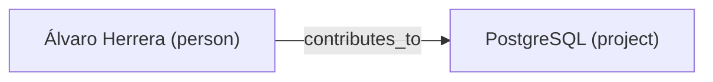

# Graph Debug

A shared **knowledge graph** of entities (`GraphNode`) and relationships
(edges) sits alongside the facts store. It is **separate** from the facts
KV/search store: facts are evidence; the graph is the distilled entity/edge
model a harvester extracts from that evidence. This skill is how you inspect
and explain it.

The graph is **optional**. If you do not have `graph_search_nodes` /
`graph_neighbourhood` / `graph_stats` in your tool set, this deployment runs
without a graph and nothing here applies — say so plainly instead of guessing.

## Tools you have (by role)

| Tool | facts-manager | agent-tuner | Purpose |
|------|:---:|:---:|---------|
| `graph_search_nodes` | ✓ | ✓ | Find entities by name / kind / seed scope-keys |
| `graph_search_edges` | ✓ | ✓ | Find relationships by predicate / endpoints |
| `graph_neighbourhood` | ✓ | ✓ | Bounded subgraph around one node (1–5 hops) |
| `graph_list_namespaces` | ✓ | ✓ | Discover registered graph corpora from compact frontmatter |
| `graph_get_namespace` | ✓ | ✓ | Read full descriptor for one namespace/corpus |
| `graph_stats` | ✓ | ✓ | Node + edge counts and crawl backlog (read-only) |
| `read_session_retrieval_usage` | ✓ | ✓ | Count-only fact/skill/graph retrieval usage for a session |
| `read_session_tree_retrieval_usage` | ✓ | ✓ | Count-only retrieval usage rolled up across a spawn tree |
| `read_session_graph_node_usage` | ✓ | ✓ | Exact graph node keys searched or loaded by a session |
| `read_session_graph_edge_search_usage` | ✓ | ✓ | Edge-search shapes grouped by predicate key and endpoints |
| `read_session_graph_searches` | — | ✓ | Forensics: what graph searches a session ran |

The `read_session_*_retrieval_usage` tools are lineage-gated for non-tuner
sessions: facts-manager can inspect itself and descendant sessions, while
agent-tuner can inspect any session. Neither role mutates the graph through this skill. The facts-manager *holds*
the graph write/delete tools (dormant), plus namespace registry mutation tools
for explicit operator actions, but graph **building** is a harvester job — do
not crawl, upsert, archive, or delete here unless an operator explicitly asks.

## Namespace discovery

If `graph_list_namespaces` is available, use it before graph traversal when the
question may be corpus/domain-specific. The compact frontmatter tells you what a
namespace contains and when it is relevant. Call `graph_get_namespace` only for a
namespace that looks relevant and needs details such as source or schema shape.

The reserved `default` namespace is the unscoped graph partition. Other
namespaces are corpus/domain keys such as `corpus/acme`; graph namespace filters
match that namespace and descendants such as `corpus/acme/services`. Use the
same namespace across graph tools and facts tools when you pivot between source
facts and graph structure.

## Reporting on the graph (facts-manager)

When asked "how big is the graph", "is the graph healthy", or "what's in the
graph":

1. Start with `graph_stats` — it returns node count, edge count, and how many
   facts remain **uncrawled** (the harvest backlog). A large uncrawled backlog
   with few nodes means harvesting is behind, not that the graph is broken.
2. If namespaces are present, list them first and choose the relevant corpus
   rather than sampling the whole graph blindly.
3. Sample structure with `graph_search_nodes` (e.g. by `kind`) and expand a
   few with `graph_neighbourhood` to characterise connectivity.
4. Do **not** fan out a neighbourhood call per node to "count" the graph —
   `graph_stats` already has the counts. Fanning out is a self-inflicted DoS.

### Rendering the graph as Markdown / Mermaid

To render a region as a diagram an operator can read, pull a bounded
neighbourhood and emit a Mermaid `graph` block. Keep it **bounded** (one seed,
depth ≤ 2, or a single `kind`) — never try to render the whole graph at once.

Label nodes with `name (kind)` and edges with the predicate. If the region is
large, render the top entities by degree and say you truncated.

## Graph-search forensics (agent-tuner)

When investigating "why did session X not find what it expected in the graph",
or "what did this agent actually search for":

1. Start with `read_session_retrieval_usage({ session_id })`. It returns
   count-only aggregates for `facts_search`, `facts_similar`, `search_skills`,
   `graph_search_nodes`, `graph_search_edges`, and `graph_neighbourhood`, grouped
   by namespace with result counts and durations. It does **not** store returned
   facts, nodes, or edges.
2. If the question is about a specific graph anchor, call
   `read_session_graph_node_usage({ session_id, node_key_like?, kind? })` to see
   exact node keys that were searched as seeds (`kind="searched"`) or loaded as
   neighbourhood anchors (`kind="loaded"`).
3. If the question is about relationships, call
   `read_session_graph_edge_search_usage({ session_id })` and inspect the
   `predicateKey`, `fromKey`, `toKey`, namespace, call count, and result count.
4. Use `read_session_graph_searches({ session_id })` only when you need the raw
   timeline. Each row is a durable `graph.searched` event with `operation`
   (`graph_search_nodes`, `graph_search_edges`, or `graph_neighbourhood`),
   namespace, bounded query preview, and result counts.
5. Compare the query to what you'd expect. A zero-result `graph_search_nodes`
   with an over-specific `nameLike` is a prompt problem, not a graph problem.
6. Cross-check visibility: graph reads honour the same lineage/ACL as
   `read_facts`. A session only sees nodes its **accessible facts** evidence.
   If a session got zero results but the entity exists, confirm whether that
   session's lineage actually has evidence linking to it before blaming the
   graph.
7. For semantic investigations ("find sessions similar to this failure"), use
   `facts_search` (semantic / hybrid) and `facts_similar` — then pivot into the
   graph with `graph_search_nodes({ seeds: [<scopeKey>] })`.

## Common pitfalls

- **Confusing "no graph" with "empty graph".** No graph tools ⇒ no graph
  configured. Tools present but `graph_stats` reports zero nodes ⇒ a real but
  empty/un-harvested graph. These are different findings — report which.
- **Treating the graph as authoritative over facts.** Facts are the evidence
  of record; the graph is a derived view. A graph node with no accessible
  evidencing fact is invisible to a reader by design, not a bug.
- **Rendering unbounded.** Always bound the region you visualise.
